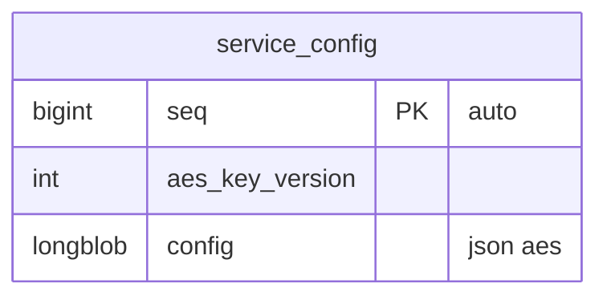

# Codecs — reading and writing column styles (S2)

Column styles are stored in the manifest `styles: [...]` in **write order** (`gz_*` → `['serialize','gz']`: serialize, then compress). Reading applies the reverse order. `aes`, `hex`, and `ip` are host stages; the remaining stages are executor codecs. Go, PHP, Rust, and TypeScript use the same authenticated AES v2 format and produce the same normalized values. Deterministic encodings are byte-identical except for a PHP serialized integral float in TypeScript: JavaScript represents both `2` and `2.0` as the same `number`, so TypeScript re-encodes it as an integer.

### Blind index

`%% blind_index <table> <aes_column> <index_column>` declares the equality-search column for an AES column. The target must be nullable-matched, declared as a single-column index, and use `char(64)`/`string` or `bytes` storage. On insert and update, the runtime writes lowercase HMAC-SHA256(plaintext, `secrets.blind_index`) to the target. Equality and `IN` predicates on the AES column use that target and never compare ciphertext. The blind-index key is independent from AES key versions and is required when the schema declares this directive.

### AES v2

`aes` writes `ORM-AES2\0 || nonce || ciphertext || tag`. The nonce is 12 random bytes, the tag is the AES-256-GCM authentication tag, and the associated data is `ORM-AES2\0`. The AES key is SHA-256(`polyspec/orm/aes-256-gcm/v2\0` || configured key bytes). `aes_hex` applies AES first and uppercase hex second.

Every AES column has a non-null integer `aes_key_version` column in the same entity. New writes use `secrets.aes_version`. Reads use the stored row version to select `secrets.aes_keys[version]`. Missing versions and authentication failures stop the operation. The runtime does not decode the previous ECB format.

### Encrypted JSON value

A blob column with the stages `json aes` stores a JSON value encrypted with AES v2. The `json` stage writes the ordered-json text, and `aes` encrypts that text; a read decrypts the cell and returns the ordered-json value of the text, as for every `json` stage (see [Value model](#value-model)). The value keeps the member order, the number text, and an empty object apart from an empty array, so `1.50` reads back as `1.50`. The entity declares the non-null integer `aes_key_version` column.

The keys come from the connection configuration: `AESKey`, `AESVersion`, and `AESKeys` in Go `orm.Config`; `aesKey`, `aesVersion`, and `aesKeys` in PHP `Config` and the TypeScript connection options; and `aes_key`, `aes_version`, and `aes_keys` in Rust `orm::Config`. A write encrypts with the current version and records it in `aes_key_version`; a read selects the key of the stored version. `utils().aes().rotate(model, keyring)` re-encrypts every row whose version differs from the keyring's current version. A `jsontext` column takes only the `json` or `jsons` stage, so an encrypted JSON value is always a blob column. Audit change rows record an AES column as `{"redacted": true, "present": true}`, never as its plaintext or ciphertext.

| style | write (value → stored bytes) | read (stored bytes → value) | reference |
|---|---|---|---|
| `json`, `jsons` | ordered-json text from the common value model | ordered-json parse | Common ordered-json revision `6d23a2a5e7c0c5d501d759b6d32a439661f153f2` (`0.0.1`); Go uses `github.com/polyspec/ordered-json/go` at `v0.0.0-20260916090424-6d23a2a5e7c0`, and Rust/PHP/TypeScript use the root package at this revision |
| `serialize` | PHP serialize | PHP unserialize | `serialize` / `unserialize` |
| `base64` | base64(serialize(v)) | unserialize(base64_decode) | same |
| `gz` | zlib(serialize(v), level 9) | unserialize(zlib inflate) | `gzcompress(…, 9)` / `gzuncompress` |
| `yaml` | YAML 1.2 document | YAML 1.2 parse | single document and common value model |

## Value model
A `json` or `jsons` stage stores its text in a `jsontext` column, which is text on the three databases, so the stored text is read back as written. The stages `json aes` store the encrypted text in a blob column (see [Encrypted JSON value](#encrypted-json-value)). Data queried inside the database is modeled as columns or a child table; the ORM has no JSON path conditions and no JSON indexes.

Styled columns use JSON-like values: null, bool, integer (i64), float (f64), string, list, and string-keyed map. A `json` or `jsons` stage reads as the ordered-json value of every client, which preserves the object member order and the number text and distinguishes an empty object from an empty array. A write takes that value and stores its text unchanged. `toArray`/`to_array` keeps the value; a model written as JSON by the language's JSON encoder writes the decoded value, as the table lists. The other styles use the common value model.

The Go JSON codec returns `*orderedjson.Value` from `Decode` and accepts that value from `Encode`. It does not use Go's `encoding/json` for user values. Portable scalar/list/map values, named scalar types, and Go structs with `json` field tags are converted to ordered-json explicitly; parsed ordered-json values retain their original order and node kinds. `jsontext.Value` and `json.RawMessage` are accepted only as already-encoded raw JSON values and are parsed immediately into ordered-json. Unsupported Go kinds, non-string map keys, `[]byte`, and non-finite numbers return `CODEC_ENCODE`.

Go values implementing `json.Marshaler` are encoded through `MarshalJSON`, then parsed immediately into ordered-json. The returned bytes must be valid JSON; custom marshalers therefore remain in the ordered-json model and cannot bypass node-kind validation.

Go `[]byte` is not a common JSON value and JSON encoding rejects it with `CODEC_ENCODE`; it is not silently converted to Go's base64 JSON string representation. Decode bytes into the common value model before assigning a JSON column.
| | Go | Rust | PHP | TypeScript |
|---|---|---|---|---|
| read value of a `json` or `jsons` stage | `*orderedjson.Value` | `orm::ordered_json::Value` | `OrderedJson\Value` | `Value` of `ordered-json` |
| write value | `*orderedjson.Value`, or a portable or tagged Go value | `orm::ordered_json::Value` | `OrderedJson\Value`, or an array, scalar, `stdClass`, or `JsonSerializable` | `Value`, or the common value model |
| model JSON output | the value text | `serde_json` value of the text (sorted keys) | decoded text with `stdClass` objects | decoded text |

PHP arrays are ordered maps. An array with exactly the keys `0..n-1` is read as a list; other keys are read as a map. Serialize-family codecs preserve the key representation. Go and Rust sort JSON map keys; PHP keeps insertion order, so bytes can differ while values remain equal.

`yaml` stores one YAML 1.2 document. Output values use the common value model. Mapping keys are strings; integral YAML keys are converted to decimal strings for compatibility with PHP arrays. Duplicate keys, multiple documents, aliases, anchors, explicit tags, non-finite numbers, collection keys, and plain boolean, null, or floating-point keys return `CODEC_DECODE`. YAML output text can differ by client, so verification compares decoded values across clients.

`point` is a column type, not a style. Its public value is `[x, y]`: Go `orm.Point`, PHP `array{float,float}`, Rust `orm::Point`, and TypeScript `Point`. `parsePoint`/`parse_point`/`Codec::point` accept `POINT(x y)` and PostgreSQL `(x,y)` output. The write conversion emits `POINT(x y)`. Values with a coordinate count other than two return `CODEC_DECODE`; non-finite output coordinates return `CODEC_ENCODE`.

## Cases
- Ordered-json distinguishes an empty object from an empty list. `{}` remains an object and `[]` remains an array through parse, encode, and repeated round trips in every client.
- NULL and an empty string are read as `null`.
- `json` and `jsons` preserve `[]`, `{}`, `0`, and `""`. A parse failure returns `CODEC_DECODE`.
- A serialize-family format failure returns `CODEC_DECODE`. `O:`, `C:`, `R:`, and `r:` return `CODEC_UNSUPPORTED`.
- A YAML parse or value-model failure returns `CODEC_DECODE`. A YAML encode failure returns `CODEC_ENCODE`. A `yaml` stage outside the first position returns `CODEC_UNSUPPORTED`.
- Invalid point input returns `CODEC_DECODE`. Point output containing NaN or infinity returns `CODEC_ENCODE`.
- String lengths use byte length. Compressed bytes can vary by implementation, so `gz` guarantees equal round-trip values.

## Vectors (`tests/codec`)
`vectors.json` is generated by `php tests/codec/gen.php`. Each runner reads stored bytes and compares normalized JSON, then compares re-encoded serialize-family bytes and JSON/gz round-trip values. TypeScript runs the same file with `node tests/typescript/codec-vector.mjs`. Database round trips are checked by `codec_roundtrip` in `tests/conformance`.

## Generated code
- Read: the executor decodes each cell immediately after reading positional rows according to `assemble.columns[].styles`.
- Write: `set<Col>(v)` uses the declared style, calls runtime `setStyled`, and binds the encoded bytes.
- Styled-column predicates are limited to `isNull` and `isNotNull` (`ir.OpAllowed`).
