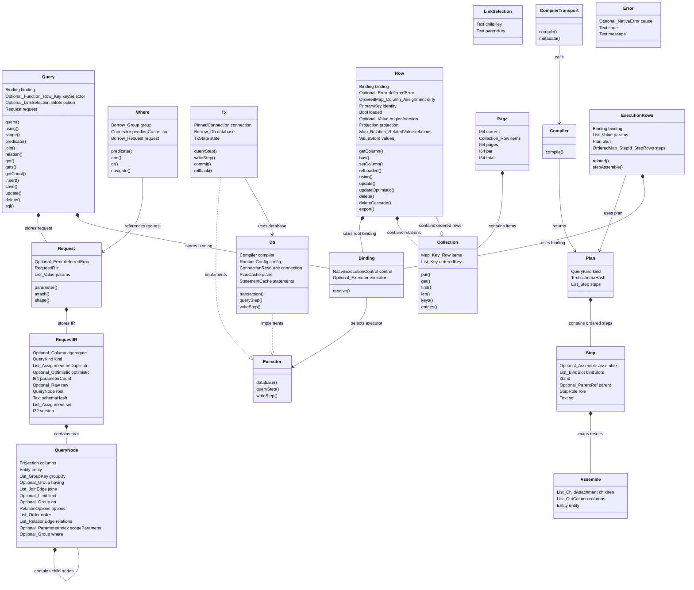

# 공통 구성요소

<!-- contracts/interfaces.json에서 생성됨. 직접 수정하지 않는다. -->

| 구성요소 | 동작 및 상태 |
|---|---|
| Query | 가변 query 상태를 저장한다. 조회 결과는 Row가 저장한다. |
| LinkSelection | relation 또는 join 생성 전까지 parent key와 child key를 저장한다. |
| Where | callback 실행 중에만 유효하다. SQL을 실행하지 않는다. |
| Request | attach는 child 상태를 복사하고 복사본의 parameter index를 이동한다. |
| RequestIR | parameter 값을 제외한 compiler 입력을 저장한다. |
| QueryNode | root 또는 child 조건 tree를 저장한다. |
| Binding | 명시한 executor를 저장한다. 현재 실행 중인 transaction을 자동 선택하지 않는다. |
| Executor | database와 고정 transaction의 실행 작업을 정의한다. |
| Db | connection, plan cache, statement cache, runtime 설정을 저장한다. |
| Tx | commit 또는 rollback 후 해당 transaction을 사용하는 query와 row는 무효다. |
| Row | 조회한 identity, 값, 변경 사항, relation, 실행 binding을 구분해 저장한다. |
| Collection | 중복 key는 순서를 유지하고 값을 교체한다. integer key와 string key는 구분한다. |
| Page | per는 양수여야 한다. total은 요청한 page와 관계없이 계산한다. |
| Compiler | RequestIR을 입력받아 변경 불가능한 Plan을 반환한다. SQL을 실행하지 않는다. |
| CompilerTransport | type이 정의된 compiler request를 전송하고 plan과 metadata를 반환한다. |
| Plan | cache 가능한 실행 step을 저장하며 실행 중에는 변경할 수 없다. |
| Step | SQL statement 하나, bind slot, parent 입력, 결과 mapping을 저장한다. |
| Assemble | 결과 column과 relation 결과를 row에 mapping한다. |
| ExecutionRows | plan, parameter, step 결과, root 실행 binding을 저장한다. |
| Error | 실패를 빈 결과 및 기본값과 구분한다. |

| 시작 | 대상 | 관계 |
|---|---|---|
| Query | Request | request 저장 |
| Query | Binding | binding 저장 |
| Where | Request | request 참조 |
| Request | RequestIR | IR 저장 |
| RequestIR | QueryNode | root 포함 |
| QueryNode | QueryNode | child node 포함 |
| Binding | Executor | executor 선택 |
| Db | Executor | 구현 |
| Tx | Executor | 구현 |
| Tx | Db | database 사용 |
| Row | Binding | root binding 사용 |
| Row | Collection | relation 포함 |
| Collection | Row | 순서 row 포함 |
| Page | Collection | 항목 포함 |
| Compiler | Plan | 반환 |
| Plan | Step | 순서 step 포함 |
| Step | Assemble | 결과 mapping |
| ExecutionRows | Plan | plan 사용 |
| ExecutionRows | Binding | binding 사용 |
| CompilerTransport | Compiler | 호출 |

도표의 type 이름에서 `_`는 중첩 type 구분자다. 정확한 type은 다음 표에 정의한다.

| 필드 | 공통 type |
|---|---|
| Query.binding | `Binding` |
| Query.keySelector | `Optional<Function<Row,Key>>` |
| Query.linkSelection | `Optional<LinkSelection>` |
| Query.request | `Request` |
| LinkSelection.childKey | `Text` |
| LinkSelection.parentKey | `Text` |
| Where.group | `Borrow<Group>` |
| Where.pendingConnector | `Connector` |
| Where.request | `Borrow<Request>` |
| Request.deferredError | `Optional<Error>` |
| Request.ir | `RequestIR` |
| Request.params | `List<Value>` |
| RequestIR.aggregate | `Optional<Column>` |
| RequestIR.kind | `QueryKind` |
| RequestIR.onDuplicate | `List<Assignment>` |
| RequestIR.optimistic | `Optional<Optimistic>` |
| RequestIR.parameterCount | `I64` |
| RequestIR.raw | `Optional<Raw>` |
| RequestIR.root | `QueryNode` |
| RequestIR.schemaHash | `Text` |
| RequestIR.set | `List<Assignment>` |
| RequestIR.version | `I32` |
| QueryNode.columns | `Projection` |
| QueryNode.entity | `Entity` |
| QueryNode.groupBy | `List<GroupKey>` |
| QueryNode.having | `Optional<Group>` |
| QueryNode.joins | `List<JoinEdge>` |
| QueryNode.limit | `Optional<Limit>` |
| QueryNode.on | `Optional<Group>` |
| QueryNode.options | `RelationOptions` |
| QueryNode.order | `List<Order>` |
| QueryNode.relations | `List<RelationEdge>` |
| QueryNode.scopeParameter | `Optional<ParameterIndex>` |
| QueryNode.where | `Optional<Group>` |
| Binding.control | `NativeExecutionControl` |
| Binding.executor | `Optional<Executor>` |
| Db.compiler | `Compiler` |
| Db.config | `RuntimeConfig` |
| Db.connection | `ConnectionResource` |
| Db.plans | `PlanCache` |
| Db.statements | `StatementCache` |
| Tx.connection | `PinnedConnection` |
| Tx.database | `Borrow<Db>` |
| Tx.state | `TxState` |
| Row.binding | `Binding` |
| Row.deferredError | `Optional<Error>` |
| Row.dirty | `OrderedMap<Column,Assignment>` |
| Row.identity | `PrimaryKey` |
| Row.loaded | `Bool` |
| Row.originalVersion | `Optional<Value>` |
| Row.projection | `Projection` |
| Row.relations | `Map<Relation,RelatedValue>` |
| Row.values | `ValueStore` |
| Collection.items | `Map<Key,Row>` |
| Collection.orderedKeys | `List<Key>` |
| Page.current | `I64` |
| Page.items | `Collection<Row>` |
| Page.pages | `I64` |
| Page.per | `I64` |
| Page.total | `I64` |
| Plan.kind | `QueryKind` |
| Plan.schemaHash | `Text` |
| Plan.steps | `List<Step>` |
| Step.assemble | `Optional<Assemble>` |
| Step.bindSlots | `List<BindSlot>` |
| Step.id | `I32` |
| Step.parent | `Optional<ParentRef>` |
| Step.role | `StepRole` |
| Step.sql | `Text` |
| Assemble.children | `List<ChildAttachment>` |
| Assemble.columns | `List<OutColumn>` |
| Assemble.entity | `Entity` |
| ExecutionRows.binding | `Binding` |
| ExecutionRows.params | `List<Value>` |
| ExecutionRows.plan | `Plan` |
| ExecutionRows.steps | `OrderedMap<StepId,StepRows>` |
| Error.cause | `Optional<NativeError>` |
| Error.code | `Text` |
| Error.message | `Text` |
