# 공통 구성요소

```mermaid
classDiagram
    class Model {
        Core core
        connect()
        and()
        or()
        raw()
        relation()
        relations()
        limit()
        duplication()
        get()
        gets()
        getsCount()
        getCount()
        getSum()
        getAvg()
        getsPage()
        getQuery()
        create()
        creates()
        update()
        save()
        delete()
        toArray()
    }
    class Core {
        Columns columns
        Group conditions
        Optional_Db connection
        List_Model joins
        Optional_Limit limit
        Text lock
        List_Order order
        List_Model relations
        Optional_RowState row
        List_Assignment sets
        build()
    }
    class Request {
        RequestIR ir
        List_Value params
        shape()
    }
    class RequestIR {
        Text kind
        List_Assignment onDuplicate
        Optional_Optimistic optimistic
        Integer parameterCount
        QueryNode root
        List_List_Integer rows
        Text schemaHash
        List_Assignment set
        Integer version
    }
    class QueryNode {
        Columns columns
        Text entity
        List_Text groupBy
        List_Join joins
        Optional_Limit limit
        Text lock
        Group on
        RelationOptions options
        List_Order order
        List_Relation relations
        Group where
    }
    class Planner {
        Dialect dialect
        SchemaManifest manifest
        validate()
        plan()
    }
    class Plan {
        Text kind
        Text schemaHash
        List_Step steps
    }
    class Step {
        Optional_Assemble assemble
        List_BindSlot bindSlots
        Integer id
        Optional_ParentRef parent
        Text role
        Text sql
    }
    class Assemble {
        List_Child children
        List_OutputColumn columns
        Text entity
    }
    class Db {
        Config config
        Map_SchemaHash_Planner planners
        Cache_Shape_Plan plans
        ConnectionPool pool
        Cache_Sql_Statement statements
        connect()
        transaction()
        utils()
        close()
        stats()
    }
    class TransactionFlow {
        List_TransactionFrame frames
        begin()
        savepoint()
        commit()
        rollback()
    }
    class Collection {
        Map_Key_Value fetched
        Map_Key_Model items
        List_Key keys
        get()
        first()
        keys()
        connect()
        delete()
        toArray()
    }
    class Page {
        Collection items
        Integer page
        Integer perPage
        Integer totalCount
        Integer totalPages
    }
    class Utils {
        Db db
        lock()
        setLocal()
        local()
        schema()
        privileges()
        aes()
        stats()
    }
    class SchemaUtils {
        Db db
        install()
        exists()
        installed()
        empty()
    }
    class AesUtils {
        Db db
        status()
        rotate()
    }
    class AESKeyring {
        Integer currentVersion
        Map_Integer_Secret versions
        versions()
    }
    class AESRotationStatus {
        Integer current
        Integer pending
        Integer total
        Map_Integer_Integer versions
    }
    class Generator {
        SchemaManifest manifest
        List_Path scan
        generate()
    }
    class Error {
        Optional_Error cause
        Text code
        Text message
    }
    Model *-- Core : stores chain state
    Core --> Db : uses connection
    Core --> TransactionFlow : uses flow transaction
    Core --> Request : builds
    Request *-- RequestIR : stores IR
    RequestIR *-- QueryNode : contains root
    QueryNode *-- QueryNode : contains child nodes
    Db *-- Planner : plans per schema
    Planner --> Plan : returns
    Plan *-- Step : contains ordered steps
    Step *-- Assemble : maps results
    Db --> TransactionFlow : opens
    Db --> Utils : returns
    Utils --> SchemaUtils : returns
    Utils --> AesUtils : returns
    SchemaUtils --> Planner : registers schema
    AesUtils --> AESKeyring : uses keys
    AesUtils --> AESRotationStatus : returns status
    Collection o-- Model : contains ordered models
    Page *-- Collection : contains items
    Model *-- Collection : contains relations
    Generator --> Model : emits
```

<!-- contracts/interfaces.json에서 생성됨. 직접 수정하지 않는다. -->

| 구성요소 | 동작 및 상태 |
|---|---|
| Model | 엔티티마다 생성된다. 새 행이나 조회한 행의 컬럼 값과 체인 상태를 Core에 담는다. |
| Core | 체인 상태를 저장하고 값이 없는 request와 별도의 parameter 목록을 만든다. |
| Request | request 모양이 plan cache key이며 값은 parameter 목록에만 있다. |
| RequestIR | 모든 client에 공통인 request 모양이다. |
| QueryNode | root, join child, relation child, subquery 중 하나다. |
| Planner | client process 안에서 실행된다. manifest로 request를 검증하고 dialect SQL을 만든다. |
| Plan | request 모양별로 cache하는 불변 statement와 조립 정보다. |
| Step | plan의 SQL statement 하나다. |
| Assemble | 결과 컬럼을 위치로 model, join, relation에 대응시킨다. |
| Db | pool, 등록된 schema의 planner, plan cache, statement cache를 가진다. |
| TransactionFlow | 비공개다. 현재 실행 흐름의 transaction이며 연결 없는 model이 사용한다. |
| Collection | primary key, keyName, fetchKey로 key를 정한 순서 있는 model 목록이다. |
| Page | getsPage의 행과 개수다. |
| Utils | 연결 유틸리티다. lock과 local 값은 진행 중인 transaction이 필요하다. |
| SchemaUtils | client DDL 렌더러로 manifest를 설치한다. |
| AesUtils | model 테이블의 AES key version을 조회하고 회전한다. |
| AESKeyring | version별 key다. 현재 version으로 새 값을 암호화한다. |
| AESRotationStatus | key version별 행 수다. |
| Generator | 언어마다 하나다. schema.json을 읽어 model을 만든다. Go와 Rust는 소스가 호출하는 체인 메서드만 만든다. |
| Error | docs/errors.yaml의 안정적인 code다. |

| 시작 | 대상 | 관계 |
|---|---|---|
| Model | Core | 체인 상태 저장 |
| Core | Db | 연결 사용 |
| Core | TransactionFlow | 흐름 transaction 사용 |
| Core | Request | 생성 |
| Request | RequestIR | IR 저장 |
| RequestIR | QueryNode | root 포함 |
| QueryNode | QueryNode | child node 포함 |
| Db | Planner | schema별 계획 |
| Planner | Plan | 반환 |
| Plan | Step | 순서 있는 step 포함 |
| Step | Assemble | 결과 대응 |
| Db | TransactionFlow | 시작 |
| Db | Utils | 반환 |
| Utils | SchemaUtils | 반환 |
| Utils | AesUtils | 반환 |
| SchemaUtils | Planner | schema 등록 |
| AesUtils | AESKeyring | key 사용 |
| AesUtils | AESRotationStatus | 상태 반환 |
| Collection | Model | 순서 있는 model 포함 |
| Page | Collection | 항목 포함 |
| Model | Collection | relation 포함 |
| Generator | Model | 생성 |

도표의 type 이름에서 `_`는 중첩 type 구분자다. 정확한 type은 다음 표에 정의한다.

| 필드 | 공통 type |
|---|---|
| Model.core | `Core` |
| Core.columns | `Columns` |
| Core.conditions | `Group` |
| Core.connection | `Optional<Db>` |
| Core.joins | `List<Model>` |
| Core.limit | `Optional<Limit>` |
| Core.lock | `Text` |
| Core.order | `List<Order>` |
| Core.relations | `List<Model>` |
| Core.row | `Optional<RowState>` |
| Core.sets | `List<Assignment>` |
| Request.ir | `RequestIR` |
| Request.params | `List<Value>` |
| RequestIR.kind | `Text` |
| RequestIR.onDuplicate | `List<Assignment>` |
| RequestIR.optimistic | `Optional<Optimistic>` |
| RequestIR.parameterCount | `Integer` |
| RequestIR.root | `QueryNode` |
| RequestIR.rows | `List<List<Integer>>` |
| RequestIR.schemaHash | `Text` |
| RequestIR.set | `List<Assignment>` |
| RequestIR.version | `Integer` |
| QueryNode.columns | `Columns` |
| QueryNode.entity | `Text` |
| QueryNode.groupBy | `List<Text>` |
| QueryNode.joins | `List<Join>` |
| QueryNode.limit | `Optional<Limit>` |
| QueryNode.lock | `Text` |
| QueryNode.on | `Group` |
| QueryNode.options | `RelationOptions` |
| QueryNode.order | `List<Order>` |
| QueryNode.relations | `List<Relation>` |
| QueryNode.where | `Group` |
| Planner.dialect | `Dialect` |
| Planner.manifest | `SchemaManifest` |
| Plan.kind | `Text` |
| Plan.schemaHash | `Text` |
| Plan.steps | `List<Step>` |
| Step.assemble | `Optional<Assemble>` |
| Step.bindSlots | `List<BindSlot>` |
| Step.id | `Integer` |
| Step.parent | `Optional<ParentRef>` |
| Step.role | `Text` |
| Step.sql | `Text` |
| Assemble.children | `List<Child>` |
| Assemble.columns | `List<OutputColumn>` |
| Assemble.entity | `Text` |
| Db.config | `Config` |
| Db.planners | `Map<SchemaHash,Planner>` |
| Db.plans | `Cache<Shape,Plan>` |
| Db.pool | `ConnectionPool` |
| Db.statements | `Cache<Sql,Statement>` |
| TransactionFlow.frames | `List<TransactionFrame>` |
| Collection.fetched | `Map<Key,Value>` |
| Collection.items | `Map<Key,Model>` |
| Collection.keys | `List<Key>` |
| Page.items | `Collection` |
| Page.page | `Integer` |
| Page.perPage | `Integer` |
| Page.totalCount | `Integer` |
| Page.totalPages | `Integer` |
| Utils.db | `Db` |
| SchemaUtils.db | `Db` |
| AesUtils.db | `Db` |
| AESKeyring.currentVersion | `Integer` |
| AESKeyring.versions | `Map<Integer,Secret>` |
| AESRotationStatus.current | `Integer` |
| AESRotationStatus.pending | `Integer` |
| AESRotationStatus.total | `Integer` |
| AESRotationStatus.versions | `Map<Integer,Integer>` |
| Generator.manifest | `SchemaManifest` |
| Generator.scan | `List<Path>` |
| Error.cause | `Optional<Error>` |
| Error.code | `Text` |
| Error.message | `Text` |
