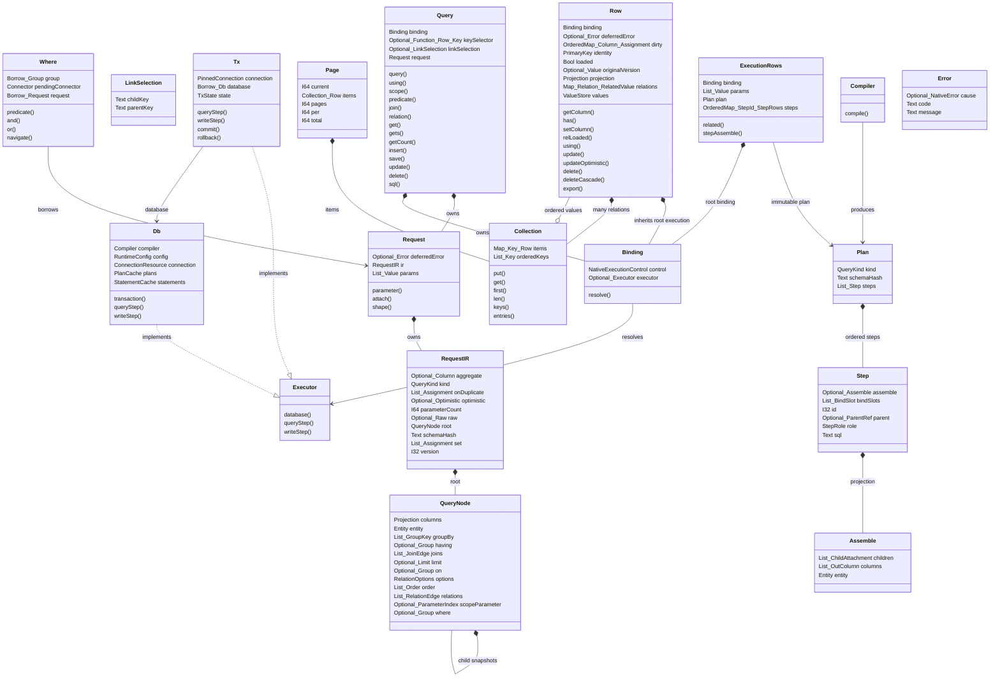

# Common components

<!-- Generated from contracts/interfaces.json; DO NOT EDIT. -->

| 구성요소 | 책임·소유 규칙 |
|---|---|
| Query | Owns mutable query state; never represents a loaded row. |
| LinkSelection | Belongs to the child Query until relation or join consumes it. |
| Where | Borrow is scoped to its callback; cannot execute SQL. |
| Request | attach snapshots all child state and shifts only the snapshot. |
| RequestIR | Value-free compiler input. |
| QueryNode | Owned condition tree, including nested child nodes. |
| Binding | Independent of request IR; does not select ambient transactions. |
| Executor | Adapter interface for the concrete database and pinned transaction executors. |
| Db | Owns connections and caches, never query predicates or row values. |
| Tx | Completion invalidates every retained bound query and row. |
| Row | Loaded identity, local values and pending changes have distinct roles. |
| Collection | Equal keys replace in place. Integer and string keys remain distinct. |
| Page | per is positive and total is independent of page range. |
| Compiler | Accepts RequestIR and returns immutable Plan; has no executor. |
| Plan | Cached and immutable while executing. |
| Step | Executes in plan order. |
| Assemble | Maps positional values to rows and relation attachments. |
| ExecutionRows | Rows inherit the root executor used by this execution. |
| Error | Errors are distinct from empty results and native defaults. |

도표의 타입 이름에서 `_`는 중첩 타입 구분자다. 정확한 타입은 다음과 같다.

| 필드 | 공통 타입 |
|---|---|
| Query.binding | `Binding` |
| Query.keySelector | `Optional<Function<Row,Key>>` |
| Query.linkSelection | `Optional<LinkSelection>` |
| Query.request | `Request` |
| LinkSelection.childKey | `Text` |
| LinkSelection.parentKey | `Text` |
| Where.group | `Borrow<Group>` |
| Where.pendingConnector | `Connector` |
| Where.request | `Borrow<Request>` |
| Request.deferredError | `Optional<Error>` |
| Request.ir | `RequestIR` |
| Request.params | `List<Value>` |
| RequestIR.aggregate | `Optional<Column>` |
| RequestIR.kind | `QueryKind` |
| RequestIR.onDuplicate | `List<Assignment>` |
| RequestIR.optimistic | `Optional<Optimistic>` |
| RequestIR.parameterCount | `I64` |
| RequestIR.raw | `Optional<Raw>` |
| RequestIR.root | `QueryNode` |
| RequestIR.schemaHash | `Text` |
| RequestIR.set | `List<Assignment>` |
| RequestIR.version | `I32` |
| QueryNode.columns | `Projection` |
| QueryNode.entity | `Entity` |
| QueryNode.groupBy | `List<GroupKey>` |
| QueryNode.having | `Optional<Group>` |
| QueryNode.joins | `List<JoinEdge>` |
| QueryNode.limit | `Optional<Limit>` |
| QueryNode.on | `Optional<Group>` |
| QueryNode.options | `RelationOptions` |
| QueryNode.order | `List<Order>` |
| QueryNode.relations | `List<RelationEdge>` |
| QueryNode.scopeParameter | `Optional<ParameterIndex>` |
| QueryNode.where | `Optional<Group>` |
| Binding.control | `NativeExecutionControl` |
| Binding.executor | `Optional<Executor>` |
| Db.compiler | `Compiler` |
| Db.config | `RuntimeConfig` |
| Db.connection | `ConnectionResource` |
| Db.plans | `PlanCache` |
| Db.statements | `StatementCache` |
| Tx.connection | `PinnedConnection` |
| Tx.database | `Borrow<Db>` |
| Tx.state | `TxState` |
| Row.binding | `Binding` |
| Row.deferredError | `Optional<Error>` |
| Row.dirty | `OrderedMap<Column,Assignment>` |
| Row.identity | `PrimaryKey` |
| Row.loaded | `Bool` |
| Row.originalVersion | `Optional<Value>` |
| Row.projection | `Projection` |
| Row.relations | `Map<Relation,RelatedValue>` |
| Row.values | `ValueStore` |
| Collection.items | `Map<Key,Row>` |
| Collection.orderedKeys | `List<Key>` |
| Page.current | `I64` |
| Page.items | `Collection<Row>` |
| Page.pages | `I64` |
| Page.per | `I64` |
| Page.total | `I64` |
| Plan.kind | `QueryKind` |
| Plan.schemaHash | `Text` |
| Plan.steps | `List<Step>` |
| Step.assemble | `Optional<Assemble>` |
| Step.bindSlots | `List<BindSlot>` |
| Step.id | `I32` |
| Step.parent | `Optional<ParentRef>` |
| Step.role | `StepRole` |
| Step.sql | `Text` |
| Assemble.children | `List<ChildAttachment>` |
| Assemble.columns | `List<OutColumn>` |
| Assemble.entity | `Entity` |
| ExecutionRows.binding | `Binding` |
| ExecutionRows.params | `List<Value>` |
| ExecutionRows.plan | `Plan` |
| ExecutionRows.steps | `OrderedMap<StepId,StepRows>` |
| Error.cause | `Optional<NativeError>` |
| Error.code | `Text` |
| Error.message | `Text` |
