# Common components

```mermaid
classDiagram
    class Model {
        Core core
        connect()
        and()
        or()
        raw()
        relation()
        relations()
        limit()
        duplication()
        get()
        gets()
        getsCount()
        getCount()
        getSum()
        getAvg()
        getsPage()
        getQuery()
        create()
        creates()
        update()
        save()
        delete()
        toArray()
    }
    class Core {
        Columns columns
        Group conditions
        Optional_Db connection
        List_Model joins
        Optional_Limit limit
        Text lock
        List_Order order
        List_Model relations
        Optional_RowState row
        List_Assignment sets
        build()
    }
    class Request {
        RequestIR ir
        List_Value params
        shape()
    }
    class RequestIR {
        Text kind
        List_Assignment onDuplicate
        Optional_Optimistic optimistic
        Integer parameterCount
        QueryNode root
        List_List_Integer rows
        Text schemaHash
        List_Assignment set
        Integer version
    }
    class QueryNode {
        Columns columns
        Text entity
        List_Text groupBy
        List_Join joins
        Optional_Limit limit
        Text lock
        Group on
        RelationOptions options
        List_Order order
        List_Relation relations
        Group where
    }
    class Planner {
        Dialect dialect
        SchemaManifest manifest
        validate()
        plan()
    }
    class Plan {
        Text kind
        Text schemaHash
        List_Step steps
    }
    class Step {
        Optional_Assemble assemble
        List_BindSlot bindSlots
        Integer id
        Optional_ParentRef parent
        Text role
        Text sql
    }
    class Assemble {
        List_Child children
        List_OutputColumn columns
        Text entity
    }
    class Db {
        Config config
        Map_SchemaHash_Planner planners
        Cache_Shape_Plan plans
        ConnectionPool pool
        Cache_Sql_Statement statements
        connect()
        transaction()
        utils()
        close()
        stats()
    }
    class TransactionFlow {
        List_TransactionFrame frames
        begin()
        savepoint()
        commit()
        rollback()
    }
    class Collection {
        Map_Key_Value fetched
        Map_Key_Model items
        List_Key keys
        get()
        first()
        keys()
        connect()
        delete()
        toArray()
    }
    class Page {
        Collection items
        Integer page
        Integer perPage
        Integer totalCount
        Integer totalPages
    }
    class Utils {
        Db db
        lock()
        setLocal()
        local()
        schema()
        privileges()
        aes()
        stats()
    }
    class SchemaUtils {
        Db db
        install()
        exists()
        installed()
        empty()
    }
    class AesUtils {
        Db db
        status()
        rotate()
    }
    class AESKeyring {
        Integer currentVersion
        Map_Integer_Secret versions
        versions()
    }
    class AESRotationStatus {
        Integer current
        Integer pending
        Integer total
        Map_Integer_Integer versions
    }
    class Generator {
        SchemaManifest manifest
        List_Path scan
        generate()
    }
    class Error {
        Optional_Error cause
        Text code
        Text message
    }
    Model *-- Core : stores chain state
    Core --> Db : uses connection
    Core --> TransactionFlow : uses flow transaction
    Core --> Request : builds
    Request *-- RequestIR : stores IR
    RequestIR *-- QueryNode : contains root
    QueryNode *-- QueryNode : contains child nodes
    Db *-- Planner : plans per schema
    Planner --> Plan : returns
    Plan *-- Step : contains ordered steps
    Step *-- Assemble : maps results
    Db --> TransactionFlow : opens
    Db --> Utils : returns
    Utils --> SchemaUtils : returns
    Utils --> AesUtils : returns
    SchemaUtils --> Planner : registers schema
    AesUtils --> AESKeyring : uses keys
    AesUtils --> AESRotationStatus : returns status
    Collection o-- Model : contains ordered models
    Page *-- Collection : contains items
    Model *-- Collection : contains relations
    Generator --> Model : emits
```

<!-- Generated from contracts/interfaces.json; DO NOT EDIT. -->

| Component | Behavior and state |
|---|---|
| Model | Generated per entity. Holds the column values of a new or loaded row and the chain state in its Core. |
| Core | Stores the chain state and builds a value-free request with a separate parameter list. |
| Request | The request shape is the plan cache key; values stay in the parameter list. |
| RequestIR | The common request shape of every client. |
| QueryNode | The root, a join child, a relation child, or a subquery. |
| Planner | Runs in the client process. Validates a request against the manifest and renders the dialect SQL. |
| Plan | Immutable statements and assembly metadata cached per request shape. |
| Step | One SQL statement of a plan. |
| Assemble | Maps result columns by position to models, joins, and relations. |
| Db | Owns the pool, the planners of registered schemas, and the plan and statement caches. |
| TransactionFlow | Private. The transaction of the current execution flow; models without a connection use it. |
| Collection | Ordered models keyed by primary key, keyName, or fetchKey. |
| Page | The rows and counts of getsPage. |
| Utils | Connection utilities; lock and local values need an active transaction. |
| SchemaUtils | Installs a manifest with the client DDL renderer. |
| AesUtils | Reports and rotates AES key versions of a model table. |
| AESKeyring | Keys by version; the current version encrypts new values. |
| AESRotationStatus | Row counts per key version. |
| Generator | One per language. Reads schema.json and emits models; Go and Rust emit only the chain methods the sources call. |
| Error | A stable code from docs/errors.yaml. |

| From | To | Relation |
|---|---|---|
| Model | Core | stores chain state |
| Core | Db | uses connection |
| Core | TransactionFlow | uses flow transaction |
| Core | Request | builds |
| Request | RequestIR | stores IR |
| RequestIR | QueryNode | contains root |
| QueryNode | QueryNode | contains child nodes |
| Db | Planner | plans per schema |
| Planner | Plan | returns |
| Plan | Step | contains ordered steps |
| Step | Assemble | maps results |
| Db | TransactionFlow | opens |
| Db | Utils | returns |
| Utils | SchemaUtils | returns |
| Utils | AesUtils | returns |
| SchemaUtils | Planner | registers schema |
| AesUtils | AESKeyring | uses keys |
| AesUtils | AESRotationStatus | returns status |
| Collection | Model | contains ordered models |
| Page | Collection | contains items |
| Model | Collection | contains relations |
| Generator | Model | emits |

An underscore in a diagram type name separates nested types. The table defines the exact types.

| Field | Common type |
|---|---|
| Model.core | `Core` |
| Core.columns | `Columns` |
| Core.conditions | `Group` |
| Core.connection | `Optional<Db>` |
| Core.joins | `List<Model>` |
| Core.limit | `Optional<Limit>` |
| Core.lock | `Text` |
| Core.order | `List<Order>` |
| Core.relations | `List<Model>` |
| Core.row | `Optional<RowState>` |
| Core.sets | `List<Assignment>` |
| Request.ir | `RequestIR` |
| Request.params | `List<Value>` |
| RequestIR.kind | `Text` |
| RequestIR.onDuplicate | `List<Assignment>` |
| RequestIR.optimistic | `Optional<Optimistic>` |
| RequestIR.parameterCount | `Integer` |
| RequestIR.root | `QueryNode` |
| RequestIR.rows | `List<List<Integer>>` |
| RequestIR.schemaHash | `Text` |
| RequestIR.set | `List<Assignment>` |
| RequestIR.version | `Integer` |
| QueryNode.columns | `Columns` |
| QueryNode.entity | `Text` |
| QueryNode.groupBy | `List<Text>` |
| QueryNode.joins | `List<Join>` |
| QueryNode.limit | `Optional<Limit>` |
| QueryNode.lock | `Text` |
| QueryNode.on | `Group` |
| QueryNode.options | `RelationOptions` |
| QueryNode.order | `List<Order>` |
| QueryNode.relations | `List<Relation>` |
| QueryNode.where | `Group` |
| Planner.dialect | `Dialect` |
| Planner.manifest | `SchemaManifest` |
| Plan.kind | `Text` |
| Plan.schemaHash | `Text` |
| Plan.steps | `List<Step>` |
| Step.assemble | `Optional<Assemble>` |
| Step.bindSlots | `List<BindSlot>` |
| Step.id | `Integer` |
| Step.parent | `Optional<ParentRef>` |
| Step.role | `Text` |
| Step.sql | `Text` |
| Assemble.children | `List<Child>` |
| Assemble.columns | `List<OutputColumn>` |
| Assemble.entity | `Text` |
| Db.config | `Config` |
| Db.planners | `Map<SchemaHash,Planner>` |
| Db.plans | `Cache<Shape,Plan>` |
| Db.pool | `ConnectionPool` |
| Db.statements | `Cache<Sql,Statement>` |
| TransactionFlow.frames | `List<TransactionFrame>` |
| Collection.fetched | `Map<Key,Value>` |
| Collection.items | `Map<Key,Model>` |
| Collection.keys | `List<Key>` |
| Page.items | `Collection` |
| Page.page | `Integer` |
| Page.perPage | `Integer` |
| Page.totalCount | `Integer` |
| Page.totalPages | `Integer` |
| Utils.db | `Db` |
| SchemaUtils.db | `Db` |
| AesUtils.db | `Db` |
| AESKeyring.currentVersion | `Integer` |
| AESKeyring.versions | `Map<Integer,Secret>` |
| AESRotationStatus.current | `Integer` |
| AESRotationStatus.pending | `Integer` |
| AESRotationStatus.total | `Integer` |
| AESRotationStatus.versions | `Map<Integer,Integer>` |
| Generator.manifest | `SchemaManifest` |
| Generator.scan | `List<Path>` |
| Error.cause | `Optional<Error>` |
| Error.code | `Text` |
| Error.message | `Text` |
