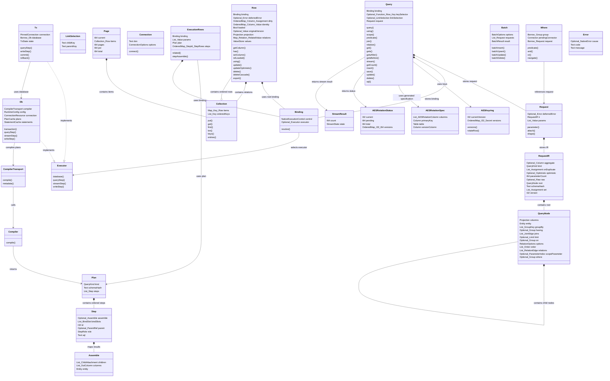

# Common components

<!-- Generated from contracts/interfaces.json; DO NOT EDIT. -->

| Component | Behavior and state |
|---|---|
| Query | Stores mutable query state. Loaded results use Row. |
| LinkSelection | Stores parent and child keys until relation or join construction. |
| Where | Valid only during its callback. Does not execute SQL. |
| Request | attach copies child state and shifts parameter indexes in the copy. |
| RequestIR | Contains compiler input without parameter values. |
| QueryNode | Contains the root or child condition tree. |
| Binding | Stores an explicit executor. Does not select an ambient transaction. |
| Executor | Defines database and pinned transaction execution operations. |
| Connection | Creates a Db from one DSN URI. The URI scheme selects the database; compiler internals are hidden from callers. |
| Db | Stores connections, plan cache, statement cache, and runtime configuration. |
| Tx | commit or rollback invalidates queries and rows that use the transaction. |
| Row | Separates loaded identity, values, pending changes, relations, and execution binding. |
| Collection | A duplicate key replaces its value without changing order. Integer and string keys are distinct. |
| Page | Requires a positive per value. total does not depend on the requested page. |
| StreamResult | Reports whether the cursor was exhausted or stopped and how many independently owned rows were delivered. |
| Batch | Executes homogeneous typed write requests in bounded chunks and one transaction. |
| AESKeyring | Stores versioned AES keys and the current write version. |
| AESRotationSpec | Contains generated identifiers and codec stages for one AES entity. |
| AESRotationStatus | Contains row counts by stored AES key version. |
| Compiler | Accepts RequestIR and returns an immutable Plan. Does not execute SQL. |
| CompilerTransport | Sends typed compiler requests and returns typed plans and metadata. |
| Plan | Contains cached execution steps and cannot change during execution. |
| Step | Contains one SQL statement, bind slots, parent input, and result mapping. |
| Assemble | Maps result columns and relation results to rows. |
| ExecutionRows | Stores the plan, parameters, step results, and root execution binding. |
| Error | Separates failures from empty results and default values. |

| From | To | Relation |
|---|---|---|
| Query | Request | stores request |
| Query | Binding | stores binding |
| Where | Request | references request |
| Request | RequestIR | stores IR |
| RequestIR | QueryNode | contains root |
| QueryNode | QueryNode | contains child nodes |
| Binding | Executor | selects executor |
| Db | Executor | implements |
| Db | CompilerTransport | compiles plans |
| Tx | Executor | implements |
| Tx | Db | uses database |
| Row | Binding | uses root binding |
| Row | Collection | contains relations |
| Collection | Row | contains ordered rows |
| Page | Collection | contains items |
| Compiler | Plan | returns |
| Plan | Step | contains ordered steps |
| Step | Assemble | maps results |
| ExecutionRows | Plan | uses plan |
| ExecutionRows | Binding | uses binding |
| CompilerTransport | Compiler | calls |
| Query | AESKeyring | uses keys |
| Query | AESRotationSpec | uses generated specification |
| Query | AESRotationStatus | returns status |
| Query | StreamResult | returns stream result |

An underscore in a diagram type name separates nested types. The table defines the exact types.

| Field | Common type |
|---|---|
| Query.binding | `Binding` |
| Query.keySelector | `Optional<Function<Row,Key>>` |
| Query.linkSelection | `Optional<LinkSelection>` |
| Query.request | `Request` |
| LinkSelection.childKey | `Text` |
| LinkSelection.parentKey | `Text` |
| Where.group | `Borrow<Group>` |
| Where.pendingConnector | `Connector` |
| Where.request | `Borrow<Request>` |
| Request.deferredError | `Optional<Error>` |
| Request.ir | `RequestIR` |
| Request.params | `List<Value>` |
| RequestIR.aggregate | `Optional<Column>` |
| RequestIR.kind | `QueryKind` |
| RequestIR.onDuplicate | `List<Assignment>` |
| RequestIR.optimistic | `Optional<Optimistic>` |
| RequestIR.parameterCount | `I64` |
| RequestIR.raw | `Optional<Raw>` |
| RequestIR.root | `QueryNode` |
| RequestIR.schemaHash | `Text` |
| RequestIR.set | `List<Assignment>` |
| RequestIR.version | `I32` |
| QueryNode.columns | `Projection` |
| QueryNode.entity | `Entity` |
| QueryNode.groupBy | `List<GroupKey>` |
| QueryNode.having | `Optional<Group>` |
| QueryNode.joins | `List<JoinEdge>` |
| QueryNode.limit | `Optional<Limit>` |
| QueryNode.on | `Optional<Group>` |
| QueryNode.options | `RelationOptions` |
| QueryNode.order | `List<Order>` |
| QueryNode.relations | `List<RelationEdge>` |
| QueryNode.scopeParameter | `Optional<ParameterIndex>` |
| QueryNode.where | `Optional<Group>` |
| Binding.control | `NativeExecutionControl` |
| Binding.executor | `Optional<Executor>` |
| Connection.dsn | `Text` |
| Connection.options | `ConnectionOptions` |
| Db.compiler | `CompilerTransport` |
| Db.config | `RuntimeConfig` |
| Db.connection | `ConnectionResource` |
| Db.plans | `PlanCache` |
| Db.statements | `StatementCache` |
| Tx.connection | `PinnedConnection` |
| Tx.database | `Borrow<Db>` |
| Tx.state | `TxState` |
| Row.binding | `Binding` |
| Row.deferredError | `Optional<Error>` |
| Row.dirty | `OrderedMap<Column,Assignment>` |
| Row.identity | `OrderedMap<Column,Value>` |
| Row.loaded | `Bool` |
| Row.originalVersion | `Optional<Value>` |
| Row.projection | `Projection` |
| Row.relations | `Map<Relation,RelatedValue>` |
| Row.values | `ValueStore` |
| Collection.items | `Map<Key,Row>` |
| Collection.orderedKeys | `List<Key>` |
| Page.current | `I64` |
| Page.items | `Collection<Row>` |
| Page.pages | `I64` |
| Page.per | `I64` |
| Page.total | `I64` |
| StreamResult.count | `I64` |
| StreamResult.state | `StreamState` |
| Batch.options | `BatchOptions` |
| Batch.requests | `List<Request>` |
| Batch.result | `BatchResult` |
| AESKeyring.currentVersion | `I32` |
| AESKeyring.versions | `OrderedMap<I32,Secret>` |
| AESRotationSpec.columns | `List<AESRotationColumn>` |
| AESRotationSpec.primaryKey | `Column` |
| AESRotationSpec.table | `Table` |
| AESRotationSpec.versionColumn | `Column` |
| AESRotationStatus.current | `I32` |
| AESRotationStatus.pending | `I64` |
| AESRotationStatus.total | `I64` |
| AESRotationStatus.versions | `OrderedMap<I32,I64>` |
| Plan.kind | `QueryKind` |
| Plan.schemaHash | `Text` |
| Plan.steps | `List<Step>` |
| Step.assemble | `Optional<Assemble>` |
| Step.bindSlots | `List<BindSlot>` |
| Step.id | `I32` |
| Step.parent | `Optional<ParentRef>` |
| Step.role | `StepRole` |
| Step.sql | `Text` |
| Assemble.children | `List<ChildAttachment>` |
| Assemble.columns | `List<OutColumn>` |
| Assemble.entity | `Entity` |
| ExecutionRows.binding | `Binding` |
| ExecutionRows.params | `List<Value>` |
| ExecutionRows.plan | `Plan` |
| ExecutionRows.steps | `OrderedMap<StepId,StepRows>` |
| Error.cause | `Optional<NativeError>` |
| Error.code | `Text` |
| Error.message | `Text` |
