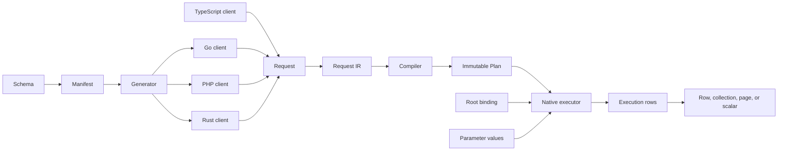
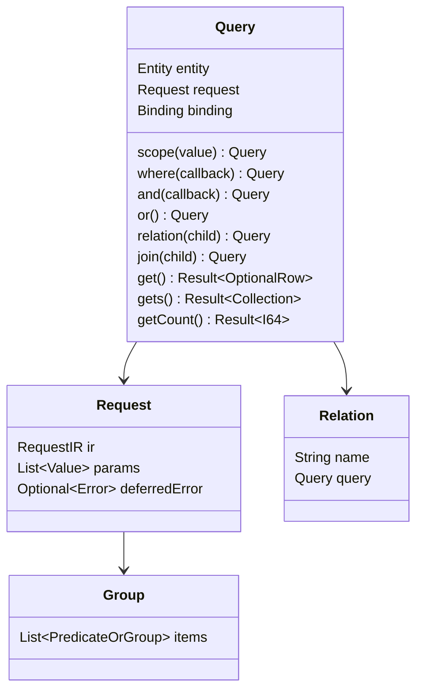
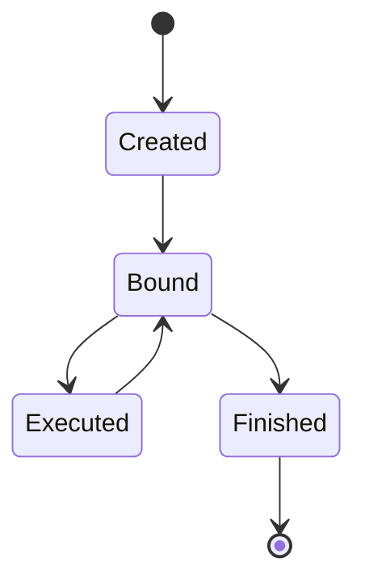
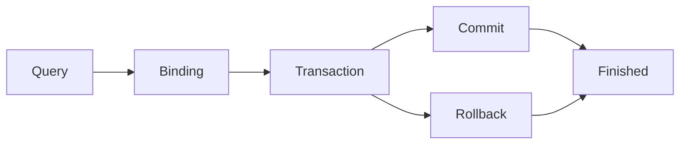
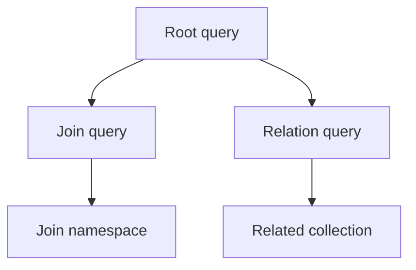
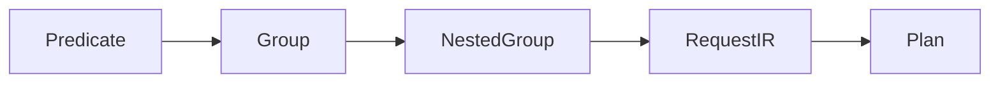
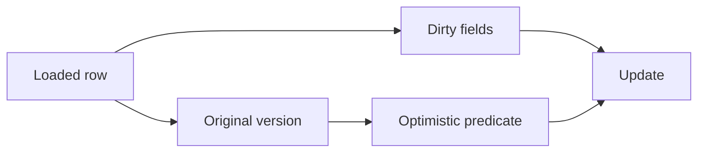
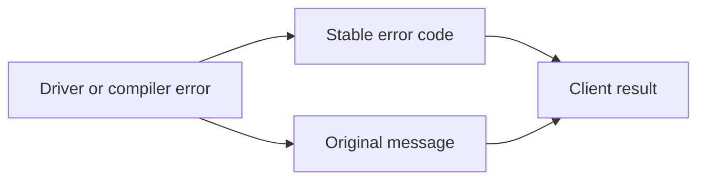
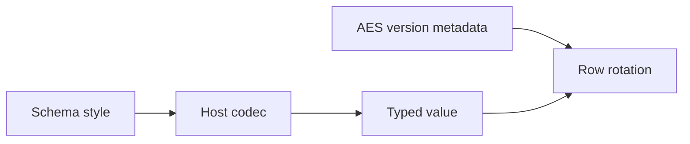

# 공통 인터페이스 v1

이 문서는 공통 공개 자료구조, 소유권 규칙, 상태 전이, 클라이언트 호출 순서를 정의한다. 구현 상태는 [구현 대조표](interface-implementation.md)에서 관리한다. 인터페이스 정의만으로 모든 클라이언트의 구현을 증명하지 않는다.

## 1. 호출 구간과 변경 규칙

schema manifest는 entity, field, relation, operator, style, error를 정의한다. compiler는 타입이 정해진 request 구조를 받고 immutable plan을 반환한다. executor는 plan, parameter 값, root binding 하나를 받는다.

변경 순서는 schema 또는 인터페이스 명세 수정, manifest와 생성물 수정, 모든 클라이언트 수정, 공통 벡터 실행, 쌍 문서 수정이다. 공통 인터페이스를 맞추기 위해 클라이언트 전용 필드나 다른 호출 순서를 추가하지 않는다.

## 2. 모듈 호출 흐름 — IF-01

compiler는 DB 자격 증명이나 parameter 값을 받지 않는다. executor가 DB 접근을 소유한다. root binding이 context와 database 또는 transaction을 제공한다. 자식 relation은 root binding을 교체할 수 없다.

## 3. 자료형과 값 — IF-02

| 논리 타입 | Go | PHP | Rust | TypeScript |
|---|---|---|---|---|
| `I64` | `int64` | `int` | `i64` | `number` |
| `F64` | `float64` | `float` | `f64` | `number` |
| `Bool` | `bool` | `bool` | `bool` | `boolean` |
| `Text` | `string` | `string` | `String` | `string` |
| `Bytes` | `[]byte` | `string` | `Vec<u8>` | `Uint8Array` |
| `DateTime` | `time.Time` | `DateTimeImmutable` | `NaiveDateTime` | `Date` |
| `JsonValue` | `any` | `mixed` | `serde_json::Value` | `unknown` |
| `Optional<T>` | `*T` | `?T` | `Option<T>` | `T \| null` |
| `List<T>` | slice | array | `Vec<T>` | `T[]` |
| `Result<T>` | `(T, error)` | return 또는 exception | `Result<T>` | `Promise<T>` |
| `Key` | `orm.Key` | typed key | `orm::Key` | `Key` |

null, 빈 목록, 누락 필드, 기본값은 서로 다른 상태다. 직렬화는 codec 명세가 요구하는 논리 타입과 필드 순서를 보존한다.

## 4. 쿼리 객체와 조건 트리 — IF-03 ~ IF-08

각 entity occurrence는 query 객체와 Where builder 하나를 가진다. group은 predicate 또는 중첩 group을 포함한다. `or()`는 다음 항목의 연결자를 바꾼다. `and(fn)`과 `or(fn)`은 중첩 group을 만든다. relation과 join은 schema의 key mapping을 사용하며 정규 문법에서 호출자가 두 번째 mapping을 전달하지 않는다.

`scope(value)`는 entity가 `%% scope`를 선언한 query에만 존재한다. 이 메서드는 parameter index를 `RequestIR.query.scope_p`에 저장하며 Where builder는 이 값을 변경할 수 없다. compiler는 root와 relation scope를 WHERE에 적용하고 join scope를 JOIN ON에 적용한다. scoped insert는 scope 컬럼을 설정한다. scoped update와 upsert는 scope 컬럼을 설정할 수 없다. scoped raw SQL은 잘못된 요청이다.

## 5. 공개 API — IF-09 ~ IF-12

### 5.0 연결 입력

모든 공개 client는 하나의 DSN URI를 받는다. `mysql://`, `postgres://`, `sqlite://` scheme이 database driver를 선택한다. 호출자는 별도의 driver 값이나 compiler engine을 전달하지 않는다.

| Client | 공개 연결 호출 | 반환값 |
|---|---|---|
| Go | `gen.Connect(dsn, schemaPath, options)` | `(*orm.DB, error)` |
| PHP | `Orm::connect(dsn, config)` | `Db` |
| Rust | `gen::connect(dsn, wasm, schema_json, pool_size, config).await?` | `orm::Db` |
| TypeScript | `Db.connect(dsn, options)` | `Promise<Db>` |

### 5.1 생성과 언어별 표기

| 동작 | PHP | Go | Rust | TypeScript |
|---|---|---|---|---|
| root entry | `Battle::query()` | `gen.Battle()` | `battle::query()` | `Battle()` |
| executor 지정 | `using($db)` | `Using(ctx, db)` | `using(&db)` | `using(database)` |
| collection terminal | `gets()` | `Gets()` | `gets().await?` | `gets()` |
| count terminal | `getCount()` | `GetCount()` | `get_count().await?` | `getCount()` |

진입점 표기는 언어 문법을 따른다. 메서드 역할, 저장 request, 반환 타입, 오류 동작, 호출 순서는 같다.

### 5.2 메서드군

| 군 | 필수 동작 |
|---|---|
| predicate | 생성된 컬럼과 schema가 허용한 operator를 사용한다. |
| group | 항목 순서와 중첩 구조를 보존한다. |
| relation | 선언된 relation 이름과 key mapping을 사용한다. |
| join | ON group과 WHERE group을 분리한다. |
| projection | 위치 기반 출력 mapping과 alias를 보존한다. |
| mutation | 변경 필드와 원본 값을 기록한다. |
| terminal | 값만 받고 root binding을 사용한다. |

`getsByX(value)`와 `getCountByX(value)`는 정규 생성 메서드다. X의 equality predicate를 적용한 뒤 `gets()` 또는 `getCount()`를 호출한다. finder 이전에 executor를 지정하며 finder에 executor를 전달하지 않는다.

### 5.3 실행 메서드

| 메서드 | 결과 | 필수 binding |
|---|---|---|
| `get` | optional row | root executor |
| `gets` | collection | root executor |
| `getCount` | integer | root executor |
| `insert` | row 또는 key | root executor |
| `update` | affected count | row 또는 root executor |
| `delete` | affected count | row 또는 root executor |

binding이 없는 terminal은 `CONFIG`다. transaction 종료 후 terminal도 `CONFIG`다. terminal에 database 인자를 전달할 수 없다.

## 6. Binding·executor·transaction — IF-13 ~ IF-17

binding은 실행 context와 database 또는 transaction 참조 하나를 포함한다. query 복사는 request 값을 공유할 수 있지만 mutable builder 상태는 공유하지 않는다. 자식 relation은 root binding을 사용한다. 로드된 row는 update와 delete에 필요한 binding을 보존한다.

transaction을 만든 코드가 소유권을 가진다. commit과 rollback은 binding을 종료한다. 이후 해당 transaction의 query와 row는 실행을 거부한다. transaction은 `savepoint(name)`, `rollbackTo(name)`, `releaseSavepoint(name)`을 제공한다. 이름은 `[A-Za-z_][A-Za-z0-9_]*`와 일치해야 하며 잘못된 이름은 `CONFIG`로 거부한다. 이 작업은 바깥 transaction을 종료하지 않는다.

PostgreSQL transaction은 transaction 범위 직렬화를 위해 `advisoryLock(key)`(Go: `AdvisoryLock`)를 제공한다. lock은 transaction 종료 시 해제된다. 다른 driver는 이 작업을 `CAPABILITY_UNSUPPORTED`로 거부한다.

스키마 설치는 호출자가 소유한 transaction에서 `installDDL(statements)`(Go: `InstallDDL`)를 사용한다. ORM은 문장을 순서대로 실행하고 첫 오류를 반환하므로 transaction 소유자가 전체 설치를 rollback할 수 있다.

PostgreSQL transaction은 transaction 종료 시 되돌리는 값에 `setLocal(key, value)`(Go: `SetLocal`), 현재 mode를 확인하는 `readOnly()`와 `isolation()`(Go: `ReadOnly`, `Isolation`), 설치를 확인하는 `schemaInstalled(schema, table)`와 `schemaExists(schema)`(Go: `SchemaInstalled`, `SchemaExists`)도 제공한다. `grantPlatformRuntimePrivileges(role)`(Go: `GrantPlatformRuntimePrivileges`)는 설치 후 고정된 `core` 및 `audit` runtime privilege를 부여한다. `grantTablePrivileges(table, role)`(Go: `GrantTablePrivileges`)는 하나의 정규화된 module table에 runtime DML 권한을 부여한다. 이 작업들은 PostgreSQL 이외 driver에서 `CAPABILITY_UNSUPPORTED`를 반환한다. 식별자는 비어 있지 않은 한 줄이어야 하고 정규화된 table 이름은 schema 구분자를 정확히 하나 포함해야 하며 statement에 사용하기 전에 quote한다.

`TransactionOptions`는 `isolation`(`default`, `read_uncommitted`, `read_committed`, `repeatable_read`, `serializable`), `readOnly`, `timeoutMs`(언어별 snake case 표기)를 받는다. Go는 isolation과 read-only를 `database/sql.TxOptions`로 전달하고 PHP·TypeScript는 PostgreSQL에서 `BEGIN` 후, MySQL에서 `START TRANSACTION` 전에 설정한다. Rust도 driver별 transaction 시작 규칙을 적용한다. SQLite는 명시적인 isolation·read-only·timeout을 거부한다. MySQL과 SQLite는 `timeoutMs`를 거부하고 PostgreSQL은 transaction 로컬 `statement_timeout`으로 적용한다. 지원하지 않는 capability는 `CAPABILITY_UNSUPPORTED`를 반환한다.

root row select는 `forUpdate()`와 `forShare()`를 제공한다(Go: `ForUpdate()`와 `ForShare()`, Rust: `for_update()`와 `for_share()`). request는 공통 IR에 `lock`을 저장한다. MySQL과 PostgreSQL은 order와 limit 뒤에 선택한 lock 절을 추가한다. SQLite는 두 mode를 모두 `CAPABILITY_UNSUPPORTED`로 거부하며 client가 row lock을 대체하지 않는다.

오류는 안정된 code와 원래 driver message를 보존한다. transaction timeout은 driver가 PostgreSQL `statement_timeout`을 지원하는 경우 `timeoutMs`로 제공하며 실행 중 cancellation은 각 언어 runtime의 native 방식을 사용한다.

`transaction`은 기본적으로 callback을 한 번 실행한다. deadlock 재시도는 기본 비활성화다. 호출자는 `TransactionOptions`의 `retryDeadlocks`와 `maxAttempts`를 지정할 수 있다. 재시도마다 새 transaction을 만들고 callback 전체를 다시 실행한다. 재시도를 활성화하면 callback은 여러 번 실행되어도 안전해야 한다.

## 7. Compile·Plan·조립 — IF-18 ~ IF-20

`Request`는 schema hash, IR version, entity, predicate tree, relation request, projection, parameter count를 포함한다. parameter 값은 request shape와 분리한다. compiler는 dialect SQL과 위치 기반 조립 정보를 포함한 immutable plan을 만든다.

조립은 `{alias, column, output_name, index}`를 사용한다. join alias는 root namespace와 분리한다. 출력 이름이 중복되면 `COLUMN_ALIAS_CONFLICT`다. schema hash가 다르면 실행 전에 `SCHEMA_HASH_MISMATCH`다.

## 8. Row 값·dirty 상태·관계 — IF-21 ~ IF-24

생성 row는 선언 필드와 relation 결과를 저장한다. getter는 선언 타입을 반환한다. setter는 필드를 변경하고 dirty로 표시한다. update는 optimistic locking에 필요한 필드를 제외하고 dirty 필드만 전송한다. 원본 version은 변경 전에 읽어 update 조건에 사용한다.

relation 결과는 schema에 따라 한 행 또는 collection이다. collection keying은 결정적이다. 중복 key는 선언된 정책을 따르고, 선언되지 않은 key function은 오류다.

## 9. Collection·Key·Page — IF-25 ~ IF-27

| 객체 | 필수 필드 |
|---|---|
| `Collection<T>` | 순서가 있는 행, 길이, first, key lookup |
| `Key` | 논리 타입 tag와 값 |
| `Page<T>` | page, 페이지당 수, total count, rows |

정수 key `7`과 문자열 key `"7"`은 다른 key다. 복합 key는 각 타입 구성요소의 길이를 함께 인코딩하므로 `("1", "23")`과 `("12", "3")`이 충돌하지 않는다. plan은 순서가 있는 collection 식별자를 `Assemble.key`에 기록한다. 일반 행은 모든 primary key 구성요소를 사용하고 grouped count 행은 group 컬럼과 expression 별칭을 사용한다. 명시적인 order나 key 정책이 없으면 collection은 DB 순서를 보존한다. page는 root 결과 순서와 relation 부착 순서를 보존한다.

## 10. 설정·오류·코덱·이벤트 — IF-28 ~ IF-31

설정은 DSN, schema 파일, executor, AES key version map, query event hook을 선택한다. 다른 database를 선택하거나 request 경로를 변경하지 않는다.

오류는 [errors.yaml](errors.yaml)의 code를 사용한다. codec style은 schema 선언이다. AES version column은 NULL 불가 정수 평문 메타데이터이며 encoding style을 사용하지 않고 기본 projection에서 제외한다. AES rotation은 모든 AES payload 컬럼과 version을 하나의 transaction에서 갱신한다.

query event에는 정규화 SQL, bind 수, duration, plan 식별자, 오류를 기록한다. secret과 parameter 값은 log에서 제외한다.

## 11. 생성기·스키마·확장 구분 — IF-32 ~ IF-34

generator는 schema manifest를 읽고 선언된 method, field, relation, column reference, error type을 출력한다. 선언되지 않은 column, relation, operator의 method를 출력하지 않는다. 생성 코드는 manifest와 interface symbol 목록으로 검사한다.

정규 API는 `relation<Rel>`, `relations<Rel>`, `join<Rel>`, `leftJoin<Rel>`처럼 선언된 relation method를 사용한다. 선언되지 않은 method 이름은 언어의 method lookup 단계에서 실패한다.

## 12. 검증

검증 도구는 manifest, 생성 symbol, 저장 필드, request shape, 상태 전이, 오류 code, codec vector, relation 결과, database 결과를 검사한다. 문서 쌍, 정적 Pages 결과, Mermaid SVG 결과, 반복 빌드 byte도 검사한다.

symbol 검사 통과는 선언된 표면만 증명한다. 적합성 벡터 통과는 검사한 입력과 결과만 증명한다. 모든 지원 client, 필요한 database, 테스트, 문서, Pages 검사를 통과해야 기능을 완료로 표시한다.
