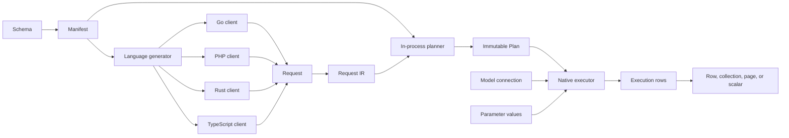
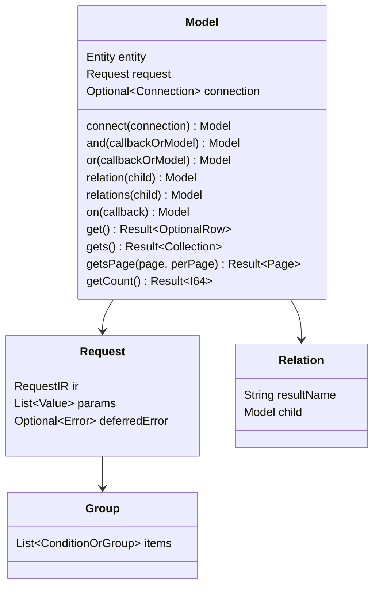
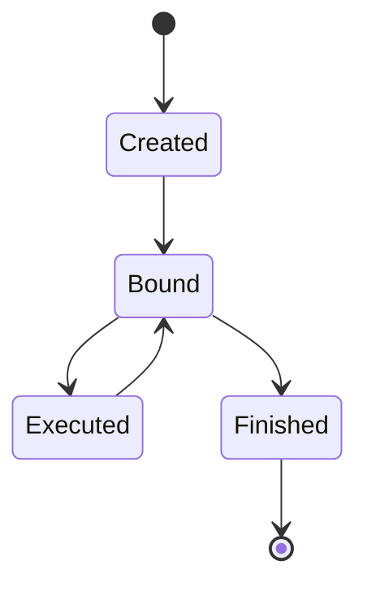
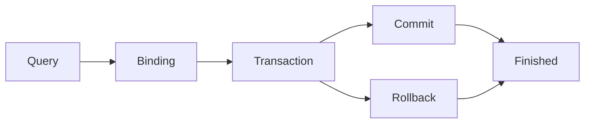
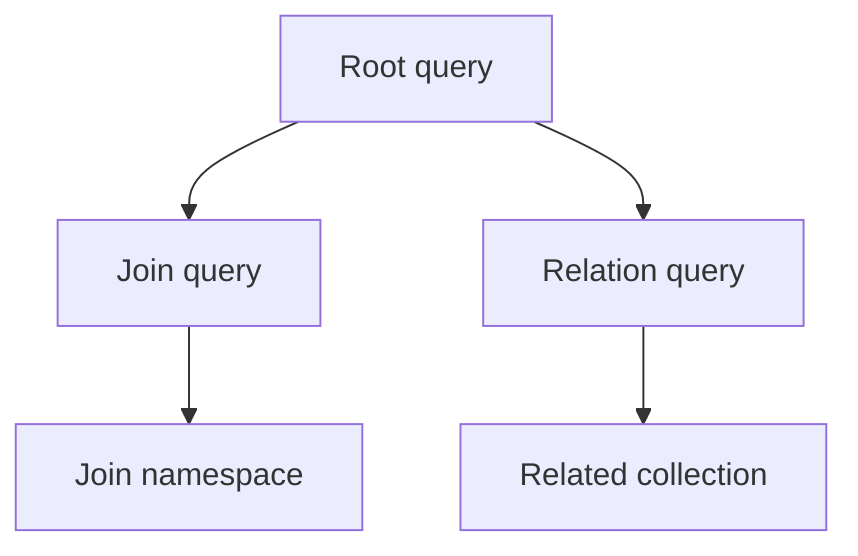
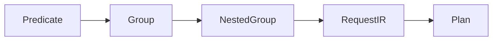
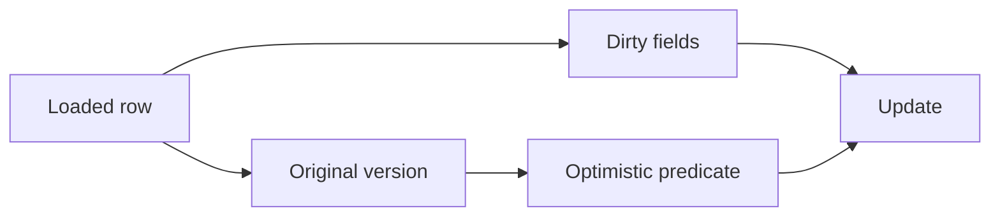
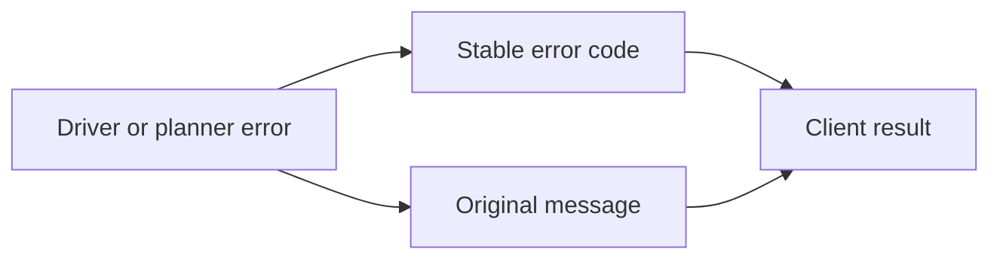
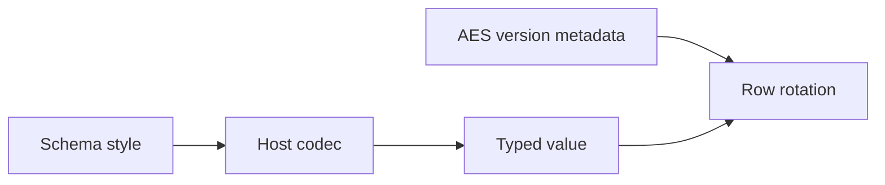

# 공통 인터페이스 v1

이 문서는 [DSL](dsl.md) 문법의 공통 공개 자료구조, 소유 규칙, 상태 전이, 클라이언트 호출 순서를 정의한다. 구현 상태는 [구현 대조표](interface-implementation.md)에 기록한다. 인터페이스를 정의했다는 사실이 모든 클라이언트의 구현을 입증하지는 않는다.

## 1. 호출 구간과 변경 규칙

스키마 매니페스트는 엔티티, 필드, 연산자, 스타일, 오류를 정의한다. 각 언어는 자기 빌드 도구로 매니페스트에서 모델을 생성한다. 클라이언트 라이브러리는 타입이 있는 요청 형태를 검증하고 애플리케이션 프로세스 안에서 변경할 수 없는 Plan으로 계획한다. 실행기는 Plan, 매개변수 값, 모델에 선택된 연결을 받는다.

변경 순서는 설계 계획과 DSL 갱신, 매니페스트와 생성물 갱신, 모든 클라이언트 갱신, 공통 벡터 실행, 쌍 문서 갱신이다. 클라이언트는 공통 인터페이스를 맞추기 위해 비공개 필드나 다른 호출 순서를 추가할 수 없다.

## 2. 모듈 호출 흐름 — IF-01

플래너는 데이터베이스 인증 정보와 매개변수 값을 받지 않는다. 데이터베이스 접근은 실행기의 책임이다. 모델은 `connect`로 연결을 받는다. 트랜잭션 콜백 안에서 `connect`를 호출하지 않은 모델은 현재 실행 흐름의 활성 트랜잭션을 사용한다. `connect`를 호출하지 않은 조인·관계 자식은 부모 연결을 사용한다.

## 3. 자료형과 값 — IF-02

| 논리 타입 | Go | PHP | Rust | TypeScript |
|---|---|---|---|---|
| `I64` | `int64` | `int` | `i64` | `number` |
| `F64` | `float64` | `float` | `f64` | `number` |
| `Bool` | `bool` | `bool` | `bool` | `boolean` |
| `Text` | `string` | `string` | `String` | `string` |
| `Bytes` | `[]byte` | `string` | `Vec<u8>` | `Uint8Array` |
| `DateTime` | `time.Time` | `DateTimeImmutable` | `NaiveDateTime` | `Date` |
| `JsonValue` | `any` | `mixed` | `serde_json::Value` | `unknown` |
| `Optional<T>` | `*T` | `?T` | `Option<T>` | `T \| null` |
| `List<T>` | slice | array | `Vec<T>` | `T[]` |
| `Result<T>` | `(T, error)` | 반환 또는 예외 | `Result<T>` | `Promise<T>` |
| `Key` | `orm.Key` | 타입 있는 키 | `orm::Key` | `Key` |

null, 빈 목록, 누락 필드, 기본값은 서로 다른 상태다. 직렬화는 코덱 명세가 요구하는 논리 타입과 필드 순서를 유지한다.

## 4. 모델과 조건 트리 — IF-03 ~ IF-08

모델은 쿼리 빌더이자 조회한 행 타입이다. 묶음은 조건이나 하위 묶음을 순서대로 가지며 첫 항목 뒤의 항목은 명시적인 `AND` 또는 `OR` 연결자를 가진다. `and(fn)`과 `or(fn)`은 하위 묶음을 만들며 콜백은 같은 타입의 빈 모델을 받는다. `and(model)`과 `or(model)`은 조인 자식의 조건을 묶음으로 넣는다. 조인 `ON` 조건은 `WHERE` 조건과 따로 저장한다.

종단 작업은 저장된 요청을 바꾸지 않으므로 종단 작업을 반복해도 같은 SQL 문장을 만든다.

## 5. 공개 API — IF-09 ~ IF-12

### 5.0 연결 입력

모든 공개 클라이언트는 DSN URI 하나를 받는다. `mysql://`, `postgres://`, `sqlite://`가 데이터베이스 드라이버를 선택한다. 선택 매개변수 `timezone`이 연결 시간대를 정하며, 없으면 서버 환경의 시간대를 사용한다. 호출자는 별도 드라이버 값을 전달하지 않는다.

| 클라이언트 | 공개 연결 호출 | 결과 |
|---|---|---|
| Go | `model.Connect(dsn, schemaPath, config)` | `(*orm.DB, error)` |
| PHP | `Orm::connect(dsn, new Config(schemaPath: …))` | `Db` |
| Rust | `orm::Db::connect(dsn, pool_size, config).await?` | `orm::Db` |
| TypeScript | `Db.connect(dsn, schemaPath, options)` | `Promise<Db>` |

### 5.1 생성과 언어별 표기

| 작업 | PHP | Go | Rust | TypeScript |
|---|---|---|---|---|
| 모델 생성 | `new Product` | `model.Product()` | `Product::new()` | `new Product()` |
| 연결 | `->connect($db)` 또는 `($db)` | `.Connect(db)` | `.connect(&db)` | `.connect(db)` |
| 컬렉션 종단 | `gets()` | `Gets()` | `gets().await?` | `gets()` |
| 개수 종단 | `getCount()` | `GetCount()` | `get_count().await?` | `getCount()` |

생성 표기는 호스트 언어를 따른다. 메서드 역할, 저장 요청, 결과 타입, 오류 동작, 호출 순서는 같다.

### 5.2 메서드군

| 메서드군 | 필수 동작 |
|---|---|
| 조건 | 컬럼 체인, 연산자 접두어, 값 형태, 명시적 연결자를 사용한다. |
| 묶음 | 항목 순서와 하위 묶음 구분을 유지한다. |
| 관계 | 자식의 `match<L>With<R>` 키를 사용하며 관계마다 별도 SQL 문장을 실행한다. |
| 조인 | `ON`과 `WHERE` 조건을 분리하고 자식을 전달한 묶음 위치에 자식 조건을 넣는다. |
| 컬럼 | 위치 기반 출력 대응을 유지하고 행 명칭 중복을 거부한다. |
| 변경 | 변경 필드와 원래 값을 기록한다. |
| 종단 | 체인 값만 받고 모델 연결을 사용한다. |

`getBy<Chain>`, `getsBy<Chain>`, `getCountBy<Chain>`은 체인을 조건으로 적용하고 종단 작업을 호출한다. PHP는 호출 시점에 체인을 해석하고, Go, Rust, TypeScript는 소비자 소스가 호출하는 체인을 생성한다.

### 5.3 실행 메서드

| 메서드 | 결과 | 연결 |
|---|---|---|
| `get` | 행 하나 또는 null | 모델 연결 또는 활성 트랜잭션 |
| `gets` | 컬렉션 | 모델 연결 또는 활성 트랜잭션 |
| `getsPage` | 페이지 | 모델 연결 또는 활성 트랜잭션 |
| `getCount` | 정수 | 모델 연결 또는 활성 트랜잭션 |
| `create` | 생성 키를 포함한 행 | 모델 연결 또는 활성 트랜잭션 |
| `creates` | 삽입한 행 수 | 모델 연결 또는 활성 트랜잭션 |
| `update` | 행 | 행 연결 또는 활성 트랜잭션 |
| `delete` | 행 또는 컬렉션 | 행 연결 또는 활성 트랜잭션 |

트랜잭션 밖에서 연결 없는 종단 작업은 `CONFIG`를 반환한다. 연결은 생성된 요청이 사용하는 스키마 엔진을 가져야 하며, 아니면 종단 작업이 `CONFIG`를 반환한다.

## 6. 연결·트랜잭션·유틸리티 — IF-13 ~ IF-17

`connection.transaction(fn, options)`은 콜백을 하나의 트랜잭션에서 실행한다. begin, commit, rollback, 실행기는 비공개다. 콜백 오류나 예외는 트랜잭션을 되돌리고, 그렇지 않으면 커밋하고 콜백 결과를 반환한다.

| 옵션 | 값 |
|---|---|
| `isolation` | `default`, `read_uncommitted`, `read_committed`, `repeatable_read`, `serializable` |
| `readOnly` | 불리언 |
| `timeoutMs` | 양의 정수. PostgreSQL은 `statement_timeout`을 적용하고 MySQL과 SQLite는 `CAPABILITY_UNSUPPORTED`를 반환 |
| `retry` | 교착 재시도 횟수, 기본값 `3`. 재시도마다 콜백 전체를 다시 실행하며 `0`은 재시도를 끈다 |

- 실행 흐름마다 활성 트랜잭션 스택을 유지한다. 실행 흐름은 Go의 goroutine, PHP의 요청, TypeScript의 비동기 컨텍스트, Rust의 task다. `connect` 없는 모델은 가장 안쪽 트랜잭션을 사용한다.
- 활성 트랜잭션 안에서 같은 연결의 트랜잭션을 호출하면 savepoint를 만든다. 바깥 콜백이 안쪽 실패를 반환하지 않으면 안쪽 작업만 되돌린다.
- 하나의 트랜잭션 연결을 동시에 사용하면 오류를 반환한다. 콜백 안에서 시작한 task나 goroutine에는 활성 트랜잭션이 없다.
- `transactionConflict(message)`(Go: `orm.TransactionConflict`)는 재시도 대상 `DEADLOCK` 오류를 만든다.
- 행 잠금 `forUpdate()`, `forShare()`, `forUpdateNoWait()`, `forShareNoWait()`는 트랜잭션 안에서만 허용한다. MySQL과 PostgreSQL은 잠금 절을 추가하고 SQLite는 ORM 트랜잭션 범위의 잠금 행을 사용한다.

`connection.utils()`는 쿼리 문법 밖의 작업을 제공한다.

| 유틸리티 | 동작 |
|---|---|
| `lock(key)` | 트랜잭션 범위 이름 잠금. MySQL `GET_LOCK`, PostgreSQL advisory lock, SQLite ORM 잠금 행. 활성 트랜잭션 필요 |
| `setLocal(key, value)`, `local(key)` | 트랜잭션 로컬 값. 활성 트랜잭션 필요. 없는 키의 `local`은 `NO_ROWS` 반환 |
| `wasInserted(entity, sequence)` | 해당 sequence에 대한 생성된 ORM insert가 현재 트랜잭션에서 성공했는지 반환. 어댑터 중립적이며 savepoint rollback에 맞춰 복원 |
| `backendWaitingForLock(ctx)` | PostgreSQL pool backend의 lock 대기를 반환. MySQL과 SQLite는 driver 전용 호출을 노출하지 않고 `false` 반환 |
| `schema().install(manifestJson)` | 모든 데이터베이스에서 매니페스트의 없는 테이블, 키, 인덱스, 주석, 트리거를 만들고 기존 테이블은 유지. MySQL에서 트랜잭션 안의 호출은 `CONFIG` |
| `schema().exists(schema)`, `schema().installed(schema, table)`, `schema().empty()` | 스키마 확인 |
| `privileges().grantTable(table, role)`, `revokeTable(table, privilege, role)`, `inspectTable(table)` | 테이블 권한. PostgreSQL이 아닌 방언은 `CAPABILITY_UNSUPPORTED` 반환 |
| `aes().status(model, keyring)`, `aes().rotate(model, keyring)` | AES 키 버전 상태와 모든 AES 컬럼·버전의 단일 트랜잭션 회전 |
| `stats()` | 연결 풀 통계 |

데이터를 바꾸는 유틸리티는 활성 트랜잭션이 없으면 트랜잭션을 열고, 같은 연결의 활성 트랜잭션이 있으면 그 트랜잭션에 참여한다.

## 7. 계획과 조립 — IF-18 ~ IF-20

`Request`는 schema hash, IR version, entity, predicate tree, relation request, projection, parameter count를 포함한다. parameter 값은 request shape와 분리한다. 클라이언트 플래너는 dialect SQL과 위치 기반 조립 정보를 포함한 immutable plan을 만든다. 네 플래너는 같은 요청에서 같은 SQL을 만들며, conformance 벡터가 이를 검사한다.

조립은 `{alias, column, output_name, index}`를 사용한다. join alias는 root namespace와 분리한다. 출력 이름이 중복되면 `COLUMN_ALIAS_CONFLICT`다. schema hash가 다르면 실행 전에 `SCHEMA_HASH_MISMATCH`다.

## 8. Row 값·dirty 상태·관계 — IF-21 ~ IF-24

모델 행은 선언 필드, 추가 컬럼, 관계 결과, `new<Name>`으로 추가한 값을 하나의 명칭 공간에 저장하며 명칭 중복을 거부한다. getter는 선언 타입을 반환한다. setter는 필드를 변경하고 dirty로 표시한다. update는 optimistic locking에 필요한 필드를 제외하고 dirty 필드만 전송한다. 원본 version은 변경 전에 읽어 update 조건에 사용한다.

relation 결과는 schema에 따라 한 행 또는 collection이다. collection keying은 결정적이다. 중복 key는 선언된 정책을 따르고, 선언되지 않은 key function은 오류다.

## 9. Collection·Key·Page — IF-25 ~ IF-27

| 객체 | 필수 필드 |
|---|---|
| `Collection<T>` | 순서가 있는 행, 길이, first, key lookup |
| `Key` | 논리 타입 tag와 값 |
| `Page<T>` | `items`, `totalCount`, `totalPages`, `page`, `perPage` |

정수 key `7`과 문자열 key `"7"`은 다른 key다. 복합 key는 각 타입 구성요소의 길이를 함께 인코딩하므로 `("1", "23")`과 `("12", "3")`이 충돌하지 않는다. plan은 순서가 있는 collection 식별자를 `Assemble.key`에 기록한다. 일반 행은 모든 primary key 구성요소를 사용하고 grouped count 행은 group 컬럼과 expression 별칭을 사용한다. 명시적인 order나 key 정책이 없으면 collection은 DB 순서를 보존한다. page는 root 결과 순서와 relation 부착 순서를 보존한다.

## 10. 설정·오류·코덱·이벤트 — IF-28 ~ IF-31

설정은 DSN, schema 파일, executor, AES key version map, query event hook을 선택한다. 다른 database를 선택하거나 request 경로를 변경하지 않는다.

오류는 [errors.yaml](errors.yaml)의 code를 사용한다. Go 호출자는 adapter에 독립적인 분류를 위해 `orm.ErrorCode`, `orm.IsDeadlock`, `orm.IsDuplicateKey`, `orm.IsForeignKey`를 사용하며 driver 오류 타입을 검사하지 않는다. codec style은 schema 선언이다. AES version column은 NULL 불가 정수 평문 메타데이터이며 encoding style을 사용하지 않고 기본 projection에서 제외한다. AES rotation은 모든 AES payload 컬럼과 version을 하나의 transaction에서 갱신한다.

query event에는 정규화 SQL, bind 수, duration, plan 식별자, 오류를 기록한다. secret과 parameter 값은 log에서 제외한다.

## 11. 생성기·스키마·확장 구분 — IF-32 ~ IF-34

생성기는 스키마 매니페스트를 읽고 모델, 필드, 컬럼 메서드, 오류 타입을 출력한다. Go와 Rust 생성은 소비자 소스도 읽어 소스가 호출하는 체인, 관계 키, 조인, `new<Name>` 메서드를 출력한다. 선언되지 않은 컬럼이나 연산자의 메서드는 출력하지 않는다. 생성 코드는 매니페스트와 인터페이스 심볼 목록으로 검사한다.

관계는 자식의 `match<L>With<R>()`와 함께 `relation(child)`, `relations(child)`를 사용한다. 조인은 `join<L>With<R>(child)`, `leftJoin<L>With<R>(child)`를 사용한다. 알 수 없는 명칭은 PHP와 TypeScript에서는 호출 해석 단계, Go와 Rust에서는 생성 단계에서 실패한다.

## 12. 검증

검증 도구는 manifest, 생성 symbol, 저장 필드, request shape, 상태 전이, 오류 code, codec vector, relation 결과, database 결과를 검사한다. 문서 쌍, 정적 Pages 결과, Mermaid SVG 결과, 반복 빌드 byte도 검사한다.

symbol 검사 통과는 선언된 표면만 증명한다. 적합성 벡터 통과는 검사한 입력과 결과만 증명한다. 모든 지원 client, 필요한 database, 테스트, 문서, Pages 검사를 통과해야 기능을 완료로 표시한다.
