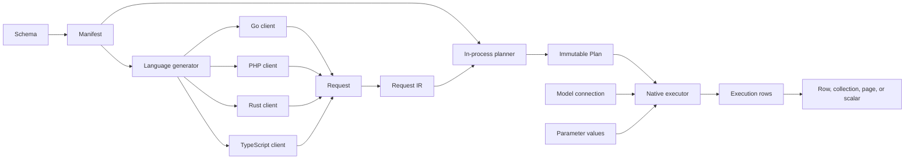
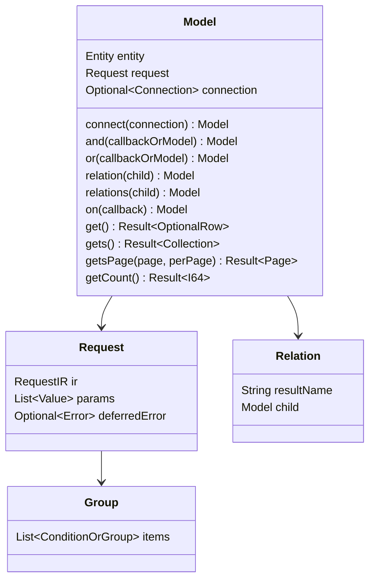
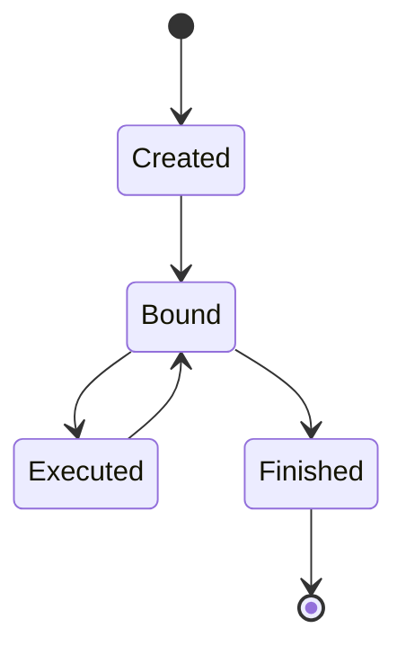
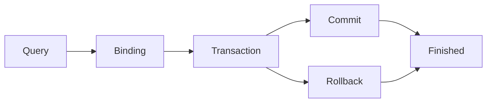
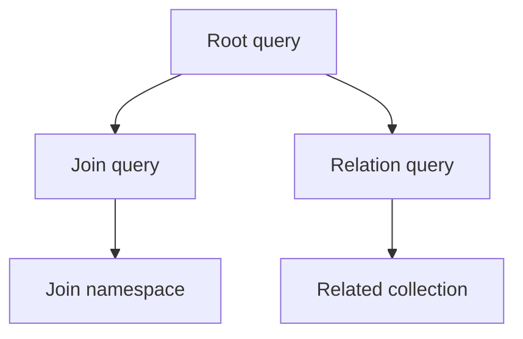
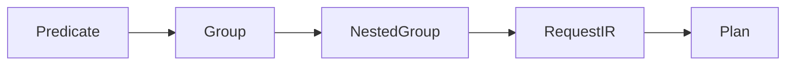
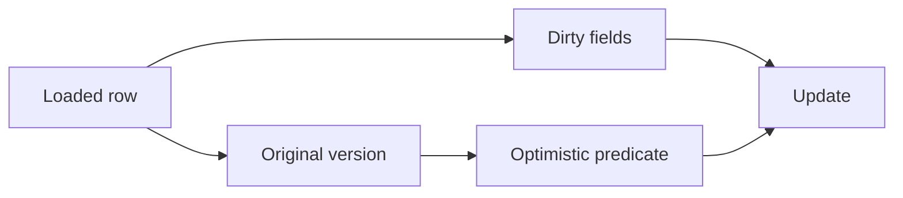
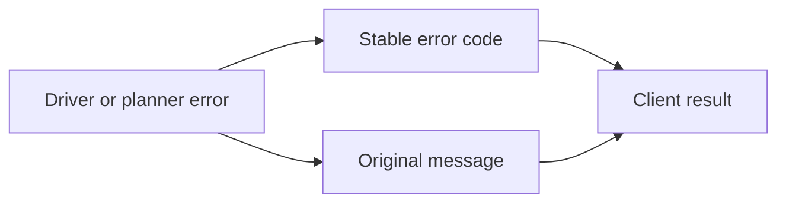
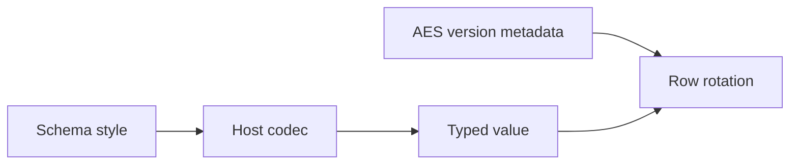

# 공통 인터페이스 v1

이 문서는 [DSL](dsl.md) 문법의 공통 공개 자료구조, 소유 규칙, 상태 전이, 클라이언트 호출 순서를 정의한다. 구현 상태는 [구현 대조표](interface-implementation.md)에 기록한다. 인터페이스를 정의했다는 사실이 모든 클라이언트의 구현을 입증하지는 않는다.

## 1. 호출 구간과 변경 규칙

스키마 매니페스트는 엔티티, 필드, 연산자, 스타일, 오류를 정의한다. 각 언어는 자기 빌드 도구로 매니페스트에서 모델을 생성한다. 클라이언트 라이브러리는 타입이 있는 요청 형태를 검증하고 호출한 프로세스 안에서 변경할 수 없는 Plan으로 계획한다. 실행기는 Plan, 매개변수 값, 모델에 선택된 연결을 받는다.

변경 순서는 설계 계획과 DSL 갱신, 매니페스트와 생성물 갱신, 모든 클라이언트 갱신, 공통 벡터 실행, 쌍 문서 갱신이다. 클라이언트는 공통 인터페이스를 맞추기 위해 비공개 필드나 다른 호출 순서를 추가할 수 없다.

## 2. 모듈 호출 흐름 — IF-01

```mermaid
flowchart LR
    Schema[Schema] --> Manifest[Manifest]
    Manifest --> Generator[Language generator]
    Generator --> Go[Go client]
    Generator --> PHP[PHP client]
    Generator --> Rust[Rust client]
    Generator --> TypeScript[TypeScript client]
    Go --> Request[Request]
    PHP --> Request
    Rust --> Request
    TypeScript --> Request
    Request --> IR[Request IR]
    Manifest --> Planner[In-process planner]
    IR --> Planner
    Planner --> Plan[Immutable Plan]
    Plan --> Executor[Native executor]
    Binding[Model connection] --> Executor
    Values[Parameter values] --> Executor
    Executor --> Rows[Execution rows]
    Rows --> Result[Row, collection, page, or scalar]
```

플래너는 데이터베이스 인증 정보와 매개변수 값을 받지 않는다. 데이터베이스 접근은 실행기의 책임이다. 모델은 `connect`로 연결을 받는다. 트랜잭션 콜백 안에서 `connect`를 호출하지 않은 모델은 현재 실행 흐름의 활성 트랜잭션을 사용한다. `connect`를 호출하지 않은 조인·관계 자식은 부모 연결을 사용한다.

## 3. 자료형과 값 — IF-02

| 논리 타입 | Go | PHP | Rust | TypeScript |
|---|---|---|---|---|
| `I64` | `int64` | `int` | `i64` | `number` |
| `F64` | `float64` | `float` | `f64` | `number` |
| `Bool` | `bool` | `bool` | `bool` | `boolean` |
| `Text` | `string` | `string` | `String` | `string` |
| `Bytes` | `[]byte` | `string` | `Vec<u8>` | `Uint8Array` |
| `DateTime` | `time.Time` | `DateTimeImmutable` | `NaiveDateTime` | `Date` |
| `JsonValue` | `any` | `mixed` | `serde_json::Value` | `unknown` |
| `Optional<T>` | `*T` | `?T` | `Option<T>` | `T \| null` |
| `List<T>` | slice | array | `Vec<T>` | `T[]` |
| `Result<T>` | `(T, error)` | 반환 또는 예외 | `Result<T>` | `Promise<T>` |
| `Key` | `orm.Key` | 타입 있는 키 | `orm::Key` | `Key` |

null, 빈 목록, 누락 필드, 기본값은 서로 다른 상태다. 직렬화는 코덱 명세가 요구하는 논리 타입과 필드 순서를 유지한다.

## 4. 모델과 조건 트리 — IF-03 ~ IF-08

```mermaid
classDiagram
    class Model {
        Entity entity
        Request request
        Optional~Connection~ connection
        connect(connection) Model
        and(callbackOrModel) Model
        or(callbackOrModel) Model
        relation(child) Model
        relations(child) Model
        on(callback) Model
        get() Result~OptionalRow~
        gets() Result~Collection~
        getsPage(page, perPage) Result~Page~
        getCount() Result~I64~
    }
    class Request {
        RequestIR ir
        List~Value~ params
        Optional~Error~ deferredError
    }
    class Group {
        List~ConditionOrGroup~ items
    }
    class Relation {
        String resultName
        Model child
    }
    Model --> Request
    Request --> Group
    Model --> Relation
```

모델은 쿼리 빌더이자 조회한 행 타입이다. 묶음은 조건이나 하위 묶음을 순서대로 가지며 첫 항목 뒤의 항목은 명시적인 `AND` 또는 `OR` 연결자를 가진다. `and(fn)`과 `or(fn)`은 하위 묶음을 만들며 콜백은 같은 타입의 빈 모델을 받는다. `and(model)`과 `or(model)`은 조인 자식의 조건을 묶음으로 넣는다. 조인 `ON` 조건은 `WHERE` 조건과 따로 저장한다.

종단 작업은 저장된 요청을 바꾸지 않으므로 종단 작업을 반복해도 같은 SQL 문장을 만든다.

## 5. 공개 API — IF-09 ~ IF-12

### 5.0 연결 입력

모든 공개 클라이언트는 DSN URI 하나를 받는다. `mysql://`, `postgres://`, `sqlite://`가 데이터베이스 드라이버를 선택한다. 모든 연결은 datetime 값을 UTC로 읽고 쓰며, 선택 매개변수 `timezone`은 `UTC`나 `+00:00`만 받는다. 호출자는 별도 드라이버 값을 전달하지 않는다.

| 클라이언트 | 공개 연결 호출 | 결과 |
|---|---|---|
| Go | `model.Connect(dsn, config)` | `(*orm.DB, error)` |
| PHP | `\Polyspec\Orm\Tests\Model\connect(dsn, new Config(…))` | `Db` |
| Rust | `model::connect(dsn, pool_size, config).await?` | `orm::Db` |
| TypeScript | generated module의 `connect(dsn, options)` | `Promise<Db>` |

### 5.1 생성과 언어별 표기

| 작업 | PHP | Go | Rust | TypeScript |
|---|---|---|---|---|
| 모델 생성 | `new Product` | `model.Product()` | `Product::new()` | `new Product()` |
| 연결 | `->connect($db)` 또는 `($db)` | `.Connect(db)` | `.connect(&db)` | `.connect(db)` |
| 컬렉션 종단 | `gets()` | `Gets()` | `gets().await?` | `gets()` |
| 개수 종단 | `getCount()` | `GetCount()` | `get_count().await?` | `getCount()` |

생성 표기는 호스트 언어를 따른다. 메서드 역할, 저장 요청, 결과 타입, 오류 동작, 호출 순서는 같다.

### 5.2 메서드군

| 메서드군 | 필수 동작 |
|---|---|
| 조건 | 컬럼 체인, 연산자 접두어, 값 형태, 명시적 연결자를 사용한다. |
| 묶음 | 항목 순서와 하위 묶음 구분을 유지한다. |
| 관계 | 자식의 `match<L>With<R>` 키를 사용하며 관계마다 별도 SQL 문장을 실행한다. |
| 조인 | `ON`과 `WHERE` 조건을 분리하고 자식을 전달한 묶음 위치에 자식 조건을 넣는다. |
| 컬럼 | 위치 기반 출력 대응을 유지하고 행 명칭 중복을 거부한다. |
| 변경 | 변경 필드와 원래 값을 기록한다. |
| 종단 | 체인 값만 받고 모델 연결을 사용한다. |

`getBy<Chain>`, `getsBy<Chain>`, `getCountBy<Chain>`은 체인을 조건으로 적용하고 종단 작업을 호출한다. PHP는 호출 시점에 체인을 해석하고, Go, Rust, TypeScript는 읽은 소스가 호출하는 체인을 생성한다.

### 5.3 실행 메서드

| 메서드 | 결과 | 연결 |
|---|---|---|
| `get` | 행 하나; 일치하는 행이 없으면 `NO_ROWS` | 모델 연결 또는 활성 트랜잭션 |
| `gets` | 컬렉션 | 모델 연결 또는 활성 트랜잭션 |
| `getsCount` | 선택한 그룹 값과 검증한 행 개수를 담은 `GroupRows` | 모델 연결 또는 활성 트랜잭션 |
| `getsPage` | 페이지 | 모델 연결 또는 활성 트랜잭션 |
| `getCount` | 정수 | 모델 연결 또는 활성 트랜잭션 |
| `create` | 생성 키를 포함한 행 | 모델 연결 또는 활성 트랜잭션 |
| `creates` | 삽입한 행 수 | 모델 연결 또는 활성 트랜잭션 |
| `update` | 행 | 행 연결 또는 활성 트랜잭션 |
| `delete` | 행 또는 컬렉션 | 행 연결 또는 활성 트랜잭션 |

트랜잭션 밖에서 연결 없는 종단 작업은 `CONFIG`를 반환한다. 연결은 생성된 요청이 사용하는 스키마 엔진을 가져야 하며, 아니면 종단 작업이 `CONFIG`를 반환한다.

`GroupRows`에는 일부 필드만 채운 모델이 없다. 각 행에는 선택한 그룹 값과 음이 아닌 `row_count` 하나만 있다. 개수가 없거나 중복되거나 형식이 잘못되었거나 손실되면 실패한다. 선택한 값은 불리언과 SQL NULL을 포함해 선언된 타입을 유지하며, 선택하지 않은 값을 요청하면 `COLUMN_UNSELECTED`를 반환한다.

## 6. 연결·트랜잭션·유틸리티 — IF-13 ~ IF-17

`connection.transaction(fn, options)`은 콜백을 하나의 트랜잭션에서 실행한다. begin, commit, rollback, 실행기는 비공개다. 콜백 오류나 예외는 트랜잭션을 되돌리고, 그렇지 않으면 커밋하고 콜백 결과를 반환한다. named lock, user variable, pragma는 pool connection에서 `COMMIT`과 `ROLLBACK` 뒤에도 남으므로, 클라이언트는 트랜잭션이 끝나기 전에 MySQL `lock` lock을 풀고 `setLocal`의 MySQL 값을 지우고 SQLite `query_only`와 `read_uncommitted` mode를 되돌린다. 모든 정리 단계를 실행하고 실패한 단계를 모두 보고한다. 1을 돌려주지 않은 `RELEASE_LOCK`은 `CONFIG` `lock <key> was not held at transaction end`다. 커밋할 때 이 정리가 실패하면 트랜잭션을 되돌리고 정리 오류를 반환한다. 콜백, begin, 커밋 정리가 실패하고 정리나 rollback도 실패하면 오류는 `ROLLBACK` `transaction failed (<cause>) and rollback failed (<transaction end error>)`다. 이 오류는 원인과 트랜잭션 종료 오류를 유지하며([protocol](protocol.ko.md)) 재시도하지 않는다. panic한 Go나 Rust 콜백과 `runtime.Goexit`로 떠난 Go 콜백은 트랜잭션을 되돌리고 panic을 이어 간다. 그 rollback이 실패하면 panic 값은 같은 형식의 `ROLLBACK` 오류다. server나 driver가 connection을 닫아서, 예를 들어 취소된 statement나 끝난 session 때문에 실패한 rollback도 실패한 rollback이며 같은 형식으로 보고한다. server가 session과 함께 트랜잭션을 끝냈어도 그렇다. 실패한 트랜잭션을 connection을 닫아 끝내는 클라이언트는 원인만 보고한다. context가 취소된 Go 트랜잭션은 정리 statement를 실행할 수 없으므로 connection을 pool에 돌려주지 않고 닫으며 `CANCELED`만 보고한다. server에서 session과 함께 트랜잭션, named lock, user variable, SQLite mode가 끝난다. 트랜잭션이 끝나기 전에 drop된 Rust 트랜잭션 future는 TLS에서도 connection을 바로 닫으므로, server에서 session과 함께 트랜잭션과 lock이 끝난다.

| 옵션 | 값 |
|---|---|
| `isolation` | `default`, `read_uncommitted`, `read_committed`, `repeatable_read`, `serializable` |
| `readOnly` | 불리언 |
| `timeoutMs` | 양의 정수. PostgreSQL은 `statement_timeout`을 적용하고 MySQL과 SQLite는 `CAPABILITY_UNSUPPORTED`를 반환 |
| `retry` | 교착 재시도 횟수, 기본값 `3`. 재시도마다 콜백 전체를 다시 실행하며 `0`은 재시도를 끈다 |

- 실행 흐름마다 활성 트랜잭션 스택을 유지한다. 실행 흐름은 Go의 goroutine, PHP의 요청, TypeScript의 비동기 컨텍스트, Rust의 task다. `connect` 없는 모델은 가장 안쪽 트랜잭션을 사용한다.
- 활성 트랜잭션 안에서 같은 연결의 트랜잭션을 호출하면 savepoint를 만든다. 바깥 콜백이 안쪽 실패를 반환하지 않으면 안쪽 작업만 되돌린다. 콜백 오류, panic, Go `runtime.Goexit` 뒤에는 `ROLLBACK TO SAVEPOINT`와 `RELEASE SAVEPOINT`를 모두 실행하고, 둘 중 하나가 실패하면 오류나 panic 값은 `ROLLBACK` `transaction failed (<cause>) and rollback failed (<savepoint end error>)`다. 성공한 콜백 뒤에 실패한 `RELEASE SAVEPOINT`는 그 오류를 반환한다. 취소된 트랜잭션 context로 이미 끝난 트랜잭션의 savepoint는 트랜잭션과 함께 끝났다.
- 하나의 트랜잭션 연결을 동시에 사용하면 오류를 반환한다. 콜백 안에서 시작한 task나 goroutine에는 활성 트랜잭션이 없다.
- `transactionConflict(message)`(Go: `orm.TransactionConflict`)는 재시도 대상 `DEADLOCK` 오류를 만든다.
- 행 잠금 `forUpdate()`, `forShare()`, `forUpdateNoWait()`, `forShareNoWait()`는 트랜잭션 안에서만 허용한다. MySQL과 PostgreSQL은 잠금 절을 추가하고 SQLite는 ORM 트랜잭션 범위의 잠금 행을 사용한다. `*_nowait` 요청이 잠금을 즉시 얻지 못하면 모든 adapter가 `LOCK_NOT_AVAILABLE`을 반환한다.

`connection.utils()`는 쿼리 문법 밖의 작업을 제공한다.

| 유틸리티 | 동작 |
|---|---|
| `lock(key)` | 트랜잭션 범위 이름 잠금. MySQL `GET_LOCK`, PostgreSQL advisory lock, SQLite ORM 잠금 행. 활성 트랜잭션 필요 |
| `setLocal(key, value)`, `local(key)` | 트랜잭션 로컬 값. 활성 트랜잭션 필요. 없는 키의 `local`은 `NO_ROWS` 반환 |
| `wasInserted(entity, sequence)` | 해당 sequence에 대한 생성된 ORM insert가 현재 트랜잭션에서 성공했는지 반환. 어댑터 중립적이며 savepoint rollback에 맞춰 복원 |
| `backendWaitingForLock(ctx)` | PostgreSQL pool backend의 lock 대기를 반환. MySQL과 SQLite는 driver 전용 호출을 노출하지 않고 `false` 반환 |
| `schema().install(schema)` | generated schema 값을 받는다. manifest text가 `manifestHash`로 hash되지 않으면 어떤 statement보다 먼저 `CONFIG`. 연결의 dialect로 dbspec document set을 렌더링하고 테이블이 하나도 없으면 모두 만들며, 그 set을 연결에 등록한다. 모두 있으면 아무것도 바꾸지 않고 일부만 있으면 `CONFIG`. MySQL에서 트랜잭션 안의 호출은 `CONFIG` |
| `schema().exists(schema)`, `schema().installed(schema, table)` | 스키마 확인 |
| `schema().empty()` | 데이터베이스에 사용자 내용이 없는지 반환. PostgreSQL에서는 `public`, `information_schema`, `pg_` 스키마가 아닌 스키마가 객체 없이도 내용이고, `public`의 테이블, 파티션 테이블, 뷰, 구체화된 뷰, 외부 테이블도 내용이다. `public`의 함수, 타입, 시퀀스는 내용이 아니다. MySQL에서는 연결한 데이터베이스의 테이블과 뷰가 내용이고, SQLite에서는 `sqlite_` 테이블과 ORM의 `orm__` 테이블이 아닌 테이블과 뷰가 내용이다 |
| `privileges().grantTable(table, role)`, `revokeTable(table, privilege, role)`, `inspectTable(table)` | 테이블 권한. PostgreSQL이 아닌 방언은 `CAPABILITY_UNSUPPORTED` 반환 |
| `aes().status(model, keyring)`, `aes().rotate(model, keyring)` | AES 키 버전 상태와 모든 AES 컬럼·버전의 단일 트랜잭션 회전 |
| `stats()` | 연결 풀 통계 |

데이터를 바꾸는 유틸리티는 활성 트랜잭션이 없으면 트랜잭션을 열고, 같은 연결의 활성 트랜잭션이 있으면 그 트랜잭션에 참여한다.

## 7. 계획과 조립 — IF-18 ~ IF-20

`Request`는 schema hash, IR version, entity, predicate tree, relation request, projection, parameter count를 포함한다. parameter 값은 request shape와 분리한다. 클라이언트 플래너는 dialect SQL과 위치 기반 조립 정보를 포함한 immutable plan을 만든다. 네 플래너는 같은 요청에서 같은 SQL을 만들며, conformance 벡터가 이를 검사한다.

조립은 `{alias, column, output_name, index}`를 사용한다. join alias는 root namespace와 분리한다. 출력 이름이 중복되면 `COLUMN_ALIAS_CONFLICT`다. schema hash가 다르면 실행 전에 `SCHEMA_HASH_MISMATCH`다.

## 8. Row 값·dirty 상태·관계 — IF-21 ~ IF-24

모델 행은 선언 필드, 추가 컬럼, 관계 결과, `new<Name>`으로 추가한 값을 하나의 명칭 공간에 저장하며 명칭 중복을 거부한다. getter는 선언 타입을 반환한다. setter는 필드를 변경하고 dirty로 표시한다. update는 optimistic locking에 필요한 필드를 제외하고 dirty 필드만 전송한다. 원본 version은 변경 전에 읽어 update 조건에 사용한다.

relation 결과는 schema에 따라 한 행 또는 collection이다. Go와 Rust의 relation getter는 error도 돌려준다. related row가 없는 행은 결과 없음으로 읽히고, 저장된 relation 값의 type이 getter 결과와 다르면 `INTERNAL`이다. collection keying은 결정적이다. 중복 key는 선언된 정책을 따르고, 선언되지 않은 key function은 오류다.

## 9. Collection·Key·Page — IF-25 ~ IF-27

| 객체 | 필수 필드 |
|---|---|
| `Collection<T>` | 순서가 있는 행, 길이, first, key lookup |
| `Key` | 논리 타입 tag와 값 |
| `Page<T>` | `items`, `totalCount`, `totalPages`, `page`, `perPage` |

정수 key `7`과 문자열 key `"7"`은 다른 key다. 복합 key는 각 타입 구성요소의 길이를 함께 인코딩하므로 `("1", "23")`과 `("12", "3")`이 충돌하지 않는다. plan은 순서가 있는 collection 식별자를 `Assemble.key`에 기록한다. 일반 행은 모든 primary key 구성요소를 사용하고 grouped count 행은 group 컬럼과 expression 별칭을 사용한다. 명시적인 order나 key 정책이 없으면 collection은 DB 순서를 보존한다. page는 root 결과 순서와 relation 부착 순서를 보존한다.

Go key 변환은 부호 있는 정수, 불리언, 문자열, 바이트, 유한 부동소수점 값, 시각의 논리 타입을 보존한다. 스타일이 없는 바이트 컬럼은 join된 컬럼을 포함하여 DB 스캔 뒤에도 바이트로 유지한다. 부호 없는 정수는 부호 있는 64비트 범위에 들어야 한다. NULL이나 지원하지 않는 값은 오류를 반환하고, DB 식별자의 NULL 구성요소는 식별자가 없음을 뜻한다. 복합 key는 구성요소의 타입, 순서, 길이를 보존한다. `KeyOf`, `Key.Value`, collection의 `Get`, `Has`, `FetchedValue`는 잘못된 key를 오류로 보고한다. collection 조회, relation 대응, 분할 질의의 중복 제거는 값을 문자열로 바꾸지 않고 변환 오류를 전파한다.

## 10. 설정·오류·코덱·이벤트 — IF-28 ~ IF-31

설정은 DSN, schema 파일, executor, AES key version map, query event hook을 선택한다. 다른 database를 선택하거나 request 경로를 변경하지 않는다.

오류는 [errors.yaml](errors.yaml)의 code를 사용한다. Go 호출자는 adapter에 독립적인 분류를 위해 `orm.ErrorCode`, `orm.IsDeadlock`, `orm.IsLockNotAvailable`, `orm.IsDuplicateKey`, `orm.IsForeignKey`, `orm.IsConstraint`를 사용하며 driver 오류 타입을 검사하지 않는다. codec style은 schema 선언이다. AES version column은 NULL 불가 정수 평문 메타데이터이며 encoding style을 사용하지 않고 기본 projection에서 제외한다. AES rotation은 모든 AES payload 컬럼과 version을 하나의 transaction에서 갱신한다.

query event에는 정규화 SQL, bind 수, duration, plan 식별자, 오류를 기록한다. secret과 parameter 값은 log에서 제외한다.

## 11. 생성기·스키마·확장 구분 — IF-32 ~ IF-34

생성기는 스키마 매니페스트를 읽고 모델, 필드, 컬럼 메서드, 오류 타입을 출력한다. Go와 Rust 생성은 읽은 소스도 읽어 소스가 호출하는 체인, 관계 키, 조인, `new<Name>` 메서드를 출력한다. 선언되지 않은 컬럼이나 연산자의 메서드는 출력하지 않는다. 생성 코드는 매니페스트와 인터페이스 심볼 목록으로 검사한다.

관계는 자식의 `match<L>With<R>()`와 함께 `relation(child)`, `relations(child)`를 사용한다. 조인은 `join<L>With<R>(child)`, `leftJoin<L>With<R>(child)`를 사용한다. 알 수 없는 명칭은 PHP와 TypeScript에서는 호출 해석 단계, Go와 Rust에서는 생성 단계에서 실패한다.

## 12. 검증

```mermaid
stateDiagram-v2
    [*] --> Created
    Created --> Bound
    Bound --> Executed
    Executed --> Bound
    Bound --> Finished
    Finished --> [*]
```

```mermaid
flowchart LR
    Query --> Binding
    Binding --> Transaction
    Transaction --> Commit
    Transaction --> Rollback
    Commit --> Finished
    Rollback --> Finished
```

```mermaid
flowchart TB
    Root[Root query] --> Join[Join query]
    Root --> Relation[Relation query]
    Join --> JoinResult[Join namespace]
    Relation --> RelationResult[Related collection]
```

```mermaid
flowchart LR
    Predicate --> Group
    Group --> NestedGroup
    NestedGroup --> RequestIR
    RequestIR --> Plan
```

```mermaid
flowchart LR
    Row[Loaded row] --> Dirty[Dirty fields]
    Dirty --> Update[Update]
    Row --> Original[Original version]
    Original --> Optimistic[Optimistic predicate]
    Optimistic --> Update
```

```mermaid
flowchart LR
    Error[Driver or planner error] --> Code[Stable error code]
    Error --> Message[Original message]
    Code --> Client[Client result]
    Message --> Client
```

```mermaid
flowchart LR
    Style[Schema style] --> Codec[Host codec]
    Codec --> Value[Typed value]
    Version[AES version metadata] --> Rotation[Row rotation]
    Value --> Rotation
```

검증 도구는 manifest, 생성 symbol, 저장 필드, request shape, 상태 전이, 오류 code, codec vector, relation 결과, database 결과를 검사한다. 문서 쌍, 정적 Pages 결과, Mermaid SVG 결과, 반복 빌드 byte도 검사한다.

인터페이스 검사는 Go, PHP, Rust, TypeScript 소스에 `multi_statement` 메서드가 선언되거나 호출되면 실패한다. 소스 변경 사례는 두 실패를 검증한다. CI 작업은 생성 Go 모델, 인터페이스, 스키마 검사를 실행하며 명령이 하나라도 제거되면 테스트가 실패한다.

symbol 검사 통과는 선언된 표면만 증명한다. 적합성 벡터 통과는 검사한 입력과 결과만 증명한다. 모든 지원 client, 필요한 database, 테스트, 문서, Pages 검사를 통과해야 기능을 완료로 표시한다.

### Rust 네이티브 그리드 조회 명세 (개발 중)

`CatalogConnection::read_only_grid_query(sql, params, limits)`는 순서 있는
컬럼 메타데이터와 타입형 그리드 셀을 반환한다. 바이너리는 바이트를 보존하며
빈 바이너리나 올바른 UTF-8 바이너리도 텍스트와 구분한다. SQL NULL은 별도 셀이다.
그리드 디코딩은 카탈로그/스키마 변환 규칙을 바꾸거나 호환 폴백을 추가하지 않는다.
같은 DB 강제 읽기 전용 범위·연결 폐기·명시적 조회 예산을 사용한다.
미지원 타입은 소유 타입 사례가 구현되기 전까지 명시적으로 실패한다.

그리드 실수는 네이티브 IEEE-754 비트를 `Float32(u32)` 또는 `Float64(u64)`로
전달하여 JSON 숫자 변환 없이 부호 있는 0·비유한 값을 보존한다. `Unsigned(u64)`는
MySQL unsigned 전체 범위를 보존한다. 이 Rust 값은 wire로 전달할 때 명시적 타입
변환이 필요하며 스키마/카탈로그 스칼라 변환 규칙을 바꾸지 않는다.

유한 그리드 decimal은 정확한 일반 10진 문자열로 DB 결과의 선언 scale과
끝자리 0을 보존한다. 이진 실수나 고정 정밀도 모델 codec을 통하지 않는다.
SQLite는 네이티브 decimal 저장 클래스가 없으므로 실제 텍스트/정수/실수 태그를
그대로 유지한다. 이번 단계에서 PostgreSQL 비유한 numeric은 명시적 미지원이다.

시간 그리드 셀은 dbspec 텍스트 형식을 담는다. `Date`는 `YYYY-MM-DD`, `Time`은
`HH:MM:SS`, `DateTime`은 UTC의 `YYYY-MM-DD HH:MM:SS`이며 뒤의 둘은 소수 자릿수를
가진다. MySQL `DATE`, `TIME`, `DATETIME`과 PostgreSQL `date`, `time`, time zone
없는 `timestamp`가 이 셀로 디코딩되고, MySQL `TIMESTAMP`와 PostgreSQL
`timestamptz`, `timetz`는 미지원으로 남는다. 기술된 테이블의 읽기(테이블 페이지,
행 조회, insert 읽기)는 컬럼이 선언한 precision p만큼 정확히 소수 자릿수를 쓰며,
p 없는 MySQL `time`과 `datetime`은 0, p 없는 PostgreSQL `time`과 `timestamp`는
6이다. read-only 그리드 조회에는 컬럼 선언이 없으므로 여섯 자리를 쓴다.
00:00:00부터 23:59:59.999999 밖의 시각, 0001-01-01부터 9999-12-31 밖의 날짜,
PostgreSQL infinity는 실패한다. SQLite에는 시간 저장 클래스가 없다. 기술된
테이블의 읽기는 `DATE`, `TIME`, `DATETIME` 컬럼에 저장된 텍스트를 MySQL,
PostgreSQL과 같은 시간 셀로 바꾸며, 소수 자릿수는 dbspec CHECK가 p로 고정한다.
dbspec 형식이 아닌 값은 `GRID_TEMPORAL_VALUE`로 실패한다. read-only 그리드
조회에는 선언이 없으므로 저장된 텍스트를 유지한다.

### 한정된 네이티브 Rust 테이블 메타데이터

`CatalogConnection::current_namespace()`는 선택된 namespace를 보고한다.
`describe_table(&TableRef { namespace, name })`는 바인딩한 카탈로그 식별자를 사용하여
명시적으로 한정된 테이블을 확인하고 네이티브 컬럼 타입·선언 기본키 순서·실제
nullable·생성 컬럼 플래그를 보존한다. 논리 스키마 컬럼 순서나 임의 조회 결과에서
행 식별을 추정하지 않는다. SQLite는 연결된 `main` namespace를 지원하며 nullable
레거시 기본키는 신뢰할 식별이 아니고 진짜 INTEGER rowid 별칭은 비NULL이다.
descriptor는 편집 권한이 아니다. 변경에는 명시적 명령·스키마/행 revision 검증·
타입 bind·낙관적 충돌 검사가 필요하다.

`TableMetadata`는 한정된 `table`·네이티브 관계 `kind`·순서 있는 `columns`
(`name`, `native_type`, `nullable`, `generated`)·제약 선언 순서의 `primary_key`·
`reliable_row_identity`를 포함한다. 식별은 비어 있지 않고 모두 비NULL인 기본키가
있는 일반/파티션 테이블에만 성립한다. 생성 플래그에는 PostgreSQL 항상 생성
identity와 SQLite 숨김 컬럼도 포함하며 완전한 컬럼 쓰기 권한 모델은 아니다.
타입 없는 SQLite 컬럼은 타입을 만들어내지 않고 빈 네이티브 타입을 유지한다.

이름은 NUL 없는 UTF-8 1..1024바이트이며 카탈로그 결과마다 2048행·4 MiB로
제한한다. 미지원 관계 종류·SQLite namespace는 명시적으로 실패한다. 이 descriptor는
완전한 물리 스키마 임포트나 원자적 스키마 revision이 아니며 변경은 자신의
실행 범위에서 메타데이터를 다시 검증해야 한다.

MySQL `SYSTEM VIEW` 카탈로그 관계는 테이블이나 쓰기 행 식별이 아닌 뷰로
분류한다. 알 수 없는 네이티브 관계 종류는 계속 명시적으로 실패한다.

### 네이티브 Rust 타입형 bind 값

tool `P`는 텍스트/signed 정수 외에 Binary·
Boolean·Float32/Float64 비트·Decimal 평문 문자열·Unsigned·Null(ParamType)을
제공한다. SQL 값 서식화 대신 SQLx 드라이버 타입형 인코딩을 사용한다.
Unsigned는 MySQL 전용이고 SQLite는 Decimal/Float32를 거부하여 암묵적 확장이나
numeric affinity 변환 없이 네이티브 정수/float64/text/blob을 유지한다.
PostgreSQL은 decimal·두 네이티브 실수 폭을 지원한다. 실행 전에 MySQL 비유한
실수·SQLite NaN을 거부하고 SQLite 무한대는 float64로 유지한다. 잘못된 decimal·
PostgreSQL 텍스트 NUL·65535개 초과 인수·총 값 16 MiB 초과를 prepare/실행 전에
거부한다. 타입형 NULL은 빈 텍스트/0이 아닌 지정 네이티브 bind 종류다.
`Date`, `Time`, `DateTime` bind는 그리드 셀과 같은 dbspec 텍스트를 받고 다른 형식은
실행 전에 거부한다. MySQL과 PostgreSQL은 네이티브 date, time, timestamp 값으로,
SQLite는 텍스트로 bind하므로, 값이 컬럼의 선언된 소수 자릿수를 가지면 시간 행
식별자를 포함한 시간 컬럼의 카탈로그 쓰기는 쓴 셀을 다시 읽는다.
Boolean bind는 SQLx bool을 사용하며 PostgreSQL grid는 Boolean을 유지한다.
MySQL TINYINT·SQLite INTEGER 저장은 별도 네이티브 boolean 타입을 만들어내지
않고 정수 0/1을 반환한다. SQLite 저장 클래스는 소유 테스트로 검증한다.
이는 bind 의미이며 컬럼/서버 강제 변환 방지가 아니다. 변경 실행은 스키마 검증·
엄격한 쓰기 후 검증·rollback/충돌 처리가 필요하다. Rust 도구는 4클라이언트 쓰기
근거가 아니다.

### Rust 행 편집 기준

자동/default 키 삽입은 DB가 생성한 식별자를 받아야 하며 행 개수·최댓값·다른
연결의 후속 조회에서 추정하지 않는다. PostgreSQL과 SQLite는 소유 트랜잭션의
제한된 타입형 `INSERT ... RETURNING`을 사용한다. MySQL은 생략한 AUTO_INCREMENT
키를 실행 statement의 삽입 응답에서 받고 같은 트랜잭션에서 행을 재조회한다.
고정 기본값 키는 서버의 `DEFAULT(column)` 조건과 선언된 복합키 순서를 사용하며
프런트엔드에서 기본값을 계산하지 않는다. `expression_default`는 MySQL 표현식
기본값과 고정 기본값을 구분한다. 생략한 표현식 키는 쓰기 전에 제한된 트랜잭션
입력 식별 조건을 선택한다. 대상 테이블 잠금 안에서 기존 일치 행이 없어야 하고
삽입 후 지정 값이 정확히 일치하는 행이 한 개여야 한다. 그 행의 실제 기본키를
반환하고 commit 전에 키로 다시 검증한다. 변하는 기본값을 재평가하지 않는다.
기존 일치 행은 쓰기 전에 `ROW_IDENTITY_AMBIGUOUS`로 실패하고 쓰기 후 모호한
결과나 강제 변환은 rollback한다. 빈 대입은 처음에 비어 있는 테이블만 식별한다.
다른 전략 실패 후의 재시도나 폴백이 아니다. MySQL descriptor/엔진 안전성 검사
전에 대상 테이블 메타데이터 잠금을 확보하며 카탈로그 조회만으로는 부족하다.
쓰기 전에 선언된 키 생성 전략을 검증하며 미지원 반환 전략은 명시적으로
실패한다. 동시 삽입도 각 요청이 생성한 자기 행을 반환해야 한다.

PostgreSQL 조회 준비는 타입 없는 placeholder 추정이 아니라 명시적 bind codec
타입을 사용한다. 그리드 i64 키는 DB 정수 비교로 INTEGER 컬럼을 조회하며
i64 바이트를 추정 int4 인수로 전송하지 않는다. 함수 시그니처가 선언 bind 타입과
다르면 SQL에 명시적 cast가 필요하며 codec을 추측하지 않는다.

`RowSnapshot::validate_update`는 쓰기 전 이름별 변경의 중복·없는 컬럼·생성 컬럼·
잘못된 NULL·과도한 값을 거부한다. 같은 잠금 안에서 쓰기 후 정확한 요청 값과
변경하지 않은 일반 컬럼을 비교하며 생성 컬럼은 다시 계산될 수 있다. 강제 변환이나
요청하지 않은 일반 컬럼 변경은 성공이 아니라 rollback해야 한다. 순수 검증만으로
트랜잭션 실행이나 변경 권한을 의미하지 않는다.

네이티브 삽입·갱신·삭제는 실패를 반환할 수 있는 필수 동기 커밋 전 허가를
받는다. 허가는 트랜잭션
쓰기 검증 후 `CommitStarted` 발행 및 커밋 소유 작업 시작 전에 실행한다. 허가
실패는 롤백하며 성공으로 바뀌지 않는다. 승인 후 취소 await 없이 커밋 소유권을
넘긴다. 단계 관측자는 관측용이며 영속 승인·복구는 호출자의 책임이다.

네이티브 update 실행기는 원본 `RowSnapshot`, 명시적 타입형 `P` 대입,
원자적 취소 플래그와 필수 단계 이벤트 구독자를 받는다. 새 discard-on-drop
트랜잭션에서 원본 키 행 잠금(SQLite는 `BEGIN IMMEDIATE`), descriptor/원본
비교와 정확한 쓰기 후 검증을 commit 전에 수행한다. MySQL은 비InnoDB와
트리거를 거부한다.
트리거 조회 가시성을 확인할 직접 계정 grant가 필요하다. 역할 전용 grant와
partial revoke 활성화는 가시성을 추정하지 않고 현재 거부한다.
commit 시작 전 취소 체크포인트는 rollback하지만 시작 후 취소를
rollback이라고 보고하지 않는다. commit은 소유 태스크에서 실행하여 호출자가
대기를 중단해도 Committed/Indeterminate를 발행한다. commit 응답을 확인할 수 없으면 불명 상태이며
자동 재시도하지 않는다. 명시적 PostgreSQL 제약/트랜잭션 거부는 응답 미확인과
구분하며 rollback 확인 뒤 `ROW_COMMIT_REJECTED`와 네이티브 원인을 반환한다.
이벤트는 영속 작업 기록이 아니며 영속 작업 식별이나
복구를 주지 않는다.

`delete_row`는 동일한 명시적 기준·취소 체크포인트·단계 구독자를 사용한다.
원본을 잠그고 비교한 뒤 정확히 한 행의 영향과 변경 없는 descriptor 및 행이 없음을
commit 전에 확인한다. 제약 실패나 commit 전 취소는 rollback하며 누락/변경된
원본을 성공적으로 삭제한 것처럼 보고하지 않는다. DB FK 효과는 권한
승인 전에 검토해야 하며 네이티브 API 자체는 연쇄 변경을 별도로 승인하지 않는다.

`insert_row`는 검증된 `TableMetadata`와 명시적 타입형 대입,
취소 플래그 및 단계 구독자를 받는다. 컬럼은 `automatic_key`와
`default_expression`을 제공하며 descriptor 비교와 제한된 기준 revision에
포함한다. 검증된 생성기가 생략한 키를 반환할 수 있는 경우를 제외하면 명시적
기본키 값을 요구한다. 명시적 키를 잠그고
조회한 뒤 descriptor 재검증·기존 키 거부·타입형 쓰기·영향 한 행 검사·선언 키
재조회를 수행한다. 지정한 값은 모두 정확히 비교하고 생략된 기본값과 생성 값은
DB에서 반환한다. 없는/중복/생성 컬럼 대입을 거부한다. 자동 키 삽입 검증은
진행 중이며 네이티브 API는 완전한 CRUD UI나 영속 권한·복구가 아니다.

`RowSnapshot::from_page(&TablePage, row_index)`는 검증된 행·
신뢰할 비NULL 기본키 값을 제약 순서로 불변 캡처하고 descriptor/타입형 셀의
값별 SHA-256 revision을 만든다. 전체 인코딩은 8 MiB로 제한한다. 뷰/불안정한
식별·잘못된 projection/키·잘못된 decimal·비NULL 컬럼의 NULL·페이지 범위를
거부한다. `check_current(&TableMetadata,&GridQueryResult)`는 descriptor 변경·
누락/변경 행·중복 식별을 구분한다. 정확한 타입 비교에는 실수 비트·decimal
scale·바이너리·생성 컬럼 원본 값이 포함된다. 이 순수 API는 DB 읽기/잠금/쓰기나
편집 권한이 아니다. 실행은 소유 쓰기 트랜잭션에서 원래 키로 잠긴 재조회를 하고
descriptor/원본 행을 비교한 뒤 타입형 쓰기를 수행해야 한다. descriptor는 완전한
물리 스키마 revision이 아니며 ABA를 감지하지 못한다. prepared 타입은 데이터에
의존할 수 있으므로 스키마 revision으로 삼지 않고 projection 이름과 네이티브
descriptor를 비교한다. Rust 네이티브 범위는 4클라이언트 변경 적합성 근거가 아니다.

### 한정된 Rust 테이블 페이지

`CatalogConnection::table_page(&TableRef, limit, offset)`는 새 강제 읽기 전용
범위에서 명시적 한정 테이블의 descriptor 컬럼을 물리 순서로 조회하며 dialect별
식별자 인용을 적용한다. 기본키가 있으면 제약 선언 순서로 정렬하고 키가 없으면
정렬 미지정이며 행 식별을 만들어내지 않는다. limit 1..1000·offset 0..1000000을
요구하며 제한된 추가 행 하나로 전체 개수 아닌 `has_more`를 보고한다. 페이지는
`metadata`·타입형 `result`·`limit`·`offset`·`order_by`·`has_more`를 담는다.
네이티브 행 인코딩은 8 MiB로 제한하고 초과 payload를 잘라내지 않고 거부한다.
prepared 컬럼명은 descriptor와 정확히 일치해야 하며 범위 내 메타데이터 변경은
실패한다. 미지원 타입 오류를 보존하고 완료/실패 시 rollback한다. 독립 offset
페이지는 데이터 변경 시 이동할 수 있으며 메타데이터는 원자적 스키마 revision이나
행 변경 권한이 아니다.
