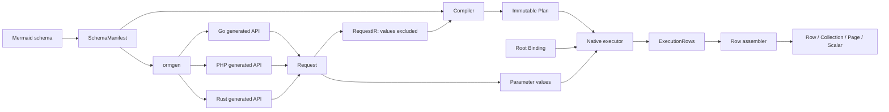
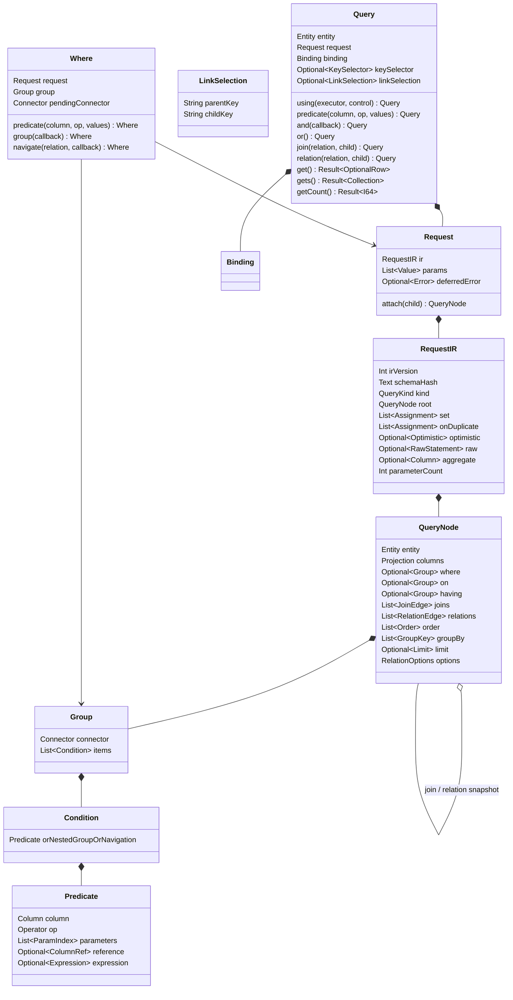
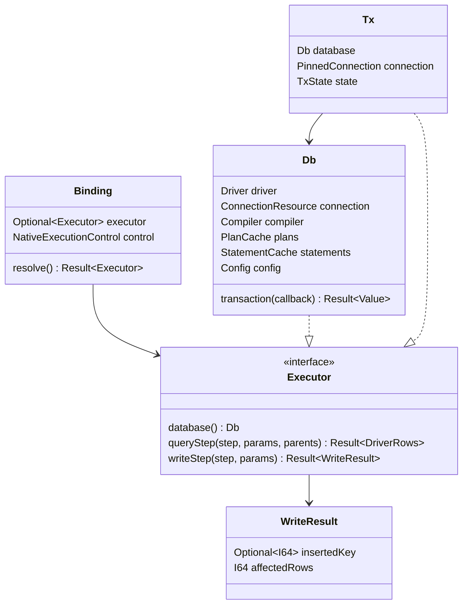
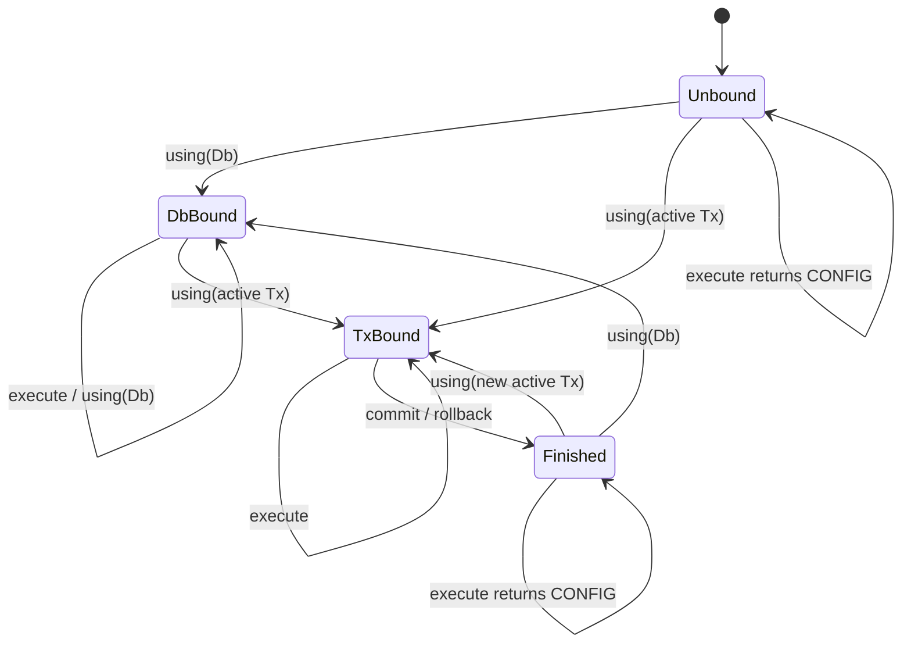
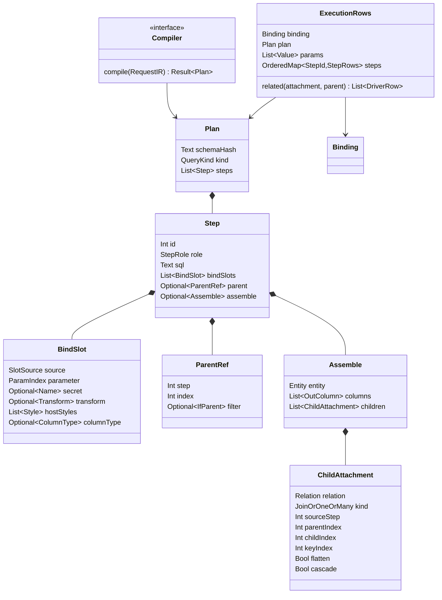
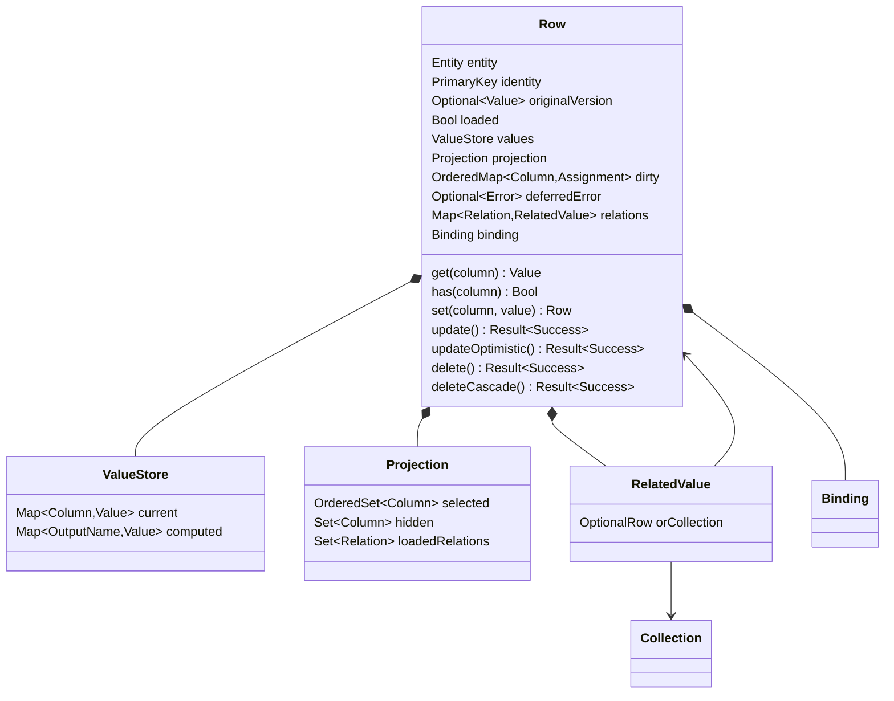
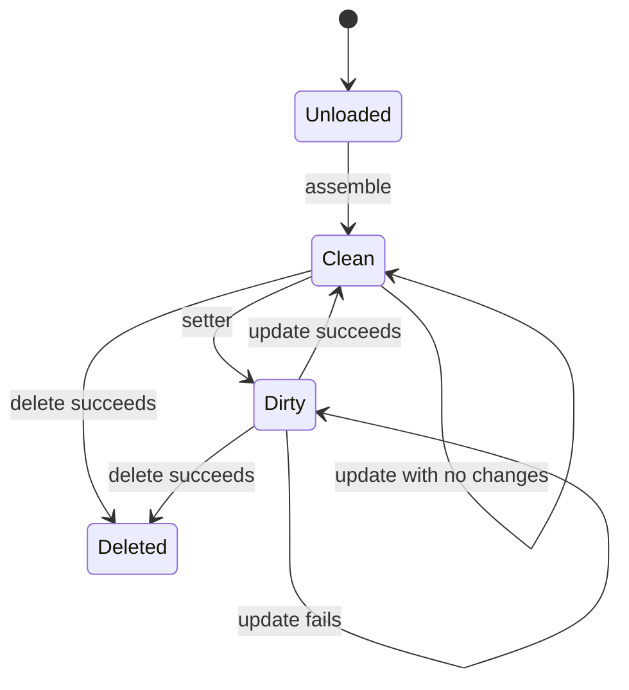
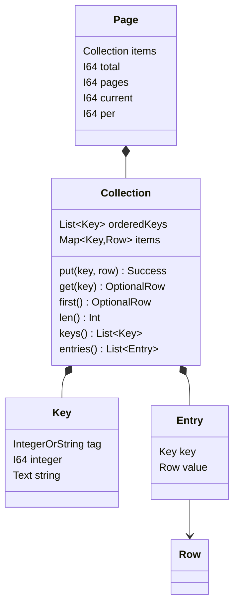
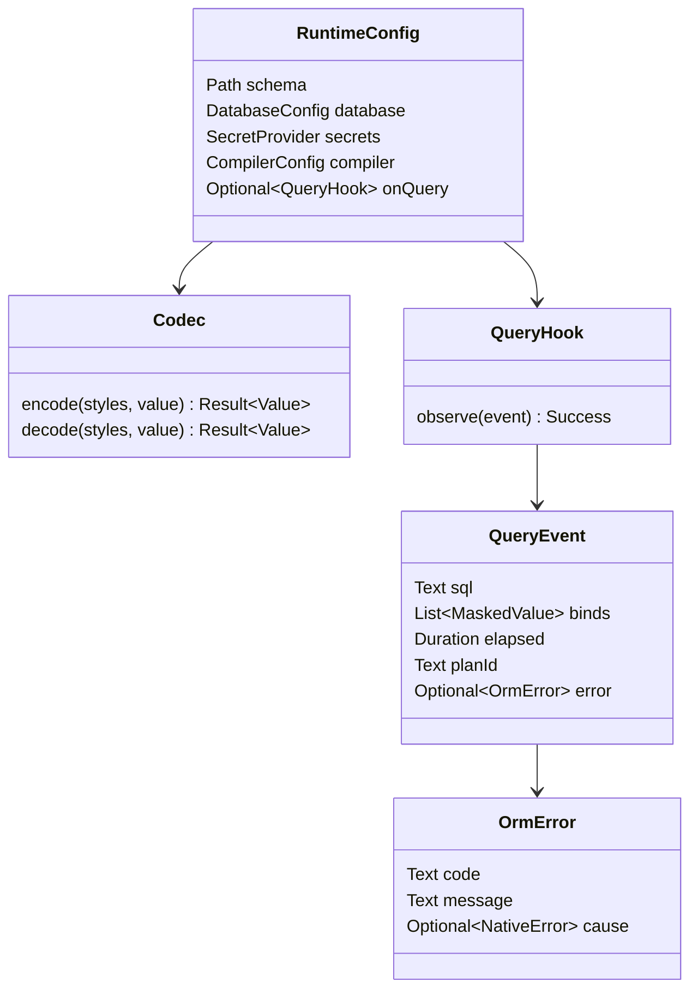

# 공통 인터페이스 v1

상태: **구현 기준**. 대상: Go·PHP·Rust, MySQL·PostgreSQL·SQLite. TypeScript 구현은 현재 대상에 포함되지 않는다. 새 언어를 추가할 때도 이 계약과 동일한 구조 검증을 통과해야 한다.

이 문서는 공개 API, 내부 자료구조, 소유권, 상태 전이와 모듈 경계를 정의한다. 구현 완료 여부는 [구현 대조표](interface-implementation.md)로 관리한다. 계약이 정해졌다는 것과 모든 구현이 계약을 만족한다는 것은 별개다.

## 1. 명세의 경계와 변경 규칙

| 기준 문서 | 책임 |
|---|---|
| [interfaces.json](../contracts/interfaces.json) | 공통 메서드·저장 필드·wire 레코드·상태 기대값과 언어별 대응 |
| 이 문서 | 객체의 역할·관계·수명·변경 규칙, API 입력·출력·실패 조건 |
| [dsl.md](dsl.md) | 생성 메서드 이름과 술어·조인·관계 문법 |
| [schema.md](schema.md) | Mermaid 스키마, 컬럼·키·관계·스타일 선언 |
| [protocol.md](protocol.md) | Request IR·Plan 필드와 전송 형식 |
| [codec.md](codec.md) | 값의 인코딩·디코딩과 빈 값·null 처리 |
| [errors.yaml](errors.yaml) | 오류 코드와 메시지 카탈로그 |
| [config.md](config.md), [dialects.md](dialects.md) | 설정과 DB별 실행 표현 |

`plan-v1.md`, `plan-v2.md`, `ir-v1.md`의 이전 설계 예제는 구현 기준이 아니다. 같은 항목이 충돌하면 이 문서의 구조·수명 계약과 위 책임별 현행 명세를 따른다.

변경 순서: 계약 ID의 입력·출력·상태 전이 수정 → 반례와 기대값 작성 → 생성기·런타임 변경 → Go·PHP·Rust 검증 → 문서와 예제 갱신. 한 언어의 편의를 위해 다른 언어의 지원 범위를 줄이지 않는다. 공통 계약을 만족하지 못한 항목은 구현 대조표에서 미완료로 남긴다.

물리적인 메모리 배치나 표준 라이브러리 컨테이너까지 같을 필요는 없다. 아래 논리 자료구조의 필드 의미, 값의 구분, 연결 관계, 변경 결과, 복사 경계는 같아야 한다. 예를 들어 ordered map을 다른 컨테이너로 구현해도 키 타입·순서·중복 처리 결과를 바꿀 수 없다.

## 2. 전체 모듈 경계 — IF-01

컴파일러는 DB 연결·조건값·조회 행을 받지 않는다. 실행기는 SQL을 자체적으로 재설계하지 않고 Plan의 단계와 바인드 슬롯을 실행한다. 생성기는 컬럼·타입·관계를 알고, 공통 런타임은 엔티티 이름을 하드코딩하지 않는다.

Go는 컴파일러를 직접 호출하고, PHP는 ormd, Rust는 WASM 어댑터를 사용한다. 이 차이는 `Compiler.compile(RequestIR) -> Plan | Error` 경계 안에 둔다. 행과 조건값은 이 경계를 통과하지 않는다.

## 3. 자료형과 값의 구분 — IF-02

| 논리 자료형 | 의미와 제약 | Go | PHP | Rust |
|---|---|---|---|---|
| `I32`, `I64` | 부호 있는 정수, 문자열과 구별 | `int32`, `int64` | 범위를 지키는 `int` | `i32`, `i64` |
| `F64` | 유한한 64비트 실수 | `float64` | `float` | `f64` |
| `Decimal` | 현행 실행기는 F64 값으로 취급. 정밀 10진수 계약은 제공하지 않음 | `float64` | `float` | `f64` |
| `Bool` | 정수 0/1과 별개인 논리값 | `bool` | `bool` | `bool` |
| `Text` | 문자열, 빈 문자열도 값 | `string` | `string` | `String` |
| `Bytes` | 텍스트 변환하지 않는 바이트열 | `[]byte` | 바이너리 `string` | `Vec<u8>` |
| `Date`, `DateTime` | 날짜 / UTC 마이크로초 시각 | `time.Time` | 정규 문자열 | `NaiveDate`, `NaiveDateTime` |
| `JsonValue` | object·array·scalar·null을 구별 | 코덱 값 | 코덱 값 | `serde_json::Value` |
| `Optional<T>` | 값 또는 DB null | `*T` 등 | `?T` | `Option<T>` |
| `List<T>` | 순서 있는 값 목록 | slice | list array | `Vec<T>` |
| `Result<T>` | 성공값 또는 오류. 실패를 빈 값으로 바꾸지 않음 | `(T, error)` | 반환 / 예외 | `Result<T>` |
| `Key` | `Integer(I64)` 또는 `String(Text)` | `orm.Key` | 타입을 보존하는 키 | `orm::Key` |

`null`, 빈 목록, 빈 객체, 미조회 컬럼, 기본값은 서로 다른 상태다. JSON·serialize·styled 값의 세부 표현은 codec 명세를 따른다. 드라이버가 문자열로 반환한 정수·bool은 컬럼 메타데이터로 정규화한다. 문자열이 숫자나 날짜처럼 보인다는 이유만으로 타입을 바꾸지 않는다.

## 4. 쿼리 객체와 조건 트리 — IF-03 ~ IF-08

| ID | 계약 |
|---|---|
| IF-03 | 쿼리는 **한 엔티티의 조건·옵션·바인딩을 보관하는 객체**다. 조회 결과 행과 다른 자료형이다. 생성 자체는 SQL을 실행하지 않는다. |
| IF-04 | 조건·옵션 메서드는 같은 논리 쿼리를 변경한다. 언어의 소유권 이동 표기가 있어도 조건을 버리거나 다른 객체에 잘못 붙여서는 안 된다. 쿼리 객체를 여러 실행에서 동시에 수정하는 것은 지원하지 않는다. |
| IF-05 | **터미널은 쿼리를 소비하지 않는다.** 같은 쿼리로 count 후 gets, 같은 count 재실행, 재바인딩 후 실행이 가능해야 한다. Rust는 터미널에서 쿼리를 빌려 쓴다. |
| IF-06 | 부모는 attach 시점의 **독립된 자식 조건 트리와 파라미터 목록**을 갖는다. 이후 자식 수정은 이미 구성한 부모에 영향을 주지 않는다. 같은 자식을 다른 부모에 붙여도 파라미터 인덱스가 원본에서 이동하지 않는다. |
| IF-07 | WHERE·ON·HAVING·중첩 그룹·조인·관계·ifParent의 파라미터는 하나의 Request.params에서 0부터 인덱싱한다. attach는 복사본의 인덱스만 부모의 파라미터 수만큼 이동한다. |
| IF-08 | 첫 빌더 오류는 Request에 보관한다. 실행을 다시 시도해도 같은 잘못된 요청은 계속 실패한다. 자식 요청의 오류도 부모로 전파한다. 오류를 소비해서 두 번째 실행을 성공시켜서는 안 된다. |

`Where`는 독립 실행기가 아니다. 부모 Request의 지정된 그룹만 편집하며, 콜백 밖으로 수명을 연장하거나 DB에 직접 실행하지 않는다. `or()`는 다음 술어·그룹 하나에 적용하며, 선행·중복 연결자 오류는 DSL 계약을 따른다.

명시적인 쿼리 분기 복사 API는 v1에서 제공하지 않는다. 별도 분기는 새 쿼리를 구성한다. attach의 독립 복사는 공개 clone 기능과 별개로 반드시 보장한다.

## 5. 공개 API — IF-09 ~ IF-12

### 5.1 생성과 언어별 표현

| 역할 | Go | PHP | Rust |
|---|---|---|---|
| 쿼리 생성 | `gen.Battle()` | `Battle::query()` | `battle::query()` |
| 쿼리 타입 | `*gen.BattleQuery` | `Battle` | `Battle` |
| 행 타입 | `*gen.BattleRow` | `BattleRow` | `BattleRow` |
| 조건 콜백 타입 | `*gen.BattleWhere` | `BattleWhere` | `BattleWhere<'_>` |
| 바인딩 | `q.Using(ctx, db)` | `$q->using($db)` | `q.using(&db)` |
| 조회 | `q.Gets()` | `$q->gets()` | `q.gets().await` |
| 오류 전달 | 별도 `error` 반환 | 예외 | `Result` |

**IF-09:** 생성 문법·대소문자·참조·await·오류 전달은 언어별 표현이다. 생성 방법을 공통 조건 토큰으로 취급하지 않는다. Go의 `ctx`는 요청 취소·제한 시간을 운반하는 실행 제어 정보이며 SQL 파라미터가 아니다. 취소 제어는 각 실행 어댑터가 담당한다.

**IF-10:** 컬럼·연산자·관계·키는 동일 SchemaManifest에서 생성한다. Eq 허용표는 엔진의 `OpAllowed`가 기준이다. 한 언어의 수동 목록이나 별도 허용표를 만들지 않는다.

### 5.2 메서드군 전체

표의 `Query`, `Where`, `Row`는 논리 반환 역할이며 언어별 성공·실패 표현은 5.1을 따른다.

| 대상 | 메서드군 | 입력 | 결과 / 상태 변경 |
|---|---|---|---|
| Query / Where | `<column>(value)`, `<column>Eq(value)` | 컬럼 타입 값 | equality 추가; Eq는 별칭 |
| Query / Where | `<column><Op>` | Op에 따른 값 0·1·2개 또는 목록 | 비교·In·Between·Null·패턴 조건 |
| Query / Where | `<column><Op>Col` | `ColumnRef(path, column)` | 값 파라미터 없이 컬럼 비교 |
| Query / Where | `and`, `or`, `<relation>(callback)` | 콜백 또는 무인자 | 그룹·연결자·조인 탐색 |
| Query / Where | `expr`, `<namedPredicate>` | 신뢰 SQL 조각과 값 | 스키마 검사 조건 |
| Query | `on`, `where`, `having` | Where 콜백 | 지정 위치의 조건만 변경 |
| Query | `select<Col>`, `unselect<Col>`, `selectAll`, `selectNone`, `select<Col>As`, `selectExpr` | 컬럼·alias·식 | Projection 변경 |
| Query | `join<Rel>`, `leftJoin<Rel>` | 자식 Query | 같은 SELECT에 조인 snapshot |
| Query | `relation<Rel>`, `relations<Rel>` | 자식 Query | 별도 실행 단계와 1:1 / 1:N 부착 |
| Query | `orderBy<Col>Asc/Desc`, `orderByExpr`, `groupBy<Col>`, `groupByExpr`, `limit`, `distinct`, `forceIndex<Index>` | 정렬·그룹·범위 | 실행 옵션 변경 |
| Query | `keyBy<Col>`, `keyByFn`, `flatten`, `limitPerParent`, `ifParent<Col>Eq`, `dropChildKey`, `noCascadeDelete` | 관계·결과 옵션 | 지정한 결과 구조만 변경 |
| Query | `set<Col>`, `set<Col>Null`, `set<Col>Expr`, `plus<Col>`, `minus<Col>` | 컬럼 값·식 | 순서 있는 쓰기 assignment 추가 |
| Query | `onDuplicateSet<Col>`, `onDuplicateSet<Col>Expr`, `onDuplicateSetAll`, `onDuplicatePlus/Minus<Col>` | 값·식 | upsert assignment 추가 |
| Query | `raw(sql, binds)` | 신뢰 SQL과 값 목록 | raw 루트 설정, 아직 실행하지 않음 |
| Query | `using` | Db 또는 Tx, 네이티브 실행 제어 | 실행 대상 교체, IR 유지 |
| Row | `get<Col>`, 필드 읽기, `has`, `extra`, 관계 접근자 | 컬럼·관계 | 행 상태 읽기 |
| Row | `set<Col>`, nullable setter | 컬럼 타입 값 | 현재 값 변경 + dirty 표시 |
| Row | `using` | Db 또는 Tx | 해당 행의 실행 대상 교체 |
| Collection | `get`, `first`, `len/count`, `keys`, 순서 있는 반복 | Key | lookup / ordered traversal |
| Row / Collection | 배열·맵 변환 | 없음 | 값·관계의 projection, DB 실행 없음 |

정확한 연산자 이름과 스키마별 생성 가능 조건은 [dsl.md](dsl.md)의 토큰 표를 따른다. 메서드군에 언급되었다고 모든 타입에 모든 연산자를 생성하는 것은 아니다.

### 5.3 실행 메서드

| 터미널 | 인자 | 성공 결과 | 비고 |
|---|---|---|---|
| `get` | 없음 | `Optional<Row>` | 없음은 null/nil/None |
| `gets` | 없음 | `Collection<Row>` | 없음은 빈 컬렉션 |
| `getBy<PK|Unique>` | 키 값, 복합 키는 선언 순서 | `Optional<Row>` | 해당 조건을 같은 루트에 추가 |
| `getsBy<Col>` | 컬럼 값 1개 | `Collection<Row>` | equality + gets |
| `getCountBy<Col>` | 컬럼 값 1개 | `I64` | equality + getCount |
| `getCount` | 없음 | `I64` | groupBy가 있으면 그룹 수 |
| `getsCount` | 없음 | `Collection<Row>` | groupBy 필수, 각 행에 row_count |
| `countDistinct<Col>` | 없음 | `I64` | null 제외 |
| `sum<Col>`, `avg<Col>` | 없음 | `F64` | 빈 집합 정규 결과 0 |
| `min<Col>`, `max<Col>` | 없음 | `Optional<ColumnType>` | 빈 집합·전부 null이면 null |
| `paginate` | page, per | `Page<Row>` | per는 양수, page는 최소 1로 정규화 |
| `insert` | 없음 | `Optional<Row>` | 자동 키가 있으면 같은 실행기로 재조회 |
| `save` | 없음 | `Optional<Row>` | PK assignment가 있으면 update, 없으면 insert |
| Query.`update`, Query.`delete` | 없음 | 영향받은 행 수 | WHERE 없는 전체 변경은 거부 |
| Row.`update`, Row.`updateOptimistic` | 없음 | 성공 또는 오류 | dirty 컬럼만 변경 |
| Row.`delete`, Row.`deleteCascade` | 없음 | 성공 또는 오류 | 로드된 PK 기준 |
| `rawAll` | 없음 | 순서 있는 raw 행 목록 | 이름으로 키를 둔 드라이버 값 |
| `sql` | 없음 | `SqlStatement(sql, binds)` | DB 실행 없음, 비밀값 마스킹 |

**IF-11:** 터미널에는 DB·트랜잭션·ctx를 넣지 않는다. 연결은 사전에 bind한다. PHP도 초과 인자를 조용히 무시하지 않고 거부한다. `one/all/count/oneBy`는 각각 `get/gets/getCount/getBy`의 별칭으로 같은 계약을 따른다.

**IF-12:** finder는 현재 쿼리의 본 엔티티에 조건을 추가한다. 기존 조인·관계의 대상·조건·projection을 재작성하지 않는다. 단일 결과 getBy는 PK·유니크 키, getsBy·getCountBy는 Eq 가능한 컬럼에 생성한다. 동적 복합 PHP 이름은 공통 생성 API가 아니다.

## 6. 바인딩·실행기·트랜잭션 — IF-13 ~ IF-17

| ID | 계약 |
|---|---|
| IF-13 | Binding은 쿼리·행에 속한다. 전역의 현재 연결·현재 트랜잭션을 조회하지 않는다. bind는 IR·조건·캐시 키를 바꾸지 않는다. |
| IF-14 | 실행기의 소유자는 **루트 Binding**이다. main·모든 relation·pagination count·insert/save 재조회가 같은 실행기를 쓴다. 부착된 자식 Query의 Binding은 루트 실행기를 교체하지 않는다. |
| IF-15 | 로드한 행은 실제 실행에 쓴 Binding을 물려받는다. 조인 행·관계 행도 같다. 행을 다시 bind하면 그 행의 이후 실행만 바뀐다. |
| IF-16 | Tx는 한 트랜잭션의 고정 연결을 가리킨다. commit·rollback 후 같은 Tx에 묶인 모든 쿼리·행은 CONFIG로 실패하며 자동으로 Db 실행으로 전환하지 않는다. |
| IF-17 | transaction 콜백 성공은 commit, 오류는 rollback. DEADLOCK은 전체 콜백을 새 Tx에서 최대 3회 실행한다. 재시도마다 이전 Tx 객체를 종료한다. cascade는 root 실행기를 쓰고, bare Db이면 전체 walk를 하나의 Tx로 감싼다. |

취소·panic·예외로 종료될 때도 미완료 트랜잭션을 남기지 않는 것이 실행기 책임이다. 중첩 transaction·savepoint API는 v1에서 제공하지 않는다. 서로 다른 연결을 골라 실행하는 것은 명시적인 별도 Db와 bind로 표현한다.

## 7. 컴파일·Plan·조립 — IF-18 ~ IF-20

**IF-18:** Plan은 값이 없는 불변 자료구조다. 실행 중 IN 확장·바인드 해석으로 캐시된 SQL·슬롯·조립 메타데이터를 수정하지 않는다. 캐시 키는 모든 의미 있는 IR 필드를 구분하며 값·Binding을 포함하지 않는다. 내부 해시 알고리즘과 캐시 저장소는 어댑터 세부사항이다.

**IF-19:** 단계는 Plan 순서로 실행한다. 관계의 부모 키는 첫 등장 순서로 중복을 제거하고 null을 제외한다. 부모가 없으면 그 관계 단계를 실행하지 않는다. ifParent는 부모 행을 필터링한 후 키를 수집한다. pagination의 total은 main의 페이지 범위에 갇히지 않는다.

**IF-20:** 조립은 위치형 OutColumn과 ChildAttachment로 한다. one은 정렬된 첫 행 또는 null, many는 순서 있는 컬렉션이다. 같은 DB 행이 여러 부모에 부착돼도 각 부착의 Row 변경 상태는 독립적이다. 자동 identity map은 제공하지 않는다. flatten·hidden·computed 컬럼은 projection 규칙을 따른다.

## 8. 행의 값·변경 상태·관계 — IF-21 ~ IF-24

Deleted은 DB에서 제거됐다는 실행 결과다. v1은 tombstone이나 자동 재조회로 로컬 값을 변경하지 않는다. 이후의 데이터 접근은 마지막 로컬 값을 읽고, 재실행은 원래 PK 조건으로 수행한다.

| ID | 계약 |
|---|---|
| IF-21 | getter는 현재 로컬 값을 읽는다. setter 직후와 update 성공 직후 값이 같아야 한다. update 성공은 dirty를 비우되 값을 이전 값으로 되돌리지 않는다. 실패하면 값과 dirty를 유지한다. |
| IF-22 | dirty는 컬럼별 마지막 값이 이기는 ordered map이다. 같은 컬럼을 두 번 set해도 assignment는 하나이며 최초 컬럼 등록 순서를 보존한다. 자동 키를 setter로 변경하지 않는다. 직접 네이티브 필드 대입은 변경 추적 API가 아니다. |
| IF-23 | 행 업데이트·삭제는 로드된 identity 기준이다. 조회되지 않은 행의 update/delete는 CONFIG. optimistic update는 조회 시 보관한 updated_ts를 조건으로 사용하고 0행이면 OPTIMISTIC_LOCK. setter로 바뀐 현재 값과 이 원본을 구분한다. 버전 컬럼을 조회하지 않았다면 CONFIG. 성공 후 자동 refresh는 하지 않는다. |
| IF-24 | 1:1 관계 없음은 null, 1:N 관계 없음은 빈 Collection. 관계를 로드하지 않은 상태와 로드했지만 없는 상태는 projection metadata로 구별한다. 결과 변환은 선택·hidden·flatten·computed 규칙과 현재 값을 함께 적용한다. |

`selectNone()`은 PK와 FK를 유지한다. 관계 바인딩에 필요한 추가 컬럼은 projection 규칙에 따라 선택한다. 그 밖의 미조회 컬럼은 `has(column)=false`다. typed getter는 nullable이면 null, non-nullable이면 해당 타입의 기본값을 돌려주며 `has`로 미조회를 구분한다. 조회한 SQL null은 `has=true`와 null 값이다. setter로 값을 지정한 컬럼은 조회 여부와 관계없이 `has=true`가 되고 배열·맵 변환에 포함된다. update 성공 후에도 이 상태를 유지한다. hidden 컬럼은 지정 여부와 관계없이 결과 변환에서 제외한다. JSON 출력의 정수·bool·빈 배열·빈 객체·null 구분은 코덱 적합성 검사를 따른다.

## 9. Collection·Key·Page — IF-25 ~ IF-27

**IF-25:** Collection은 목록이나 일반 dictionary로 임의 교체할 수 없는 **키 순서를 보존하는 map**이다. 같은 키를 다시 넣으면 값만 교체하고 첫 삽입 위치를 유지한다. `first`, `keys`, 반복, entries가 같은 순서를 사용한다. 조회 결과가 없으면 유효한 빈 Collection을 반환한다.

**IF-26:** Key의 타입 태그를 비교에 포함한다. 정수 `1`과 문자열 `"1"`은 다른 키다. PHP 배열의 자동 키 변환을 공통 규칙으로 삼지 않는다. 공통 손실 없는 표현은 ordered entries다. 문자열 키만 가능한 JSON object나 PHP array 변환은 키를 문자열로 표현했을 때 충돌이 없는 컬렉션에 한정한다. 충돌은 IR_INVALID로 거부하고 손실 없는 entries 변환을 사용한다. keyByFn은 Key를 반환하며 int/string 이외 값을 키로 주면 IR_INVALID다. 컬럼 keyBy의 스칼라 키는 정수이면 정수 태그를 유지하고 다른 스칼라는 문자열 키로 변환한다. 명시적 keyByFn의 키 타입 검사와 구별한다.

행의 관계를 재귀 변환할 때도 같은 오류를 전달한다. Go의 행·컬렉션 `ToArray()`는 `(map[string]any, error)`, Rust의 `to_map()`은 `Result<serde_json::Value>`를 반환한다. PHP의 `toArray()`는 충돌 시 예외를 던진다. 변환은 실행기를 사용하지 않는 동기 연산이다.

**IF-27:** Page는 동일한 다섯 필드를 갖는다. `items`는 Collection, `total`은 전체 결과 수, `pages = ceil(total/per)`, `current`는 정규화된 page, `per > 0`. 빈 페이지와 total 0을 구분한다. count 단계에는 row assembly를 적용하지 않는다.

## 10. 설정·오류·코덱·관측 — IF-28 ~ IF-31

**IF-28:** 설정은 명시된 경로와 DB를 사용한다. schema hash와 dialect 불일치는 시작 또는 binding 검증에서 오류다. fromConfig는 Db를 만들며 암묵적 기본 쿼리 연결을 설치하지 않는다. 비밀값은 IR·공개 SQL dump·로그에 원문을 넣지 않는다.

**IF-29:** 정의된 오류는 모든 언어에서 같은 code와 의미를 갖는다. 네이티브 예외 타입·스택·드라이버 원문은 달라도 된다. CONFIG, IR_INVALID, EMPTY_IN, OPTIMISTIC_LOCK, DEADLOCK, DUPLICATE_KEY와 codec 오류는 빈 결과·false로 바꾸지 않는다. 아직 공통 코드로 분류되지 않은 드라이버 오류는 원인을 보존한다.

**IF-30:** 스타일은 순서 있는 pipeline이다. 쓰기는 선언 순서, 읽기는 역순이며 DB 함수와 host codec의 경계는 dialect 명세를 따른다. 같은 입력의 타입과 복원값이 같아야 한다. 압축 구현의 바이트 차이는 동일한 복원 결과로 검증하되 타입 차이를 숨기는 정규화는 금지한다.

**IF-31:** query hook은 실제 실행한 statement마다 SQL·마스킹된 binds·소요 시간·plan 식별자·오류를 제공한다. 관계 조회도 포함한다. `sql()` 자체는 실행 hook을 발생시키지 않는다. 시간과 내부 plan hash는 언어 간 바이트 동일 비교 대상이 아니며 statement 순서·SQL·바인드 타입과 값·결과는 비교 대상이다.

## 11. 생성기·스키마·확장 경계 — IF-32 ~ IF-34

**IF-32:** SchemaManifest는 엔티티·테이블·컬럼 타입·nullable·PK·unique·index·fulltext·relation·style·named predicate·schema hash를 가진다. generated Query/Where/Row와 컬럼 참조는 동일 Manifest로 생성한다. 한 언어만 별도 스키마를 유지하지 않는다.

**IF-33:** 관계 자식 Query는 `matchAKeyWithBKey()` 또는 `onAKeyWithBKey()`로 부모 키와 자식 키를 `LinkSelection(parentKey, childKey)`에 기록한다. 부모의 `relation/relations/join/leftJoin`은 자식 엔티티와 이 선택을 함께 사용해 Manifest의 단일 관계를 해석한다. 두 방식은 같은 링크 상태와 같은 IR을 만든다. Go·Rust·PHP 생성기는 이 메서드와 필드를 같은 생성 규칙에서 받으며, 계약 검사는 세 언어의 심볼·시그니처·레코드 구조를 비교한다.

**IF-33:** ormgen의 공개 작업은 build, gen, ddl, import, validate, errors, tokens, check다. schema build와 타입·관계 검증은 DB 실행과 분리한다. generated 파일은 템플릿에서 재생성하며 수동 수정으로 계약 차이를 숨기지 않는다. 같은 입력의 생성 결과는 재현 가능해야 한다.

**IF-34:** PHP 동적 이름 해석·ArrayAccess·invocation 축약은 PHP 어댑터다. 공통 메서드가 존재하면 동적 해석이 그 의미를 덮어쓰지 않는다. dynamic adapter는 공통 Request 구조로 내려가고, 값 기반 터미널·binding·오류·관계의 계약은 동일하게 지킨다. Go·Rust에 PHP의 magic method를 모사하지 않는다.

## 12. 계약을 증명하는 검증

[자동 검사 안내](../tests/interfaces/README.md)에 생성·대조·반례 명령을 정리한다. 검증 층은 서로 대체할 수 없다.

1. **구조 검증:** Request/QueryNode의 필드·조건 트리·파라미터 인덱스·복사 독립성·Key 타입·행 상태를 직접 비교한다.
2. **공개 API 검증:** 생성자의 역할, 터미널 인자, 반환 타입, 쿼리 재사용을 실제 컴파일·실행으로 확인한다. 토큰 비교만으로 시그니처를 증명하지 않는다.
3. **실행 검증:** 같은 시나리오의 SQL·typed binds·순서·행·관계·오류를 3언어 × 3 DB에서 비교한다.
4. **수명 검증:** commit·rollback·expired Tx·row binding·실패 후 dirty·취소를 검증한다.
5. **생성 검증:** 재생성 결과와 작업 트리 파일이 일치하고, 명세 예제가 실제 API로 컴파일돼야 한다.

구현 대조표의 각 행에는 계약 ID, 관찰한 차이, 수정 파일, 테스트, 상태를 둔다. 기대값은 현재 출력에 맞춰 자동 승인하지 않는다. 정해진 계약에서 먼저 기대 결과를 도출하고, 새 결과가 그 기대를 만족할 때만 기록한다.
