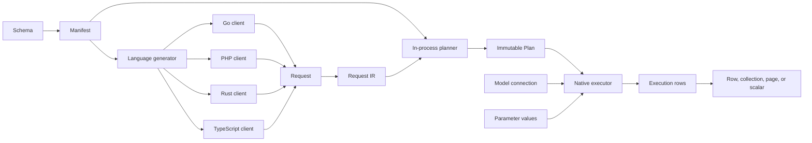
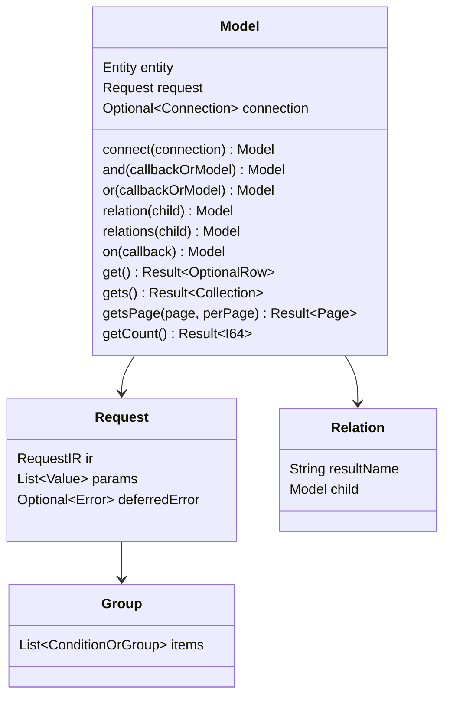
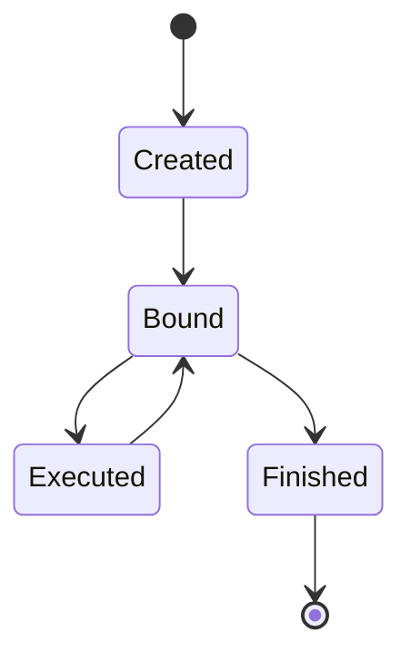
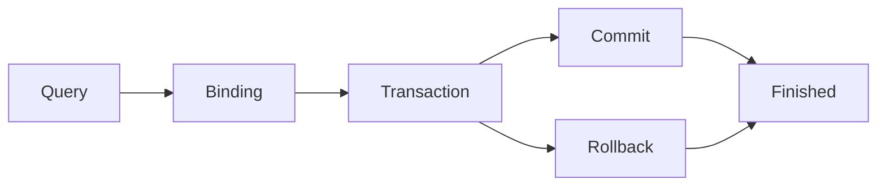
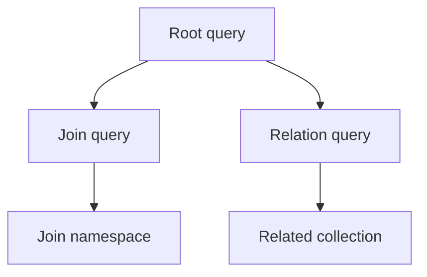
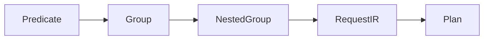
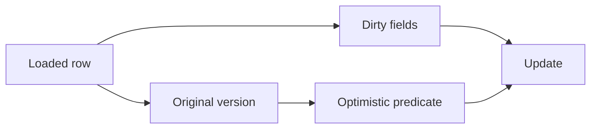
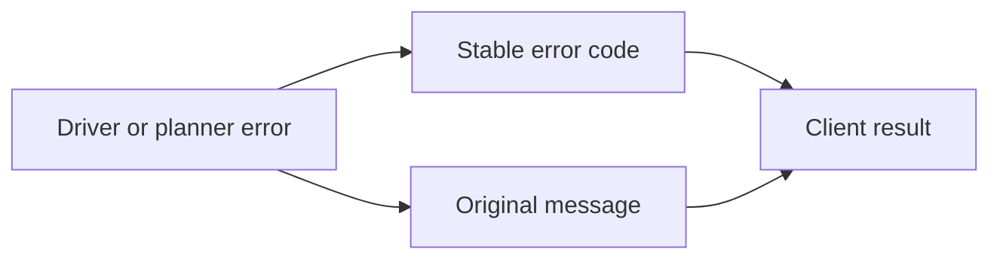
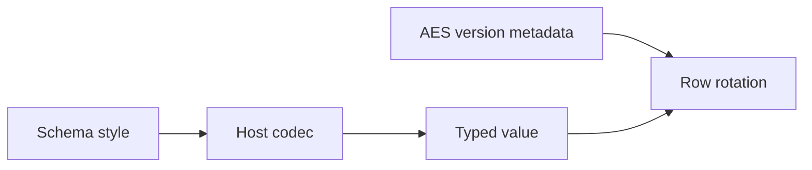

# Common interface v1

This page defines the shared public data structures, ownership rules, state transitions, and client call order for the syntax in the [DSL](dsl.md). Implementation status is recorded in [the implementation matrix](interface-implementation.md). A defined interface does not prove that every client implements it.

## 1. Call boundaries and change rules

The schema manifest defines entities, fields, operators, styles, and errors. Each language generates its models from the manifest with its own build tool. The client library validates a typed request shape and plans it in the application process into an immutable plan. An executor receives the plan, parameter values, and the connection selected for the model.

The change order is: update the design plan and the DSL, update the manifest and generated artifacts, update all clients, run shared vectors, then update paired documentation. A client cannot add a private field or alternate call order to satisfy a shared interface.

## 2. Module call flow — IF-01

The planner does not receive database credentials or parameter values. The executor owns database access. A model receives its connection through `connect`; inside a transaction callback, a model without `connect` uses the active transaction of the current execution flow. A join or relation child without `connect` uses the parent connection.

## 3. Types and values — IF-02

| Logical type | Go | PHP | Rust | TypeScript |
|---|---|---|---|---|
| `I64` | `int64` | `int` | `i64` | `number` |
| `F64` | `float64` | `float` | `f64` | `number` |
| `Bool` | `bool` | `bool` | `bool` | `boolean` |
| `Text` | `string` | `string` | `String` | `string` |
| `Bytes` | `[]byte` | `string` | `Vec<u8>` | `Uint8Array` |
| `DateTime` | `time.Time` | `DateTimeImmutable` | `NaiveDateTime` | `Date` |
| `JsonValue` | `any` | `mixed` | `serde_json::Value` | `unknown` |
| `Optional<T>` | `*T` | `?T` | `Option<T>` | `T \| null` |
| `List<T>` | slice | array | `Vec<T>` | `T[]` |
| `Result<T>` | `(T, error)` | return or exception | `Result<T>` | `Promise<T>` |
| `Key` | `orm.Key` | typed key | `orm::Key` | `Key` |

Null, an empty list, a missing field, and a default value are different states. Serialization preserves the logical type and field order required by the codec specification.

## 4. Models and condition trees — IF-03 to IF-08

A model is both the query builder and the loaded row type. A group contains conditions or nested groups in order, and each item after the first carries an explicit `AND` or `OR` connector. `and(fn)` and `or(fn)` create nested groups whose callback receives an empty model of the same type. `and(model)` and `or(model)` place the conditions of a joined child as a group. Join `ON` conditions are stored separately from `WHERE` conditions.

A terminal does not change the stored request, so repeated terminals produce the same statement.

## 5. Public API — IF-09 to IF-12

### 5.0 Connection input

Every public client accepts one DSN URI. `mysql://`, `postgres://`, and `sqlite://` select the database driver. The optional `timezone` parameter sets the connection time zone; without it the server environment time zone is used. The caller does not pass a second driver value.

| Client | Public connection call | Result |
|---|---|---|
| Go | `model.Connect(dsn, schemaPath, config)` | `(*orm.DB, error)` |
| PHP | `Orm::connect(dsn, new Config(schemaPath: …))` | `Db` |
| Rust | `orm::Db::connect(dsn, pool_size, config).await?` | `orm::Db` |
| TypeScript | `Db.connect(dsn, schemaPath, options)` | `Promise<Db>` |

### 5.1 Creation and language forms

| Operation | PHP | Go | Rust | TypeScript |
|---|---|---|---|---|
| model creation | `new Product` | `model.Product()` | `Product::new()` | `new Product()` |
| connection | `->connect($db)` or `($db)` | `.Connect(db)` | `.connect(&db)` | `.connect(db)` |
| collection terminal | `gets()` | `Gets()` | `gets().await?` | `gets()` |
| count terminal | `getCount()` | `GetCount()` | `get_count().await?` | `getCount()` |

The creation spelling follows the host language. The method role, stored request, result type, error behavior, and call order remain the same.

### 5.2 Method groups

| Group | Required behavior |
|---|---|
| conditions | Use column chains, operator prefixes, value shapes, and explicit connectors. |
| groups | Preserve item order and nested group boundaries. |
| relations | Use `match<L>With<R>` keys on the child and a separate statement per relation. |
| joins | Keep `ON` and `WHERE` conditions separate and place child conditions where the child is passed to a group. |
| projection | Preserve positional output mapping and reject duplicate row names. |
| mutation | Record changed fields and original values. |
| terminals | Receive chain values only and use the model connection. |

`getBy<Chain>`, `getsBy<Chain>`, and `getCountBy<Chain>` apply the chain as the condition and call the terminal. PHP resolves chains at call time, and Go, Rust, and TypeScript generate the chains that consumer source code calls.

### 5.3 Execution methods

| Method | Result | Connection |
|---|---|---|
| `get` | one row; `NO_ROWS` when no row matches | model connection or active transaction |
| `gets` | collection | model connection or active transaction |
| `getsPage` | page | model connection or active transaction |
| `getCount` | integer | model connection or active transaction |
| `create` | row with generated key | model connection or active transaction |
| `creates` | inserted row count | model connection or active transaction |
| `update` | row | row connection or active transaction |
| `delete` | row or collection | row connection or active transaction |

A terminal without a connection outside a transaction returns `CONFIG`. A connection must carry the schema engine used by the generated request; otherwise the terminal returns `CONFIG`.

## 6. Connections, transactions, and utilities — IF-13 to IF-17

`connection.transaction(fn, options)` runs the callback in one transaction. Begin, commit, rollback, and the executor are private. A callback error or exception rolls back the transaction; otherwise the transaction commits and the callback result is returned.

| Option | Values |
|---|---|
| `isolation` | `default`, `read_uncommitted`, `read_committed`, `repeatable_read`, `serializable` |
| `readOnly` | boolean |
| `timeoutMs` | positive integer; PostgreSQL applies `statement_timeout`, MySQL and SQLite return `CAPABILITY_UNSUPPORTED` |
| `retry` | deadlock retry count, default `3`; each retry runs the complete callback again, and `0` disables retry |

- Each execution flow keeps a stack of active transactions: the goroutine in Go, the request in PHP, the async context in TypeScript, and the task in Rust. A model without `connect` uses the innermost transaction.
- A transaction on the same connection inside an active transaction creates a savepoint. An inner failure rolls back only the inner work unless the outer callback returns it.
- Concurrent use of one transaction connection returns an error. A task or goroutine started inside the callback has no active transaction.
- `transactionConflict(message)` (Go: `orm.TransactionConflict`) creates the retryable `DEADLOCK` error.
- Row locks `forUpdate()`, `forShare()`, `forUpdateNoWait()`, and `forShareNoWait()` are allowed only inside a transaction. MySQL and PostgreSQL append the lock clause; SQLite uses an ORM transaction-scoped lock row. A `*_nowait` request that cannot acquire the lock returns `LOCK_NOT_AVAILABLE` on every adapter.

`connection.utils()` provides operations outside the query syntax.

| Utility | Behavior |
|---|---|
| `lock(key)` | transaction-scoped named lock: MySQL `GET_LOCK`, PostgreSQL advisory lock, SQLite ORM lock row; requires an active transaction |
| `setLocal(key, value)`, `local(key)` | transaction-local values; requires an active transaction; `local` returns `NO_ROWS` for a missing key |
| `wasInserted(entity, sequence)` | reports whether a generated ORM insert for the sequence succeeded in the active transaction; the fact is adapter-neutral and restored across savepoint rollback |
| `backendWaitingForLock(ctx)` | reports PostgreSQL pool backends waiting for a lock; MySQL and SQLite return `false` without exposing a driver-specific caller API |
| `schema().install(manifestJson)` | creates the missing tables, keys, indexes, comments, and triggers of the manifest on every database and keeps existing tables; on MySQL a call inside a transaction returns `CONFIG` |
| `schema().exists(schema)`, `schema().installed(schema, table)`, `schema().empty()` | schema inspection |
| `privileges().grantTable(table, role)`, `revokeTable(table, privilege, role)`, `inspectTable(table)` | table privileges; non-PostgreSQL dialects return `CAPABILITY_UNSUPPORTED` |
| `aes().status(model, keyring)`, `aes().rotate(model, keyring)` | AES key version status and rotation of every AES column and the version in one transaction |
| `stats()` | connection pool statistics |

Utilities that change data open a transaction when none is active and join the active transaction of the same connection otherwise.

## 7. Planning and assembly — IF-18 to IF-20

`Request` contains the schema hash, IR version, entity, predicate tree, relation requests, projection, and parameter count. Parameter values are stored separately from the request shape. The client planner produces an immutable plan with dialect-specific SQL and positional assembly metadata. The four planners produce the same SQL for the same request; the conformance vectors check this.

Assembly uses `{alias, column, output_name, index}`. Join aliases remain separate from the root namespace. Duplicate output names return `COLUMN_ALIAS_CONFLICT`. A schema hash mismatch returns `SCHEMA_HASH_MISMATCH` before execution.

## 8. Row values, dirty state, and relations — IF-21 to IF-24

A model row stores declared fields, added columns, relation results, and values attached with `new<Name>` in one name space; duplicate names are rejected. Getters return the declared type. Setters update the field and mark it dirty. Update operations send dirty fields only, except fields required by optimistic locking. The original version is read before mutation and is used in the update predicate.

A relation result is either one row or a collection according to the schema. Collection keying is deterministic. A duplicate key follows the declared key policy; an undeclared key function is invalid.

## 9. Collection, key, and page — IF-25 to IF-27

| Object | Required fields |
|---|---|
| `Collection<T>` | ordered rows, length, first, key lookup |
| `Key` | logical type tag and value |
| `Page<T>` | `items`, `totalCount`, `totalPages`, `page`, `perPage` |

The integer key `7` and text key `"7"` are different keys. Composite keys encode each typed component with its length, so `("1", "23")` and `("12", "3")` cannot collide. The plan records the ordered collection identity in `Assemble.key`. Regular rows use every primary-key component; grouped count rows use their group columns and expression aliases. A collection preserves database order unless an explicit order or key policy changes it. A page preserves the root result order and relation attachment order.

## 10. Configuration, errors, codecs, and events — IF-28 to IF-31

Configuration selects the dialect, DSN, schema file, executor, AES key version map, and query event hook. It does not select another database or silently change the request path.

Errors use the codes in [errors.yaml](errors.yaml). Go callers use `orm.ErrorCode`, `orm.IsDeadlock`, `orm.IsLockNotAvailable`, `orm.IsDuplicateKey`, `orm.IsForeignKey` and `orm.IsConstraint` for adapter-neutral classification; they do not inspect driver error types. Codec styles are schema declarations. The AES version column is non-null integer plaintext metadata with no encoding style and is excluded from the default projection. AES rotation updates all AES payload columns and the version in one transaction.

Query events expose the normalized SQL, bind count, duration, plan identifier, and error. Secrets and parameter values are excluded from logs.

## 11. Generator, schema, and extension boundaries — IF-32 to IF-34

The generator reads the schema manifest and emits models, fields, column methods, and error types. Go and Rust generation also reads consumer source and emits the chain, relation key, join, and `new<Name>` methods that the source calls. It must not emit a method for an undeclared column or operator. Generated code is checked against the manifest and the interface symbol list.

Relations use `relation(child)` and `relations(child)` with `match<L>With<R>()` on the child. Joins use `join<L>With<R>(child)` and `leftJoin<L>With<R>(child)`. Unknown names fail during PHP and TypeScript call resolution and during Go and Rust generation.

## 12. Verification

The verification suite checks the manifest, generated symbols, stored fields, request shape, state transitions, error codes, codec vectors, relation results, and database results. It also checks document pairs, static Pages output, Mermaid SVG output, and repeated-build bytes.

A passing symbol check proves the declared surface only. A passing conformance vector proves the tested input and result. A feature is complete only when all supported clients, required databases, tests, documents, and Pages checks pass.
