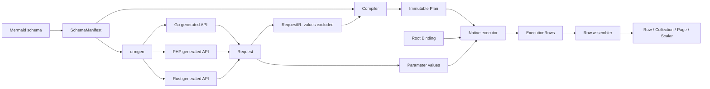
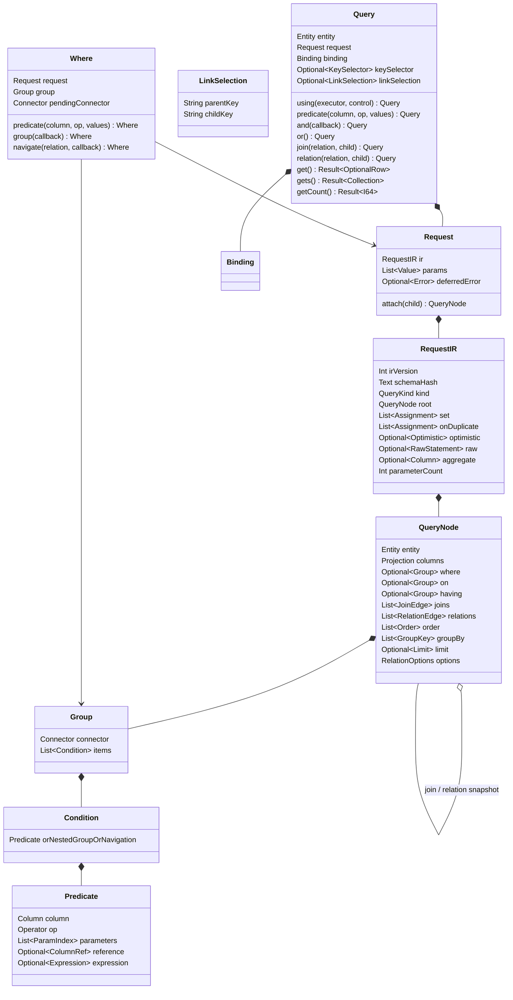
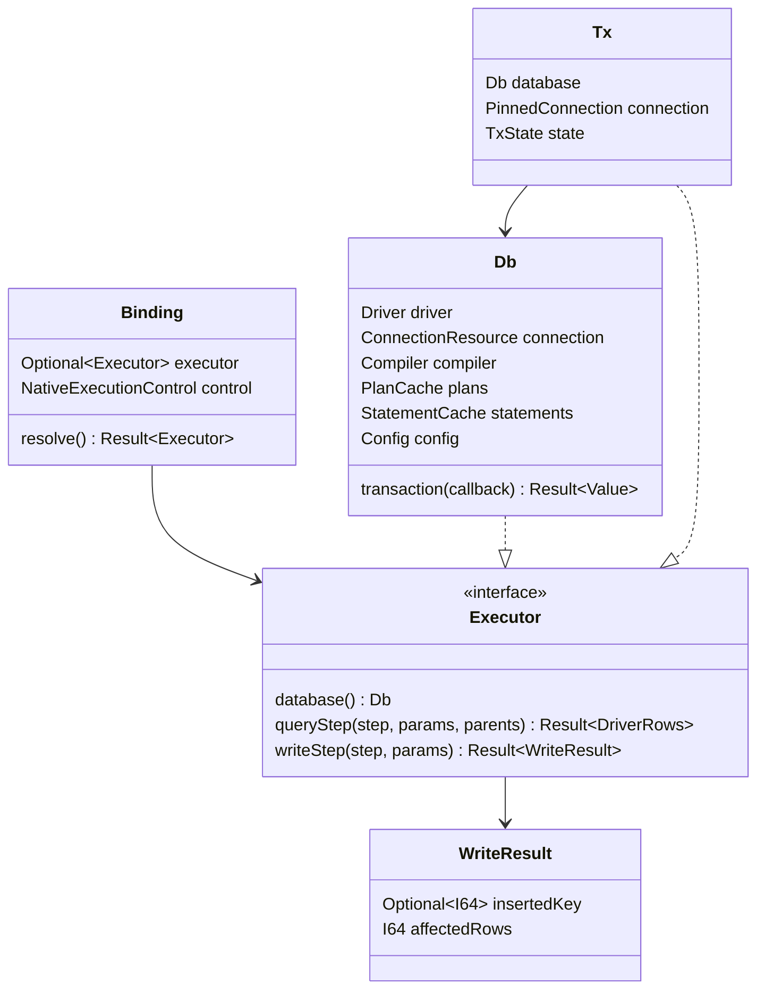
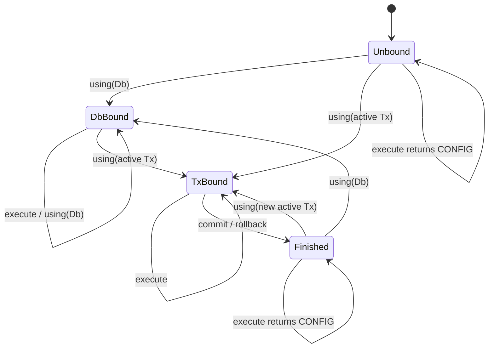
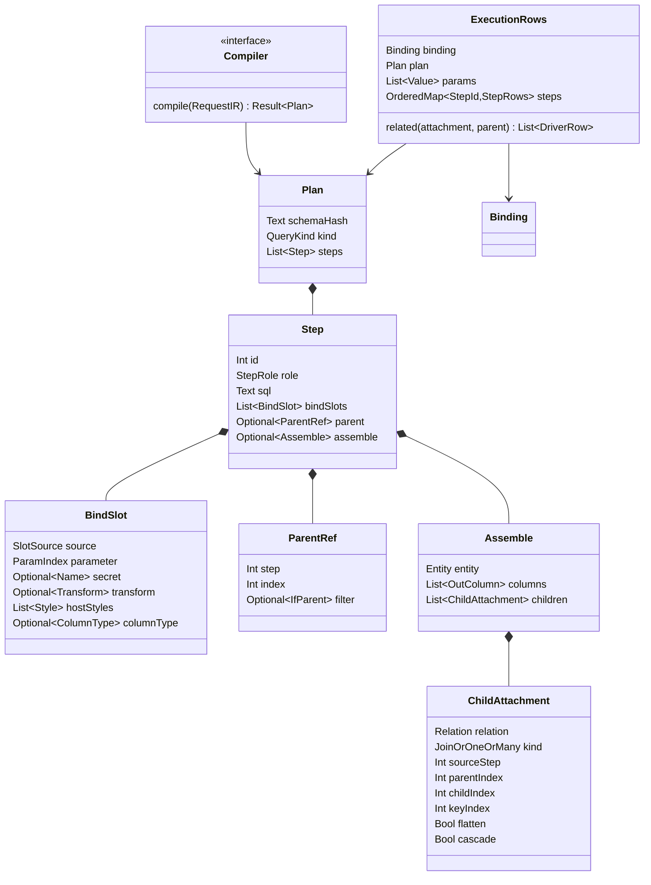
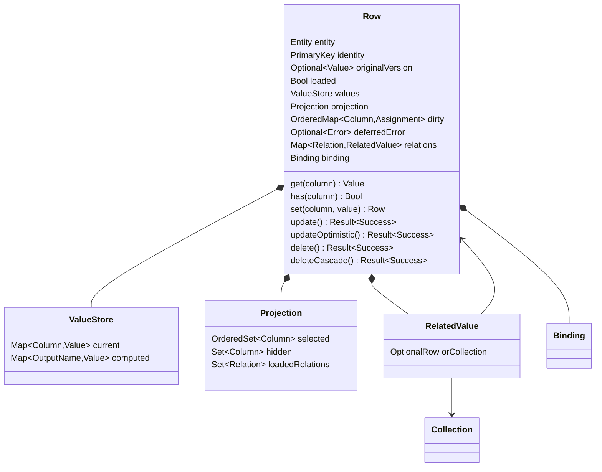
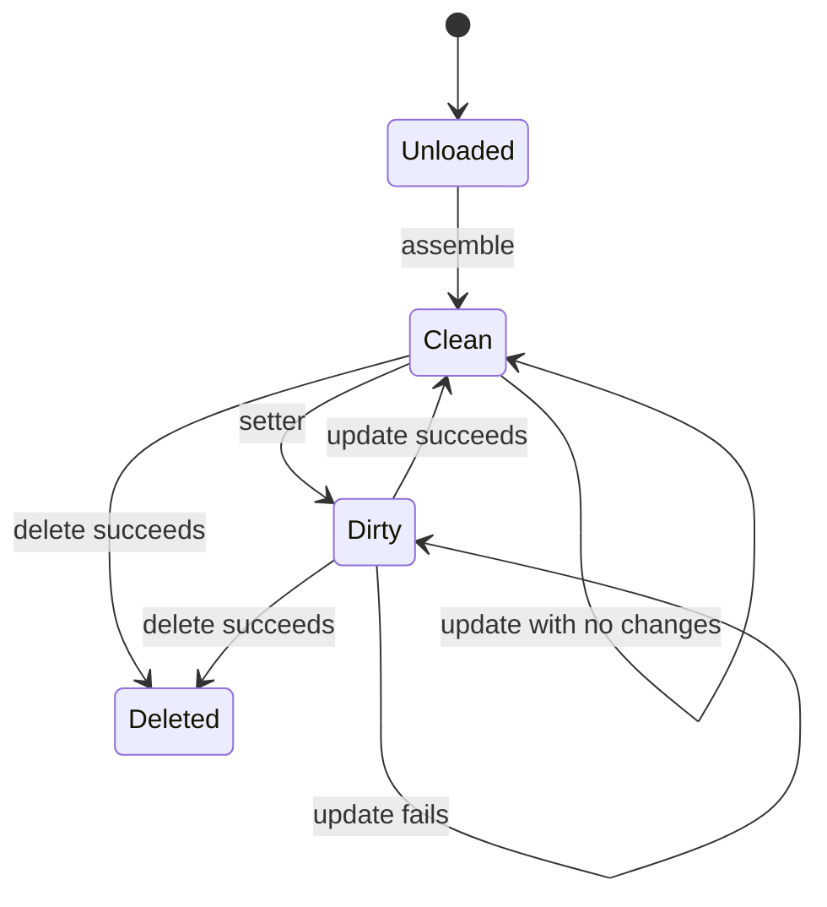
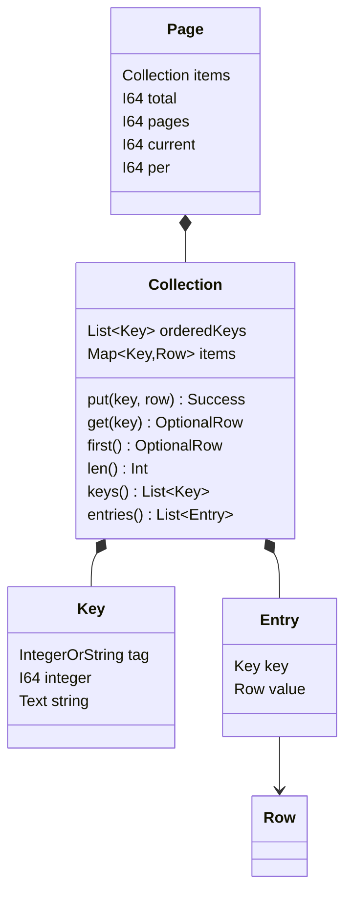
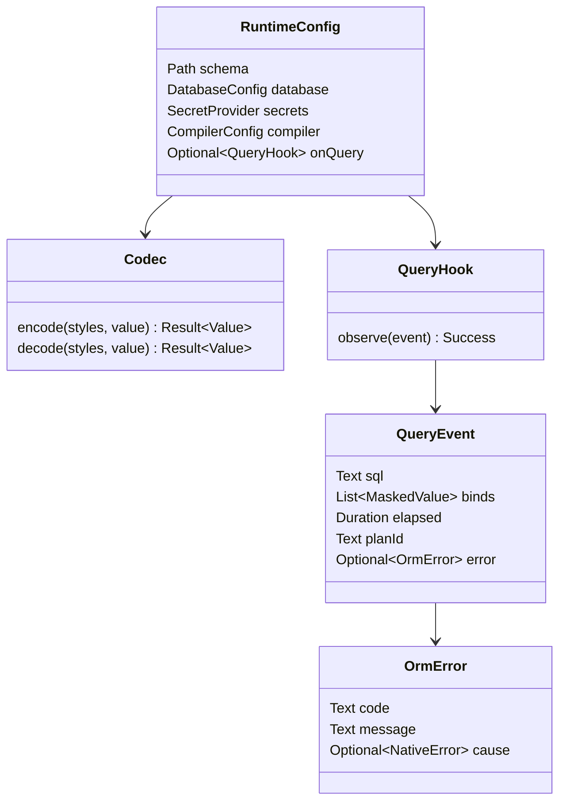

# common specified v1

state: **implementation criteria**. specified: Go·PHP·Rust, MySQL·PostgreSQL·SQLite. TypeScript implementationspecified current specified specified specified. specified languagespecified addspecified specified specified specified samespecified Structure Verificationspecified specified specified.

specified documentspecified specified API, specified data structure, ownership, state transitionspecified specified specified definitionspecified. implementation complete specified [implementation specified](interface-implementation.md)specified specified. specified specified specified specified implementationspecified specified specified specified specified.

## 1. specifiedthreespecified specified change rule

| criteria document | specified |
|---|---|
| [interfaces.json](../contracts/interfaces.json) | common specified·specified field·wire specified·state specifiedvaluespecified languagespecified specified |
| specified document | specified specified·relation·lifetime·change rule, API specified·specified·failure condition |
| [dsl.md](dsl.md) | generation specified namespecified Predicate·join·relation specified |
| [schema.md](schema.md) | Mermaid schema, Columns·specified·relation·specified specified |
| [protocol.md](protocol.md) | Request IR·Plan fieldspecified specified specified |
| [codec.md](codec.md) | valuespecified specified·specified specified value·null specified |
| [errors.yaml](errors.yaml) | error specified specified specified |
| [config.md](config.md), [dialects.md](dialects.md) | specified DBspecified Execution specified |

`plan-v1.md`, `plan-v2.md`, `ir-v1.md`specified specified specified examplespecified implementation criteriaspecified specified. same specified specified specified documentspecified Structure·lifetime specified specified specified specifiedRow specifiedthreespecified follows.

change order: specified IDspecified specified·specified·state transition specified → specified specifiedvalue specified → generator·specified change → Go·PHP·Rust Verification → documentspecified example specified. specified languagespecified specified specified different languagespecified support rangespecified specified specified. common specified specified specified specified implementation specified incompletespecified specified.

specified memory specified specified specified specified specified specified specified. specified logical data structurespecified field specified, valuespecified distinction, connection relation, change result, copy specified specified specified. Examplespecified specified ordered mapspecified different specified implementationspecified specified type·order·duplicate specified resultspecified specified specified specified.

## 2. all specified specified — IF-01

specified DB connection·conditionvalue·specified Rowspecified specified specified. Executorspecified SQLspecified specified specified specified Planspecified Stagespecified specified specified Executionspecified. generatorspecified Columns·type·relationspecified specified, common specified specified namespecified specified specified.

Gospecified specified directly callspecified, PHPspecified ormd, Rustspecified WASM specified uses. specified specified `Compiler.compile(RequestIR) -> Plan | Error` specified insidespecified specified. Rowspecified conditionvaluespecified specified specified specified specified.

## 3. specified valuespecified distinction — IF-02

| logical specified | specified specified | Go | PHP | Rust |
|---|---|---|---|---|
| `I32`, `I64` | specified specified specified, specified specified | `int32`, `int64` | rangespecified specified `int` | `i32`, `i64` |
| `F64` | specified 64specified specified | `float64` | `float` | `f64` |
| `Decimal` | specifiedRow Executorspecified F64 valuespecified specified. specified 10specified specified providespecified specified | `float64` | `float` | `f64` |
| `Bool` | specified 0/1specified specified logicalvalue | `bool` | `bool` | `bool` |
| `Text` | specified, specified specified value | `string` | `string` | `String` |
| `Bytes` | specified conversionspecified specified specified | `[]byte` | specified `string` | `Vec<u8>` |
| `Date`, `DateTime` | specified / UTC specified specifiedeach | `time.Time` | specified specified | `NaiveDate`, `NaiveDateTime` |
| `JsonValue` | object·array·scalar·nullspecified specified | specified value | specified value | `serde_json::Value` |
| `Optional<T>` | value specified DB null | `*T` specified | `?T` | `Option<T>` |
| `List<T>` | order specified value specified | slice | list array | `Vec<T>` |
| `Result<T>` | successvalue specified error. failurespecified specified valuespecified specified specified | `(T, error)` | return / Examplespecified | `Result<T>` |
| `Key` | `Integer(I64)` specified `String(Text)` | `orm.Key` | typespecified preservespecified specified | `orm::Key` |

`null`, specified specified, specified specified, specified Columns, defaultvaluespecified specified different statespecified. JSON·serialize·styled valuespecified threespecified specified codec specifiedthreespecified follows. specified specified returnspecified specified·boolspecified Columns specified specified. specified specified specified specified specified typespecified specified specified.

## 4. specified specified condition specified — IF-03 ~ IF-08

| ID | specified |
|---|---|
| IF-03 | specified **specified specified condition·specified·specified specified specified**specified. specified result Rowspecified different specified. generation specified SQLspecified Executionspecified specified. |
| IF-04 | condition·specified specified same logical specified changespecified. languagespecified ownership specified specified specified conditionspecified specified different specified specified specified inside specified. specified specified specified Executionspecified specified specified specified supportspecified specified. |
| IF-05 | **Terminalspecified specified specified specified.** same specified count specified gets, same count specifiedExecution, specified specified Executionspecified specified specified. Rustspecified Terminalspecified specified specified specified. |
| IF-06 | specified attach specified **specified specified condition specified specified specified**specified specified. after specified specified specified specified specified specified specified specified. same specified different specified specified specified specified specified specified specified. |
| IF-07 | WHERE·ON·HAVING·specified specified·join·relation·ifParentspecified specified onespecified Request.paramsspecified 0specified specified. attachspecified copyspecified specified specified specified specified specified. |
| IF-08 | specified specified errorspecified Requestspecified specified. Executionspecified specified specified same specified specified specified failurespecified. specified specified errorspecified specified specified. errorspecified specified two specified Executionspecified successspecified inside specified. |

`Where`specified specified Executorspecified specified. specified Requestspecified specified specified specified, specified outsidespecified lifetimespecified specified DBspecified directly Executionspecified specified. `or()`specified specified Predicate·specified onespecified specified, specifiedRow·duplicate connectionspecified errorspecified DSL specified follows.

specified specified specified copy APIspecified v1specified providespecified specified. specified specified specified specified specified. attachspecified specified copyspecified specified clone specified specified must guaranteespecified.

## 5. specified API — IF-09 ~ IF-12

### 5.1 generationspecified languagespecified specified

| specified | Go | PHP | Rust |
|---|---|---|---|
| specified generation | `gen.Battle()` | `Battle::query()` | `battle::query()` |
| specified type | `*gen.BattleQuery` | `Battle` | `Battle` |
| Row type | `*gen.BattleRow` | `BattleRow` | `BattleRow` |
| condition specified type | `*gen.BattleWhere` | `BattleWhere` | `BattleWhere<'_>` |
| specified | `q.Using(ctx, db)` | `$q->using($db)` | `q.using(&db)` |
| specified | `q.Gets()` | `$q->gets()` | `q.gets().await` |
| error specified | specified `error` return | Examplespecified | `Result` |

**IF-09:** generation specified·specified·specified·await·error specified languagespecified specified. generation specified common condition Tokensspecified specified specified. Gospecified `ctx`specified specified specified·specified specified specified Execution specified specified SQL specified specified. specified specified each Execution specified specified.

**IF-10:** Columns·specified·relation·specified same SchemaManifestspecified generationspecified. Eq allowspecified Enginespecified `OpAllowed`specified criteriaspecified. specified languagespecified specified specified specified allowspecified specified specified.

### 5.2 specified all

specified `Query`, `Where`, `Row`specified logical return specified languagespecified success·failure specified 5.1specified follows.

| specified | specified | specified | result / state change |
|---|---|---|---|
| Query / Where | `<column>(value)`, `<column>Eq(value)` | Columns type value | equality add; Eqspecified specified |
| Query / Where | `<column><Op>` | Opspecified specified value 0·1·2specified specified specified | specified·In·Between·Null·specified condition |
| Query / Where | `<column><Op>Col` | `ColumnRef(path, column)` | value specified specified Columns specified |
| Query / Where | `and`, `or`, `<relation>(callback)` | specified specified specified | specified·connectionspecified·join specified |
| Query / Where | `expr`, `<namedPredicate>` | specified SQL specifiedeachspecified value | schema check condition |
| Query | `on`, `where`, `having` | Where specified | specified specified conditionspecified change |
| Query | `select<Col>`, `unselect<Col>`, `selectAll`, `selectNone`, `select<Col>As`, `selectExpr` | Columns·alias·specified | Projection change |
| Query | `join<Rel>`, `leftJoin<Rel>` | specified Query | same SELECTspecified join snapshot |
| Query | `relation<Rel>`, `relations<Rel>` | specified Query | specified Execution Stagespecified 1:1 / 1:N specified |
| Query | `orderBy<Col>Asc/Desc`, `orderByExpr`, `groupBy<Col>`, `groupByExpr`, `limit`, `distinct`, `forceIndex<Index>` | order·specified·range | Execution specified change |
| Query | `keyBy<Col>`, `keyByFn`, `flatten`, `limitPerParent`, `ifParent<Col>Eq`, `dropChildKey`, `noCascadeDelete` | relation·result specified | specified result Structurespecified change |
| Query | `set<Col>`, `set<Col>Null`, `set<Col>Expr`, `plus<Col>`, `minus<Col>` | Columns value·specified | order specified write assignment add |
| Query | `onDuplicateSet<Col>`, `onDuplicateSet<Col>Expr`, `onDuplicateSetAll`, `onDuplicatePlus/Minus<Col>` | value·specified | upsert assignment add |
| Query | `raw(sql, binds)` | specified SQLspecified value specified | raw specified specified, specified Executionspecified specified |
| Query | `using` | Db specified Tx, specified Execution specified | executor specified, IR specified |
| Row | `get<Col>`, field read, `has`, `extra`, relation specified | Columns·relation | Row state read |
| Row | `set<Col>`, nullable setter | Columns type value | current value change + dirty specified |
| Row | `using` | Db specified Tx | specified Rowspecified executor specified |
| Collection | `get`, `first`, `len/count`, `keys`, order specified specified | Key | lookup / ordered traversal |
| Row / Collection | specified·specified conversion | none | value·relationspecified projection, DB Execution none |

specified specified namespecified schemaspecified generation specified conditionspecified [dsl.md](dsl.md)specified Tokens specified follows. specified specified specified typespecified specified specified generationspecified specified specified.

### 5.3 Execution specified

| Terminal | specified | success result | specified |
|---|---|---|---|
| `get` | none | `Optional<Row>` | nonespecified null/nil/None |
| `gets` | none | `Collection<Row>` | nonespecified specified collection |
| `getBy<PK|Unique>` | specified value, specified specified specified order | `Optional<Row>` | specified conditionspecified same specified add |
| `getsBy<Col>` | Columns value 1specified | `Collection<Row>` | equality + gets |
| `getCountBy<Col>` | Columns value 1specified | `I64` | equality + getCount |
| `getCount` | none | `I64` | groupByspecified specified specified specified |
| `getsCount` | none | `Collection<Row>` | groupBy required, each Rowspecified row_count |
| `countDistinct<Col>` | none | `I64` | null specified |
| `sum<Col>`, `avg<Col>` | none | `F64` | specified specified specified result 0 |
| `min<Col>`, `max<Col>` | none | `Optional<ColumnType>` | specified specified·all nullspecified null |
| `paginate` | page, per | `Page<Row>` | perspecified specified, pagespecified specified 1specified specified |
| `insert` | none | `Optional<Row>` | specified specified specified same Executorspecified specified |
| `save` | none | `Optional<Row>` | PK assignmentspecified specified update, specified insert |
| Query.`update`, Query.`delete` | none | specified Row specified | WHERE specified all changespecified specified |
| Row.`update`, Row.`updateOptimistic` | none | success specified error | dirty Columnsspecified change |
| Row.`delete`, Row.`deleteCascade` | none | success specified error | specified PK criteria |
| `rawAll` | none | order specified raw Row specified | namespecified specified specified specified value |
| `sql` | none | `SqlStatement(sql, binds)` | DB Execution none, specifiedvalue specified |

**IF-11:** Terminalspecified DB·transaction·ctxspecified specified specified. connectionspecified specified bindspecified. PHPspecified specified specified specified specified specified specified. `one/all/count/oneBy`specified eacheach `get/gets/getCount/getBy`specified specified same specified follows.

**IF-12:** finderspecified current specified specified specified conditionspecified addspecified. specified join·relationspecified specified·condition·projectionspecified specified specified. specified result getByspecified PK·unique specified, getsBy·getCountByspecified Eq specified Columnsspecified generationspecified. specified specified PHP namespecified common generation APIspecified specified.

## 6. specified·Executor·transaction — IF-13 ~ IF-17

| ID | specified |
|---|---|
| IF-13 | Bindingspecified specified·Rowspecified specified. specified current connection·current transactionspecified specified specified. bindspecified IR·condition·specified specified specified specified. |
| IF-14 | Executorspecified ownerspecified **specified Binding**specified. main·specified relation·pagination count·insert/save specified same Executorspecified specified. specified specified Queryspecified Bindingspecified specified Executorspecified specified specified. |
| IF-15 | specified Rowspecified actual Executionspecified specified Bindingspecified specifiedreceives. join Row·relation Rowspecified specified. Rowspecified specified bindspecified specified Rowspecified after Executionspecified specified. |
| IF-16 | Txspecified specified transactionspecified specified connectionspecified specified. commit·rollback specified same Txspecified specified specified specified·Rowspecified CONFIGspecified failurespecified specified Db Executionspecified specified specified. |
| IF-17 | transaction specified successspecified commit, errorspecified rollback. DEADLOCKspecified all specified specified Txspecified specified 3specified Executionspecified. specified specified Tx specified specified. cascadespecified root Executorspecified specified, bare Dbspecified all walkspecified onespecified Txspecified specified. |

specified·panic·Examplespecified specified specified incomplete transactionspecified specified specified specified Executor specified. specified transaction·savepoint APIspecified v1specified providespecified specified. specified different connectionspecified specified Executionspecified specified specified specified Dbspecified bindspecified specified.

## 7. specified·Plan·specified — IF-18 ~ IF-20

**IF-18:** Planspecified valuespecified specified specified data structurespecified. Execution specified IN specified·specified specified specified SQL·specified·specified specified specified specified. specified specified specified specified specified IR fieldspecified distinctionspecified value·Bindingspecified specified specified. specified specified specified specified specified specified threespecified.

**IF-19:** Stagespecified Plan orderspecified Executionspecified. relationspecified specified specified specified specified orderspecified duplicatespecified removespecified nullspecified specified. specified specified specified relation Stagespecified Executionspecified specified. ifParentspecified specified Rowspecified specified specified specified specified. paginationspecified totalspecified mainspecified page rangespecified specified specified.

**IF-20:** specified specified OutColumnspecified ChildAttachmentspecified specified. onespecified orderspecified specified Row specified null, manyspecified order specified collectionspecified. same DB Rowspecified specified specified specified each specified Row change statespecified specified. specified identity mapspecified providespecified specified. flatten·hidden·computed Columnsspecified projection rulespecified follows.

## 8. Rowspecified value·change state·relation — IF-21 ~ IF-24

Deletedspecified DBspecified removespecified Execution resultspecified. v1specified tombstonespecified specified specified specified valuespecified changespecified specified. afterspecified specified specified specified specified valuespecified specified, specifiedExecutionspecified specified PK conditionspecified specifiedRowspecified.

| ID | specified |
|---|---|
| IF-21 | getterspecified current specified valuespecified specified. setter specified update success specified valuespecified specified specified. update successspecified dirtyspecified specified valuespecified specified valuespecified specified specified. failurespecified valuespecified dirtyspecified specified. |
| IF-22 | dirtyspecified Columnsspecified specified valuespecified specified ordered mapspecified. same Columnsspecified two specified setspecified assignmentspecified onespecified specified Columns specified orderspecified preservespecified. specified specified setterspecified changespecified specified. directly specified field specified change specified APIspecified specified. |
| IF-23 | Row specified·specified specified identity criteriaspecified. specified specified Rowspecified update/deletespecified CONFIG. optimistic updatespecified specified specified specified updated_tsspecified conditionspecified usespecified 0Rowspecified OPTIMISTIC_LOCK. setterspecified specified current valuespecified specified specified distinctionspecified. specified Columnsspecified specified specified CONFIG. success specified specified refreshspecified specified specified. |
| IF-24 | 1:1 relation nonespecified null, 1:N relation nonespecified specified Collection. relationspecified specified specified statespecified specified specified statespecified projection metadataspecified specified. result conversionspecified specified·hidden·flatten·computed rulespecified current valuespecified specified specified. |

`selectNone()`specified PKspecified FKspecified specified. relation specified specified add Columnsspecified projection rulespecified specified specified. specified outsidespecified specified Columnsspecified `has(column)=false`specified. typed getterspecified nullablespecified null, non-nullablespecified specified typespecified defaultvaluespecified specified `has`specified specified distinctionspecified. specified SQL nullspecified `has=true`specified null valuespecified. setterspecified valuespecified specified Columnsspecified specified specified relationspecified `has=true`specified specified specified·specified conversionspecified specified. update success specified specified statespecified specified. hidden Columnsspecified specified specified relationspecified result conversionspecified specified. JSON specified specified·bool·specified specified·specified specified·null distinctionspecified specified specified checkspecified follows.

## 9. Collection·Key·Page — IF-25 ~ IF-27

**IF-25:** Collectionspecified specified specified dictionaryspecified specified specified specified specified **specified orderspecified preservespecified map**specified. same specified specified specified valuespecified specified specified specified specified specified. `first`, `keys`, specified, entriesspecified same orderspecified uses. specified resultspecified specified specified specified Collectionspecified returnspecified.

**IF-26:** Keyspecified type specified specified specified. specified `1`specified specified `"1"`specified different specified. PHP specified specified specified conversionspecified common rulespecified specified specified. common specified specified specified ordered entriesspecified. specified specified specified JSON objectspecified PHP array conversionspecified specified specified specified specified specified specified collectionspecified specified. specified IR_INVALIDspecified specified specified specified entries conversionspecified uses. keyByFnspecified Keyspecified returnspecified int/string specified valuespecified specified specified IR_INVALIDspecified. Columns keyByspecified specified specified specified specified specified specified different specified specified specified conversionspecified. specified keyByFnspecified specified type checkspecified specified.

Rowspecified relationspecified specified conversionspecified specified same errorspecified specified. Gospecified Row·collection `ToArray()`specified `(map[string]any, error)`, Rustspecified `to_map()`specified `Result<serde_json::Value>`specified returnspecified. PHPspecified `toArray()`specified specified specified Examplespecified specified. conversionspecified Executorspecified usespecified specified specified specified.

**IF-27:** Pagespecified samespecified specified fieldspecified specified. `items`specified Collection, `total`specified all result specified, `pages = ceil(total/per)`, `current`specified specified page, `per > 0`. specified pagespecified total 0specified distinctionspecified. count Stagespecified row assemblyspecified specified specified.

## 10. specified·error·specified·specified — IF-28 ~ IF-31

**IF-28:** specified specified specified DBspecified uses. schema hashspecified dialect specified specified specified binding Verificationspecified errorspecified. fromConfigspecified Dbspecified specified specified default specified connectionspecified specified specified. specifiedvaluespecified IR·specified SQL dump·specified specified specified specified.

**IF-29:** definitionspecified errorspecified specified languagespecified same codespecified specified specified. specified Examplespecified type·specified·specified specified specified specified. CONFIG, IR_INVALID, EMPTY_IN, OPTIMISTIC_LOCK, DEADLOCK, DUPLICATE_KEYspecified codec errorspecified specified result·falsespecified specified specified. specified common specified specified specified specified errorspecified specified preservespecified.

**IF-30:** specified order specified pipelinespecified. writespecified specified order, readspecified specified DB specified host codecspecified specified dialect specifiedthreespecified follows. same specified typespecified specifiedvaluespecified specified specified. specified implementationspecified specified specified samespecified specified resultspecified Verificationspecified type specified specified specified forbidspecified.

**IF-31:** query hookspecified actual Executionspecified statementspecified SQL·specified binds·specified specified·plan specified·errorspecified providespecified. relation specified specified. `sql()` specified Execution hookspecified specified specified. specified specified plan hashspecified language specified specified same specified specified specified statement order·SQL·specified typespecified value·resultspecified specified specified.

## 11. generator·schema·specified specified — IF-32 ~ IF-34

**IF-32:** SchemaManifestspecified specified·specified·Columns type·nullable·PK·unique·index·fulltext·relation·style·named predicate·schema hashspecified specified. generated Query/Where/Rowspecified Columns specified same Manifestspecified generationspecified. specified languagespecified specified schemaspecified specified specified.

**IF-33:** relation specified Queryspecified `matchAKeyWithBKey()` specified `onAKeyWithBKey()`specified specified specified specified specified `LinkSelection(parentKey, childKey)`specified specified. specified `relation/relations/join/leftJoin`specified specified specified specified specified specified usespecified Manifestspecified specified relationspecified specified. two specified same link statespecified same IRspecified specified. Go·Rust·PHP generatorspecified specified specified fieldspecified same generation rulespecified specified, specified checkspecified three languagespecified specified·specified·specified Structurespecified specified.

**IF-33:** ormgenspecified specified workspecified build, gen, ddl, import, validate, errors, tokens, checkspecified. schema buildspecified type·relation Verificationspecified DB Executionspecified specified. generated specified specified specifiedgenerationspecified specified specified specified specified specified specified. same specified generation resultspecified specified specified specified.

**IF-34:** PHP specified name specified·ArrayAccess·invocation specified PHP specified. common specified specified specified specified specified specified specified specified. dynamic adapterspecified common Request Structurespecified specified, value specified Terminal·binding·error·relationspecified specified samespecified specified. Go·Rustspecified PHPspecified magic methodspecified specified specified.

## 12. specified specified Verification

[specified check insidespecified](../tests/interfaces/README.md)specified generation·specified·specified specified specified. Verification specified specified specified specified specified.

1. **Structure Verification:** Request/QueryNodespecified field·condition specified·specified specified·copy specified·Key type·Row statespecified directly specified.
2. **specified API Verification:** generationspecified specified, Terminal specified, return type, specified specifiedusespecified actual specified·Executionspecified verifyspecified. Tokens specified specified specified specified.
3. **Execution Verification:** same specified SQL·typed binds·order·Row·relation·errorspecified 3language × 3 DBspecified specified.
4. **lifetime Verification:** commit·rollback·expired Tx·row binding·failure specified dirty·specified Verificationspecified.
5. **generation Verification:** specifiedgeneration resultspecified work specified specified specified, specifiedthree examplespecified actual APIspecified specified specified.

implementation specified each Rowspecified specified ID, specified specified, specified specified, specified, statespecified specified. specifiedvaluespecified current specified specified specified specified specified. defined specified first specified resultspecified specified, specified resultspecified specified specified specified specified specified.
