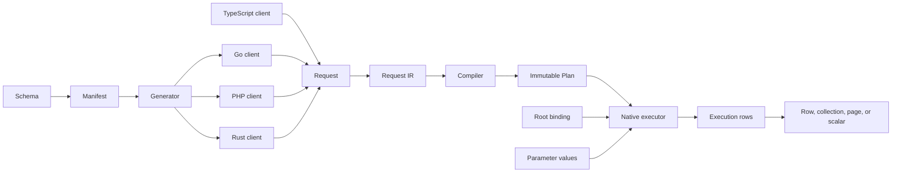
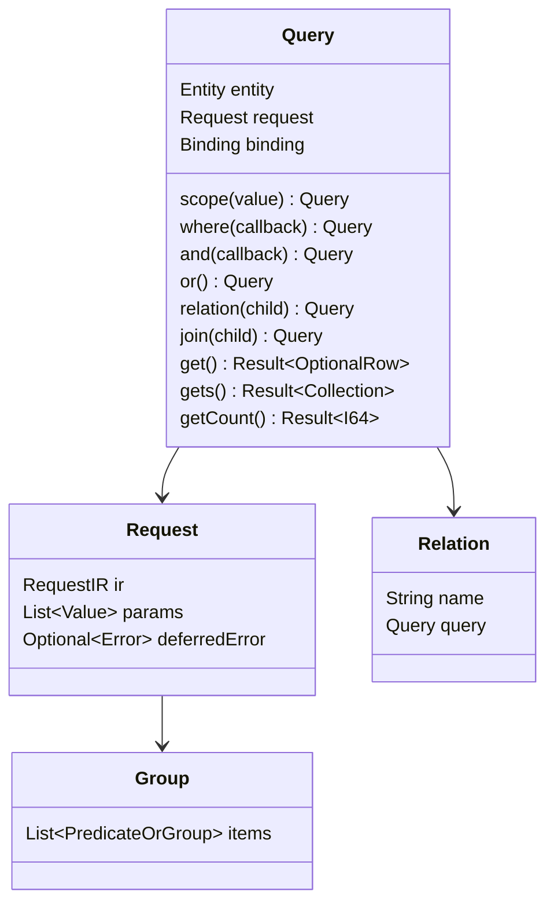
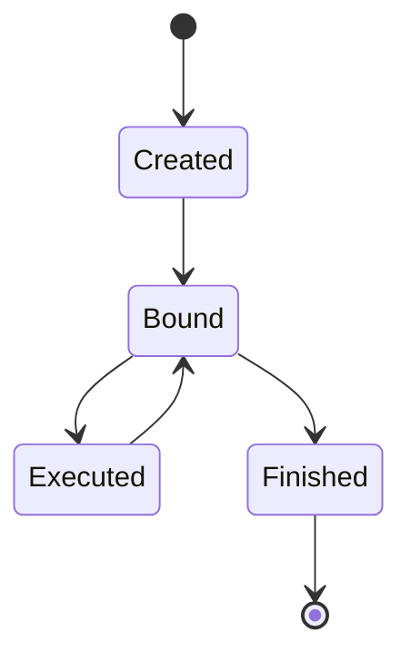
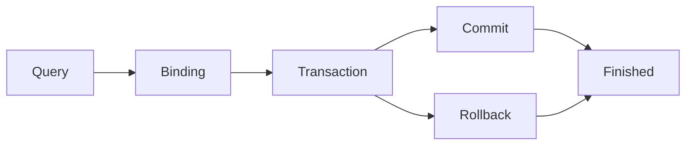
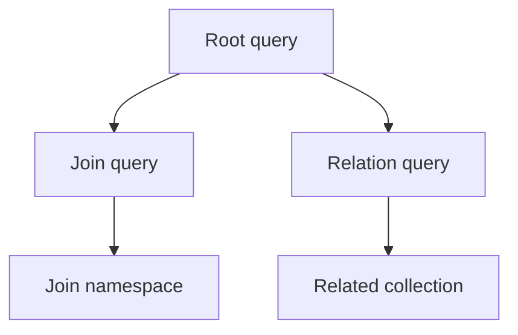
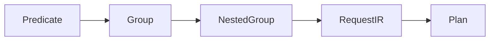
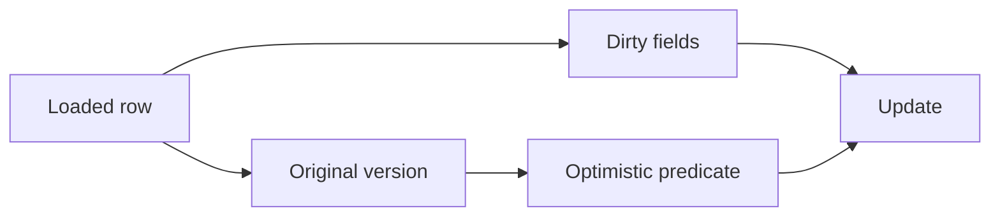
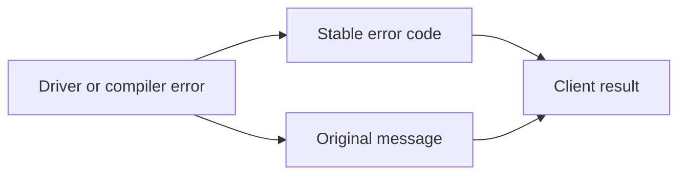
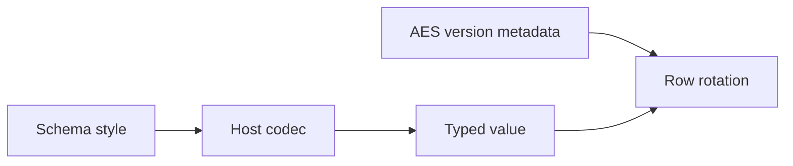

# Common interface v1

This page defines the shared public data structures, ownership rules, state transitions, and client call order. Implementation status is recorded in [the implementation matrix](interface-implementation.md). A defined interface does not prove that every client implements it.

## 1. Call boundaries and change rules

The schema manifest defines entities, fields, relations, operators, styles, and errors. The compiler receives a typed request shape and returns an immutable plan. An executor receives the plan, parameter values, and one root binding.

The change order is: update the schema or interface specification, update the manifest and generated artifacts, update all clients, run shared vectors, then update paired documentation. A client cannot add a private field or alternate call order to satisfy a shared interface.

## 2. Module call flow — IF-01

The compiler does not receive database credentials or parameter values. The executor owns database access. The root binding supplies the context and database or transaction. A child relation cannot replace the root binding.

## 3. Types and values — IF-02

| Logical type | Go | PHP | Rust | TypeScript |
|---|---|---|---|---|
| `I64` | `int64` | `int` | `i64` | `number` |
| `F64` | `float64` | `float` | `f64` | `number` |
| `Bool` | `bool` | `bool` | `bool` | `boolean` |
| `Text` | `string` | `string` | `String` | `string` |
| `Bytes` | `[]byte` | `string` | `Vec<u8>` | `Uint8Array` |
| `DateTime` | `time.Time` | `DateTimeImmutable` | `NaiveDateTime` | `Date` |
| `JsonValue` | `any` | `mixed` | `serde_json::Value` | `unknown` |
| `Optional<T>` | `*T` | `?T` | `Option<T>` | `T \| null` |
| `List<T>` | slice | array | `Vec<T>` | `T[]` |
| `Result<T>` | `(T, error)` | return or exception | `Result<T>` | `Promise<T>` |
| `Key` | `orm.Key` | typed key | `orm::Key` | `Key` |

Null, an empty list, a missing field, and a default value are different states. Serialization preserves the logical type and field order required by the codec specification.

## 4. Query objects and condition trees — IF-03 to IF-08

Each entity occurrence has one query object and one Where builder. A group contains predicates or nested groups. `or()` changes the connection for the next item. `and(fn)` and `or(fn)` create nested groups. A relation or join uses schema key mapping; callers do not provide a second relation mapping in regular syntax.

`scope(value)` exists only on a query whose entity declares `%% scope`. It stores a parameter index in `RequestIR.query.scope_p`; the Where builder cannot change it. The compiler applies root and relation scope in WHERE and join scope in JOIN ON. Scoped inserts assign the scope column. Scoped updates and upserts cannot assign the scope column. Scoped raw SQL is invalid.

## 5. Public API — IF-09 to IF-12

### 5.0 Connection input

Every public client accepts one DSN URI. `mysql://`, `postgres://`, and `sqlite://` select the database driver. The caller does not pass a second driver value and does not construct the compiler engine.

| Client | Public connection call | Result |
|---|---|---|
| Go | `gen.Connect(dsn, schemaPath, options)` | `(*orm.DB, error)` |
| PHP | `Orm::connect(dsn, config)` | `Db` |
| Rust | `gen::connect(dsn, wasm, schema_json, pool_size, config).await?` | `orm::Db` |
| TypeScript | `Db.connect(dsn, options)` | `Promise<Db>` |

### 5.1 Creation and language forms

| Operation | PHP | Go | Rust | TypeScript |
|---|---|---|---|---|
| root entry | `Battle::query()` | `gen.Battle()` | `battle::query()` | `Battle()` |
| bind executor | `using($db)` | `Using(ctx, db)` | `using(&db)` | `using(database)` |
| collection terminal | `gets()` | `Gets()` | `gets().await?` | `gets()` |
| count terminal | `getCount()` | `GetCount()` | `get_count().await?` | `getCount()` |

The entry-point spelling follows the host language. The method role, stored request, result type, error behavior, and call order remain the same.

### 5.2 Method groups

| Group | Required behavior |
|---|---|
| predicates | Use generated columns and schema-allowed operators. |
| groups | Preserve item order and nested group boundaries. |
| relations | Use declared relation names and key mappings. |
| joins | Keep ON and WHERE groups separate. |
| projection | Preserve positional output mapping and aliases. |
| mutation | Record changed fields and original values. |
| terminals | Receive values only and use the root binding. |

`getsByX(value)` and `getCountByX(value)` are regular generated methods. They apply the equality predicate for `X` and call `gets()` or `getCount()`. The executor is configured before the finder and is never passed to the finder.

### 5.3 Execution methods

| Method | Result | Required binding |
|---|---|---|
| `get` | optional row | root executor |
| `gets` | collection | root executor |
| `getCount` | integer | root executor |
| `insert` | row or key | root executor |
| `update` | affected count | row or root executor |
| `delete` | affected count | row or root executor |

An unbound terminal returns `CONFIG`. A terminal after transaction completion returns `CONFIG`. A database argument on a terminal is invalid.

## 6. Binding, executor, and transaction — IF-13 to IF-17

A binding contains the execution context and one database or transaction reference. Query copies share the request value structure but do not share mutable builder state. A child relation uses the root binding. A loaded row retains the binding needed for its update and delete methods.

Transaction ownership belongs to the code that created the transaction. Commit and rollback end the binding. After either operation, all queries and rows from that transaction reject execution. A transaction exposes `savepoint(name)`, `rollbackTo(name)`, and `releaseSavepoint(name)`; names must match `[A-Za-z_][A-Za-z0-9_]*`. These operations preserve the outer transaction and reject invalid names with `CONFIG`.

PostgreSQL transactions expose `advisoryLock(key)` (Go: `AdvisoryLock`) for transaction-scoped serialization. The lock is released when the transaction ends. Other drivers reject this operation with `CAPABILITY_UNSUPPORTED`.

Schema installation uses `installDDL(statements)` (Go: `InstallDDL`) on a caller-owned transaction. The ORM executes statements in order and returns the first error so the transaction owner can roll back the complete installation.

`TransactionOptions` accepts `isolation` (`default`, `read_uncommitted`, `read_committed`, `repeatable_read`, or `serializable`), `readOnly`, and `timeoutMs` (or the language's snake-case equivalent). Go maps isolation and read-only settings to `database/sql.TxOptions`; PHP and TypeScript apply PostgreSQL settings after `BEGIN` and MySQL settings before `START TRANSACTION`; Rust emits the equivalent driver-specific transaction start. SQLite rejects explicit isolation, read-only, and timeout options. MySQL and SQLite reject `timeoutMs`; PostgreSQL applies it as transaction-local `statement_timeout`. Unsupported capabilities return `CAPABILITY_UNSUPPORTED`.

Root row selects expose `forUpdate()` and `forShare()` (Go: `ForUpdate()` and `ForShare()`, Rust: `for_update()` and `for_share()`). The request stores `lock` in the common IR. MySQL and PostgreSQL append the selected lock clause after ordering and limits. SQLite rejects either mode with `CAPABILITY_UNSUPPORTED`; the client does not emulate a row lock.

Errors preserve their stable code and the original driver message. Transaction timeout is available through `timeoutMs` where the driver supports PostgreSQL `statement_timeout`; in-flight cancellation remains native to each language runtime.

`transaction` executes its callback once by default. Deadlock retry is disabled by default. The caller may pass `TransactionOptions` with `retryDeadlocks` and `maxAttempts`; each retry creates a new transaction and re-executes the complete callback. The callback must be safe to execute more than once when retry is enabled.

## 7. Compile, plan, and assembly — IF-18 to IF-20

`Request` contains the schema hash, IR version, entity, predicate tree, relation requests, projection, and parameter count. Parameter values are stored separately from the request shape. The compiler produces an immutable plan with dialect-specific SQL and positional assembly metadata.

Assembly uses `{alias, column, output_name, index}`. Join aliases remain separate from the root namespace. Duplicate output names return `COLUMN_ALIAS_CONFLICT`. A schema hash mismatch returns `SCHEMA_HASH_MISMATCH` before execution.

## 8. Row values, dirty state, and relations — IF-21 to IF-24

A generated row stores declared fields and relation results. Getters return the declared type. Setters update the field and mark it dirty. Update operations send dirty fields only, except fields required by optimistic locking. The original version is read before mutation and is used in the update predicate.

A relation result is either one row or a collection according to the schema. Collection keying is deterministic. A duplicate key follows the declared key policy; an undeclared key function is invalid.

## 9. Collection, key, and page — IF-25 to IF-27

| Object | Required fields |
|---|---|
| `Collection<T>` | ordered rows, length, first, key lookup |
| `Key` | logical type tag and value |
| `Page<T>` | page, per-page count, total count, rows |

The integer key `7` and text key `"7"` are different keys. Composite keys encode each typed component with its length, so `("1", "23")` and `("12", "3")` cannot collide. The plan records the ordered collection identity in `Assemble.key`. Regular rows use every primary-key component; grouped count rows use their group columns and expression aliases. A collection preserves database order unless an explicit order or key policy changes it. A page preserves the root result order and relation attachment order.

## 10. Configuration, errors, codecs, and events — IF-28 to IF-31

Configuration selects the dialect, DSN, schema file, executor, AES key version map, and query event hook. It does not select another database or silently change the request path.

Errors use the codes in [errors.yaml](errors.yaml). Codec styles are schema declarations. The AES version column is non-null integer plaintext metadata with no encoding style and is excluded from the default projection. AES rotation updates all AES payload columns and the version in one transaction.

Query events expose the normalized SQL, bind count, duration, plan identifier, and error. Secrets and parameter values are excluded from logs.

## 11. Generator, schema, and extension boundaries — IF-32 to IF-34

The generator reads the schema manifest and emits the declared methods, fields, relations, column references, and error types. It must not emit a method for an undeclared column, relation, or operator. Generated code is checked against the manifest and the interface symbol list.

The regular API uses declared relation methods such as `relation<Rel>`, `relations<Rel>`, `join<Rel>`, and `leftJoin<Rel>`. Undeclared method names fail during language-level method lookup.

## 12. Verification

The verification suite checks the manifest, generated symbols, stored fields, request shape, state transitions, error codes, codec vectors, relation results, and database results. It also checks document pairs, static Pages output, Mermaid SVG output, and repeated-build bytes.

A passing symbol check proves the declared surface only. A passing conformance vector proves the tested input and result. A feature is complete only when all supported clients, required databases, tests, documents, and Pages checks pass.
