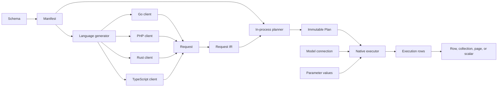
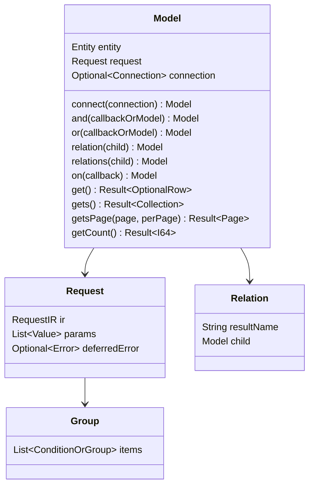
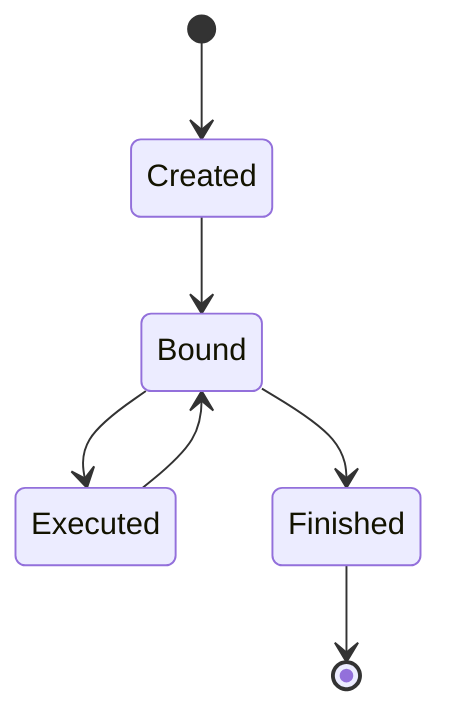
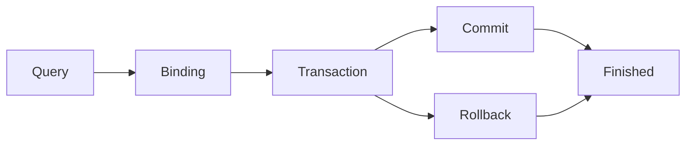
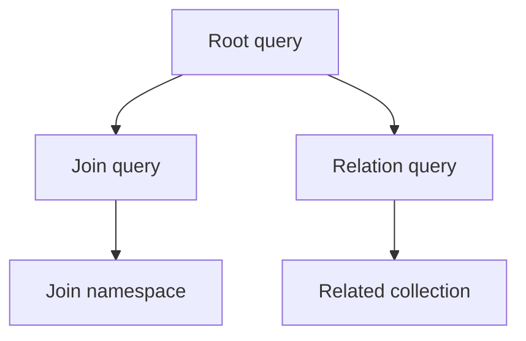
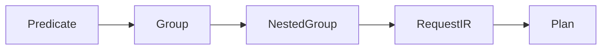
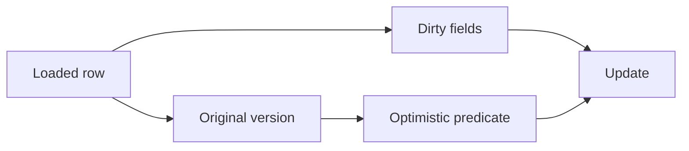
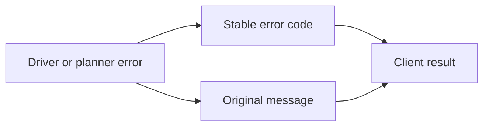
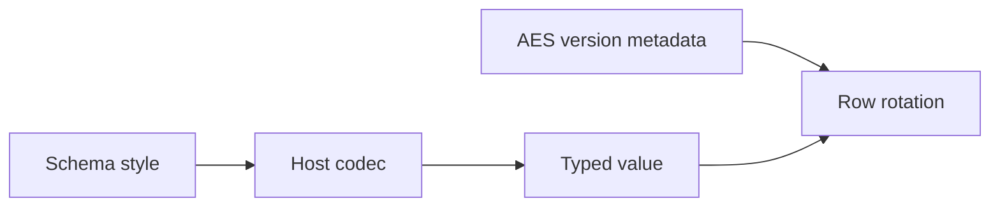

# Common interface v1

This page defines the shared public data structures, ownership rules, state transitions, and client call order for the syntax in the [DSL](dsl.md). Implementation status is recorded in [the implementation matrix](interface-implementation.md). A defined interface does not prove that every client implements it.

## 1. Call boundaries and change rules

The schema manifest defines entities, fields, operators, styles, and errors. Each language generates its models from the manifest with its own build tool. The client library validates a typed request shape and plans it in the calling process into an immutable plan. An executor receives the plan, parameter values, and the connection selected for the model.

The change order is: update the design plan and the DSL, update the manifest and generated artifacts, update all clients, run shared vectors, then update paired documentation. A client cannot add a private field or alternate call order to satisfy a shared interface.

## 2. Module call flow — IF-01

```mermaid
flowchart LR
    Schema[Schema] --> Manifest[Manifest]
    Manifest --> Generator[Language generator]
    Generator --> Go[Go client]
    Generator --> PHP[PHP client]
    Generator --> Rust[Rust client]
    Generator --> TypeScript[TypeScript client]
    Go --> Request[Request]
    PHP --> Request
    Rust --> Request
    TypeScript --> Request
    Request --> IR[Request IR]
    Manifest --> Planner[In-process planner]
    IR --> Planner
    Planner --> Plan[Immutable Plan]
    Plan --> Executor[Native executor]
    Binding[Model connection] --> Executor
    Values[Parameter values] --> Executor
    Executor --> Rows[Execution rows]
    Rows --> Result[Row, collection, page, or scalar]
```

The planner does not receive database credentials or parameter values. The executor owns database access. A model receives its connection through `connect`; inside a transaction callback, a model without `connect` uses the active transaction of the current execution flow. A join or relation child without `connect` uses the parent connection.

## 3. Types and values — IF-02

| Logical type | Go | PHP | Rust | TypeScript |
|---|---|---|---|---|
| `I64` | `int64` | `int` | `i64` | `number` |
| `F64` | `float64` | `float` | `f64` | `number` |
| `Bool` | `bool` | `bool` | `bool` | `boolean` |
| `Text` | `string` | `string` | `String` | `string` |
| `Bytes` | `[]byte` | `string` | `Vec<u8>` | `Uint8Array` |
| `DateTime` | `time.Time` | `DateTimeImmutable` | `NaiveDateTime` | `Date` |
| `JsonValue` | `any` | `mixed` | `serde_json::Value` | `unknown` |
| `Optional<T>` | `*T` | `?T` | `Option<T>` | `T \| null` |
| `List<T>` | slice | array | `Vec<T>` | `T[]` |
| `Result<T>` | `(T, error)` | return or exception | `Result<T>` | `Promise<T>` |
| `Key` | `orm.Key` | typed key | `orm::Key` | `Key` |

Null, an empty list, a missing field, and a default value are different states. Serialization preserves the logical type and field order required by the codec specification.

## 4. Models and condition trees — IF-03 to IF-08

```mermaid
classDiagram
    class Model {
        Entity entity
        Request request
        Optional~Connection~ connection
        connect(connection) Model
        and(callbackOrModel) Model
        or(callbackOrModel) Model
        relation(child) Model
        relations(child) Model
        on(callback) Model
        get() Result~OptionalRow~
        gets() Result~Collection~
        getsPage(page, perPage) Result~Page~
        getCount() Result~I64~
    }
    class Request {
        RequestIR ir
        List~Value~ params
        Optional~Error~ deferredError
    }
    class Group {
        List~ConditionOrGroup~ items
    }
    class Relation {
        String resultName
        Model child
    }
    Model --> Request
    Request --> Group
    Model --> Relation
```

A model is both the query builder and the loaded row type. A group contains conditions or nested groups in order, and each item after the first carries an explicit `AND` or `OR` connector. `and(fn)` and `or(fn)` create nested groups whose callback receives an empty model of the same type. `and(model)` and `or(model)` place the conditions of a joined child as a group. Join `ON` conditions are stored separately from `WHERE` conditions.

A terminal does not change the stored request, so repeated terminals produce the same statement.

## 5. Public API — IF-09 to IF-12

### 5.0 Connection input

Every public client accepts one DSN URI. `mysql://`, `postgres://`, and `sqlite://` select the database driver. The optional `timezone` parameter sets the connection time zone; without it the server environment time zone is used. The caller does not pass a second driver value.

| Client | Public connection call | Result |
|---|---|---|
| Go | `model.Connect(dsn, config)` | `(*orm.DB, error)` |
| PHP | `Orm::connect(dsn, new Config(schemaPath: …))` | `Db` |
| Rust | `orm::Db::connect(dsn, pool_size, config).await?` | `orm::Db` |
| TypeScript | `Db.connect(dsn, schemaPath, options)` | `Promise<Db>` |

### 5.1 Creation and language forms

| Operation | PHP | Go | Rust | TypeScript |
|---|---|---|---|---|
| model creation | `new Product` | `model.Product()` | `Product::new()` | `new Product()` |
| connection | `->connect($db)` or `($db)` | `.Connect(db)` | `.connect(&db)` | `.connect(db)` |
| collection terminal | `gets()` | `Gets()` | `gets().await?` | `gets()` |
| count terminal | `getCount()` | `GetCount()` | `get_count().await?` | `getCount()` |

The creation spelling follows the host language. The method role, stored request, result type, error behavior, and call order remain the same.

### 5.2 Method groups

| Group | Required behavior |
|---|---|
| conditions | Use column chains, operator prefixes, value shapes, and explicit connectors. |
| groups | Preserve item order and nested group boundaries. |
| relations | Use `match<L>With<R>` keys on the child and a separate statement per relation. |
| joins | Keep `ON` and `WHERE` conditions separate and place child conditions where the child is passed to a group. |
| projection | Preserve positional output mapping and reject duplicate row names. |
| mutation | Record changed fields and original values. |
| terminals | Receive chain values only and use the model connection. |

`getBy<Chain>`, `getsBy<Chain>`, and `getCountBy<Chain>` apply the chain as the condition and call the terminal. PHP resolves chains at call time, and Go, Rust, and TypeScript generate the chains that the scanned source code calls.

### 5.3 Execution methods

| Method | Result | Connection |
|---|---|---|
| `get` | one row; `NO_ROWS` when no row matches | model connection or active transaction |
| `gets` | collection | model connection or active transaction |
| `getsCount` | `GroupRows` with selected grouping values and checked row counts | model connection or active transaction |
| `getsPage` | page | model connection or active transaction |
| `getCount` | integer | model connection or active transaction |
| `create` | row with generated key | model connection or active transaction |
| `creates` | inserted row count | model connection or active transaction |
| `update` | row | row connection or active transaction |
| `delete` | row or collection | row connection or active transaction |

A terminal without a connection outside a transaction returns `CONFIG`. A connection must carry the schema engine used by the generated request; otherwise the terminal returns `CONFIG`.

`GroupRows` contains no partial models. Each row contains only selected grouping values and one nonnegative `row_count`. A missing, duplicate, malformed, or lossy count fails. Selected values retain their declared types, including boolean and SQL NULL; requesting an unselected value returns `COLUMN_UNSELECTED`.

## 6. Connections, transactions, and utilities — IF-13 to IF-17

`connection.transaction(fn, options)` runs the callback in one transaction. Begin, commit, rollback, and the executor are private. A callback error or exception rolls back the transaction; otherwise the transaction commits and the callback result is returned.

| Option | Values |
|---|---|
| `isolation` | `default`, `read_uncommitted`, `read_committed`, `repeatable_read`, `serializable` |
| `readOnly` | boolean |
| `timeoutMs` | positive integer; PostgreSQL applies `statement_timeout`, MySQL and SQLite return `CAPABILITY_UNSUPPORTED` |
| `retry` | deadlock retry count, default `3`; each retry runs the complete callback again, and `0` disables retry |

- Each execution flow keeps a stack of active transactions: the goroutine in Go, the request in PHP, the async context in TypeScript, and the task in Rust. A model without `connect` uses the innermost transaction.
- A transaction on the same connection inside an active transaction creates a savepoint. An inner failure rolls back only the inner work unless the outer callback returns it.
- Concurrent use of one transaction connection returns an error. A task or goroutine started inside the callback has no active transaction.
- `transactionConflict(message)` (Go: `orm.TransactionConflict`) creates the retryable `DEADLOCK` error.
- Row locks `forUpdate()`, `forShare()`, `forUpdateNoWait()`, and `forShareNoWait()` are allowed only inside a transaction. MySQL and PostgreSQL append the lock clause; SQLite uses an ORM transaction-scoped lock row. A `*_nowait` request that cannot acquire the lock returns `LOCK_NOT_AVAILABLE` on every adapter.

`connection.utils()` provides operations outside the query syntax.

| Utility | Behavior |
|---|---|
| `lock(key)` | transaction-scoped named lock: MySQL `GET_LOCK`, PostgreSQL advisory lock, SQLite ORM lock row; requires an active transaction |
| `setLocal(key, value)`, `local(key)` | transaction-local values; requires an active transaction; `local` returns `NO_ROWS` for a missing key |
| `wasInserted(entity, sequence)` | reports whether a generated ORM insert for the sequence succeeded in the active transaction; the fact is adapter-neutral and restored across savepoint rollback |
| `backendWaitingForLock(ctx)` | reports PostgreSQL pool backends waiting for a lock; MySQL and SQLite return `false` without exposing a driver-specific caller API |
| `schema().install(manifestJson)` | creates the missing tables, keys, indexes, comments, and triggers of the manifest on every database and keeps existing tables; on MySQL a call inside a transaction returns `CONFIG` |
| `schema().exists(schema)`, `schema().installed(schema, table)` | schema inspection |
| `schema().empty()` | reports whether the database holds no user content. On PostgreSQL a schema other than `public`, `information_schema` and the `pg_` schemas is content even without objects, and so is a table, partitioned table, view, materialized view, or foreign table in `public`; functions, types, and sequences in `public` are not content. On MySQL a table or view of the connected database is content; on SQLite a table or view other than the `sqlite_` tables and the ORM's `orm__` tables is content |
| `privileges().grantTable(table, role)`, `revokeTable(table, privilege, role)`, `inspectTable(table)` | table privileges; non-PostgreSQL dialects return `CAPABILITY_UNSUPPORTED` |
| `aes().status(model, keyring)`, `aes().rotate(model, keyring)` | AES key version status and rotation of every AES column and the version in one transaction |
| `stats()` | connection pool statistics |

Utilities that change data open a transaction when none is active and join the active transaction of the same connection otherwise.

## 7. Planning and assembly — IF-18 to IF-20

`Request` contains the schema hash, IR version, entity, predicate tree, relation requests, projection, and parameter count. Parameter values are stored separately from the request shape. The client planner produces an immutable plan with dialect-specific SQL and positional assembly metadata. The four planners produce the same SQL for the same request; the conformance vectors check this.

Assembly uses `{alias, column, output_name, index}`. Join aliases remain separate from the root namespace. Duplicate output names return `COLUMN_ALIAS_CONFLICT`. A schema hash mismatch returns `SCHEMA_HASH_MISMATCH` before execution.

## 8. Row values, dirty state, and relations — IF-21 to IF-24

A model row stores declared fields, added columns, relation results, and values attached with `new<Name>` in one name space; duplicate names are rejected. Getters return the declared type. Setters update the field and mark it dirty. Update operations send dirty fields only, except fields required by optimistic locking. The original version is read before mutation and is used in the update predicate.

A relation result is either one row or a collection according to the schema. Collection keying is deterministic. A duplicate key follows the declared key policy; an undeclared key function is invalid.

## 9. Collection, key, and page — IF-25 to IF-27

| Object | Required fields |
|---|---|
| `Collection<T>` | ordered rows, length, first, key lookup |
| `Key` | logical type tag and value |
| `Page<T>` | `items`, `totalCount`, `totalPages`, `page`, `perPage` |

The integer key `7` and text key `"7"` are different keys. Composite keys encode each typed component with its length, so `("1", "23")` and `("12", "3")` cannot collide. The plan records the ordered collection identity in `Assemble.key`. Regular rows use every primary-key component; grouped count rows use their group columns and expression aliases. A collection preserves database order unless an explicit order or key policy changes it. A page preserves the root result order and relation attachment order.

Go key conversion preserves the logical types of signed integers, booleans, text, bytes, finite floating-point values, and times. An unstyled byte column remains bytes after database scanning, including a joined column. Unsigned integers must fit a signed 64-bit value. A null or unsupported value returns an error; a null database identity component is absent. Composite keys retain component type, order, and length. `KeyOf`, `Key.Value`, and collection `Get`, `Has`, and `FetchedValue` report invalid keys with an error. Collection lookups, relation matching, and split-query deduplication propagate conversion errors instead of converting values to text.

## 10. Configuration, errors, codecs, and events — IF-28 to IF-31

Configuration selects the dialect, DSN, schema file, executor, AES key version map, and query event hook. It does not select another database or silently change the request path.

Errors use the codes in [errors.yaml](errors.yaml). Go callers use `orm.ErrorCode`, `orm.IsDeadlock`, `orm.IsLockNotAvailable`, `orm.IsDuplicateKey`, `orm.IsForeignKey` and `orm.IsConstraint` for adapter-neutral classification; they do not inspect driver error types. Codec styles are schema declarations. The AES version column is non-null integer plaintext metadata with no encoding style and is excluded from the default projection. AES rotation updates all AES payload columns and the version in one transaction.

Query events expose the normalized SQL, bind count, duration, plan identifier, and error. Secrets and parameter values are excluded from logs.

## 11. Generator, schema, and extension boundaries — IF-32 to IF-34

The generator reads the schema manifest and emits models, fields, column methods, and error types. Go and Rust generation also reads the scanned source and emits the chain, relation key, join, and `new<Name>` methods that the source calls. It must not emit a method for an undeclared column or operator. Generated code is checked against the manifest and the interface symbol list.

Relations use `relation(child)` and `relations(child)` with `match<L>With<R>()` on the child. Joins use `join<L>With<R>(child)` and `leftJoin<L>With<R>(child)`. Unknown names fail during PHP and TypeScript call resolution and during Go and Rust generation.

## 12. Verification

```mermaid
stateDiagram-v2
    [*] --> Created
    Created --> Bound
    Bound --> Executed
    Executed --> Bound
    Bound --> Finished
    Finished --> [*]
```

```mermaid
flowchart LR
    Query --> Binding
    Binding --> Transaction
    Transaction --> Commit
    Transaction --> Rollback
    Commit --> Finished
    Rollback --> Finished
```

```mermaid
flowchart TB
    Root[Root query] --> Join[Join query]
    Root --> Relation[Relation query]
    Join --> JoinResult[Join namespace]
    Relation --> RelationResult[Related collection]
```

```mermaid
flowchart LR
    Predicate --> Group
    Group --> NestedGroup
    NestedGroup --> RequestIR
    RequestIR --> Plan
```

```mermaid
flowchart LR
    Row[Loaded row] --> Dirty[Dirty fields]
    Dirty --> Update[Update]
    Row --> Original[Original version]
    Original --> Optimistic[Optimistic predicate]
    Optimistic --> Update
```

```mermaid
flowchart LR
    Error[Driver or planner error] --> Code[Stable error code]
    Error --> Message[Original message]
    Code --> Client[Client result]
    Message --> Client
```

```mermaid
flowchart LR
    Style[Schema style] --> Codec[Host codec]
    Codec --> Value[Typed value]
    Version[AES version metadata] --> Rotation[Row rotation]
    Value --> Rotation
```

The verification suite checks the manifest, generated symbols, stored fields, request shape, state transitions, error codes, codec vectors, relation results, and database results. It also checks document pairs, static Pages output, Mermaid SVG output, and repeated-build bytes.

The interface check rejects a declared or called `multi_statement` method in Go, PHP, Rust, and TypeScript source. Its source mutation cases verify both failures. The CI workflow runs the generated Go model, interface, and schema checks; a test fails if any command is removed.

A passing symbol check proves the declared surface only. A passing conformance vector proves the tested input and result. A feature is complete only when all supported clients, required databases, tests, documents, and Pages checks pass.

### Rust native grid query specification (in development)

`CatalogConnection::read_only_grid_query(sql, params, limits)` returns ordered
column metadata and typed grid cells. Binary cells preserve bytes and remain
distinct from text, including empty binary and valid UTF-8 binary. SQL NULL
is a separate cell. Grid decoding does not modify catalog/schema coercion
rules or add a compatibility fallback. It uses the same database-enforced
read-only scope, connection disposal and explicit query budgets. Unsupported
types fail explicitly until their owning type cases are implemented.

Grid floating-point cells carry native IEEE-754 bits as `Float32(u32)` or
`Float64(u64)`, preserving signed zero and nonfinite values without JSON
number coercion. `Unsigned(u64)` preserves the entire MySQL unsigned range.
These native Rust values require explicit typed conversion at wire boundaries;
they do not change schema/catalog scalar conversion rules.

Finite grid decimal cells use exact plain decimal strings, preserving the
database's declared result scale, including trailing zeros. Do not pass through
binary floats or fixed-precision model codecs. SQLite has no native decimal
storage class: its actual text/integer/real values keep their existing tags.
Nonfinite PostgreSQL numeric values remain explicitly unsupported in this stage.

### Qualified native Rust table metadata

`CatalogConnection::current_namespace()` reports the selected namespace.
`describe_table(&TableRef { namespace, name })` resolves an explicitly qualified
table through bound catalog names, preserving native column types, declared
primary-key order, actual nullability and generated-column flags. Do not derive
identity from logical schema column order or arbitrary query results. SQLite
supports its connected `main` namespace; nullable legacy primary keys are not
reliable identity, while a genuine INTEGER rowid alias is non-null. A descriptor
is not edit authorization: table mutation requires explicit commands, validated
schema/row revisions, typed binds and optimistic conflict checks.

`TableMetadata` contains the qualified `table`, native relation `kind`, ordered
`columns` (`name`, `native_type`, `nullable`, `generated`), constraint-ordered
`primary_key` and `reliable_row_identity`. Identity requires an ordinary or
partitioned table with a nonempty, entirely non-null primary key. Generated
flags also cover PostgreSQL always-generated identity and SQLite hidden columns;
they are not a complete writable-column permission model. Preserve an empty
SQLite native type for an untyped column rather than inventing a type.

Names require 1..1024 UTF-8 bytes and no NUL. Each catalog result is bounded to
2048 rows and 4 MiB. Unsupported relation kinds and SQLite namespaces fail
explicitly. This descriptor is not a complete physical schema import or an
atomic schema revision; mutation must revalidate metadata in its owning scope.

MySQL `SYSTEM VIEW` catalog relations are classified as views, never as tables
or writable row identity. Unknown native relation kinds still fail explicitly.

### Native Rust typed bind values

Tool `P` retains text/signed integers and
adds Binary, Boolean, Float32/Float64 bit values, Decimal plain strings, Unsigned
and Null(ParamType). Use SQLx typed driver encoding, never formatted SQL values.
Unsigned is MySQL-only; SQLite rejects Decimal and Float32, preserving its native
integer/float64/text/blob classes without implicit widening or numeric affinity
coercion. PostgreSQL supports decimal and both native float widths. Reject
nonfinite MySQL floats and SQLite NaN before execution; SQLite infinities remain
native float64 values. Reject malformed decimals, PostgreSQL text NUL, more than
65535 parameters or total value bytes exceeding 16 MiB before preparing/executing.
Typed NULLs use the selected native bind kind, not empty text or zero.
Native Boolean binding uses SQLx bool; PostgreSQL grid reads preserve Boolean,
while MySQL TINYINT and SQLite INTEGER storage return integer 0/1 rather than
inventing a distinct native boolean type. SQLite storage class is owner-tested.
These are bind semantics, not protection from column/server coercion: mutation
execution still needs schema validation, strict post-write verification and
rollback/conflict handling. Native Rust tooling does not prove four-client writes.

### Rust row-edit baselines

Automatic/default-key insertion must receive database-owned identities, never
derive them from row counts, maxima or a later unrelated connection. PostgreSQL
and SQLite use bounded typed `INSERT ... RETURNING` on the owning transaction.
MySQL uses the executing statement's insert acknowledgement for an omitted
AUTO_INCREMENT key and rereads the row on that same transaction. Literal default
keys use server-side `DEFAULT(column)` predicates and declared composite-key
ordering, without frontend default evaluation. `expression_default` distinguishes
MySQL expression defaults from literal defaults. For omitted expression keys,
select a bounded transactional input locator before writing. It must match no
existing rows under a target-table lock, then match exactly one row whose supplied
values are exact after inserting. Return that row's actual primary keys and
revalidate it by key before commit. Never reevaluate a volatile default. An
existing locator match fails before writing with `ROW_IDENTITY_AMBIGUOUS`; an
ambiguous or coerced post-write result requires rollback. Empty assignments can
identify only an initially empty table. This strategy is not a retry or fallback
after another strategy fails. Acquire MySQL target-table metadata locking before
descriptor/engine safety checks; catalog reads alone are insufficient.
Verify the
declared key-generation strategy before writing; unsupported returning
strategies fail explicitly. Concurrent inserts must return their own rows.

PostgreSQL prepared query metadata must use the explicit bind codec types, not
untyped inferred placeholders. A grid i64 key can select an INTEGER column via
the database's integer comparison, without sending i64 bytes as an inferred
int4 parameter. Native functions still require explicit SQL casts where their
signature differs from a declared bind type; no codec guessing is permitted.

Before writing, `RowSnapshot::validate_update` checks named assignments and must
reject duplicates, unknown names, generated columns, invalid NULLs and oversized
values. After writing under the same lock, compare exact requested values and
untouched ordinary columns; generated columns may be recomputed. A coercion or
unrequested ordinary-column change requires rollback, never success. Pure
verification alone is not transactional execution or mutation authorization.

Native insert, update and delete require a fallible synchronous pre-commit permit.
The permit runs after transactional write verification, before publishing
`CommitStarted` or spawning the commit owner. A rejected permit rolls back;
it cannot silently become commit success. Successful permission transfers
commit ownership without an intervening cancellation await. The phase observer
remains observational; durable authorization and recovery belong to the caller.

The native update executor accepts an original `RowSnapshot`, explicit
typed `P` assignments, an atomic cancellation flag and a required phase event
subscriber. Use a fresh discard-on-drop transaction, original-key row locking
(`BEGIN IMMEDIATE` on SQLite), descriptor/original comparison and exact post-write
verification before commit. Reject non-InnoDB MySQL tables and MySQL triggers.
Trigger absence is valid only with a verified direct account grant; role-only
grants and enabled partial revokes are currently rejected, not assumed visible.
Cancellation checkpoints before commit roll back; cancellation after commit begins does not
claim rollback. Commit runs in an owned task publishing Committed/Indeterminate,
even if its awaiting caller drops. Unconfirmed commit errors are indeterminate;
never automatically retry. Explicit PostgreSQL constraint/transaction rejection is
distinguished from missing acknowledgement and requires rollback confirmation
before reporting `ROW_COMMIT_REJECTED`. Preserve the owning native error cause.
These events are not a durable operation journal and give no durable
operation identity or recovery.

`delete_row` uses the same explicit baseline, cancellation checkpoints and phase
subscriber. Lock and compare the original, require exactly one affected row and
verify absence with an unchanged descriptor before commit. Constraint failure or
pre-commit cancellation rolls back; never invent a successful deletion for a
missing or changed original. Database FK effects require review before
authorization; the native API does not independently authorize cascading effects.

`insert_row` takes a checked `TableMetadata` and explicit typed
assignments, cancellation flag and phase subscriber. Columns expose
`automatic_key` and `default_expression`; these participate in descriptor
comparison and the bounded baseline revision. Require explicit primary-key
values unless an authoritative generator supports returning the omitted keys.
Lock/probe explicit keys, revalidate the descriptor, reject existing keys,
write with typed binds, require one affected row and reread by the declared key.
Compare every supplied value exactly; omitted defaults and generated values are
returned from the database. Reject unknown/duplicate/generated assignments.
Automatic-key insertion validation is in progress; this native API is not full
CRUD, durable authorization or recovery.

`RowSnapshot::from_page(&TablePage, row_index)` captures
one checked immutable row, reliable non-null declared primary-key values in
constraint order and a value-sensitive SHA-256 revision of descriptor/typed cells.
Bound the complete captured encoding to 8 MiB. Reject views/unreliable identities,
bad projection/keys, malformed decimals, NULL in non-null columns and page bounds.
`check_current(&TableMetadata,&GridQueryResult)` distinguishes changed descriptor,
missing/changed row and ambiguous identity. Exact typed comparison includes float
bits, decimal scale, binary and generated-column original values.
This pure API neither reads, locks nor writes a database and does not authorize
edits. Execution must re-read by original keys inside the owning locked writable
transaction, compare the original descriptor/row, then perform typed writes.
The descriptor is not a complete physical schema revision and cannot detect ABA.
Prepared native types may be data-dependent; compare projection names and the
native descriptor, not prepared type names as schema revisions. Rust native
tooling scope does not establish four-client mutation conformance.

### Qualified Rust table pages

`CatalogConnection::table_page(&TableRef, limit, offset)` reads one explicit
qualified table in a fresh enforced read-only scope, selecting descriptor columns
in physical order with dialect-quoted identifiers. Order by declared primary-key
constraint order when present; no key means unspecified ordering, never an
invented row identity. Require limit 1..1000 and offset 0..1000000; read one extra
bounded sentinel row to report `has_more`, not a total count. The page carries
`metadata`, typed `result`, `limit`, `offset`, `order_by` and `has_more`.
Bound native row encoding to 8 MiB, reject rather than truncate excess payloads.
Prepared column names must exactly match the descriptor, and changed metadata
within the read scope fails. Preserve unsupported-type errors and rollback the
scope on completion/failure. Independent offset pages can drift as data changes;
metadata is not an atomic schema revision or authorization for row mutations.
