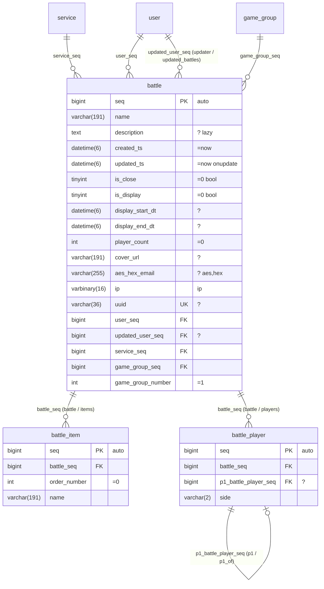

# schema.md — 스키마 소스는 Mermaid erDiagram 하나

사람이 쓰는 파일은 `schema/*.mmd`(Mermaid `erDiagram`)뿐이다. GitHub·IDE·아티팩트에서 그대로 그림으로 렌더되고,
`ormgen`이 이 파일을 파싱해 관계·kind·인덱스·스타일을 갖춘 **매니페스트(`schema.json`, 생성물)** 를 만든다. 매니페스트는 손으로 편집하지 않는다.
기존 DB가 있으면 `ormgen import --dsn … --out schema/service.mmd`가 이 파일을 만들어 준다(FK → 관계선, 인덱스 → `%%` 지시문).

## 1. 예



## 2. 규칙

### 2.1 컬럼 줄 — `타입 이름 [PK|FK|UK] ["주석"]`
Mermaid 문법을 사용한다. `PK`, `FK`, `UK`는 Mermaid keyword다. 기본키를 구성하는 모든 컬럼에 `PK`를 지정하며 선언 순서가 복합키 순서다. 복합 unique key는 아래 `%% unique`로 표현한다.
생성된 복합키 타입과 전체 키 조회 메서드는 이 순서를 보존한다. 자동 키가 없는 엔터티에 insert하려면 모든 primary key 값을 지정해야 하며, insert 후 모든 키 조건으로 행을 조회한다. `save`는 실행 전에 부분 primary key를 거부한다.
타입은 DB 타입을 그대로 쓴다(`bigint`, `varchar(191)`, `datetime(6)`, `decimal(13_3)`, `enum('a','b')`). 매니페스트가 정규 타입(i64/string/datetime/…)으로 바꾼다.
`varchar`와 `char`에는 양의 길이가 필요하다. 길이가 없거나 0이거나 잘못된 값이면 DDL 생성 전에 schema build가 실패한다.

주석 문자열은 공백으로 나눈 **속성 목록**이다. 없으면 NOT NULL, 기본값 없음, 일반 컬럼.
| 속성 | 의미 |
|---|---|
| `?` | NULL 허용 |
| `=값` | DEFAULT. `=0`, `='ko'`, `=now`(CURRENT_TIMESTAMP), `=null` |
| `onupdate` | ON UPDATE CURRENT_TIMESTAMP (`updated_ts`용) |
| `auto` | AUTO_INCREMENT |
| `unsigned` | UNSIGNED (임포터가 채움; 손으로 쓸 땐 생략 가능) |
| `bool` | tinyint를 bool로 노출 |
| `lazy` | 기본 SELECT에서 제외(`selectX()`로 옵트인). text/blob 계열은 지정 없어도 lazy |
| `aes` `hex` `gz` `json` `jsons` `base64` `serialize` `ip` | dataStyle 파이프라인(순서대로 쓰기, 역순 읽기). 컬럼명 접두어(`aes_hex_*`, `gz_*`, `json_*`)와 컬럼명 `ip`에서 자동 추론되므로 보통 생략 |
| `-> table.column` | FK 대상 명시(관계선 없이 FK만 둘 때). 관계선이 있으면 불필요 |
| `%…%` 나머지 | 설명(문서용). 속성으로 해석되지 않는 단어는 설명으로 취급 |

### 2.2 관계선 — `부모 ||--o{ 자식 : "fk컬럼 (자식측이름 / 부모측이름)"`
| 표기 | kind | 생성되는 토큰 |
|---|---|---|
| `\|\|--o{` (1 : 0..N) | 자식→부모 **one**, 부모→자식 **many** | 자식: `relation<Parent>` / `join<Parent>`, 부모: `relations<Children>` / `join<Children>` |
| `\|\|--\|\|`, `\|\|--o\|` (1 : 0..1) | 양쪽 **one** | 양쪽 `relation…` |
| `}o--o{` (N : M) | 직접 지원 안 함 — 조인 테이블을 엔티티로 그린다(`a_match_b` 관례) |

라벨: 단일 컬럼 관계는 자식 FK 컬럼으로 시작한다. 복합 관계는 `(tenant_id, account_id)`처럼 순서가 있는 자식 FK 목록으로 시작하고 `(tenant_id, account_id) (account / memberships)`처럼 관계 이름을 반드시 명시한다. FK 수는 부모 기본키 수와 같아야 하며 같은 위치의 부모 키에 대응한다. `(자식측 / 부모측)` 관계 이름은 단일 컬럼 관계에서만 생략할 수 있다.
이름 기본값: 자식측 = FK 컬럼에서 `_seq` 제거(`service_seq`→`service`, `updated_user_seq`→`updated_user`), 부모측 = 자식 테이블명에서 부모 테이블명 접두어를 떼고 복수형(`battle_item`→`items`, `product_review`→`reviews`, 접두어가 없으면 테이블명 복수형 `battles`).
같은 부모를 두 번 참조하면(`user_seq`, `updated_user_seq`) 관계선을 두 줄 긋는다. 이름 충돌은 `ormgen`이 오류로 표시한다.

### 2.3 `%%` 지시문 (Mermaid는 주석으로 무시, ormgen만 읽음)
```
%% unique   <table> (<col>, …)              # 복합 UNIQUE. 단일 컬럼은 컬럼 줄의 UK로
%% index    <table> (<col>, …)  [이름]      # 복합 인덱스. 단일 컬럼 인덱스는 FK면 자동, 아니면 여기
%% fulltext <table> (<col>, …)              # FULLTEXT → `<a>With<b>Match…()` 생성
%% check    <table> <name> : <expression>   # database CHECK constraint; backtick columns are validated
%% timestamps <table> created_ts updated_ts # 자동 타임스탬프 컬럼 지정(기본: 이름이 created_ts/updated_ts면 자동)
%% predicate <table> <name> : <expr 조각>   # 재사용 술어 → `<name>(args…)` 메서드. 백틱 컬럼은 검증, `?`마다 인자 하나
%% scope <table> <column>                 # query API와 IR에 독립된 tenant scope 생성
%% soft_delete <table> <column>            # nullable datetime; reads exclude non-NULL rows and delete writes the current timestamp
%% many_to_many <source> <target> <source_relation> <target_relation> through <through_entity>
%% table_comment <table> "database table comment"
%% column_comment <table> <column> "database column comment"
%% rename_table <new_table> <old_table>      # migration rename
%% rename_column <table> <new_col> <old_col> # migration rename
```

Rename directive는 migration metadata다. `ormgen diff`는 비슷한 이름을 rename으로 추정하지 않는다. target directive는 정방향 `RENAME`을 생성하며 같은 구조화 plan은 rollback용 역방향 `RENAME`을 생성한다. 이후 schema version에도 directive를 유지한다. 현재 table이나 column 이름이 이미 있으면 반복 diff는 no-op이다. 누락, 중복, 자기 참조, 모호한 rename source는 schema 검증이나 diff 생성 단계에서 실패한다.

테이블 주석과 컬럼 주석은 스키마 데이터입니다. `ormgen ddl`은 MySQL 주석,
PostgreSQL `COMMENT ON` 문, SQLite의 `orm_schema_comments` 행을 생성합니다.
`ormgen import`는 같은 데이터베이스 메타데이터를 읽어 이 지시문을 생성합니다.
주석을 변경하면 스키마 해시가 변경되고 멱등 마이그레이션이 생성됩니다.

`many_to_many`는 하나의 지시문으로 양쪽 typed relation 이름을 선언한다. through entity에는 source primary-key component마다 참조 column 하나와 target primary-key component마다 참조 column 하나가 있어야 하며, 이 FK column들이 through entity의 primary key를 구성해야 한다. 관계 로딩은 through table subquery로 target table을 제한하고 선언된 key 순서를 유지한다.

### 2.4 생략 가능한 것 (기본 규칙)
- PK가 `seq`이고 `auto`면 `bigint seq PK "auto"` 한 줄.
- `created_ts`/`updated_ts`는 이름만으로 타임스탬프 컬럼.
- `is_*` tinyint는 `bool` 없이도 bool로 노출(임포터 기본; 끄려면 `int` 속성).
- text/blob/스타일 컬럼은 자동 lazy(`aes_hex_*`만 예외로 기본 포함).
- FK 컬럼이 `<table>_seq`이고 관계선이 있으면 `-> table.seq` 불필요.

### 2.5 표준 Mermaid가 못 담는 것과 그 자리 (CREATE문 대체 범위)
| CREATE문 요소 | 자리 |
|---|---|
| 테이블·컬럼·타입·PK/FK/UK·관계·카디널리티 | 표준 Mermaid |
| NULL/NOT NULL, DEFAULT, AUTO_INCREMENT, ON UPDATE, lazy, 스타일, FK 대상 | 컬럼 주석 문자열(렌더러는 글자로 표시) |
| 복합 UNIQUE, INDEX(순서 포함), FULLTEXT, 타임스탬프 지정, 재사용 술어, soft delete | `%%` 지시문(렌더러는 무시) |
| FK 참조 동작 | 관계선 라벨 속성 `cascade`/`setnull` (기본 RESTRICT) |
| 3 DB 방언 차이 | 파일에 없음. 타입 어휘를 고정하고 `ormgen ddl --dialect mysql\|postgres\|sqlite`가 방언별 CREATE문을 생성 |
| CHECK, 파티션, 콜레이션·엔진 옵션, 뷰·트리거·함수·시퀀스·확장 | 다루지 않음(ORM 범위 밖). 마이그레이션 SQL에 직접 |

타입 문자열에 쉼표는 Mermaid 문법상 불가 → `decimal(13_3)`, `enum(a_b_c)`처럼 `_`로 쓴다(ormgen이 해석). 방언별 매핑 규칙표(정규 타입 → DDL)는 `docs/dialects.md`(S6)에 둔다.

## 3. 매니페스트 (생성물, `schema.json`)
```json
{
  "schema_hash": "…",
  "entities": {
    "battle": {
      "table": "battle", "pk": ["seq"], "auto": "seq",
      "columns": {"seq": {"type": "i64", "unsigned": true}, "description": {"type": "text", "nullable": true, "lazy": true},
                  "is_close": {"type": "bool", "default": 0}, "aes_hex_email": {"type": "string", "nullable": true, "style": ["aes","hex"]}, "…": {}},
      "relations": {"service": {"kind": "one", "target": "service", "left": "service_seq", "right": "seq"},
                    "items":   {"kind": "many", "target": "battle_item", "left": "seq", "right": "battle_seq"}, "…": {}},
      "unique": [["uuid"], ["game_group_seq", "game_group_number"]],
      "indexes": {"ik": ["service_seq", "is_close"]},
      "fulltext": [["name", "description"]],
      "timestamps": {"created": "created_ts", "updated": "updated_ts"}
    }
  }
}
```
이 파일은 커밋하되 편집하지 않는다. `ormgen validate`가 `.mmd`↔`schema.json`↔라이브 DB 세 방향의 불일치를 오류로 표시한다.

## 4. 명령
```
ormgen import   --dsn mysql://… --schema service --out schema/service.mmd   # DB → Mermaid (멱등: 라벨의 이름 재정의·주석 속성 보존)
ormgen build    schema/*.mmd --out schema/schema.json                       # Mermaid → 매니페스트 (검증 포함)
ormgen validate --dsn …                                                      # 매니페스트 ↔ 라이브 DB
ormgen ddl      --dialect mysql|postgres|sqlite [--tables …]                # 매니페스트 → CREATE문
ormgen gen      --lang php|go|rust|typescript                                           # 매니페스트 → 클라이언트
ormgen check    --lang php                                                   # 소스 코드 ↔ 매니페스트 (레거시 이름·expr 컬럼)
```

## 5. 검증 에러 (빌드 실패)
컬럼명 규칙(`_and_/_or_/_with_` 포함, 연산자 접미어로 끝남 `_eq/_gt/…`, 키워드와 동일, `__`), 관계 이름 충돌·예약어, 관계선의 FK 컬럼이 자식 엔티티에 없음, `%% index` 컬럼 미존재, 복합 UK와 컬럼 UK 중복, `-> table.column` 대상 없음, FK 컬럼인데 관계선도 `->`도 없음(경고).

## 4. 임포트 (`ormgen import --dsn … [--driver mysql|postgres] --out schema/app.mmd [--tables a,b]`)
살아 있는 MySQL의 `information_schema`를 읽어 다이어그램을 쓴다. 결정적(테이블 알파벳순·컬럼 ordinal순)이라 바뀐 게 없으면 재실행 diff가 0이다.
- 타입: `COLUMN_TYPE` 그대로, `unsigned`는 속성으로(`is_*` tinyint는 bool이라 생략), `decimal(13,3)`→`decimal(13_3)`, `enum('a','b')`→`enum(a_b)`.
- 속성: `?`(NULL), `=값`(`CURRENT_TIMESTAMP*`→`=now`), `onupdate`, `auto`.
- 관계선: FK 제약이 없어도 `<역할>_<테이블>_seq` 이름을 사용해 부모를 추론(앞 단어를 하나씩 떼며 테이블명과 맞춘다: `updated_user_seq`→`user`).
- 인덱스: 복합 unique→`%% unique`, fulltext→`%% fulltext`, 복합/비FK 단일 인덱스→`%% index … 이름`, 단일 컬럼 unique→컬럼 줄 `UK`, FK 단일 인덱스는 생략(자동).
- MySQL과 PostgreSQL은 카탈로그에서 실제 외래키 대상, 컬럼 순서, 삭제 규칙을 읽는다. SQLite는 `PRAGMA foreign_key_list`를 읽는다. 단일·복합 외래키를 관계선으로 생성하며 복합 라벨은 순서가 있는 괄호형 FK 목록을 사용한다. `cascade`와 `setnull`을 보존하고 생략된 동작은 `RESTRICT`를 사용한다.
- PostgreSQL(`--driver postgres`, `postgres://…` DSN이면 자동)은 `information_schema.columns`, `pg_index`, `pg_constraint`를 읽어 같은 다이어그램을 만든다. 타입은 정규 타입으로 변환하고(`character varying(191)`→`varchar(191)`, `boolean`→`tinyint`, `numeric(p,s)`→`decimal(p,s)`, `timestamp(6)`→`datetime(6)`, `inet`→`varbinary(16)`, `jsonb`→`json`) identity/`nextval`은 `auto`로 변환하며, 생성된 GIN full-text 인덱스는 `pg_get_indexdef`에서 복원한다.
- `--out`이 이미 있으면 DB가 모르는 사실을 이어받는다: 관계 라벨 재정의 `(child / parent)`, 컬럼 속성 `lazy`/`bool`/`int`/명시 스타일, `%% predicate` 줄. 그 외는 DB가 진실이다.
