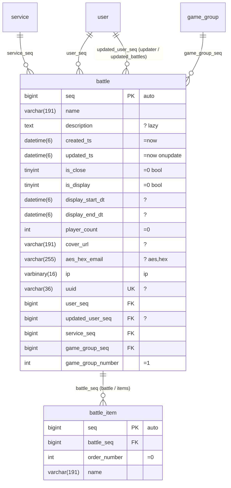

# 스키마

사람이 관리하는 스키마 파일은 `schema/*.mmd`(Mermaid `erDiagram`)다. GitHub, IDE, 빌드 산출물이 이 파일을 그림으로 렌더링하며, `ormgen`은 이 파일을 파싱해 컬럼, 키, 관계, 인덱스, 스타일을 담은 생성 **매니페스트**(`schema.json`)를 만든다. 매니페스트는 편집하지 않는다.
기존 데이터베이스가 있으면 `ormgen import --dsn … --out schema/service.mmd`가 다이어그램을 만든다. 외래 키는 관계선이 되고 인덱스는 `%%` 지시문이 된다.

## 1. 예



## 2. 규칙

### 2.1 컬럼 줄 — `type name [PK|FK|UK] ["속성"]`

컬럼 줄은 Mermaid 문법을 따르며 `PK`, `FK`, `UK`는 Mermaid 키워드다. 기본 키의 모든 컬럼에 `PK`를 표시하고, 선언 순서가 복합 키의 순서다. 기본 키는 올바른 명칭이면 무엇이든 되고 여러 컬럼으로 구성할 수 있다. `seq`는 자동 키의 명명 관례다.
데이터베이스 타입을 그대로 쓴다(`bigint`, `uuid`, `varchar(191)`, `datetime(6)`, `decimal(13_3)`, `enum(a_b)`, `jsontext`). 매니페스트는 이를 `i64`, `string`, `datetime` 같은 타입으로 정규화하며, PostgreSQL DDL은 `uuid`를 그대로 유지한다. `varchar`와 `char`는 양수 길이가 필요하다.
- `jsontext` 컬럼은 JSON을 그 텍스트 그대로 담는다. PostgreSQL은 `text`, MySQL은 `LONGTEXT`, SQLite는 TEXT다. ordered-json 코덱이 멤버 순서, 적은 그대로의 중복 키, 빈 객체와 빈 배열의 구분을 유지하므로 세 데이터베이스에서 같은 값을 반환한다. 모든 클라이언트는 컬럼의 ordered-json 값을 반환하고 그 값의 텍스트를 그대로 쓴다([값 모델](codec.ko.md#value-model)). 타입 `json`은 거부하며 `jsontext`로 적는다. `jsontext` 컬럼은 `json` 또는 `jsons` 단계만 받는다.
- 암호화한 JSON 값은 `longblob config "json aes"`처럼 `json aes` 단계를 가진 blob 컬럼이며, 엔티티에 non-null integer `aes_key_version` 컬럼이 있어야 한다. 키는 연결의 AES 키 설정에서 받는다([암호화한 JSON 값](codec.ko.md#encrypted-json-value)).
- `enum(a_b)` 컬럼은 MySQL에서 `enum('a','b')`, PostgreSQL과 SQLite에서 텍스트다. 라이브 스키마에는 값 목록이 없으므로 `ormgen diff`, `validate`, migration 검증은 PostgreSQL `enum` 컬럼과 라이브 텍스트 컬럼을 같다고 비교한다.
- 데이터베이스 안에서 조건·정렬·인덱스에 쓰는 데이터는 컬럼이나 자식 테이블로 만들며 `jsontext` 컬럼 안의 경로로 다루지 않는다. ORM에는 JSON 경로 조건과 JSON 인덱스가 없고, 네이티브 문서 타입(MySQL `JSON`, PostgreSQL `jsonb`)은 문서를 정규화하므로 저장한 텍스트를 유지하지 못한다. 질의 가능한 문서 타입은 자체 조건·인덱스 문법을 가진 별도 컬럼 타입이어야 하며 지금은 없다.

따옴표 안의 문자열은 공백으로 구분한 속성 목록이다. 속성이 없으면 NOT NULL이고 기본값과 스타일이 없다.

필수 컬럼은 NOT NULL이고 기본값이 없으며 `auto`가 아니고 ORM이 AES 값과 함께 쓰는 `aes_key_version` 컬럼이 아닌 컬럼이다. 모든 삽입(`create()`, `creates()`, `create()`와 함께 쓰는 `duplication()`, 기본 키가 없는 `save()`)은 필수 컬럼을 모두 설정한다. 설정하지 않으면 클라이언트는 문장을 실행하기 전에 `IR_INVALID: required column <entity>.<column> is not set`으로 실패하며, 네 클라이언트와 MySQL·PostgreSQL·SQLite에서 같다. 이 검사가 없으면 MySQL은 생략한 NOT NULL `enum` 컬럼에 첫 번째 값을 저장한다.

| 속성 | 의미 |
|---|---|
| `?` | null 허용 |
| `=value` | 기본값. 예: `=0`, `='ko'`, `=now`, `=null` |
| `onupdate` | 갱신할 때마다 현재 시각으로 바뀐다 |
| `auto` | 자동 키 |
| `unsigned` | 부호 없는 정수(가져오기가 기록하며 직접 작성할 때는 생략 가능) |
| `bool` | `tinyint` 컬럼을 불리언으로 노출 |
| `lazy` | 기본 컬럼 집합에서 제외하며 `addColumn<Col>()`로 선택한다. 텍스트와 blob 컬럼은 기본적으로 lazy다 |
| `aes` `hex` `gz` `json` `jsons` `base64` `serialize` `ip` `yaml` | 쓰기에는 순서대로, 읽기에는 역순으로 적용하는 코덱 단계([코덱](codec.md)). 보통 `aes_hex_`, `gz_`, `json_` 같은 명칭 접두어와 `ip` 컬럼 명칭에서 추론한다 |
| `-> table.column` | 관계선이 없을 때 외래 키 대상을 명시 |

컬럼 명칭은 [DSL](dsl.ko.md) 9절의 예약 명칭 규칙을 따른다.

### 2.2 관계선 — `parent ||--o{ child : "fk_column (child_name / parent_name)"`

| 표기 | 의미 |
|---|---|
| `\|\|--o{` (1 : 0..N) | 자식 행이 부모 행 하나를 가리키는 외래 키를 가진다 |
| `\|\|--\|\|`, `\|\|--o\|` (1 : 0..1) | 양쪽 모두 행 하나 |
| `}o--o{` (N : M) | 지원하지 않는다. 연결 테이블을 엔티티로 모델링한다 |

관계선은 외래 키를 선언한다. 생성 DDL, 가져오기, 마이그레이션 diff가 이를 사용하고, 재귀 삭제는 관계 방향을 사용한다. 조회는 `match<L>With<R>`와 `join<L>With<R>`로 키를 지정한다.

레이블은 자식의 외래 키 컬럼으로 시작한다. 복합 관계는 외래 키 컬럼을 순서대로 나열하고 양쪽 명칭을 적는다: `(tenant_id, account_id) (account / memberships)`. 외래 키 컬럼 수는 부모 기본 키 컬럼 수와 같고 위치로 대응한다. 단일 컬럼 관계에서는 `(child / parent)` 명칭을 생략할 수 있으며, 이때 자식 쪽은 컬럼에서 `_seq`나 `_id`를 뗀 명칭, 부모 쪽은 부모 테이블 접두어를 뗀 자식 테이블 명칭의 복수형을 사용한다. 명칭 충돌은 빌드 오류다.
한 컬럼이 여러 외래 키에 참여할 수 있으며 관계선마다 자기 키 쌍을 유지한다.

### 2.3 `%%` 지시문

Mermaid는 이 줄을 주석으로 처리하며 `ormgen`만 읽는다.

```text
%% unique   <table> (<col>, …)                 # 복합 고유 키. 단일 컬럼은 컬럼 줄의 UK를 사용한다
%% index    <table> (<col>, …) [name]          # 복합 인덱스 또는 외래 키가 아닌 단일 컬럼 인덱스
%% fulltext <table> (<col>, …)                 # fulltext<Col>With<Col> 조건이 사용하는 전문 검색 인덱스
%% check    <table> <name> : <expression>      # 데이터베이스 CHECK 제약. 백틱 컬럼을 검증한다
%% timestamps <table> <created> <updated>      # 시각 컬럼(기본값: created_ts, updated_ts)
%% aes_version <table> <column>                # AES 값과 함께 기록하는 null 불가 정수 키 버전
%% soft_delete <table> <column>                # null 허용 datetime. 조회는 NULL이 아닌 행을 제외한다
%% table_comment <table> "comment"
%% column_comment <table> <column> "comment"
%% rename_table <new_table> <old_table>        # 마이그레이션 이름 변경
%% rename_column <table> <new_col> <old_col>   # 마이그레이션 이름 변경
%% orm:table entity=<entity> name=<schema.table>
%% orm:foreign entity=<entity> columns=<col>[,<col>…] references=<schema.table>(<col>[,<col>…]) [name=<constraint>] [on_delete=<action>] [deferred=true]
%% orm:immutable entity=<entity>
%% orm:audit_log operation=<table>(<seq>, <uuid>) context=<setting> change=<table>(<operation_seq>, <operation>, <service>, <table_name>, <entity_key>, <old_value>, <new_value>)
%% orm:audit entity=<entity> mode=changes|operations [service=<column>] [redact=<column.path>[,<column.path>…]]
```

- `orm:table`은 스키마로 한정한 물리 테이블을 선언하는 유일한 방법이다. PostgreSQL은 스키마와 테이블을 별도 식별자로 다루고, SQLite는 `schema.table`을 생성 인덱스 명칭까지 포함해 물리 명칭 `schema__table`로 바꾸므로 같은 테이블 명칭을 가진 두 스키마가 충돌하지 않는다.
- `orm:foreign`은 매니페스트 밖의 테이블을 가리키거나 제약 옵션을 명시한 물리 외래 키를 선언한다. `deferred=true`는 PostgreSQL과 SQLite에서 지연 가능한 제약(초기 지연)을 만든다.
- MySQL에서 `orm:table`은 스키마 명칭과 같은 데이터베이스에 테이블을 둔다. DDL은 그 데이터베이스를 먼저 만든다.
- `orm:immutable`은 엔티티 테이블의 갱신, 삭제, truncate를 거부하는 데이터베이스 트리거를 만든다. MySQL에는 truncate 트리거가 없으므로 갱신과 삭제만 거부한다.
- `orm:audit_log`는 작업 테이블(순번 컬럼과 식별자 컬럼), 현재 작업 식별자를 담는 트랜잭션 설정, 변경 테이블과 그 일곱 컬럼을 표시한 순서대로 지정한다. `orm:foreign`의 대상처럼 두 테이블은 같은 연결에 설치한 다른 매니페스트에 속할 수 있으므로 명칭과 컬럼 개수만 검사하며, 감사 로그는 스키마마다 하나만 선언한다.
- `orm:audit`는 엔티티 테이블에 작업을 요구하는 트리거를 만든다. 설정이 비어 있으면 `audit operation context is required`, 그 식별자의 작업 행이 없으면 `audit operation does not exist`로 쓰기가 실패한다. `mode=changes`는 삽입·갱신·삭제된 행마다 변경 행을 하나 기록한다. 변경 행에는 작업 순번, `INSERT`/`UPDATE`/`DELETE`, `service` 컬럼 값, 테이블 명칭, JSON 객체로 된 기본 키, JSON 객체로 된 이전 행과 새 행이 들어간다. 갱신은 바뀐 컬럼만 기록하고 바뀐 것이 없으면 행을 쓰지 않는다. `redact`는 지정한 JSON 경로를 `{"redacted": true, "present": true}`로 바꾼다. 가린 컬럼은 존재해야 하고 키 컬럼일 수 없으며, 점으로 이어진 경로는 JSON을 담을 수 있는 컬럼에만 쓸 수 있다. `aes` 단계를 가진 컬럼은 평문이나 암호문이 아니라 항상 `{"redacted": true, "present": true}`로 기록한다. `service` 값은 감사 대상 컬럼의 타입을 유지하므로 변경 테이블의 service 컬럼은 텍스트나 정수일 수 있고, `service`가 없는 엔티티는 NULL을 기록한다. `mode=operations`는 아무것도 기록하지 않는다. 감사 로그 테이블은 감사 대상이 될 수 없다.
- 애플리케이션은 트랜잭션 안에서 `utils().setLocal(<setting>, id)`로 작업 식별자를 설정한다. PostgreSQL은 트랜잭션 설정을, MySQL은 `setLocal`이 설정하고 트랜잭션 끝에서 지우는 사용자 변수 `` @`orm.<setting>` ``를, SQLite는 `orm__context` 테이블을 읽는다. PostgreSQL은 truncate에도 작업을 요구한다. MySQL과 SQLite에는 truncate 트리거가 없다.
- 바이너리 로그가 켜진 MySQL(기본값)에서는 서버가 `log_bin_trust_function_creators=ON`으로 동작하거나 매니페스트를 설치하는 로그인이 `SUPER` 권한을 가질 때만 트리거를 만든다. 그렇지 않으면 설치가 MySQL 오류 1419로 실패한다.
- JSON 행 값: PostgreSQL은 `to_jsonb`를 사용한다. MySQL과 SQLite는 컬럼을 명칭 순으로 나열한다. 이진 값은 `\x`와 소문자 16진수로 기록하고, SQLite는 텍스트 컬럼의 유효한 JSON 텍스트를 JSON으로 읽으며, MySQL은 point를 WKT로 기록한다.
- 트리거에는 지시문을 담은 `-- orm:` 주석이 있으므로 `ormgen import`, `validate`, `migrate`, `db:` 소스가 현재 스키마에서 지시문을 다시 읽는다. `ormgen diff`는 바뀐 트리거를 테이블 변경 전에 지우고 변경 후에 만들며, 재생성한 SQLite 테이블의 트리거를 다시 만든다.
- 이름 변경 지시문은 마이그레이션 메타데이터다. `ormgen diff`는 비슷한 명칭에서 이름 변경을 추론하지 않으므로 이후 스키마 버전에도 지시문을 유지한다. 원본이 없거나 중복되거나 자기 자신을 가리키거나 모호하면 검증에 실패한다.
- 테이블과 컬럼 주석은 스키마 데이터다. `ormgen ddl`은 MySQL 주석, PostgreSQL `COMMENT ON` 문장, SQLite의 `orm_schema_comments` 행을 기록하고 `ormgen import`는 이를 다시 읽는다. 주석이 바뀌면 스키마 해시도 바뀐다.

### 2.4 기본 규칙

- `bigint seq PK "auto"`가 관례적인 자동 키다. 다른 키 명칭과 복합 키도 사용할 수 있다.
- `created_ts`와 `updated_ts`는 명칭만으로 시각 컬럼이 된다.
- `is_*` tinyint 컬럼은 `bool` 없이도 불리언이다.
- 텍스트, blob, 스타일 컬럼은 lazy이며 `aes_hex_*`는 예외다.
- Mermaid 타입 문자열에는 쉼표를 쓸 수 없으므로 `decimal(13_3)`, `enum(a_b_c)`처럼 쓴다. 정규화 타입과 DDL의 대응은 [dialect](dialects.md)에 있다.

### 2.5 다이어그램이 저장하는 내용

| 요소 | 위치 |
|---|---|
| 테이블, 컬럼, 타입, 키, 관계 | Mermaid 문법 |
| null 허용, 기본값, 자동 키, 갱신 시각, lazy, 스타일, 명시 대상 | 컬럼 속성 문자열 |
| 복합 키, 인덱스 순서, 전문 검색 인덱스, 시각 컬럼, 소프트 삭제, CHECK, 주석, 이름 변경 | `%%` 지시문 |
| 외래 키 삭제 동작 | 관계 레이블의 `cascade` 또는 `setnull`(기본값 RESTRICT) |
| dialect 차이 | 저장하지 않는다. `ormgen ddl --dialect mysql\|postgres\|sqlite`가 dialect별로 출력한다 |
| 파티션, 정렬 규칙과 엔진 옵션, 뷰, 함수, 시퀀스, 확장 | 지원하지 않으며 마이그레이션 SQL로 작성한다 |

## 3. 매니페스트

```json
{
  "schema_hash": "…",
  "entities": {
    "battle": {
      "table": "battle", "pk": ["seq"], "auto": "seq",
      "columns": [{"name": "seq", "type": "i64", "pk": true, "auto": true}, {"name": "description", "type": "text", "nullable": true, "lazy": true}],
      "relations": {"service": {"kind": "one", "target": "service", "keys": [{"local": "service_seq", "target": "seq"}]}},
      "unique": [["uuid"], ["game_group_seq", "game_group_number"]],
      "indexes": {"ix_service": ["service_seq", "is_close"]},
      "fulltext": [["name", "description"]],
      "timestamps": {"created": "created_ts", "updated": "updated_ts"}
    }
  }
}
```

매니페스트는 커밋하되 편집하지 않는다. `ormgen validate`는 다이어그램, 매니페스트, 실제 데이터베이스 사이의 차이를 보고한다.

### 3.1 네임스페이스 확장

파서는 `%% orm:<kind>` 줄을 `Manifest.ORM`에 보존하고 종류, 식별자, 키/값 문법, 중복을 검증한다. 라우트, 권한, 공개 키, CRUD 의미는 해석하지 않으며 상위 생성기가 그 규칙을 책임진다.

```text
%% orm:field product.company_seq relation=company fk=company.seq public=company.uuid required=true order=1
```

## 4. 명령

```sh
ormgen import   --dsn mysql://… --out schema/service.mmd        # 데이터베이스 → Mermaid
ormgen build    schema/*.mmd --out schema/schema.json            # Mermaid → 매니페스트(검증 포함)
ormgen validate --dsn … --schema schema/schema.json              # 매니페스트 ↔ 실제 데이터베이스
ormgen ddl      --schema schema/schema.json --dialect mysql --out schema.sql   # 매니페스트 → CREATE 문장
ormgen diff     --from old.json --to schema/schema.json --dialect postgres --out migration.sql
ormgen gen      --schema schema/schema.json --lang go --out model --scan ./...
```

`--check`를 붙인 `build`와 `gen`은 출력을 기존 파일과 비교해 경로마다 `differs:`, `missing:`, `extra:`를 출력하고, 아무것도 쓰지 않으며, 파일이 다르면 상태 1로 종료한다([사용법](usage.md#_3-code-generation)).

모든 `--dsn`과 `db:` source는 client DSN URI(`mysql://`, `postgres://`, `sqlite:///<절대 경로>`)이며 scheme이 데이터베이스를 정한다. `ormgen import`와 `ormgen validate`는 MySQL, PostgreSQL, SQLite를 읽는다.

`tests/schema/cases.json`은 Go 테스트의 Mermaid fixture와 bench 스키마에 대해 매니페스트, 방언별 DDL, 매니페스트 쌍별 diff, 쌍별 `ormgen plan` 파일을 기록한다(`go run ./tests/schema/record`; 파일이 낡으면 `make schema-check`가 실패한다). 모든 언어의 스키마 도구를 이 파일과 비교한다.

`ormgen gen --lang go`는 Go 모델을 생성한다. 이 생성기는 `--scan`으로 지정한 패키지를 읽고 그 패키지가 호출하는 체인 메서드를 생성한다. PHP, TypeScript, Rust는 자기 도구인 `vendor/bin/orm-gen`, `orm-gen` npm bin, `orm-build` crate로 모델을 생성한다([사용법](usage.md)).

PHP 도구는 같은 옵션과 같은 출력으로 스키마 명령을 실행한다: `vendor/bin/orm-gen build | import | validate | ddl | diff | migrate`. DSN은 `mysql://`, `postgres://`, `sqlite://` URI이며 URI가 데이터베이스를 정한다.

TypeScript 도구도 `npx orm-gen build | import | validate | ddl | diff | migrate | plan | apply | verify | recover | rollback`으로 같은 일을 한다. 옵션, 작성하는 파일, plan 파일, 마이그레이션 이력이 Go 도구와 같고, DSN은 `mysql://`, `postgres://`, `sqlite://` URI이며 URI가 데이터베이스를 정한다.

Rust 도구는 `orm-build` crate의 `orm-gen` 바이너리이며 `cli` feature로 빌드한다(`cargo install --path clients/rust/orm-build --features cli`). `orm-gen build | import | validate | ddl | diff | migrate | plan | apply | verify | recover | rollback`을 Go 도구와 같은 옵션, 작성 파일, plan 파일, 마이그레이션 이력으로 실행하며 DSN은 URI다. 라이브러리 쪽은 feature가 필요 없다: `build.rs`에서 `orm_build::schema::build_files`가 `.mmd` 파일로 매니페스트를 만들고, `orm_build::ddl`이 DDL과 마이그레이션을 렌더링한다.

## 5. 검증

`ormgen build`는 예약 컬럼 명칭, 관계 명칭 충돌, 자식 외래 키 컬럼 누락, 인덱스 컬럼 누락, 중복 고유 키, 존재하지 않는 `-> table.column` 대상에서 실패한다. 관계선이나 대상이 없는 외래 키 컬럼은 경고다.

## 6. 가져오기

`ormgen import --dsn … --out schema/app.mmd [--tables a,b]`는 데이터베이스 카탈로그를 읽어 다이어그램을 기록한다. 출력은 결정적(테이블은 알파벳 순, 컬럼은 위치 순)이므로 바뀌지 않은 데이터베이스는 diff를 만들지 않는다.

- MySQL 타입은 `COLUMN_TYPE`에서 읽는다. `unsigned`는 속성이 되고, `is_*` tinyint 컬럼은 불리언이 되며, `decimal(13,3)`은 `decimal(13_3)`, `enum('a','b')`는 `enum(a_b)`가 된다.
- 속성에는 `?`, `=value`(`CURRENT_TIMESTAMP`는 `=now`), `onupdate`, `auto`가 있다.
- 관계선은 카탈로그의 외래 키 제약을 사용한다. 제약이 없으면 `<role>_<table>_seq` 컬럼을 `<table>`에 대응시킨다.
- 인덱스는 `%% unique`, `%% fulltext`, `%% index` 지시문이 되고, 단일 컬럼 고유 키는 `UK`가 되며, 자동으로 만들어지는 단일 외래 키 인덱스는 기록하지 않는다.
- PostgreSQL(`postgres://` DSN)은 `information_schema.columns`, `pg_index`, `pg_constraint`를 읽고 타입을 정규화하며(`character varying(191)` → `varchar(191)`, `boolean` → `tinyint`, `numeric(p,s)` → `decimal(p_s)`, `timestamp(6) with time zone` → `datetime(6)`, `inet` → `varbinary(16)`, `json`과 `jsonb` → `json`), identity 컬럼을 `auto`로 바꾸고 생성된 전문 검색 인덱스를 복원한다. SQLite는 `PRAGMA table_info`, `index_list`, `foreign_key_list`를 읽는다. `INTEGER PRIMARY KEY AUTOINCREMENT` 컬럼은 `auto`가 되고, 생성된 DDL의 시각 기본값은 `=now`가 된다.
- `--out` 파일이 있으면 데이터베이스가 표현하지 못하는 내용, 즉 관계 명칭 재정의, `lazy`, `bool`, `int`, 명시 스타일을 유지한다.

## 7. 클라이언트 생성 API

`github.com/polyspec/orm/generator` 패키지는 다른 프로그램에 생성 기능을 제공한다. `generator.Generate`는 매니페스트, 언어 `Go`, 출력 디렉터리를 받는다. Go 생성은 `PackageName`(기본값은 디렉터리 명칭)과 호출을 생성할 패키지 패턴인 `Scan`도 받는다. 명칭 규칙, 필드 대응, 출력은 ORM 생성기가 책임진다.

## 8. 스키마 설치

`connection.utils().schema().install(manifestJson)`은 연결의 dialect로 매니페스트의 없는 테이블, 키, 인덱스, 주석, 트리거를 만들고, 기존 테이블은 유지하고, 매니페스트를 연결에 등록한다. PostgreSQL과 SQLite는 연결의 진행 중인 트랜잭션이나 새 트랜잭션에서 문장을 적용한다. MySQL은 스키마 문장마다 암묵적으로 커밋하므로 트랜잭션 밖에서 적용하며, 트랜잭션 안에서 호출하면 `CONFIG`를 반환한다. 입력은 매니페스트뿐이며 호출자는 SQL이나 dialect를 전달하지 않는다.
