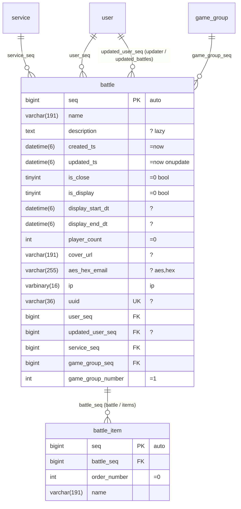

# 스키마

물리 기본·고유 키는 정확히 `id`, `name`, `tableId`, `kind`, `columns`,
`indexId`, `deferrable`, `initiallyDeferred`, `nullsDistinct`,
`withoutOverlaps`, `comment`, `options`를 가진다. ID와 nullable 이름은
물리 레코드 규칙을 따른다. kind는 primary/unique이며 columns는 선언 순서로
서로 다른 안정 컬럼 ID 1–64개를 가진다. indexId는 null(선언된 기반 인덱스
없음)이거나 안정 인덱스 ID다. 제약 이름에서 추측하지 않는다. 지연 플래그는
boolean 또는 미지정 null이며 initiallyDeferred true에는 deferrable true가
필요하다. nullsDistinct는 고유 키에서 boolean/null이며 기본 키에서는 null만
허용한다. 기본 키의 SQL NULL 동작은 고유 옵션이 아니다. withoutOverlaps는
boolean 또는 미지정 null이며 마지막 키 컬럼의 시간 중첩 배제 여부를 보존한다.
방언, 범위 타입, 기반 인덱스 의미는 후속 검증이 필요하며 구조 검증이 DB
작업을 허용하지 않는다. 주석, 순서 있는 옵션, UTF-8, 정확한 필드 형태와
전체 문자열 65536바이트 제한은 공통 레코드 규칙을 따른다. 잘못된 입력은
값 없는 SCHEMA_INVALID로 거절하고 분리되거나 깊게 불변인 값을 반환한다.
제약을 인덱스로 합치거나 빠진 상태를 추측하지 않는다. 참조 소유, 기반 인덱스
일치, 테이블당 기본 키 하나 제한은 개별 레코드가 아닌 그래프에서 검증한다.

공개 API는 Go `orm.PhysicalKeyFromValue`, PHP `Orm\PhysicalKey::fromValue`,
Rust `orm_schema::physical_key::PhysicalKey::from_value`, TypeScript 패키지
export `createPhysicalKey`다. `make physical-key-check`로 동일 사례를
클라이언트마다 두 번 실행하고 관련 레코드 회귀를 검증한다. 디코딩된 구조
레코드이며 SQL 파싱, 물리 임포트, DDL, 마이그레이션 실행은 아니다.
키와 인덱스 구분, 지연 검사, 시간 구문은 공식
[PostgreSQL CREATE TABLE](https://www.postgresql.org/docs/18/sql-createtable.html)에
설명돼 있으며 DB별 동작은 별도의 소유 DB 사례에서 검증해야 한다.

물리 인덱스 레코드는 정확히 `id`, `name`, `tableId`, `unique`, `methodSql`,
`terms`, `include`, `predicateSql`, `nullsDistinct`, `visible`, `comment`,
`options`를 가진다. ID와 nullable 이름은 기존 레코드 규칙을 따른다.
unique는 boolean이다. methodSql은 null(미지정)이거나 비어 있지 않은
최대 128 UTF-8바이트 문자열이다. predicateSql은 null(없음)이거나 최대
16384바이트 원문 SQL이다. nullsDistinct와 visible은 서로 독립적인 boolean
또는 미지정 null이다. 주석·옵션을 보존하고 기존 전체 65536바이트 제한을
적용한다. 구조 검증 통과는 방언의 옵션 지원을 의미하지 않는다.

terms는 순서 있는 1–64개 객체이며 정확히 `source`, `order`, `nulls`,
`collationSql`, `operatorClassSql`, `prefixLength`를 가진다. source는
`{kind:"column",columnId}` 또는 `{kind:"expression",sql}`다. ID는 안정 ID
규칙, 원문 식은 비어 있지 않은 최대 16384 UTF-8바이트 규칙을 따른다.
반복되는 항목을 제거하지 않는다. order는 asc/desc/unspecified, nulls는
first/last/unspecified다. nullable 원문 collation/operator-class 문자열은
비어 있지 않은 최대 1024/4096바이트이며 인용 이름과 매개변수를 유지한다.
prefixLength는 null이거나 boolean이 아닌 1–2147483647 정수 수치이며 컬럼
source에만 쓴다. include는 서로 다른 컬럼 ID 0–64개의 순서 있는 목록이며
고유성 항목을 바꾸지 않는다. 컬럼 소유와 방언별 필드 관계 제한은 스키마
구성·계획에서 검증한다. 빠진/알 수 없는 필드, 잘못된 타입·인코딩·제한 초과는
값 없는 SCHEMA_INVALID로 거절한다. 정규화 없이 값을 분리하거나 깊게 불변으로 만든다.

API는 Go `orm.PhysicalIndexFromValue`, PHP `Orm\PhysicalIndex::fromValue`,
Rust `orm_schema::physical_index::PhysicalIndex::from_value`, TypeScript 패키지
export `createPhysicalIndex`다. `make physical-index-check`로 공통 벡터를
클라이언트별 두 번 실행한다. 인덱스와 기본·고유 제약은 다르며 제약은 별도
레코드와 명시적 기반 인덱스 링크가 필요하다. 그래프 연결, SQL 파싱,
임포트, DDL, 실행은 아니다. 기능 구분은 공식
[PostgreSQL CREATE INDEX](https://www.postgresql.org/docs/18/sql-createindex.html),
[MySQL CREATE INDEX](https://dev.mysql.com/doc/refman/8.4/en/create-index.html),
[SQLite CREATE INDEX](https://www.sqlite.org/lang_createindex.html) 문서를 따른다.

물리 CHECK 레코드는 정확히 `id`, `name`, `tableId`, `expressionSql`,
`enforced`, `validated`, `comment`, `options`를 가진다. ID는 물리 레코드
규칙을 따르며 이름은 null이거나 정확한 물리 이름 규칙을 따른다. 식은
비어 있지 않은 UTF-8 문자열로 최대 16384바이트를 그대로 보존하며 파싱하거나
실행을 허용하지 않는다. 두 상태는 서로 독립적인 boolean 또는
null(미지정)이며 검증 상태가 강제를 의미하지 않는다. 주석과 순서 있는 옵션은
기존 레코드 제한과 전체 65536바이트 제한을 따른다. 알 수 없거나 빠진 필드,
잘못된 타입·인코딩·제한 초과는 값을 노출하지 않는 `SCHEMA_INVALID`로 거절한다.
호출자의 입력·출력과 레코드를 분리한다. API는 Go `orm.PhysicalCheckFromValue`,
PHP `Orm\PhysicalCheck::fromValue`, Rust
`orm_schema::physical_check::PhysicalCheck::from_value`, TypeScript 패키지
루트의 `createPhysicalCheck`다. `make physical-check-check`가 공통 벡터를
클라이언트마다 두 번 실행한다. 레코드 생성자는 그래프 소유를 검증하지 않는다.
PhysicalGraph가 선언한 CHECK의 소유와 공유 제약 이름을 검증한다. 두 생성자
모두 방언 지원, SQL 문법, 식 참조, 임포트, DDL, 마이그레이션 실행은 검증하지 않는다.

물리 이름은 논리 모델 식별자와 분리한다. 선택적 catalog/schema/column과 필수
table을 정확히 보존하고 소문자화나 점으로 분리하지 않는다. 존재하는 각
요소는 빈 값이 아닌 유효 UTF-8이며 최대 1024바이트이고 ASCII 제어문자
(U+0000–001F 또는 U+007F)를 포함하지 않는다. 위반은 값 없는 메시지의
SCHEMA_INVALID로 거절한다. 불변 이름 키는 `p1:` 뒤에 catalog/schema/table/
column 순으로 점으로 구분한 네 토큰이다. 없으면 `-`, 있으면 소문자 UTF-8
hex다. SQL 인용이나 정규화 없이 한정 요소를 구분한다. 이름을 식별하는 키이지
이름 변경에도 유지되는 문서 ID는 아니다. 아직 물리 임포트·주석·DDL·
마이그레이션 실행을 구현한 것은 아니다.

공개 API는 Go `orm.NewPhysicalIdentity`, PHP `Orm\PhysicalIdentity`, Rust
`orm_schema::physical::PhysicalIdentity::new`, TypeScript 패키지 루트의
`createPhysicalIdentity`다. 요소는 분리된 값이나 불변 참조로 반환한다.
`make physical-identity-check`는 공통 벡터 10개를 클라이언트마다 두 번
실행하고 바이트 제한/잘못된 인코딩을 검증한다.

물리 컬럼은 정확히 `id`, `name`, `typeSql`, `nullable`, `default`, `generation`,
`comment`, `options`를 가진다. ID는 `[A-Za-z0-9_-]{1,128}`, 이름은 물리 이름
요소 규칙을 따른다. 빈 값이 아닌 typeSql은 UTF-8 4096바이트, 코멘트는
8192바이트까지 원문을 보존한다. nullable은 boolean이다. 기본값은
`{kind:"absent"}`, `{kind:"null"}` 또는 빈 값이 아닌 16384바이트 이하 `sql`을
가진 literal/expression이다. 생성은 `{kind:"none"}`, `sql`을 가진 identity,
`sql`과 storage(stored/virtual/unspecified)를 가진 computed다. 생성 SQL도
16384바이트 제한이다. 순서 있는 옵션은 정확한 `{name,value}` 문자열 객체
최대 64개다. name은 빈 값이 아닌 128바이트 이하, value는 4096바이트 이하다.
모든 문자열은 NUL 없는 유효 UTF-8이며 값 문자열 총합은 65536바이트까지다.
알 수 없는 필드나 잘못된 타입은 값 없는 SCHEMA_INVALID로 거절한다. 결과는
분리된 값이나 깊은 불변 객체로 제공한다. API는 JSON 텍스트가 아닌 해석된
객체를 받으며 엄격한 텍스트 해석은 입력 생산자의 책임이다. 분류와 SQL
의미는 방언별 임포터/planner가 소유한다. 구조가 맞다고 DDL을 허용하거나
표현식·리터럴·타입의 실행 가능성을 증명하지 않는다.

컬럼 API는 Go `orm.PhysicalColumnFromValue`, PHP
`Orm\PhysicalColumn::fromValue`, Rust
`orm_schema::physical_column::PhysicalColumn::from_value`, TypeScript 패키지
export `createPhysicalColumn`이다. `make physical-column-check`가 공통 벡터
25개를 각 클라이언트에서 두 번 실행하고 전체/필드/옵션 제한·인코딩·입출력
참조 분리도 검증한다. `PHYSICAL_NODE`로 TypeScript 도구 런타임을 명시한다.

물리 FK는 정확히 `id`, `name`, `tableId`, `columns`, `target`, `onDelete`,
`onUpdate`, `match`, `deferrable`, `initiallyDeferred`, `comment`, `options`를
가진다. 안정적 ID는 컬럼 ID 규칙을 따르고 name은 이름이 없으면 null,
있으면 정확한 물리 이름이다. target은 정확히 `{tableId,columns}`다. 양쪽
컬럼 ID는 중복 없는 1–64개이며 길이가 같고 쌍 순서를 보존한다. 자기 참조와
독립 FK끼리 컬럼을 공유하는 경우도 유효하다. 동작은 noAction/restrict/cascade/
setNull/setDefault/unspecified를 구분하고 match는 simple/full/partial/unspecified다.
지연 flag는 boolean이며 미지정은 null이다. initiallyDeferred true는 deferrable
true를 요구한다. 코멘트/옵션/전체 문자열 제한은 물리 컬럼과 같다. 알 수 없는
필드·잘못된 ID·컬럼 중복·서로 다른 길이·모순된 지연은 안전하게 거절한다.
개별 객체 검증이며 그래프 소속이나 방언 지원 검증은 아니다.

FK API는 Go `orm.PhysicalForeignKeyFromValue`, PHP
`Orm\PhysicalForeignKey::fromValue`, Rust
`orm_schema::physical_foreign_key::PhysicalForeignKey::from_value`, TypeScript
패키지 export `createPhysicalForeignKey`다. 컬럼과 FK가 제한된 공통 객체 검증을
사용한다. Rust는 안전한 SCHEMA_INVALID 코드의 `physical_record::RecordError`를
반환한다. `make physical-fk-check`가 공통 FK 26개와 기존 컬럼 25개 벡터를
각 언어에서 두 번 실행한다. 64/65컬럼 제한과 독립 FK 2000개의 생성/보관도
측정한다. 연결 그래프 참조 해석·압축 임포트·메모리·표시 프레임의 증거는
아니다. PHYSICAL_RUST_TOOLCHAIN으로 Rust를 명시한다(기본 1.98.1). 사용자
전역 도구는 바꾸지 않는다.

### 주석 포함 물리 마크다운 요구사항

물리 JSON API는 아직 주석 포함 마크다운을 파싱하지 않는다. 기존 논리
Mermaid 파서는 별도 입력이며 물리 이름·네이티브 타입·식을 자신이 지원하는
논리 표현으로 정규화하면 안 된다.

이 경로를 활성화하기 전에 버전 있는 단일 문법을 정의하고 검증한다.

- 물리 이름과 SQL 원문은 정확한 JSON 문자열로 유지한다. Mermaid 컬럼
  주석은 내부 큰따옴표를 받지 않으므로 손실 없는 SQL 원문 저장소가 아니다.
  표시 이스케이프는 가역이어야 하며 실제 다이어그램 파싱으로 따옴표·역슬래시·
  Unicode·제어 문자·HTML/주석 종료·마크다운 펜스 문자열을 검증한다.
  이름을 암묵적으로 바꾸지 않는다.
- 테이블·컬럼·제약 연결은 표시 이름·결합된 한정 이름·위치 추측이 아닌
  안정된 ID를 사용한다. 복합 컬럼 쌍 순서와 공유 컬럼의 독립 제약을
  표시에서도 구분한다.
- crow-foot 표기는 표시 정보이며 FK 대상 고유성·행 존재·실행 가능한
  방언 의미의 증거가 아니다. 그림으로 더 강한 물리 제약을 추론하지 않는다.
  검증하지 않은 다중성은 사실처럼 암묵적으로 출력하지 않고 명시한다.
- 권위 있는 문서를 반환하기 전에 다이어그램과 주석을 함께 파싱한다.
  누락·추가·이름 변경·순서 변경·모순된 참조는 위치와 안전한 진단이 필요하며
  한쪽이 다른 쪽을 암묵적으로 덮어쓰지 않는다.
- 읽기·편집·출력에서 일반 마크다운과 무관한 펜스 예제를 보존한다.
  예제 내부 문자열은 활성 주석이 아니다. 중복·알 수 없는 버전 표시,
  끝나지 않은 블록·모호한 소유는 명시적으로 거절한다.
- 할당 전에 전체 UTF-8 바이트, 줄·블록·다이어그램 수와 유지할 진단 수를
  명시한다. 네 클라이언트에서 허용할 제한 값과 초과를 모두 검증한다.
  문서 제한으로 사이드카 와이어 크기를 암묵적으로 늘리지 않는다.
- 문서 출력·파싱·재출력 후 모든 물리 필드를 비교하며 주석·펜스 구분자도
  포함한다. 연결된 2000테이블·60000컬럼·10000FK 사례를 유지한다.
  소유 CPU·보존 측정과 실제 네이티브 화면 프레임·플랫폼 증거를 구분한다.

이 요구사항은 물리 문서·임포트·실행을 활성화하지 않는다.

개발 중인 공동 파서는 `erDiagram` 다음에 `%% orm:physical-json 1`,
`%% ` 접두사가 있는 단일 압축 물리 JSON 줄,
`%% orm:physical-json-end`를 사용한다. 나머지 줄은 원래 테이블·컬럼·FK
순서의 결정적 표시다. 안정된 ASCII ID는 16진수 `T_`·`C_` 별칭이 된다.
표시 문자열은 ASCII 제어 문자·따옴표·역슬래시·꺾쇠·앰퍼샌드·해시·백틱·
퍼센트·대괄호·중괄호·이스케이프 표식을 문자 그대로의 `␛XXXX`로 바꾼다.
Mermaid 엔티티 별칭은 역슬래시를 거절하므로 ASCII 역슬래시 대신
U+241B 표시 표식을 사용한다. 정확한 물리 값은 JSON에 유지한다.
각 FK는 자신의 ID와 순서 있는 컬럼 쌍 주석을 가진다. crow-foot 양 끝은
검증하지 않은 표시 규칙임을 명시하며 SQL 증거로 사용하지 않는다.
그림 불일치는 메타데이터 덮어쓰기 대신 실패한다. 아직 임포트 API를
활성화하지 않은 초안이며 네 클라이언트·소유 검증이 필요하다.

#### 물리 원문 블록

소유 내부 스캐너는 info가 정확히 `mermaid orm-physical-v1`인 최상위 펜스
블록 하나를 찾는다. 시작 줄·본문 시작·종료 줄·종료 줄 다음 바이트의
UTF-8 오프셋 네 개를 반환한다. 이 위치로 앞뒤 마크다운과 본문 원문을
줄 목록 복사 없이 보존한다. 이 단계는 본문 파싱을 활성화하지 않는다.

소유 시작 펜스는 들여쓰지 않는다. 다른 시작 펜스는 ASCII 공백 0–3개를
허용한다. 둘 다 같은 backtick 또는 tilde 세 개 이상을 사용한다.
info 앞뒤는 ASCII 공백·탭만 제거하며 backtick 펜스의 info에는
backtick이 없어야 한다. 종료 펜스는 같은 문자이고 시작보다 짧지 않으며
뒤에는 공백·탭만 허용한다. 다른 펜스 내부는 해석하지 않는다. 다른 펜스가
끝나지 않아도 소유 블록을 숨기는 대신 거절한다. 활성 info가
`mermaid orm-physical-`로 시작하지만 나머지가 다르면 거절한다.
들여쓴 코드·인용·목록 안의 펜스는 소유 블록이 아니다. 물리 문서는 최상위
블록을 사용한다. 이 스캐너는 일반 마크다운 AST나 그림 검증기가 아니다.
명시적 종료를 가진 HTML 블록은 해석하지 않는다. 원시 pre/script/style/
textarea 요소, 주석·처리 지시·선언·CDATA가 해당한다. 원시 요소 시작은
ASCII 대소문자를 구분하지 않으며 이름 뒤에 공백·탭·`>`·줄 끝이 필요하다.
네 가지 정확한 종료 태그 중 하나가 대소문자 구분 없이 블록을 종료한다.
다른 시작은 `<!--`, `<?`, ASCII 문자 뒤의 `<!`, `<![CDATA[`이며 종료는
각각 `-->`, `?>`, `>`, `]]>`다. 앞 공백은 0–3개를 허용한다. 종료 줄까지
중첩 시작·빈 줄·펜스 문자열을 무시하고 종료 줄의 나머지가 아닌 다음
줄에서 재개한다. 끝나지 않은 명시적 HTML 블록은 시작 줄에서 거절한다.
코드 펜스 안의 HTML 모양 문자열은 소유를 바꾸지 않는다. 빈 줄로 끝나는
표준 블록 태그 이름의 HTML은 종료 태그가 아닌 다음 빈 줄(ASCII 공백·탭만)
또는 EOF까지 해석하지 않는다. 시작·종료 이름 뒤에 공백·탭·`>`·`/>`·줄 끝을
허용하며 ASCII 대소문자를 구분하지 않고 앞 공백은 0–3개다. 블록 이름은
공통 HTML fixture에 나열한다. 중첩 시작은 종료 규칙을 바꾸지 않는다.
명시적인 원시 HTML은 자신의 종료 규칙을 유지한다. 이 도구는 임의의 HTML
태그나 전체 마크다운 컨테이너를 분류하지 않는다. 구현된 기능이 아니며
일반 HTML 파서 확장은 물리 문서 형식을 정의하는 선행 조건이 아니다.
임포트 활성화 전에 문서 리더가 모호하지 않은 원문 소유를 명시하고
그래프 메타데이터와 그림을 함께 검증해야 한다.

BOM 없는 유효한 UTF-8, LF 또는 CRLF(단독 CR 제외), 최대 64 MiB,
200000줄(LF 개수+1이며 마지막 빈 줄 포함), 시작 펜스 4096개를 허용한다.
소유 블록은 정확히 하나다. 실패는 값을 포함하지 않는 SCHEMA_INVALID
진단 하나이며 인코딩·자원·블록 누락은 0번 줄, 알 수 없는 info·중복·
미완성은 1부터 시작하는 줄 위치를 사용한다. 본문·줄 목록 할당 전에
소스·줄·블록 제한을 검사한다. JSON·사이드카 크기 제한은 바꾸지 않는다.
네 소유 테스트가 `make physical-envelope-check`로 같은 fixture를 실행한다.

텍스트 교환은 UTF-8 JSON 객체 하나를 읽고 검증된 그래프를 compact JSON
객체로 출력한다. 일반 디코딩 전에 모든 깊이의 디코딩된 중복 멤버 이름,
잘못된 문법·Unicode(짝 없는 이스케이프 surrogate 포함), 뒤따르는 입력과
BOM을 거절한다. UTF-8 입력·출력은 32 MiB, 컨테이너 깊이는 16, 값 노드는
3000000개로 제한한다. 숫자 토큰은 ASCII 64바이트 이하이며 정확한 안전
정수여야 한다. 정수 값인 소수·지수 표기는 반올림 없이 받는다. 모든 그래프
필드와 배열 순서를 보존하지만 공백·멤버 순서·숫자 표기는 보존하지 않는다.
텍스트 문법·자원 오류는 SCHEMA_INVALID와 빈 그래프 포인터로 표시하고
유효한 JSON의 구조 오류는 기존 그래프 위치를 사용한다. 텍스트 직렬화·
디코딩은 마크다운·임포트·실행 권한을 주지 않는다.

텍스트 API는 Go `orm.PhysicalGraphFromJSON([]byte)` / `graph.JSON()`, PHP
`Orm\PhysicalGraph::fromJson(string)` / `graph->toJson()`, Rust
`PhysicalGraph::from_json(&[u8])` / `graph.to_json()`, TypeScript
`parsePhysicalGraphJSON(string)` / `emitPhysicalGraphJSON(graph)`이다.
바이트·문자열 런타임은 잘못된 UTF-8을 거절한다. TypeScript는 잘못된
UTF-16 문자열과 문자열 아닌 입력을 거절하며 바이트 배열을 암묵적으로
받지 않는다. `make physical-json-check PHYSICAL_NODE=/absolute/path/to/node`가
클라이언트별 공통 문법·값 사례 30개, 숫자 표기 6개, 전체 레코드 왕복,
네이티브 인코딩을 두 번 검사하고 공통 출력 크기 사례 2개도 확인한다.
소유 디코더는 바이트·깊이·노드 제한을
각각 허용하고 다음 값을 거절하므로 그래프 구조 오류로 자원 검사를
대체할 수 없다. 연결된 부하 그래프도 출력·파싱·재출력으로 모든 필드를
비교하고 JSON 바이트 수·시간을 기록한다. PHP는 직접 트리를 구성하고
짧은 문자열·작은 스칼라 객체의 FIFO 캐시를 각각 256개로 제한한다.
copy-on-write가 공유된 불변 데이터를 수정 후에도 분리한다. 기존 128M
제한에서 실제 PHP 최대 할당량을 기록하며 프로세스 RSS가 아니다.
이 검사는 네이티브 화면 프레임이나 실행하지 않은 플랫폼의 증거가 아니다.

물리 그래프는 정확히 `version`(숫자 값 1이며 boolean 아님), `dialect`
(mysql/postgres/sqlite), 빈 값이 아닌 128바이트 이하 UTF-8 `dialectVersion`,
`tables`, `foreignKeys`, `indices`, `keys`, `checks`를 가진다. 모든 배열이
필수이며 이전 노드/FK 전용 형태에 빠진 배열을 자동으로 채우지 않고 거절한다.
테이블은 정확히 `id`, `identity`(물리 이름
네 요소이며 column은 null), 순서 있는 `columns`, `comment`, `options`다.
메타데이터는 객체 제한을 따르고 테이블당 컬럼 1–4096개·테이블 최대 4096개·
전체 컬럼 120000개·FK 20000개·전체 값 문자열 16MiB를 제한한다. 추가 레코드
목록은 각각 최대 20000개이며 네 레코드 목록 합계는 최대 60000개다.
합계 초과는 최상위 오류다. 빈 그래프는 유효하고 null 리스트는 아니다.
테이블/컬럼/FK/인덱스/키/CHECK ID는 전역에서 고유하다.
정확한 한정 테이블 이름·각 테이블의 컬럼 이름·원본 테이블의 이름 있는 FK도
고유하다. 테이블/컬럼 소유자 맵을 한 번 구성한 뒤 FK 쌍을 해석한다. 각 컬럼은
선언한 테이블에 속해야 한다. 순서·순환·자기 참조·컬럼을 공유하는 독립 제약을
유지한다. 오류는 SCHEMA_INVALID와 고정 필드/숫자 위치의 JSON pointer이며
입력 이름/SQL은 노출하지 않는다. 하위 검증 오류는 해당 객체, 소속/중복 오류는
해당 필드의 위치를 반환한다. 결과는 분리된 값 또는 깊은 불변 객체다. 물리 노드와
FK·인덱스·키·CHECK 연결을 표현하지만 전체 SQL 객체 지원·방언 검증·실행
권한은 아니다. 방언 버전은 보존할 뿐 추론하거나 검증하지 않는다.

검증 순서는 최상위 제한, 테이블/컬럼, FK, 인덱스, 키, CHECK다. FK·키·CHECK
이름은 테이블별 정확한 제약 이름 공간을 공유한다. 인덱스 이름은 별도
테이블별 공간이며 키와 기반 인덱스가 같은 이름일 수 있다. 각 tableId와
컬럼/포함 ID는 소유 테이블에 해석한다. 식 참조는 SQL 파싱이 필요하고
문자열에서 추측하지 않는다. 테이블당 기본 키는 하나다. 선언한 기반 인덱스는
같은 테이블에 속하며 키와 정확히 같은 컬럼 source 순서를 가지고 부분 조건이
없어야 한다. 기반 인덱스는 최대 한 키에 연결된다. 일반 키는 고유 인덱스가
필요하고 시간 중첩 키는 배제 인덱스 메타데이터를 보존할 뿐 SQL·범위 타입
유효성을 주장하지 않는다. 고유 NULL 처리가 키·인덱스 양쪽에 명시되면
같아야 한다. 불일치는 키의 indexId 위치다. 미지정 값을 추측하지 않고 유지한다.
새 목록 형태 오류는 레코드, 중복/소유 오류는 해당 필드 위치를 반환한다.

공개 진입점은 Go `orm.PhysicalGraphFromValue`(디코딩된 JSON 값이며 버전은
네이티브 int 1도 허용), PHP `Orm\PhysicalGraph::fromValue`, Rust
`orm_schema::physical_graph::PhysicalGraph::from_value`, TypeScript
`createPhysicalGraph`다. Go/PHP는 Value()/value()로 분리된 스냅샷을 반환하고
Rust는 불변 Value 참조, TypeScript는 깊게 동결한 결과를 제공한다. 위치 오류는
Go/PHP/TypeScript의 PhysicalGraphError와 Rust의 GraphError다. 최상위 형태
오류는 빈 JSON pointer다.

`make physical-graph-check PHYSICAL_NODE=/absolute/path/to/node`는 공통 그래프
기존 28개·기존 개수/바이트 제한 5개·추가 레코드 그래프 35개·중복 3개·목록
개수 3개·합계 개수 1개·독립적으로 계산한 새 목록 바이트 제한 3개를 실행한다.
연결된 테이블 2000개/컬럼 60000개/FK 10000개에 인덱스·키·CHECK를 각각
2000개 유지한다. 이 사례들과 모든 레코드 회귀를 각 언어에서 두 번 실행한다.
소유 테스트가 시간과 그래프 테스트
15초 제한을 보고한다. 생성과 검증 시간을 분리하고 Rust는 debug 빌드다. PHP는
프로세스 최대 할당 바이트와 바꾸지 않은 메모리 제한을 보고하며 상주 메모리나
다른 런타임의 메모리 측정은 아니다. 구조적 그래프 테스트이며 SQL 방언 검증·
DB·실제 화면 프레임의 증거가 아니다.


사람이 관리하는 스키마 파일은 `schema/*.mmd`(Mermaid `erDiagram`)다. GitHub, IDE, 빌드 산출물이 이 파일을 그림으로 렌더링하며, `ormgen`은 이 파일을 파싱해 컬럼, 키, 관계, 인덱스, 스타일을 담은 생성 **매니페스트**(`schema.json`)를 만든다. 매니페스트는 편집하지 않는다.
기존 데이터베이스가 있으면 `ormgen import --dsn … --out schema/service.mmd`가 다이어그램을 만든다. 외래 키는 관계선이 되고 인덱스는 `%%` 지시문이 된다.

## 1. 예


```mermaid
erDiagram
  battle {
    bigint       seq                 PK  "auto"
    varchar(191) name
    text         description             "? lazy"
    datetime(6)  created_ts              "=now"
    datetime(6)  updated_ts              "=now onupdate"
    tinyint      is_close                "=0 bool"
    tinyint      is_display              "=0 bool"
    datetime(6)  display_start_dt        "?"
    datetime(6)  display_end_dt          "?"
    int          player_count            "=0"
    varchar(191) cover_url               "?"
    varchar(255) aes_hex_email           "? aes,hex"
    varbinary(16) ip                     "ip"
    varchar(36)  uuid                UK  "?"
    bigint       user_seq            FK
    bigint       updated_user_seq    FK  "?"
    bigint       service_seq         FK
    bigint       game_group_seq      FK
    int          game_group_number       "=1"
  }
  battle_item {
    bigint  seq          PK "auto"
    bigint  battle_seq   FK
    int     order_number    "=0"
    varchar(191) name
  }

  service       ||--o{ battle        : service_seq
  user          ||--o{ battle        : user_seq
  user          ||--o{ battle        : "updated_user_seq (updater / updated_battles)"
  game_group    ||--o{ battle        : game_group_seq
  battle        ||--o{ battle_item   : "battle_seq (battle / items)"

  %% unique   battle (game_group_seq, game_group_number)
  %% index    battle (service_seq, is_close)              ix_service
  %% fulltext battle (name, description)
```

## 2. 규칙

### 2.1 컬럼 줄 — `type name [PK|FK|UK] ["속성"]`

컬럼 줄은 Mermaid 문법을 따르며 `PK`, `FK`, `UK`는 Mermaid 키워드다. 기본 키의 모든 컬럼에 `PK`를 표시하고, 선언 순서가 복합 키의 순서다. 기본 키는 올바른 명칭이면 무엇이든 되고 여러 컬럼으로 구성할 수 있다. `seq`는 자동 키의 명명 관례다.
데이터베이스 타입을 그대로 쓴다(`bigint`, `uuid`, `varchar(191)`, `datetime(6)`, `decimal(13_3)`, `enum(a_b)`, `jsontext`). 매니페스트는 이를 `i64`, `string`, `datetime` 같은 타입으로 정규화하며, PostgreSQL DDL은 `uuid`를 그대로 유지한다. `varchar`와 `char`는 양수 길이가 필요하다.
- `jsontext` 컬럼은 JSON을 그 텍스트 그대로 담는다. PostgreSQL은 `text`, MySQL은 `LONGTEXT`, SQLite는 TEXT다. ordered-json 코덱이 멤버 순서, 적은 그대로의 중복 키, 빈 객체와 빈 배열의 구분을 유지하므로 세 데이터베이스에서 같은 값을 반환한다. 모든 클라이언트는 컬럼의 ordered-json 값을 반환하고 그 값의 텍스트를 그대로 쓴다([값 모델](codec.ko.md#value-model)). 타입 `json`은 거부하며 `jsontext`로 적는다. `jsontext` 컬럼은 `json` 또는 `jsons` 단계만 받는다.
- 암호화한 JSON 값은 `longblob config "json aes"`처럼 `json aes` 단계를 가진 blob 컬럼이며, 엔티티에 non-null integer `aes_key_version` 컬럼이 있어야 한다. 키는 연결의 AES 키 설정에서 받는다([암호화한 JSON 값](codec.ko.md#encrypted-json-value)).
- `enum(a_b)` 컬럼은 MySQL에서 `enum('a','b')`, PostgreSQL과 SQLite에서 텍스트다. 라이브 스키마에는 값 목록이 없으므로 `ormgen diff`, `validate`, migration 검증은 PostgreSQL `enum` 컬럼과 라이브 텍스트 컬럼을 같다고 비교한다.
- 데이터베이스 안에서 조건·정렬·인덱스에 쓰는 데이터는 컬럼이나 자식 테이블로 만들며 `jsontext` 컬럼 안의 경로로 다루지 않는다. ORM에는 JSON 경로 조건과 JSON 인덱스가 없고, 네이티브 문서 타입(MySQL `JSON`, PostgreSQL `jsonb`)은 문서를 정규화하므로 저장한 텍스트를 유지하지 못한다. 질의 가능한 문서 타입은 자체 조건·인덱스 문법을 가진 별도 컬럼 타입이어야 하며 지금은 없다.

따옴표 안의 문자열은 공백으로 구분한 속성 목록이다. 속성이 없으면 NOT NULL이고 기본값과 스타일이 없다.

필수 컬럼은 NOT NULL이고 기본값이 없으며 `auto`가 아니고 ORM이 AES 값과 함께 쓰는 `aes_key_version` 컬럼이 아닌 컬럼이다. 모든 삽입(`create()`, `creates()`, `create()`와 함께 쓰는 `duplication()`, 기본 키가 없는 `save()`)은 필수 컬럼을 모두 설정한다. 설정하지 않으면 클라이언트는 문장을 실행하기 전에 `IR_INVALID: required column <entity>.<column> is not set`으로 실패하며, 네 클라이언트와 MySQL·PostgreSQL·SQLite에서 같다. 이 검사가 없으면 MySQL은 생략한 NOT NULL `enum` 컬럼에 첫 번째 값을 저장한다.

| 속성 | 의미 |
|---|---|
| `?` | null 허용 |
| `=value` | 기본값. 예: `=0`, `='ko'`, `=now`, `=null` |
| `onupdate` | 갱신할 때마다 현재 시각으로 바뀐다 |
| `auto` | 자동 키. 컬럼은 NULL을 허용하지 않는 부호 있는 기본 키이며 타입이 `i64`로 정규화되어야 한다. 그렇지 않으면 스키마 빌드가 해당 컬럼의 원천 행에서 실패한다. |
| `unsigned` | 부호 없는 정수(가져오기가 기록하며 직접 작성할 때는 생략 가능) |
| `bool` | `tinyint` 컬럼을 불리언으로 노출 |
| `lazy` | 기본 컬럼 집합에서 제외하며 `addColumn<Col>()`로 선택한다. 텍스트와 blob 컬럼은 기본적으로 lazy다 |
| `aes` `hex` `gz` `json` `jsons` `base64` `serialize` `ip` `yaml` | 쓰기에는 순서대로, 읽기에는 역순으로 적용하는 코덱 단계([코덱](codec.md)). 보통 `aes_hex_`, `gz_`, `json_` 같은 명칭 접두어와 `ip` 컬럼 명칭에서 추론한다 |
| `-> table.column` | 관계선이 없을 때 외래 키 대상을 명시 |

컬럼 명칭은 [DSL](dsl.ko.md) 9절의 예약 명칭 규칙을 따른다.

### 2.2 관계선 — `parent ||--o{ child : "fk_column (child_name / parent_name)"`

| 표기 | 의미 |
|---|---|
| `\|\|--o{` (1 : 0..N) | 자식 행이 부모 행 하나를 가리키는 외래 키를 가진다 |
| `\|\|--\|\|`, `\|\|--o\|` (1 : 0..1) | 양쪽 모두 행 하나 |
| `}o--o{` (N : M) | 지원하지 않는다. 연결 테이블을 엔티티로 모델링한다 |

관계선은 외래 키를 선언한다. 생성 DDL, 가져오기, 마이그레이션 diff가 이를 사용하고, 재귀 삭제는 관계 방향을 사용한다. 조회는 `match<L>With<R>`와 `join<L>With<R>`로 키를 지정한다.

레이블은 자식의 외래 키 컬럼으로 시작한다. 복합 관계는 외래 키 컬럼을 순서대로 나열하고 양쪽 명칭을 적는다: `(tenant_id, account_id) (account / memberships)`. 외래 키 컬럼 수는 부모 기본 키 컬럼 수와 같고 위치로 대응한다. 단일 컬럼 관계에서는 `(child / parent)` 명칭을 생략할 수 있으며, 이때 자식 쪽은 컬럼에서 `_seq`나 `_id`를 뗀 명칭, 부모 쪽은 부모 테이블 접두어를 뗀 자식 테이블 명칭의 복수형을 사용한다. 명칭 충돌은 빌드 오류다.
한 컬럼이 여러 외래 키에 참여할 수 있으며 관계선마다 자기 키 쌍을 유지한다.

### 2.3 `%%` 지시문

Mermaid는 이 줄을 주석으로 처리하며 `ormgen`만 읽는다.

```text
%% unique   <table> (<col>, …)                 # 복합 고유 키. 단일 컬럼은 컬럼 줄의 UK를 사용한다
%% index    <table> (<col>, …) [name]          # 복합 인덱스 또는 외래 키가 아닌 단일 컬럼 인덱스
%% fulltext <table> (<col>, …)                 # fulltext<Col>With<Col> 조건이 사용하는 전문 검색 인덱스
%% check    <table> <name> : <expression>      # 데이터베이스 CHECK 제약. 백틱 컬럼을 검증한다
%% timestamps <table> <created> <updated>      # 시각 컬럼(기본값: created_ts, updated_ts)
%% aes_version <table> <column>                # AES 값과 함께 기록하는 null 불가 정수 키 버전
%% soft_delete <table> <column>                # null 허용 datetime. 조회는 NULL이 아닌 행을 제외한다
%% table_comment <table> "comment"
%% column_comment <table> <column> "comment"
%% rename_table <new_table> <old_table>        # 마이그레이션 이름 변경
%% rename_column <table> <new_col> <old_col>   # 마이그레이션 이름 변경
%% orm:table entity=<entity> name=<schema.table>
%% orm:foreign entity=<entity> columns=<col>[,<col>…] references=<schema.table>(<col>[,<col>…]) [name=<constraint>] [on_delete=<action>] [deferred=true]
%% orm:immutable entity=<entity>
%% orm:audit_log operation=<table>(<seq>, <uuid>) context=<setting> change=<table>(<operation_seq>, <operation>, <service>, <table_name>, <entity_key>, <old_value>, <new_value>)
%% orm:audit entity=<entity> mode=changes|operations [service=<column>] [redact=<column.path>[,<column.path>…]]
```

- `orm:table`은 스키마로 한정한 물리 테이블을 선언하는 유일한 방법이다. PostgreSQL은 스키마와 테이블을 별도 식별자로 다루고, SQLite는 `schema.table`을 생성 인덱스 명칭까지 포함해 물리 명칭 `schema__table`로 바꾸므로 같은 테이블 명칭을 가진 두 스키마가 충돌하지 않는다.
- `orm:foreign`은 매니페스트 밖의 테이블을 가리키거나 제약 옵션을 명시한 물리 외래 키를 선언한다. `deferred=true`는 PostgreSQL과 SQLite에서 지연 가능한 제약(초기 지연)을 만든다.
- MySQL에서 `orm:table`은 스키마 명칭과 같은 데이터베이스에 테이블을 둔다. DDL은 그 데이터베이스를 먼저 만든다.
- `orm:immutable`은 엔티티 테이블의 갱신, 삭제, truncate를 거부하는 데이터베이스 트리거를 만든다. MySQL에는 truncate 트리거가 없으므로 갱신과 삭제만 거부한다.
- `orm:audit_log`는 작업 테이블(순번 컬럼과 식별자 컬럼), 현재 작업 식별자를 담는 트랜잭션 설정, 변경 테이블과 그 일곱 컬럼을 표시한 순서대로 지정한다. `orm:foreign`의 대상처럼 두 테이블은 같은 연결에 설치한 다른 매니페스트에 속할 수 있으므로 명칭과 컬럼 개수만 검사하며, 감사 로그는 스키마마다 하나만 선언한다.
- `orm:audit`는 엔티티 테이블에 작업을 요구하는 트리거를 만든다. 설정이 비어 있으면 `audit operation context is required`, 그 식별자의 작업 행이 없으면 `audit operation does not exist`로 쓰기가 실패한다. `mode=changes`는 삽입·갱신·삭제된 행마다 변경 행을 하나 기록한다. 변경 행에는 작업 순번, `INSERT`/`UPDATE`/`DELETE`, `service` 컬럼 값, 테이블 명칭, JSON 객체로 된 기본 키, JSON 객체로 된 이전 행과 새 행이 들어간다. 갱신은 바뀐 컬럼만 기록하고 바뀐 것이 없으면 행을 쓰지 않는다. `redact`는 지정한 JSON 경로를 `{"redacted": true, "present": true}`로 바꾼다. 가린 컬럼은 존재해야 하고 키 컬럼일 수 없으며, 점으로 이어진 경로는 JSON을 담을 수 있는 컬럼에만 쓸 수 있다. `aes` 단계를 가진 컬럼은 평문이나 암호문이 아니라 항상 `{"redacted": true, "present": true}`로 기록한다. `service` 값은 감사 대상 컬럼의 타입을 유지하므로 변경 테이블의 service 컬럼은 텍스트나 정수일 수 있고, `service`가 없는 엔티티는 NULL을 기록한다. `mode=operations`는 아무것도 기록하지 않는다. 감사 로그 테이블은 감사 대상이 될 수 없다.
- 애플리케이션은 트랜잭션 안에서 `utils().setLocal(<setting>, id)`로 작업 식별자를 설정한다. PostgreSQL은 트랜잭션 설정을, MySQL은 `setLocal`이 설정하고 트랜잭션 끝에서 지우는 사용자 변수 `` @`orm.<setting>` ``를, SQLite는 `orm__context` 테이블을 읽는다. PostgreSQL은 truncate에도 작업을 요구한다. MySQL과 SQLite에는 truncate 트리거가 없다.
- 바이너리 로그가 켜진 MySQL(기본값)에서는 서버가 `log_bin_trust_function_creators=ON`으로 동작하거나 매니페스트를 설치하는 로그인이 `SUPER` 권한을 가질 때만 트리거를 만든다. 그렇지 않으면 설치가 MySQL 오류 1419로 실패한다.
- JSON 행 값: PostgreSQL은 `to_jsonb`를 사용한다. MySQL과 SQLite는 컬럼을 명칭 순으로 나열한다. 이진 값은 `\x`와 소문자 16진수로 기록하고, SQLite는 텍스트 컬럼의 유효한 JSON 텍스트를 JSON으로 읽으며, MySQL은 point를 WKT로 기록한다.
- 트리거에는 지시문을 담은 `-- orm:` 주석이 있으므로 `ormgen import`, `validate`, `migrate`, `db:` 소스가 현재 스키마에서 지시문을 다시 읽는다. `ormgen diff`는 바뀐 트리거를 테이블 변경 전에 지우고 변경 후에 만들며, 재생성한 SQLite 테이블의 트리거를 다시 만든다.
- 이름 변경 지시문은 마이그레이션 메타데이터다. `ormgen diff`는 비슷한 명칭에서 이름 변경을 추론하지 않으므로 이후 스키마 버전에도 지시문을 유지한다. 원본이 없거나 중복되거나 자기 자신을 가리키거나 모호하면 검증에 실패한다.
- 테이블과 컬럼 주석은 스키마 데이터다. `ormgen ddl`은 MySQL 주석, PostgreSQL `COMMENT ON` 문장, SQLite의 `orm_schema_comments` 행을 기록하고 `ormgen import`는 이를 다시 읽는다. 주석이 바뀌면 스키마 해시도 바뀐다.

### 2.4 기본 규칙

- `bigint seq PK "auto"`가 관례적인 자동 키다. 다른 키 명칭과 복합 키도 사용할 수 있다.
- `created_ts`와 `updated_ts`는 명칭만으로 시각 컬럼이 된다.
- `is_*` tinyint 컬럼은 `bool` 없이도 불리언이다.
- 텍스트, blob, 스타일 컬럼은 lazy이며 `aes_hex_*`는 예외다.
- Mermaid 타입 문자열에는 쉼표를 쓸 수 없으므로 `decimal(13_3)`, `enum(a_b_c)`처럼 쓴다. 정규화 타입과 DDL의 대응은 [dialect](dialects.md)에 있다.

### 2.5 다이어그램이 저장하는 내용

| 요소 | 위치 |
|---|---|
| 테이블, 컬럼, 타입, 키, 관계 | Mermaid 문법 |
| null 허용, 기본값, 자동 키, 갱신 시각, lazy, 스타일, 명시 대상 | 컬럼 속성 문자열 |
| 복합 키, 인덱스 순서, 전문 검색 인덱스, 시각 컬럼, 소프트 삭제, CHECK, 주석, 이름 변경 | `%%` 지시문 |
| 외래 키 삭제 동작 | 관계 레이블의 `cascade` 또는 `setnull`(기본값 RESTRICT) |
| dialect 차이 | 저장하지 않는다. `ormgen ddl --dialect mysql\|postgres\|sqlite`가 dialect별로 출력한다 |
| 파티션, 정렬 규칙과 엔진 옵션, 뷰, 함수, 시퀀스, 확장 | 지원하지 않으며 마이그레이션 SQL로 작성한다 |

## 3. 매니페스트

```json
{
  "schema_hash": "…",
  "entities": {
    "battle": {
      "table": "battle", "pk": ["seq"], "auto": "seq",
      "columns": [{"name": "seq", "type": "i64", "pk": true, "auto": true}, {"name": "description", "type": "text", "nullable": true, "lazy": true}],
      "relations": {"service": {"kind": "one", "target": "service", "keys": [{"local": "service_seq", "target": "seq"}]}},
      "unique": [["uuid"], ["game_group_seq", "game_group_number"]],
      "indexes": {"ix_service": ["service_seq", "is_close"]},
      "fulltext": [["name", "description"]],
      "timestamps": {"created": "created_ts", "updated": "updated_ts"}
    }
  }
}
```

매니페스트는 커밋하되 편집하지 않는다. `ormgen validate`는 다이어그램, 매니페스트, 실제 데이터베이스 사이의 차이를 보고한다.

### 3.1 네임스페이스 확장

파서는 `%% orm:<kind>` 줄을 `Manifest.ORM`에 보존하고 종류, 식별자, 키/값 문법, 중복을 검증한다. 라우트, 권한, 공개 키, CRUD 의미는 해석하지 않으며 상위 생성기가 그 규칙을 책임진다.

```text
%% orm:field product.company_seq relation=company fk=company.seq public=company.uuid required=true order=1
```

## 4. 명령

```sh
ormgen import   --dsn mysql://… --out schema/service.mmd        # 데이터베이스 → Mermaid
ormgen build    schema/*.mmd --out schema/schema.json            # Mermaid → 매니페스트(검증 포함)
ormgen validate --dsn … --schema schema/schema.json              # 매니페스트 ↔ 실제 데이터베이스
ormgen ddl      --schema schema/schema.json --dialect mysql --out schema.sql   # 매니페스트 → CREATE 문장
ormgen diff     --from old.json --to schema/schema.json --dialect postgres --out migration.sql
ormgen gen      --schema schema/schema.json --lang go --out model --scan ./...
```

`--check`를 붙인 `build`와 `gen`은 출력을 기존 파일과 비교해 경로마다 `differs:`, `missing:`, `extra:`를 출력하고, 아무것도 쓰지 않으며, 파일이 다르면 상태 1로 종료한다([사용법](usage.md#_3-code-generation)).

모든 `--dsn`과 `db:` source는 client DSN URI(`mysql://`, `postgres://`, `sqlite:///<절대 경로>`)이며 scheme이 데이터베이스를 정한다. `ormgen import`와 `ormgen validate`는 MySQL, PostgreSQL, SQLite를 읽는다.

`tests/schema/cases.json`은 Go 테스트의 Mermaid fixture와 bench 스키마에 대해 매니페스트, 방언별 DDL, 매니페스트 쌍별 diff, 쌍별 `ormgen plan` 파일을 기록한다(`go run ./tests/schema/record`; 파일이 낡으면 `make schema-check`가 실패한다). 모든 언어의 스키마 도구를 이 파일과 비교한다.

`ormgen gen --lang go`는 Go 모델을 생성한다. 이 생성기는 `--scan`으로 지정한 패키지를 읽고 그 패키지가 호출하는 체인 메서드를 생성한다. PHP, TypeScript, Rust는 자기 도구인 `vendor/bin/orm-gen`, `orm-gen` npm bin, `orm-build` crate로 모델을 생성한다([사용법](usage.md)).

PHP 도구는 같은 옵션과 같은 출력으로 스키마 명령을 실행한다: `vendor/bin/orm-gen build | import | validate | ddl | diff | migrate`. DSN은 `mysql://`, `postgres://`, `sqlite://` URI이며 URI가 데이터베이스를 정한다.

TypeScript 도구도 `npx orm-gen build | import | validate | ddl | diff | migrate | plan | apply | verify | recover | rollback`으로 같은 일을 한다. 옵션, 작성하는 파일, plan 파일, 마이그레이션 이력이 Go 도구와 같고, DSN은 `mysql://`, `postgres://`, `sqlite://` URI이며 URI가 데이터베이스를 정한다.

Rust 도구는 `orm-build` crate의 `orm-gen` 바이너리이며 `cli` feature로 빌드한다(`cargo install --path clients/rust/orm-build --features cli`). `orm-gen build | import | validate | ddl | diff | migrate | plan | apply | verify | recover | rollback`을 Go 도구와 같은 옵션, 작성 파일, plan 파일, 마이그레이션 이력으로 실행하며 DSN은 URI다. 라이브러리 쪽은 feature가 필요 없다: `build.rs`에서 `orm_build::schema::build_files`가 `.mmd` 파일로 매니페스트를 만들고, `orm_build::ddl`이 DDL과 마이그레이션을 렌더링한다.

## 5. 검증

`ormgen build`는 예약 컬럼 명칭, 관계 명칭 충돌, 자식 외래 키 컬럼 누락, 인덱스 컬럼 누락, 중복 고유 키, 존재하지 않는 `-> table.column` 대상에서 실패한다. 관계선이나 대상이 없는 외래 키 컬럼은 경고다.

## 6. 가져오기

`ormgen import --dsn … --out schema/app.mmd [--tables a,b]`는 데이터베이스 카탈로그를 읽어 다이어그램을 기록한다. 출력은 결정적(테이블은 알파벳 순, 컬럼은 위치 순)이므로 바뀌지 않은 데이터베이스는 diff를 만들지 않는다.

- MySQL 타입은 `COLUMN_TYPE`에서 읽는다. `unsigned`는 속성이 되고, `is_*` tinyint 컬럼은 불리언이 되며, `decimal(13,3)`은 `decimal(13_3)`, `enum('a','b')`는 `enum(a_b)`가 된다.
- 속성에는 `?`, `=value`(`CURRENT_TIMESTAMP`는 `=now`), `onupdate`, `auto`가 있다.
- 관계선은 카탈로그의 외래 키 제약을 사용한다. 제약이 없으면 `<role>_<table>_seq` 컬럼을 `<table>`에 대응시킨다.
- 인덱스는 `%% unique`, `%% fulltext`, `%% index` 지시문이 되고, 단일 컬럼 고유 키는 `UK`가 되며, 자동으로 만들어지는 단일 외래 키 인덱스는 기록하지 않는다.
- PostgreSQL(`postgres://` DSN)은 `information_schema.columns`, `pg_index`, `pg_constraint`를 읽고 타입을 정규화하며(`character varying(191)` → `varchar(191)`, `boolean` → `tinyint`, `numeric(p,s)` → `decimal(p_s)`, `timestamp(6) with time zone` → `datetime(6)`, `inet` → `varbinary(16)`, `json`과 `jsonb` → `json`), identity 컬럼을 `auto`로 바꾸고 생성된 전문 검색 인덱스를 복원한다. SQLite는 `PRAGMA table_info`, `index_list`, `foreign_key_list`를 읽는다. `INTEGER PRIMARY KEY AUTOINCREMENT` 컬럼은 `auto`가 되고, 생성된 DDL의 시각 기본값은 `=now`가 된다.
- SQLite는 자동 rowid 컬럼을 `INTEGER`로 보고하지만 그 값은 부호 있는 64비트 정수다. 실제 스키마 가져오기는 해당 컬럼을 `bigint PK "auto"`로 기록하여 부호 있는 `i64` 키로 빌드하고, 다른 SQLite `INTEGER` 컬럼은 `int`로 유지한다.
- `--out` 파일이 있으면 데이터베이스가 표현하지 못하는 내용, 즉 관계 명칭 재정의, `lazy`, `bool`, `int`, 명시 스타일을 유지한다.

## 7. 클라이언트 생성 API

### Rust 카탈로그 연결

도구 셀 디코딩은 실제 SQL NULL과 지원되는 정수·텍스트·boolean을 보존하되 미지원 타입·잘못된 UTF-8·signed 64비트 범위를 넘는 unsigned 정수를 거부한다. SQL NULL·대체 문자열·순환한 정수로 대체하지 않는다. 이 검증이 카탈로그 도구를 범용 쿼리 결과 디코더로 만드는 것은 아니다.

도구 `Val::int()`, `opt_int()`, `bool()`은 검증된 결과를 반환한다. 필수 정수·boolean 변환은 SQL NULL을 거부하며 선택적 정수는 NULL을 `None`으로 보존한다. Boolean은 실제 boolean, 정수 0/1, 문자열 `t`, `f`, `true`, `false`, `1`, `0`만 허용하며 잘못된 값을 기본값으로 바꾸지 않는다. 오류는 입력값을 포함하지 않으며 트랜잭션 정리를 포함한 카탈로그·마이그레이션 작업에 전달된다.

`live-db` 기능은 `orm_build::catalog::CatalogConnection::connect(dsn)`을 노출한다. 별도 driver 인자 없이 DSN이 DB를 선택한다. `dialect()`, `tables(only)`, `manifest()`는 CLI 소유 카탈로그 읽기와 논리 변환을 재사용한다. 카탈로그 연결은 마이그레이션 재구축 설정을 적용하지 않고 SQLite 외래키 설정을 보존한다.

SQLite 카탈로그 연결은 기존 일반 DB 파일을 요구하고 파일 자동 생성을 끈다. `close(self)`는 예약 연결을 해제한 뒤 풀을 닫는다. 소유 사례 4개로 잘못된 DSN·없는 SQLite 파일 거부·SQLite FK/내용 보존·MySQL/PostgreSQL 반복 카탈로그 조회를 검증했으며 이는 무손실 물리 임포트의 근거가 아니다.

이 추출은 무손실 물리 임포트를 주장하지 않는다. 기존 읽기는 PostgreSQL의 현재 스키마로 제한되며 모든 표현식 인덱스나 물리 옵션을 보존하지 않는다. 임의 SQL/데이터 접근을 활성화하기 전에 네이티브 디코딩 한계를 소유 코드에서 수정해야 한다.

`github.com/polyspec/orm/generator` 패키지는 다른 프로그램에 생성 기능을 제공한다. `generator.Generate`는 매니페스트, 언어 `Go`, 출력 디렉터리를 받는다. Go 생성은 `PackageName`(기본값은 디렉터리 명칭)과 호출을 생성할 패키지 패턴인 `Scan`도 받는다. 명칭 규칙, 필드 대응, 출력은 ORM 생성기가 책임진다.

## 8. 스키마 설치

`connection.utils().schema().install(manifestJson)`은 연결의 dialect로 매니페스트의 없는 테이블, 키, 인덱스, 주석, 트리거를 만들고, 기존 테이블은 유지하고, 매니페스트를 연결에 등록한다. PostgreSQL과 SQLite는 연결의 진행 중인 트랜잭션이나 새 트랜잭션에서 문장을 적용한다. MySQL은 스키마 문장마다 암묵적으로 커밋하므로 트랜잭션 밖에서 적용하며, 트랜잭션 안에서 호출하면 `CONFIG`를 반환한다. 입력은 매니페스트뿐이며 호출자는 SQL이나 dialect를 전달하지 않는다.
