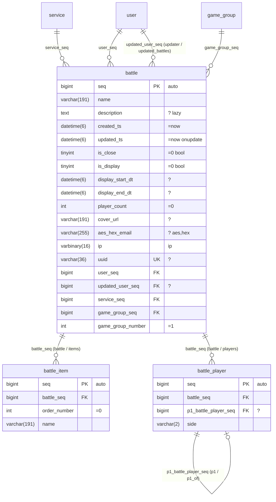

# schema.md — One Mermaid erDiagram is the schema source

The only human-maintained files are `schema/*.mmd` (Mermaid `erDiagram`). GitHub, IDEs, and build artifacts render them as diagrams,
and `ormgen` parses them into a **manifest (`schema.json`, a generated file)** containing relations, kinds, indexes, and styles. Do not edit the manifest.
For an existing database, `ormgen import --dsn … --out schema/service.mmd` creates this file (FKs become relation lines and indexes become `%%` directives).

## 1. Example



## 2. Rules

### 2.1 Column lines — `type name [PK|FK|UK] ["comment"]`
This follows Mermaid syntax. `PK`, `FK`, and `UK` are Mermaid keywords. Mark every primary-key column with `PK`; declaration order defines composite-key order. Composite unique keys use `%% unique` below.
Generated composite-key types and complete-key finders preserve this order. An insert into an entity without an automatic key requires every primary-key value and reads the inserted row with all key predicates. `save` rejects a partial primary key before execution.
Use the database type directly (`bigint`, `varchar(191)`, `datetime(6)`, `decimal(13_3)`, `enum('a','b')`). The manifest normalizes it to types such as i64, string, and datetime.
`varchar` and `char` require a positive length. Schema build rejects a missing, zero, or invalid length before DDL generation.

The comment string is a space-separated **attribute list**. With no comment, the column is NOT NULL, has no default, and is ordinary.
| Attribute | Meaning |
|---|---|
| `?` | Nullable |
| `=value` | DEFAULT, such as `=0`, `='ko'`, `=now` (CURRENT_TIMESTAMP), or `=null` |
| `onupdate` | ON UPDATE CURRENT_TIMESTAMP (for `updated_ts`) |
| `auto` | AUTO_INCREMENT |
| `unsigned` | UNSIGNED (added by import; optional when written manually) |
| `bool` | Expose tinyint as bool |
| `lazy` | Exclude from the default SELECT; opt in with `selectX()`. Text/blob types are lazy by default |
| `aes` `hex` `gz` `json` `jsons` `base64` `serialize` `ip` | dataStyle pipeline (write in order, read in reverse). Usually inferred from prefixes such as `aes_hex_*`, `gz_*`, `json_*`, and the column name `ip` |
| `-> table.column` | Explicit FK target when no relation line exists; unnecessary with a relation line |
| Other `%…%` | Documentation text; words that are not attributes are treated as descriptions |

### 2.2 Relation lines — `parent ||--o{ child : "fk_column (child_name / parent_name)"`
| Notation | Kind | Generated tokens |
|---|---|---|
| `\|\|--o{` (1 : 0..N) | Child→parent **one**, parent→child **many** | Child: `relation<Parent>` / `join<Parent>`; parent: `relations<Children>` / `join<Children>` |
| `\|\|--\|\|`, `\|\|--o\|` (1 : 0..1) | **one** on both sides | `relation…` on both sides |
| `}o--o{` (N : M) | Unsupported directly; model a join table as an entity (`a_match_b`) |

Label: a single-column relation starts with the child FK column. A composite relation starts with the ordered child FK list, such as `(tenant_id, account_id)`, and must include explicit names: `(tenant_id, account_id) (account / memberships)`. The FK count must equal the parent primary-key count; each FK maps to the parent key at the same position. `(child / parent)` overrides relation names and is optional only for a single-column relation.
Default names: child side removes `_seq` from the FK (`service_seq`→`service`, `updated_user_seq`→`updated_user`); parent side removes the parent-table prefix from the child table and pluralizes (`battle_item`→`items`, `product_review`→`reviews`, or `battles` without a prefix).
When the same parent is referenced twice (`user_seq`, `updated_user_seq`), draw two relation lines. `ormgen` reports name collisions as errors.

### 2.3 `%%` directives (Mermaid ignores them as comments; only ormgen reads them)
```
%% unique   <table> (<col>, …)              # 복합 UNIQUE. 단일 컬럼은 컬럼 줄의 UK로
%% index    <table> (<col>, …)  [이름]      # 복합 인덱스. 단일 컬럼 인덱스는 FK면 자동, 아니면 여기
%% fulltext <table> (<col>, …)              # FULLTEXT → `<a>With<b>Match…()` 생성
%% check    <table> <name> : <expression>   # database CHECK constraint; backtick columns are validated
%% timestamps <table> created_ts updated_ts # 자동 타임스탬프 컬럼 지정(기본: 이름이 created_ts/updated_ts면 자동)
%% predicate <table> <name> : <expr 조각>   # 재사용 술어 → `<name>(args…)` 메서드. 백틱 컬럼은 검증, `?`마다 인자 하나
%% scope <table> <column>                 # query API와 IR에 독립된 tenant scope 생성
%% soft_delete <table> <column>            # nullable datetime; reads exclude non-NULL rows and delete writes the current timestamp
%% many_to_many <source> <target> <source_relation> <target_relation> through <through_entity>
%% table_comment <table> "database table comment"
%% column_comment <table> <column> "database column comment"
%% rename_table <new_table> <old_table>      # migration rename
%% rename_column <table> <new_col> <old_col> # migration rename
```

Rename directives are migration metadata. `ormgen diff` never infers a rename from similar names. A target directive generates the forward `RENAME`; the same structured plan generates the reverse `RENAME` for rollback. Keep the directive in later schema versions. If the current table or column name already exists, a repeated diff is a no-op. Missing, duplicate, self-referencing, and ambiguous rename sources fail during schema validation or diff generation.

Table and column comments are schema data. `ormgen ddl` emits MySQL comments,
PostgreSQL `COMMENT ON` statements, and SQLite rows in `orm_schema_comments`.
`ormgen import` reads the same database metadata and writes these directives.
Changing a comment changes the schema hash and produces an idempotent migration.

`many_to_many` declares both typed relation names in one directive. The through entity must have one column referencing every source primary-key component and one column referencing every target primary-key component. These FK columns must form the through entity's primary key. Relation loading uses the target table with a through-table subquery and preserves the declared key order.

### 2.4 Optional declarations (default rules)
- A PK named `seq` with `auto` can be written as `bigint seq PK "auto"`.
- `created_ts` and `updated_ts` are timestamp columns by name.
- `is_*` tinyint columns are exposed as bool without `bool`; use `int` to disable this import default.
- Text, blob, and styled columns are lazy by default; `aes_hex_*` is the exception.
- `-> table.seq` is unnecessary when an FK is `<table>_seq` and has a relation line.

### 2.5 Data outside standard Mermaid and its location (CREATE replacement scope)
| CREATE element | Location |
|---|---|
| Tables, columns, types, PK/FK/UK, relations, cardinality | Standard Mermaid |
| NULL/NOT NULL, DEFAULT, AUTO_INCREMENT, ON UPDATE, lazy, styles, FK target | Column comment string (rendered as text) |
| Composite UNIQUE, INDEX order, FULLTEXT, timestamps, reusable predicates, soft delete | `%%` directives (ignored by renderers) |
| FK actions | `cascade`/`setnull` relation-label attributes (RESTRICT by default) |
| Three database dialect differences | Not stored in the file; fixed type vocabulary and `ormgen ddl --dialect mysql\|postgres\|sqlite` generate dialect-specific CREATE statements |
| CHECK, partitions, collation/engine options, views, triggers, functions, sequences, extensions | Unsupported by the ORM; write them in migration SQL |

Commas are invalid in Mermaid type strings; use `_` such as `decimal(13_3)` and `enum(a_b_c)`; ormgen interprets them. Dialect mapping from normalized types to DDL is in `docs/dialects.md` (S6).

## 3. Manifest (generated `schema.json`)
```json
{
  "schema_hash": "…",
  "entities": {
    "battle": {
      "table": "battle", "pk": ["seq"], "auto": "seq",
      "columns": {"seq": {"type": "i64", "unsigned": true}, "description": {"type": "text", "nullable": true, "lazy": true},
                  "is_close": {"type": "bool", "default": 0}, "aes_hex_email": {"type": "string", "nullable": true, "style": ["aes","hex"]}, "…": {}},
      "relations": {"service": {"kind": "one", "target": "service", "left": "service_seq", "right": "seq"},
                    "items":   {"kind": "many", "target": "battle_item", "left": "seq", "right": "battle_seq"}, "…": {}},
      "unique": [["uuid"], ["game_group_seq", "game_group_number"]],
      "indexes": {"ik": ["service_seq", "is_close"]},
      "fulltext": [["name", "description"]],
      "timestamps": {"created": "created_ts", "updated": "updated_ts"}
    }
  }
}
```
Commit this file but do not edit the generated manifest. `ormgen validate` reports mismatches among `.mmd`, `schema.json`, and the live database.

## 3.1 Namespaced ORM extensions

The parser preserves `%% orm:<kind>` lines in `Manifest.ORM`. The core validates the directive kind, identifier syntax, key/value syntax, duplicate options, and duplicate declarations. It does not validate route, permission, public-key, or CRUD meaning. A higher-level generator owns those checks.

```text
%% orm:field product.company_seq relation=scope fk=company.seq public=company.uuid required=true order=1
```

## 4. Commands
```
ormgen import   --dsn mysql://… --schema service --out schema/service.mmd   # DB → Mermaid (멱등: 라벨의 이름 재정의·주석 속성 보존)
ormgen build    schema/*.mmd --out schema/schema.json                       # Mermaid → 매니페스트 (검증 포함)
ormgen validate --dsn …                                                      # 매니페스트 ↔ 라이브 DB
ormgen ddl      --dialect mysql|postgres|sqlite [--tables …]                # 매니페스트 → CREATE문
ormgen gen      --lang php|go|rust|typescript                                           # 매니페스트 → 클라이언트
ormgen check    --lang php                                                   # 소스 코드 ↔ 매니페스트 (레거시 이름·expr 컬럼)
```

## 5. Validation errors (build failure)
Validation covers column naming (`_and_`, `_or_`, `_with_`, operator suffixes such as `_eq` and `_gt`, keywords, and `__`), relation collisions and reserved words, missing child FK columns, missing `%% index` columns, duplicate composite and column UKs, missing `-> table.column` targets, and FK columns without a relation line or `->` target (warning).

## 4. Import (`ormgen import --dsn … [--driver mysql|postgres] --out schema/app.mmd [--tables a,b]`)
The importer reads MySQL `information_schema` and writes the diagram. It is deterministic (alphabetical tables and ordinal columns), so an unchanged database produces zero diff on repeat.
- Types use `COLUMN_TYPE`; `unsigned` is an attribute, `is_*` tinyint omits bool, `decimal(13,3)` becomes `decimal(13_3)`, and `enum('a','b')` becomes `enum(a_b)`.
- Attributes include `?` (NULL), `=value` (`CURRENT_TIMESTAMP*` becomes `=now`), `onupdate`, and `auto`.
- Relation lines infer the parent from `<role>_<table>_seq` even without an FK constraint, removing leading words until the table matches (`updated_user_seq`→`user`).
- Indexes use `%% unique` for composite unique, `%% fulltext` for fulltext, `%% index … name` for composite or non-FK single indexes, `UK` on a column for single-column unique, and omit single FK indexes because they are automatic.
- MySQL and PostgreSQL read actual foreign-key targets, ordered columns, and delete rules from their catalogs. SQLite reads `PRAGMA foreign_key_list`. Single and composite foreign keys become relation lines; composite labels use the ordered parenthesized FK list. `cascade` and `setnull` are preserved, and an omitted action uses `RESTRICT`.
- PostgreSQL (`--driver postgres`, or a `postgres://` DSN) reads `information_schema.columns`, `pg_index`, and `pg_constraint` and writes the same diagram. It normalizes types (`character varying(191)`→`varchar(191)`, `boolean`→`tinyint`, `numeric(p,s)`→`decimal(p,s)`, `timestamp(6)`→`datetime(6)`, `inet`→`varbinary(16)`, `jsonb`→`json`), maps identity/`nextval` to `auto`, and reconstructs generated GIN full-text indexes from `pg_get_indexdef`.
- When `--out` already exists, the importer preserves details unavailable from the database: relation-label overrides `(child / parent)`, `lazy`/`bool`/`int` and explicit column styles, and `%% predicate` lines. The database is authoritative for everything else.
