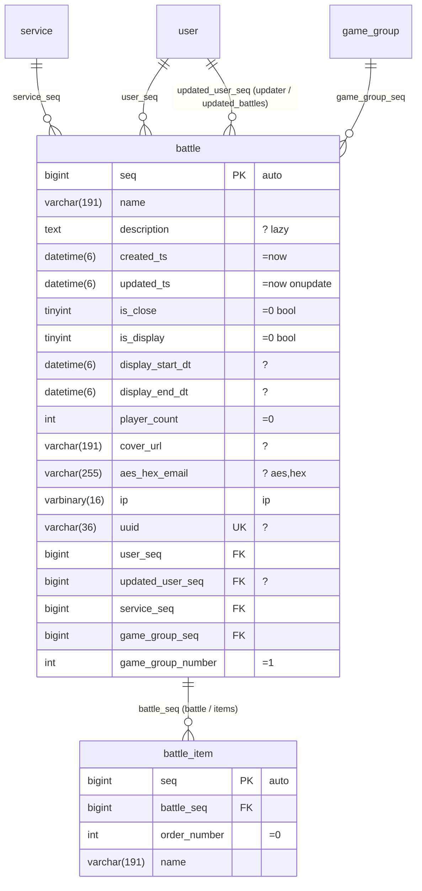

# Schema

The human-maintained schema files are `schema/*.mmd` (Mermaid `erDiagram`). GitHub, IDEs, and build artifacts render them as diagrams, and `ormgen` parses them into a generated **manifest** (`schema.json`) with columns, keys, relations, indexes, and styles. Do not edit the manifest.
For an existing database, `ormgen import --dsn … --out schema/service.mmd` creates the diagram; foreign keys become relation lines and indexes become `%%` directives.

## 1. Example



## 2. Rules

### 2.1 Column lines — `type name [PK|FK|UK] ["attributes"]`

Column lines follow Mermaid syntax; `PK`, `FK`, and `UK` are Mermaid keywords. Mark every primary-key column with `PK`; the declaration order is the composite-key order. A primary key may use any valid name and may contain several columns; `seq` is a naming convention for automatic keys.
Write the database type directly (`bigint`, `uuid`, `varchar(191)`, `datetime(6)`, `decimal(13_3)`, `enum(a_b)`, `jsontext`). The manifest normalizes it to types such as `i64`, `string`, and `datetime`; PostgreSQL DDL keeps a native `uuid`. `varchar` and `char` require a positive length.
- A `jsontext` column holds JSON as its exact text: `text` on PostgreSQL, `LONGTEXT` on MySQL, and TEXT on SQLite. The ordered-json codec keeps the member order, the duplicate keys as written, and an empty object apart from an empty array, so the value reads back identically on the three databases. The type `json` is rejected; write `jsontext`. A `jsontext` column takes only the `json` or `jsons` stage.
- An encrypted JSON value is a blob column with the stages `json aes`, such as `longblob config "json aes"`, in an entity with a non-null integer `aes_key_version` column. The connection's AES key configuration supplies the keys ([encrypted JSON value](codec.md#encrypted-json-value)).
- Data that is filtered, sorted, or indexed inside the database is modeled as columns or a child table, never as a path into a `jsontext` column: the ORM has no JSON path conditions and no JSON indexes, and the native document types (MySQL `JSON`, PostgreSQL `jsonb`) normalize the document, so they cannot keep the stored text. A queryable document type would be a separate column type with its own condition and index syntax; it does not exist.

The quoted string is a space-separated attribute list. Without it the column is NOT NULL, has no default, and has no style.

| Attribute | Meaning |
|---|---|
| `?` | nullable |
| `=value` | default, such as `=0`, `='ko'`, `=now`, or `=null` |
| `onupdate` | updated to the current time on every update |
| `auto` | automatic key |
| `unsigned` | unsigned integer (written by import; optional by hand) |
| `bool` | expose a `tinyint` column as a boolean |
| `lazy` | excluded from the default column set; select it with `addColumn<Col>()`. Text and blob columns are lazy by default |
| `aes` `hex` `gz` `json` `jsons` `base64` `serialize` `ip` `yaml` | codec stages, applied in order on write and in reverse on read ([codecs](codec.md)); usually inferred from name prefixes such as `aes_hex_`, `gz_`, `json_`, and the column name `ip` |
| `-> table.column` | explicit foreign-key target when no relation line exists |

Column names follow the reserved-name rules of the [DSL](dsl.md#_9-reserved-names).

### 2.2 Relation lines — `parent ||--o{ child : "fk_column (child_name / parent_name)"`

| Notation | Meaning |
|---|---|
| `\|\|--o{` (1 : 0..N) | the child row has a foreign key to one parent row |
| `\|\|--\|\|`, `\|\|--o\|` (1 : 0..1) | one row on each side |
| `}o--o{` (N : M) | not supported; model the join table as an entity |

Relation lines declare foreign keys: generated DDL, import, and migration diff use them, and recursive delete uses their direction. Queries name their keys with `match<L>With<R>` and `join<L>With<R>`.

The label starts with the child foreign-key column. A composite relation lists the ordered foreign-key columns and names both sides: `(tenant_id, account_id) (account / memberships)`. The number of foreign-key columns equals the number of parent primary-key columns, matched by position. `(child / parent)` names are optional for a single-column relation; without them the child side removes `_seq` or `_id` from the column and the parent side pluralizes the child table name without the parent-table prefix. Name collisions are build errors.
A column may take part in more than one foreign key; every relation line keeps its own key pairs.

### 2.3 `%%` directives

Mermaid treats these lines as comments; only `ormgen` reads them.

```text
%% unique   <table> (<col>, …)                 # composite unique key; a single column uses UK on its line
%% index    <table> (<col>, …) [name]          # composite index or single-column index on a non-FK column
%% fulltext <table> (<col>, …)                 # full-text index used by fulltext<Col>With<Col> conditions
%% check    <table> <name> : <expression>      # database CHECK constraint; backtick columns are validated
%% timestamps <table> <created> <updated>      # timestamp columns (default: created_ts and updated_ts)
%% aes_version <table> <column>                # non-null integer key version written with AES values
%% soft_delete <table> <column>                # nullable datetime; reads exclude non-NULL rows
%% table_comment <table> "comment"
%% column_comment <table> <column> "comment"
%% rename_table <new_table> <old_table>        # migration rename
%% rename_column <table> <new_col> <old_col>   # migration rename
%% orm:table entity=<entity> name=<schema.table>
%% orm:foreign entity=<entity> columns=<col>[,<col>…] references=<schema.table>(<col>[,<col>…]) [name=<constraint>] [on_delete=<action>] [deferred=true]
%% orm:immutable entity=<entity>
%% orm:audit_log operation=<table>(<seq>, <uuid>) context=<setting> change=<table>(<operation_seq>, <operation>, <service>, <table_name>, <entity_key>, <old_value>, <new_value>)
%% orm:audit entity=<entity> mode=changes|operations [service=<column>] [redact=<column.path>[,<column.path>…]]
```

- `orm:table` is the only declaration of a qualified physical table. PostgreSQL treats the schema and the table as separate identifiers; SQLite maps `schema.table` to the physical name `schema__table`, including generated index names, so two schemas with the same table name do not collide.
- `orm:foreign` declares a physical foreign key to a table outside the manifest or with explicit constraint options. `deferred=true` creates a deferrable, initially deferred constraint on PostgreSQL and SQLite.
- `orm:table` on MySQL places the table in the database named by the schema; DDL creates that database first.
- `orm:immutable` creates database triggers that reject updates, deletes, and truncation of the entity's table. MySQL has no truncate trigger, so its guard rejects updates and deletes only.
- `orm:audit_log` names the operation table (its sequence and id columns), the transaction setting that carries the current operation id, and the change table with its seven columns in the order shown. Like the target of `orm:foreign`, the two tables may belong to another manifest installed on the same connection, so only their names and column counts are checked; a schema declares at most one audit log.
- `orm:audit` creates triggers on the entity's table that require an operation: a write fails with `audit operation context is required` when the setting is empty and `audit operation does not exist` when no operation row has that id. `mode=changes` also writes one change row per inserted, updated, or deleted row: the operation sequence, `INSERT`/`UPDATE`/`DELETE`, the `service` column value, the table name, the primary key as a JSON object, and the old and new row as JSON objects. An update records only the changed columns and writes no row when nothing changed. `redact` replaces each named JSON path with `{"redacted": true, "present": true}`; a redacted column must exist, must not be a key column, and and a dotted path requires a column that can hold JSON. A column with the `aes` stage is always recorded as `{"redacted": true, "present": true}`, never as its plaintext or ciphertext. `mode=operations` records nothing. The audit log tables cannot be audited.
- The application sets the operation id with `utils().setLocal(<setting>, id)` inside the transaction. PostgreSQL reads the transaction setting, MySQL the user variable `` @`orm.<setting>` `` that `setLocal` sets and clears at the end of the transaction, and SQLite the `orm__context` table. On PostgreSQL a truncate also requires an operation; MySQL and SQLite have no truncate trigger.
- JSON row values: PostgreSQL uses `to_jsonb`. MySQL and SQLite list the columns by name; binary values are written as `\x` and lowercase hex, SQLite reads valid JSON text in text columns as JSON, and MySQL writes points as WKT.
- The triggers carry a `-- orm:` comment with their directive, so `ormgen import`, `validate`, `migrate`, and `db:` sources read the directives back from the current schema. `ormgen diff` drops a changed trigger before the table changes and creates it after them, and creates the triggers of a rebuilt SQLite table again.
- Rename directives are migration metadata. `ormgen diff` never infers a rename from similar names; keep the directive in later schema versions. Missing, duplicate, self-referencing, and ambiguous rename sources fail validation.
- Table and column comments are schema data. `ormgen ddl` writes MySQL comments, PostgreSQL `COMMENT ON` statements, and SQLite rows in `orm_schema_comments`; `ormgen import` reads them back. A changed comment changes the schema hash.

### 2.4 Defaults

- `bigint seq PK "auto"` is the conventional automatic key. Other key names and composite keys are valid.
- `created_ts` and `updated_ts` are timestamp columns by name.
- `is_*` tinyint columns are booleans without `bool`.
- Text, blob, and styled columns are lazy, except `aes_hex_*`.
- Commas are invalid in Mermaid type strings; write `decimal(13_3)` and `enum(a_b_c)`. [Dialects](dialects.md) maps the normalized types to DDL.

### 2.5 What the diagram stores

| Element | Location |
|---|---|
| tables, columns, types, keys, relations | Mermaid syntax |
| nullability, defaults, automatic keys, update time, lazy, styles, explicit targets | column attribute string |
| composite keys, index order, full-text indexes, timestamps, soft delete, checks, comments, renames | `%%` directives |
| foreign-key delete actions | `cascade` or `setnull` in the relation label (RESTRICT by default) |
| dialect differences | not stored; `ormgen ddl --dialect mysql\|postgres\|sqlite` renders each dialect |
| partitions, collation and engine options, views, functions, sequences, extensions | not supported; write them in migration SQL |

## 3. Manifest

```json
{
  "schema_hash": "…",
  "entities": {
    "battle": {
      "table": "battle", "pk": ["seq"], "auto": "seq",
      "columns": [{"name": "seq", "type": "i64", "pk": true, "auto": true}, {"name": "description", "type": "text", "nullable": true, "lazy": true}],
      "relations": {"service": {"kind": "one", "target": "service", "keys": [{"local": "service_seq", "target": "seq"}]}},
      "unique": [["uuid"], ["game_group_seq", "game_group_number"]],
      "indexes": {"ix_service": ["service_seq", "is_close"]},
      "fulltext": [["name", "description"]],
      "timestamps": {"created": "created_ts", "updated": "updated_ts"}
    }
  }
}
```

Commit the manifest and do not edit it. `ormgen validate` reports differences among the diagrams, the manifest, and a live database.

### 3.1 Namespaced extensions

The parser keeps `%% orm:<kind>` lines in `Manifest.ORM` and validates the kind, identifiers, key/value syntax, and duplicates. It does not interpret routes, permissions, public keys, or CRUD meaning; a higher-level generator owns those rules.

```text
%% orm:field product.company_seq relation=company fk=company.seq public=company.uuid required=true order=1
```

## 4. Commands

```sh
ormgen import   --dsn mysql://… --out schema/service.mmd        # database → Mermaid
ormgen build    schema/*.mmd --out schema/schema.json            # Mermaid → manifest, with validation
ormgen validate --dsn … --schema schema/schema.json              # manifest ↔ live database
ormgen ddl      --schema schema/schema.json --dialect mysql --out schema.sql   # manifest → CREATE statements
ormgen diff     --from old.json --to schema/schema.json --dialect postgres --out migration.sql
ormgen gen      --schema schema/schema.json --lang go --out model --scan ./...
```

Every `--dsn` and `db:` source is the client DSN URI (`mysql://`, `postgres://`, or `sqlite:///<absolute path>`), and the scheme selects the database. `ormgen import` and `ormgen validate` read MySQL, PostgreSQL, and SQLite.

`tests/schema/cases.json` records the manifest, the DDL of each dialect, the diff of each manifest pair, and the `ormgen plan` file of each pair for the Mermaid fixtures of the Go tests and the bench schema (`go run ./tests/schema/record`; `make schema-check` fails when it is stale). The schema tools of every language are compared with this file.

`ormgen gen --lang go` writes the Go models; it reads the packages named by `--scan` and generates the chain methods they call. PHP, TypeScript, and Rust generate their models with their own tools: `vendor/bin/orm-gen`, the `orm-gen` npm bin, and the `orm-build` crate ([usage](usage.md)).

The PHP tool runs the schema commands with the same flags and output: `vendor/bin/orm-gen build | import | validate | ddl | diff | migrate`. Its DSN is a `mysql://`, `postgres://`, or `sqlite://` URI, which selects the database.

The TypeScript tool does the same with `npx orm-gen build | import | validate | ddl | diff | migrate | plan | apply | verify | recover | rollback`: the flags, the written files, the plan files, and the migration history match the Go tool, and the DSN is a `mysql://`, `postgres://`, or `sqlite://` URI, which selects the database.

The Rust tool is the `orm-gen` binary of the `orm-build` crate, built with its `cli` feature (`cargo install --path clients/rust/orm-build --features cli`). It runs `orm-gen build | import | validate | ddl | diff | migrate | plan | apply | verify | recover | rollback` with the flags, written files, plan files, and migration history of the Go tool; the DSN is a URI. The library side needs no feature: `orm_build::schema::build_files` builds the manifest from `.mmd` files in `build.rs`, and `orm_build::ddl` renders DDL and migrations.

## 5. Validation

`ormgen build` fails on reserved column names, relation name collisions, missing child foreign-key columns, missing index columns, duplicate unique keys, and missing `-> table.column` targets. A foreign-key column without a relation line or target is a warning.

## 6. Import

`ormgen import --dsn … --out schema/app.mmd [--tables a,b]` reads the database catalog and writes the diagram. The output is deterministic (tables alphabetically, columns by position), so an unchanged database produces no diff.

- MySQL types come from `COLUMN_TYPE`: `unsigned` becomes an attribute, `is_*` tinyint columns become booleans, `decimal(13,3)` becomes `decimal(13_3)`, and `enum('a','b')` becomes `enum(a_b)`.
- Attributes include `?`, `=value` (`CURRENT_TIMESTAMP` becomes `=now`), `onupdate`, and `auto`.
- Relation lines use the foreign-key constraints of the catalog; without a constraint, a column named `<role>_<table>_seq` is matched to `<table>`.
- Indexes become `%% unique`, `%% fulltext`, and `%% index` directives, `UK` for single-column unique keys, and nothing for single foreign-key indexes, which are automatic.
- PostgreSQL (`postgres://` DSN) reads `information_schema.columns`, `pg_index`, and `pg_constraint`, normalizes types (`character varying(191)` → `varchar(191)`, `boolean` → `tinyint`, `numeric(p,s)` → `decimal(p_s)`, `timestamp(6) with time zone` → `datetime(6)`, `inet` → `varbinary(16)`, `json` and `jsonb` → `json`), maps identity columns to `auto`, and reconstructs generated full-text indexes. SQLite reads `PRAGMA table_info`, `index_list`, and `foreign_key_list`; an `INTEGER PRIMARY KEY AUTOINCREMENT` column becomes `auto`, and the clock default of the generated DDL becomes `=now`.
- When `--out` exists, the importer keeps what the database cannot express: relation name overrides, `lazy`, `bool`, `int`, and explicit styles.

## 7. Client generation API

The `github.com/polyspec/orm/generator` package exposes generation to other programs. `generator.Generate` takes a manifest, the language `Go`, and an output directory. Go generation also takes `PackageName` (the directory name by default) and `Scan`, the package patterns whose calls are generated. Naming, field mapping, and output stay in the ORM generator.

## 8. Schema installation

`connection.utils().schema().install(manifestJson)` creates the missing tables, keys, indexes, comments, and triggers of the manifest on the connection's dialect, keeps existing tables, and registers the manifest with the connection. PostgreSQL and SQLite apply the statements in the active transaction of the connection or in a new one. MySQL commits each schema statement implicitly, so it applies them outside a transaction, and a call inside a transaction returns `CONFIG`. The manifest is the only input; callers do not pass SQL or select a dialect.
