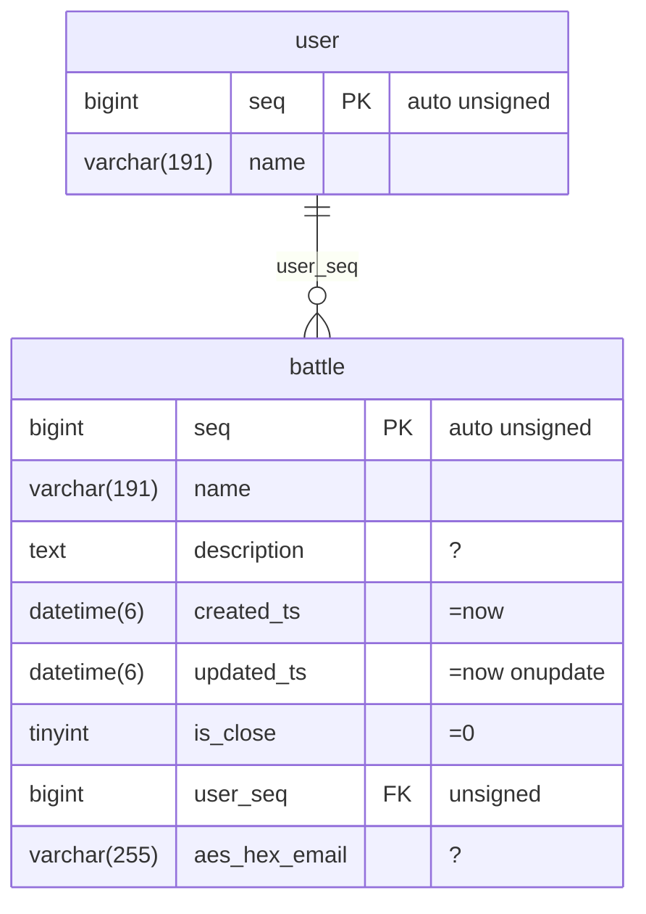

# 사용법

스키마 한 벌(Mermaid)에서 Go·PHP·Rust 클라이언트를 생성하고, 같은 문장을 세 언어에서 같은 SQL로 실행한다.
대상 DB는 MySQL 8(기본), PostgreSQL 12+, SQLite 3.35+.

문법의 전체 목록은 [dsl.md](dsl.md), 다이어그램 문법은 [schema.md](schema.md), IR/Plan 명세은 [protocol.md](protocol.md),
방언 차이는 [dialects.md](dialects.md), 설정은 [config.md](config.md), 에러 코드는 [errors.yaml](errors.yaml)에 있다.

---

## 1. 준비

| 필요한 것 | 비고 |
|---|---|
| Go 1.27+ | 엔진·생성기·Go 클라이언트 |
| MySQL 8.0.2+ / MariaDB 10.2+ | 1차 대상. PostgreSQL 12+, SQLite 3.35+도 같은 플랜으로 동작 |
| PHP 8.4+ (`pdo_mysql`, `apcu`) | PHP 클라이언트를 쓸 때만. `pdo_pgsql`/`pdo_sqlite`는 해당 DB를 쓸 때 |
| Rust 1.98+ | Rust 클라이언트를 쓸 때만 |

```sh
git clone https://github.com/polyspec/orm && cd orm
go build ./...
```

---

## 2. 스키마 → 매니페스트

사람이 쓰는 정의는 Mermaid `erDiagram` 하나뿐이다(`schema/bench.mmd`가 예제).



- 주석 문자열이 속성이다: `?`=NULL 허용, `=값`=기본값(`=now`), `onupdate`, `auto`, `unsigned`, `lazy`, `bool`.
- 컬럼 이름이 스타일을 정한다: `aes_hex_*`, `gz_*`, `json_*`, `jsons_*`, `base64_*`, `serialize_*`, `ip`([codec.md](codec.md)).
- 관계선 `부모 ||--o{ 자식 : fk컬럼`이 양쪽 관계 이름을 만든다(`battle.user`, `user.battles`).

```sh
go run ./cmd/ormgen build schema/bench.mmd --out schema/schema.json
```

기존 DB에서 시작한다면 임포트가 같은 파일을 만들어 준다(멱등, 손으로 쓴 속성 보존):

```sh
go run ./cmd/ormgen import --dsn "root@unix(/tmp/mysql.sock)/mydb" --out schema/app.mmd
go run ./cmd/ormgen import --dsn "postgres://user@localhost:5432/mydb" --out schema/app.mmd   # PostgreSQL도 동일
```

## 2.1 테이블 생성과 마이그레이션 생성

manifest에서 데이터베이스별 `CREATE TABLE` SQL을 생성한다.

```sh
go run ./cmd/ormgen ddl --schema schema/schema.json --dialect mysql --out create.mysql.sql
go run ./cmd/ormgen ddl --schema schema/schema.json --dialect postgres --out create.postgres.sql
go run ./cmd/ormgen ddl --schema schema/schema.json --dialect sqlite --out create.sqlite.sql
```

선택한 SQL 파일은 해당 DB의 migration 도구나 client로 적용한다. `ormgen ddl`은 SQL 파일을 생성하며 DB에 연결하지 않는다. 멱등적인 DB 적용에는 실제 DB를 대상으로 `ormgen migrate`를 사용한다.

마이그레이션은 이전 manifest를 보관하고 Mermaid schema를 수정한 뒤 새 manifest와 diff를 생성한다.

```sh
cp schema/schema.json schema/schema.previous.json
go run ./cmd/ormgen build schema/bench.mmd --out schema/schema.json
go run ./cmd/ormgen diff --from schema/schema.previous.json --to schema/schema.json \
  --dialect mysql --out migration.mysql.sql
```

생성된 SQL을 적용하기 전에 검토한다. `ormgen diff`에서 테이블 삭제, 컬럼 삭제, 컬럼 정의 변경에는 `--allow-destructive`가 필요하며 migration 명령은 이 변경을 거부한다. rename은 안전 여부를 추정할 수 없으므로 명시적인 migration으로 작성한다.

`ormgen migrate`는 실제 스키마를 읽고 `orm_schema_migrations`를 생성한 뒤 계획을 계산하고 지원되는 비파괴 변경을 적용한다. 적용 후 실제 스키마를 검증하고 결과를 기록한다. 같은 `migration-id`를 다시 실행하면 기록된 migration과 실제 스키마가 일치할 때만 no-op이 된다. `--dry-run`은 DB를 변경하지 않고 계획을 출력한다.

구조화된 plan을 생성하고 검토한 동일 plan을 적용한다.

```sh
go run ./cmd/ormgen plan --from schema/previous.json --to schema/schema.json \
  --dialect postgres --out migrations/20260912-schema.json
go run ./cmd/ormgen apply --plan migrations/20260912-schema.json \
  --dsn "$ORM_DSN" --schema schema/schema.json
go run ./cmd/ormgen verify --dsn "$ORM_DSN" --schema schema/schema.json
```

plan에는 source manifest, target hash, 순서가 고정된 작업, destructive 표시, plan checksum이 저장된다. `apply`는 실행 전에 실제 source schema를 검사하며 `--allow-destructive`를 명시하지 않은 destructive 작업을 거부한다.

주석은 매니페스트와 마이그레이션 비교에 포함됩니다. Mermaid 원본에서 `%% table_comment`와 `%% column_comment`을 사용합니다. import는 데이터베이스 주석을 읽고, DDL 생성기는 방언별 주석 문을 생성합니다.

각 실행은 기본적으로 `migrations/logs` 아래에 JSON 감사 파일도 생성한다. 파일명은 `<UTC 시각>__<migration-id>.json`이며 driver, schema hash, 계획 checksum, 상태, 작업 수, 시작 시각, 종료 시각, 오류 상세를 포함한다. `--log-dir`로 다른 디렉터리를 지정할 수 있다. 적용된 migration에 대응하는 파일 로그가 없거나 DB 기록과 다르면 검증에 실패한다.

```sh
go run ./cmd/ormgen migrate --driver mysql --dsn "$ORM_DSN" \
  --schema schema/schema.json --migration-id 20260912-initial --dry-run
go run ./cmd/ormgen migrate --driver mysql --dsn "$ORM_DSN" \
  --schema schema/schema.json --migration-id 20260912-initial
```

---

## 3. 코드 생성

```sh
go run ./cmd/ormgen gen --schema schema/schema.json --lang go   --out clients/go/gen
go run ./cmd/ormgen gen --schema schema/schema.json --lang php  --out clients/php/gen
go run ./cmd/ormgen gen --schema schema/schema.json --lang rust --out clients/rust/gen
```

엔티티마다 쿼리 타입·Row 타입·Where 빌더·컬럼 참조가 생긴다. 스키마를 바꾸면 **다시 생성하고 다시 배포**한다.
생성물과 엔진의 `schema_hash`가 다르면 시작할 때 `SCHEMA_HASH_MISMATCH`로 즉시 멈춘다(감시·자동 리로드 없음).

---

## 4. 연결

### Go — 엔진이 프로세스 안에 있다

```go
import (
    "github.com/polyspec/orm/clients/go/gen"
    "github.com/polyspec/orm/clients/go/orm"
    "github.com/polyspec/orm/engine"
    "github.com/polyspec/orm/engine/schema"

    _ "github.com/polyspec/orm/clients/go/orm/pg"     // PostgreSQL을 쓸 때만
    _ "github.com/polyspec/orm/clients/go/orm/sqlite" // SQLite를 쓸 때만
)

js, _ := os.ReadFile("schema/schema.json")
m, _ := schema.Load(js)
eng, _ := engine.New(m, "mysql")                       // 방언 = 드라이버와 같아야 한다
db, err := orm.Open("mysql", dsn, eng, orm.Config{AESKey: "…"})
if err := gen.Init(eng); err != nil { … }              // schema_hash 확인 1회
```

DSN에 `parseTime=true&clientFoundRows=true`가 필요하다(낙관적 잠금이 `clientFoundRows`에 의존).

### PHP — 컴파일 데몬 + PDO

```sh
bin/ormd -socket /run/orm/ormd.sock -schema /srv/app/schema/schema.json &   # 호스트당 1개
```
```php
use Orm\{Config, Db, Orm};

Orm::init(new Config(socket: '/run/orm/ormd.sock', schemaPath: '/srv/app/schema/schema.json', aesKey: '…'));
$db = Db::mysql('mysql:unix_socket=/tmp/mysql.sock;dbname=app;charset=utf8mb4', 'user', 'pass');
// Db::postgres('pgsql:host=…;dbname=…;user=…') / Db::sqlite('/abs/app.sqlite')
```

`ormd`는 IR을 플랜으로 컴파일만 한다(DB에 접속하지 않는다). 플랜은 APCu에 캐시되어 문장 형태당 한 번만 왕복한다.

### Rust — 엔진이 wasm

```rust
use orm::db::{Config, ConnectOptions, Db};
use orm::engine::{Engine, EngineConfig};

let engine = Arc::new(Engine::new(EngineConfig {
    wasm: &std::fs::read("bin/ormengine.wasm")?,
    schema_json: &std::fs::read("schema/schema.json")?,
    ..Default::default()                       // dialect: "mysql" | "postgres" | "sqlite"
})?);
gen::init(engine.clone())?;                    // schema_hash 확인 1회
let db = Db::connect(ConnectOptions::parse("mysql", url)?, 8, engine,
                     Config { aes_key: "…".into(), on_query: None }).await?;
```

### 설정 파일로 한 번에

세 언어 모두 `orm.toml` 하나를 읽는 생성자가 있다([config.md](config.md)). 경로는 절대경로여야 하고 symlink는 거부한다.

```toml
schema = "/srv/app/schema/schema.json"
[db]
driver = "mysql"
dsn = "user@unix(/tmp/mysql.sock)/app?parseTime=true&clientFoundRows=true"
pool = 8
[secrets]
aes_env = "ORM_AES_KEY"
[ormd]                       # PHP
socket = "/run/orm/ormd.sock"
[engine]                     # Rust
wasm = "/srv/app/bin/ormengine.wasm"
cache_dir = "/var/cache/orm"
```
```go
db, err := orm.OpenConfig("/srv/app/orm.toml")   // PHP: Orm::fromConfig(...)  Rust: Db::from_config(...).await
```

---

## 5. 읽기

토큰은 세 언어가 같고 표기만 다르다(PHP `camelCase` / Go `PascalCase` / Rust `snake_case`).

```php
$rows = Battle::query()
    ->serviceSeq(7)->isClose(false)
    ->and(fn(BattleWhere $w) => $w->isDisplay(true)->or()->isAllday(true))
    ->seqIn([6, 106, 206])
    ->orderBySeqDesc()->limit(0, 20)
    ->using($db)->gets();
```
```go
rows, err := gen.Battle().
    ServiceSeq(7).IsClose(false).
    And(func(w *gen.BattleWhere) { w.IsDisplay(true).Or().IsAllday(true) }).
    SeqIn([]int64{6, 106, 206}).
    OrderBySeqDesc().Limit(0, 20).Using(ctx, db).Gets()
```
```rust
let rows = battle::query()
    .service_seq(7).is_close(false)
    .and(|w| w.is_display(true).or().is_allday(true))
    .seq_in(vec![6, 106, 206])
    .order_by_seq_desc().limit(0, 20)
    .using(&db).gets().await?;
```

- 술어: `<Col>(v)`는 `=`이며, 그 밖에는 `<Col>NotEq Gt Gte Lt Lte In NotIn Between IsNull IsNotNull Like LikeBinary Contains StartsWith EndsWith`를 붙인다. `Eq` 접미사는 호환 별칭으로도 제공한다.
  타입이 허용하지 않는 연산자는 **컴파일 에러**(`OPERATOR_NOT_ALLOWED`)다. `In`의 값 개수는 2의 거듭제곱으로 패딩되어
  목록 길이마다 prepared statement가 새로 생기지 않는다(결과는 동일).
- 그룹: `and(fn)`/`or(fn)`. `or()`는 다음 술어를 OR로 잇는다. 그룹 첫머리의 `or()`는 `OR_AT_GROUP_START` 에러.
- 컬럼 선택: `selectAll() selectNone() select<Col>() unselect<Col>() select<Col>As("이름") selectExpr("이름", "조각")`.
  `text`/`blob`/스타일 컬럼은 기본 SELECT에서 빠져 있고 `select<Col>()`로 켠다.
- 터미널: `get` `gets` `getCount` `getsCount` `countDistinct<Col>` `sum<Col>` `avg<Col>` `min<Col>` `max<Col>` `paginate(page, per)`
  `getBy<PK>`·`getsBy<Col>`·`getCountBy<Col>` — 전부 값만 인자로 받는다. 루트에 `using`으로 실행 대상을 지정하고 Go의 컨텍스트도 이때 지정한다. 반환된 행은 루트의 실행 대상을 물려받는다. `get`은 없으면 null/nil/None, `gets`와 `getsBy`는 절대 null이 아닌 빈 컬렉션이다. 기존 `one/all`도 호환용으로 남는다.
- 컬렉션은 PK(또는 `keyBy<Col>`) 키의 순서 있는 맵이다: `first() count() toArray()`, 반복은 `키 => 행`.
- 행·컬렉션의 맵/배열 변환은 정수 `1`과 문자열 `"1"`처럼 문자열 표현이 겹치는 키를 `IR_INVALID`로 거부한다. Go는 `values, err := rows.ToArray()`, Rust는 `let values = rows.to_map()?`, PHP는 `$values = $rows->toArray()`로 오류를 처리한다. 순서와 키 타입을 유지하려면 entries를 사용한다.

### 집계·그룹·HAVING·raw

```php
Battle::query()->serviceSeq(7)->groupByUserSeq()
    ->having(fn(BattleWhere $w) => $w->expr('COUNT(*) > ?', [1]))->using($db)->getCount();   // 그룹 수
Battle::query()->serviceSeq(7)->groupByExpr('ROUND(`like_count`)', 'bucket')
    ->using($db)->getsCount();                                                               // 그룹별 행과 getRowCount()
Battle::query()->raw('SELECT COUNT(*) AS n FROM {table} WHERE service_seq = ?', [7])->using($db)->rawAll();
Battle::query()->visible()->serviceSeq(7)->using($db)->getCount();   // %% predicate 로 선언한 술어
```
`raw`/`expr`/`setXExpr`는 신뢰 코드 전용이다. 백틱 컬럼(`` `name` ``)은 스키마로 검사하고 `?`만 값 채널이며,
개수가 맞지 않으면 `IR_INVALID`. Go 소스는 `ormgen check --lang go`가 빌드 전에 같은 검사를 한다.

---

## 6. 관계와 조인

**관계(relation)** 는 별도 문장이다. 부모 행의 값으로 `IN` 배치를 만들어 자식을 가져와 붙인다.
**조인(join)** 은 같은 행의 조각이다.

```php
$rows = Battle::query()->serviceSeq(7)->limit(0, 20)
    ->relation(User::query())                                   // one  → $b->getUser()
    ->relation(Service::query()
        ->relations(ServiceMember::query()                 // many → ->getMembers()
            ->orderBySeqDesc()->limitPerParent(3)              // 부모당 3행 (윈도 함수)
            ->keyByUserSeq()->dropChildKey()))
    ->join(Service::query()->where(fn(ServiceWhere $w) => $w->name('service-7')))
    ->using($db)->gets();
```

| 자식에 붙이는 옵션 | 뜻 |
|---|---|
| `keyBy<Col>()` | many 컬렉션의 키 컬럼(중복은 마지막이 이김) |
| `keyByFn(fn)` | 루트 컬렉션을 함수로 키잉 |
| `flatten()` | one 관계의 컬럼을 부모의 배열 형태에 병합(부모 키 우선) |
| `limitPerParent(n)` | 부모당 n행 — `ROW_NUMBER() OVER (PARTITION BY …)` |
| `ifParent<Col>Eq(v)` | 부모 행이 조건에 맞을 때만 로드 |
| `dropChildKey()` | 자식의 FK 컬럼을 배열 형태에서 숨김(바인딩·키에는 사용) |
| `noCascadeDelete()` | `deleteCascade`의 정지점 |

조인 자식에는 `on(fn)`(ON 절)과 `where(fn)`(WHERE에 AND)이 따로 있다. 조인한 엔티티는 루트 술어에서
탐색으로 참조한다: `->and(fn($w) => $w->service(fn($s) => $s->seqGt(10)))`.
컬럼 대 컬럼 비교는 생성된 참조를 쓴다: `$w->seqEqCol(BattleCols::serviceModuleSeq())`.

---

## 7. 쓰기

```php
$row = Battle::query()->setName('x')->setUserSeq(1)->…->using($db)->insert();   // 자동 PK면 다시 읽어 돌려준다
$row->setName('y')->using($db)->update();                                    // 바뀐 컬럼만 UPDATE
$row->setName('z')->using($db)->updateOptimistic();                          // updated_ts 불일치 → OPTIMISTIC_LOCK
$row->using($db)->delete();
$row->using($db)->deleteCascade();                                           // 로드된 소유 관계부터 깊이 우선, Db면 트랜잭션으로 감쌈

Battle::query()->setUuid($u)->setName('x')->…
    ->onDuplicateSetName('x')->onDuplicatePlusReadCount(1)->using($db)->insert();   // UPSERT
Battle::query()->seq($id)->plusReadCount(1)->using($db)->update();                   // 쿼리 단위 UPDATE, 영향 행 수 반환
Battle::query()->seq($id)->using($db)->delete();
```

- `update`는 항상 `updated_ts`를 명시적으로 넣는다(방언 무관하게 같은 값이 되도록).
- `minus<Col>`는 0에서 멈춘다. `set<Col>Expr('`read_count` * ? + 1', [2])`로 식을 쓸 수 있다.
- 트랜잭션은 각 언어의 네이티브 트랜잭션이고, 데드락(1213/40001)이면 **클로저를 새 트랜잭션으로 최대 3회 재실행**한다.

```go
row, err := orm.Transaction(ctx, db, func(tx *orm.Tx) (*gen.BattleRow, error) {
    return gen.Battle().SetName("x").….Using(ctx, tx).Insert()
})
```
```php
$row = $db->transaction(fn(Tx $tx) => Battle::query()->setName('x')->…->using($tx)->insert());
```
```rust
let row = db.transaction(|tx| async move { battle::query().set_name("x")./*…*/.using(&tx).insert().await }).await?;
```

---

## 8. 스타일 컬럼

`gz_*`·`json_*`·`jsons_*`·`base64_*`·`serialize_*`는 저장 바이트가 아니라 **디코드된 값**으로 드나든다
(Go `any`, Rust `serde_json::Value`, PHP `mixed`). `aes_hex_*`·`ip`는 MySQL에서 SQL 함수로 처리되고,
PostgreSQL·SQLite에서는 실행기가 같은 바이트를 만든다([codec.md](codec.md)).

```php
$b->setJsonSetting(['a' => 1])->using($db)->update();
$b = Battle::query()->selectJsonSetting()->seq(42)->using($db)->get();   // 기본 SELECT에서 빠져 있으므로 켠다
$b->getJsonSetting()['a'];
```

---

## 9. 여러 데이터베이스

같은 문장이 세 DB에서 같은 결과를 표시한다(문장 텍스트는 방언마다 다르다). 규칙과 예외는 [dialects.md](dialects.md).

```sh
go run ./cmd/ormgen ddl --schema schema/schema.json --dialect postgres --out app.pg.sql
psql … -f app.pg.sql
```
- Go: `orm.Open("postgres", url, eng, …)` + 드라이버 패키지 임포트, 엔진도 `engine.New(m, "postgres")`.
- PHP: `ormd -dialect postgres`로 데몬을 띄우고 `Db::postgres(...)`. 방언이 다르면 `CONFIG` 에러.
- Rust: `EngineConfig { dialect: "postgres", .. }` + `ConnectOptions::parse("postgres", url)`.
- SQLite는 `likeBinary`와 fulltext를 거부한다(`OPERATOR_NOT_ALLOWED`).

---

## 10. 운영

| 하는 일 | 명령 |
|---|---|
| 스키마가 라이브 DB와 같은지 | `ormgen validate --dsn … --schema schema/schema.json` (다르면 exit 1) |
| 생성물이 최신인지 | `ormgen gen …` 후 `git diff --exit-code` |
| 문장 로그 | `Config.OnQuery` / `onQuery` / `Config { on_query }` → `(sql, binds, 시간, plan_id, err)`, 비밀은 `$SECRET`로 마스킹 |
| 실행 없이 SQL 보기 | `->using($db)->sql()` / `.Using(ctx, db).SQL()` / `.using(&db).sql()` |
| 에러 코드 상수 | `ormgen errors --lang go\|php\|rust --out …` ([errors.yaml](errors.yaml)) |
| 배포 아티팩트 | `scripts/build-artifacts.sh` → `dist/`(버전이 파일명에, SHA256SUMS) |
| 데몬 유닛 | `deploy/ormd.service`, `deploy/com.orm.ormd.plist` |

---

## 11. 자주 나는 에러

| 코드 | 원인과 조치 |
|---|---|
| `SCHEMA_HASH_MISMATCH` | 생성물과 엔진이 읽은 `schema.json`이 다르다 → 다시 생성하고 같이 배포 |
| `OPERATOR_NOT_ALLOWED` | 그 타입/스타일에 없는 연산자(스타일 컬럼은 `isNull`만, SQLite fulltext 등) |
| `COLUMN_UNKNOWN` / `RELATION_UNKNOWN` | 스키마에 없는 이름. 다이어그램을 고치고 다시 생성 |
| `EMPTY_IN` | 빈 배열로 `In` — 호출 전에 걸러야 한다 |
| `OR_AT_GROUP_START` | 그룹 첫 항목이 `or()` |
| `LIMIT_IN_RELATION` | 관계 자식의 `limit` → `limitPerParent(n)` |
| `OPTIMISTIC_LOCK` | `updateOptimistic` 중 다른 트랜잭션이 먼저 고쳤다 → 다시 읽고 재시도 |
| `DUPLICATE_KEY` / `DEADLOCK` | 드라이버 에러를 옮긴 것(원문 보존). 데드락은 `transaction`이 이미 3회 재실행한 뒤다 |
| `CONFIG` | 설정·경로·드라이버 불일치. 메시지가 무엇이 빠졌는지 표현한다 |
| `CODEC_DECODE` | 스타일 컬럼의 저장 바이트가 선언된 스타일과 다르다 |

---

## 12. 확인

```sh
go test ./...                                            # 엔진 + Go 클라이언트 + 회귀 게이트
go run ./tests/conformance/check run                     # 3언어 같은 결과 (MySQL)
go run ./tests/conformance/check run -driver postgres -dsn 'postgres://…'
go run ./cmd/ormgen tokens --schema schema/schema.json a.go b.php c.rs   # 세 파일의 토큰열이 같은지
```

예제: [`examples/thin-slice`](../examples/thin-slice)(세 언어, 같은 JSON), [`examples/complex`](../examples/complex)(조인·그룹·3단 관계·집계).
