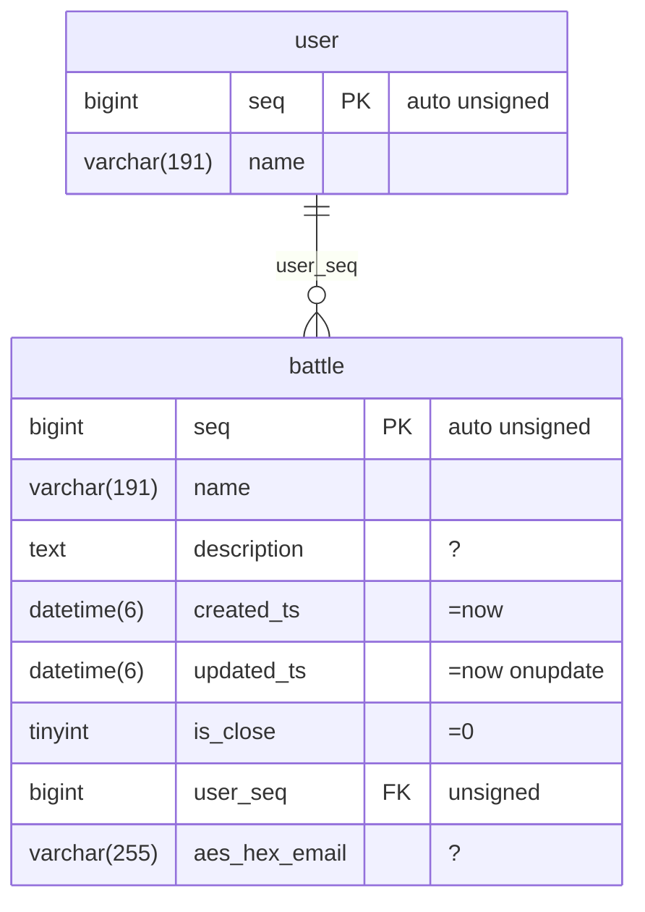

# Usage

Generate Go, PHP, and Rust clients from one Mermaid schema and execute the same statement as the same SQL in each client.
Supported databases are MySQL 8 by default, PostgreSQL 12+, and SQLite 3.35+.

The complete syntax is in [dsl.md](dsl.md), diagram syntax is in [schema.md](schema.md), and the IR/Plan format is in [protocol.md](protocol.md).
Dialect differences are in [dialects.md](dialects.md), configuration is in [config.md](config.md), and error codes are in [errors.yaml](errors.yaml).

---

## 1. Requirements

| Requirement | Notes |
|---|---|
| Go 1.27+ | Engine, generator, and Go client |
| MySQL 8.0.2+ / MariaDB 10.2+ | Primary target; PostgreSQL 12+ and SQLite 3.35+ use the same plan |
| PHP 8.4+ (`pdo_mysql`, `apcu`) | Required for PHP; add `pdo_pgsql`/`pdo_sqlite` for those databases |
| Rust 1.98+ | Required for Rust |

```sh
git clone https://github.com/polyspec/orm && cd orm
go build ./...
```

---

## 2. Schema to manifest

The human-maintained definition is one Mermaid `erDiagram` (`schema/bench.mmd` is an example).



- Comment attributes define nullability, defaults, update timestamps, auto increment, unsigned values, lazy loading, and booleans.
- Column names can imply styles: `aes_hex_*`, `gz_*`, `json_*`, `jsons_*`, `base64_*`, `serialize_*`, and `ip` ([codec.md](codec.md)).
- A relation line `parent ||--o{ child : fk_column` defines names on both sides (`battle.user`, `user.battles`).

```sh
go run ./cmd/ormgen build schema/bench.mmd --out schema/schema.json
```

When starting from an existing database, import creates the same file deterministically and preserves declared attributes:

```sh
go run ./cmd/ormgen import --dsn "root@unix(/tmp/mysql.sock)/mydb" --out schema/app.mmd
go run ./cmd/ormgen import --dsn "postgres://user@localhost:5432/mydb" --out schema/app.mmd   # PostgreSQL도 동일
```

## 2.1 Create tables and generate migrations

Generate database-specific `CREATE TABLE` statements from the manifest:

```sh
go run ./cmd/ormgen ddl --schema schema/schema.json --dialect mysql --out create.mysql.sql
go run ./cmd/ormgen ddl --schema schema/schema.json --dialect postgres --out create.postgres.sql
go run ./cmd/ormgen ddl --schema schema/schema.json --dialect sqlite --out create.sqlite.sql
```

Apply the selected SQL file with the database's migration tool or client. `ormgen ddl` writes SQL and does not connect to a database. For idempotent database execution, use `ormgen migrate` against a physical database.

To create a migration, keep the previous manifest, update the Mermaid schema, build the new manifest, and generate a diff:

```sh
cp schema/schema.json schema/schema.previous.json
go run ./cmd/ormgen build schema/bench.mmd --out schema/schema.json
go run ./cmd/ormgen diff --from schema/schema.previous.json --to schema/schema.json \
  --dialect mysql --out migration.mysql.sql
```

Review the generated SQL before applying it. Table removal, column removal, and column definition changes require `--allow-destructive` with `ormgen diff`; the migration command rejects these changes. Renames require an explicit migration because the tool cannot infer whether a rename is safe.

`ormgen migrate` reads the live schema, creates `orm_schema_migrations`, computes a plan, applies supported non-destructive changes, verifies the live schema, and records the result. Repeating the same `migration-id` is a no-op only when the recorded migration and live schema match. Use `--dry-run` to print the plan without changing the database.

Create a structured plan and apply that exact plan after review:

```sh
go run ./cmd/ormgen plan --from schema/previous.json --to schema/schema.json \
  --dialect postgres --out migrations/20260912-schema.json
go run ./cmd/ormgen apply --plan migrations/20260912-schema.json \
  --dsn "$ORM_DSN" --schema schema/schema.json
go run ./cmd/ormgen verify --dsn "$ORM_DSN" --schema schema/schema.json
```

The plan stores the source manifest, target hash, ordered operations, destructive flags, and plan checksum. `apply` checks the live source schema before execution and rejects destructive operations unless `--allow-destructive` is explicit.

Comments are included in the manifest and migration comparison. Use `%% table_comment` and `%% column_comment` in the Mermaid source. The importer reads database comments, and the DDL generator emits dialect-specific comment statements.

Migration statements execute inside one database transaction. On statement failure,
the runner records the statement number, SQL text, driver error, and whether rollback was issued.
Database engines that implicitly commit DDL retain their engine-specific DDL behavior.

Migration execution uses one reserved database connection. MySQL acquires a database-specific
`GET_LOCK`, PostgreSQL acquires a transaction advisory lock, and SQLite starts with
`BEGIN IMMEDIATE`. A competing migration fails with `MIGRATION_LOCK_BUSY` before executing
the first planned statement. Locks are released on commit, rollback, or connection close.

The SQL statement parser recognizes single-quoted strings, quoted identifiers, line comments,
block comments, and PostgreSQL dollar-quoted blocks. Semicolons inside these regions do not end
a statement. Execution errors report the one-based operation number and complete statement text.

Each execution also writes a JSON audit file under `migrations/logs` by default. The filename is `<UTC timestamp>__<migration-id>.json`; it contains the driver, schema hashes, plan checksum, status, operation count, start time, finish time, and error detail. Use `--log-dir` to select another directory. An applied migration fails verification if no file log matches its database record.

```sh
go run ./cmd/ormgen migrate --driver mysql --dsn "$ORM_DSN" \
  --schema schema/schema.json --migration-id 20260912-initial --dry-run
go run ./cmd/ormgen migrate --driver mysql --dsn "$ORM_DSN" \
  --schema schema/schema.json --migration-id 20260912-initial
```

---

## 3. Code generation

```sh
go run ./cmd/ormgen gen --schema schema/schema.json --lang go   --out clients/go/gen
go run ./cmd/ormgen gen --schema schema/schema.json --lang php  --out clients/php/gen
go run ./cmd/ormgen gen --schema schema/schema.json --lang rust --out clients/rust/gen
```

Each entity produces a query type, Row type, Where builder, and column references. After changing the schema, **regenerate and redeploy**.
A mismatch between the generated `schema_hash` and the engine hash stops startup with `SCHEMA_HASH_MISMATCH`.

The TypeScript package is built and checked with:

```sh
npm run typescript:check
npm run typescript:build
node tests/typescript/common-vector.mjs
```

---

## 4. Connections

### Go — in-process engine

```go
import (
    "github.com/polyspec/orm/clients/go/gen"
    "github.com/polyspec/orm/clients/go/orm"
    "github.com/polyspec/orm/engine"
    "github.com/polyspec/orm/engine/schema"

    _ "github.com/polyspec/orm/clients/go/orm/pg"     // PostgreSQL을 쓸 때만
    _ "github.com/polyspec/orm/clients/go/orm/sqlite" // SQLite를 쓸 때만
)

js, _ := os.ReadFile("schema/schema.json")
m, _ := schema.Load(js)
eng, _ := engine.New(m, "mysql")                       // 방언 = 드라이버와 같아야 한다
db, err := orm.Open("mysql", dsn, eng, orm.Config{AESKey: "…"})
if err := gen.Init(eng); err != nil { … }              // schema_hash 확인 1회
```

The DSN requires `parseTime=true&clientFoundRows=true` because optimistic updates depend on `clientFoundRows`.

### PHP — compiler daemon and PDO

```sh
bin/ormd -socket /run/orm/ormd.sock -schema /srv/app/schema/schema.json &   # 호스트당 1개
```
```php
use Orm\{Config, Db, Orm};

Orm::init(new Config(socket: '/run/orm/ormd.sock', schemaPath: '/srv/app/schema/schema.json', aesKey: '…'));
$db = Db::mysql('mysql:unix_socket=/tmp/mysql.sock;dbname=app;charset=utf8mb4', 'user', 'pass');
// Db::postgres('pgsql:host=…;dbname=…;user=…') / Db::sqlite('/abs/app.sqlite')
```

`ormd` only compiles IR into plans; it does not connect to the database. APCu caches plans, so each statement shape uses one round trip.

### Rust — WASM engine

```rust
use orm::db::{Config, ConnectOptions, Db};
use orm::engine::{Engine, EngineConfig};

let engine = Arc::new(Engine::new(EngineConfig {
    wasm: &std::fs::read("bin/ormengine.wasm")?,
    schema_json: &std::fs::read("schema/schema.json")?,
    ..Default::default()                       // dialect: "mysql" | "postgres" | "sqlite"
})?);
gen::init(engine.clone())?;                    // schema_hash 확인 1회
let db = Db::connect(ConnectOptions::parse("mysql", url)?, 8, engine,
                     Config { aes_key: "…".into(), on_query: None }).await?;
```

### One configuration file

Each client has a constructor that reads one `orm.toml` file ([config.md](config.md)). Paths must be absolute; symlinks are rejected.

```toml
schema = "/srv/app/schema/schema.json"
[db]
driver = "mysql"
dsn = "user@unix(/tmp/mysql.sock)/app?parseTime=true&clientFoundRows=true"
pool = 8
[secrets]
aes_env = "ORM_AES_KEY"
[ormd]                       # PHP
socket = "/run/orm/ormd.sock"
[engine]                     # Rust
wasm = "/srv/app/bin/ormengine.wasm"
cache_dir = "/var/cache/orm"
```
```go
db, err := orm.OpenConfig("/srv/app/orm.toml")   // PHP: Orm::fromConfig(...)  Rust: Db::from_config(...).await
```

---

## 5. Reading

Tokens are shared; only spelling differs (PHP `camelCase` / Go `PascalCase` / Rust `snake_case`).

```php
$rows = Battle::query()
    ->serviceSeq(7)->isClose(false)
    ->and(fn(BattleWhere $w) => $w->isDisplay(true)->or()->isAllday(true))
    ->seqIn([6, 106, 206])
    ->orderBySeqDesc()->limit(0, 20)
    ->using($db)->gets();
```
```go
rows, err := gen.Battle().
    ServiceSeq(7).IsClose(false).
    And(func(w *gen.BattleWhere) { w.IsDisplay(true).Or().IsAllday(true) }).
    SeqIn([]int64{6, 106, 206}).
    OrderBySeqDesc().Limit(0, 20).Using(ctx, db).Gets()
```
```rust
let rows = battle::query()
    .service_seq(7).is_close(false)
    .and(|w| w.is_display(true).or().is_allday(true))
    .seq_in(vec![6, 106, 206])
    .order_by_seq_desc().limit(0, 20)
    .using(&db).gets().await?;
```

- Predicates: `<Col>(v)` means `=`, while other operators use `<Col>NotEq`, `Gt`, `Gte`, `Lt`, `Lte`, `In`, `NotIn`, `Between`, `IsNull`, `IsNotNull`, `Like`, `LikeBinary`, `Contains`, `StartsWith`, and `EndsWith`. The `Eq` suffix is retained as a compatibility alias.
  An operator not allowed for the type is a **compile error** (`OPERATOR_NOT_ALLOWED`). `In` values are padded to a power of two so
  each list length does not create a new prepared statement; the result is unchanged.
- Groups: `and(fn)` and `or(fn)`. `or()` connects the next predicate with OR. `or()` as the first group item returns `OR_AT_GROUP_START`.
- Column selection: `selectAll()`, `selectNone()`, `select<Col>()`, `unselect<Col>()`, `select<Col>As("name")`, and `selectExpr("name", "fragment")`.
  `text`, `blob`, and styled columns are excluded from the default SELECT and enabled with `select<Col>()`.
- Terminals: `get`, `gets`, `getCount`, `getsCount`, `countDistinct<Col>`, `sum<Col>`, `avg<Col>`, `min<Col>`, `max<Col>`, and `paginate(page, per)`.
  `getBy<PK>`, `getsBy<Col>`, and `getCountBy<Col>` take values only. Set the execution target with `using` at the root; Go also sets its context there. Returned rows inherit the root target. `get` returns null/nil/None when absent; `gets` and `getsBy` return non-null empty collections. `one` and `all` remain compatibility aliases.
- A collection is an ordered map keyed by PK or `keyBy<Col>`: `first()`, `count()`, and `toArray()` are available, and iteration yields `key => row`.
- Row and collection map/array conversion returns `IR_INVALID` for keys with the same string form, such as integer `1` and string `"1"`. Go uses `values, err := rows.ToArray()`, Rust uses `let values = rows.to_map()?`, and PHP uses `$values = $rows->toArray()`. Use entries to retain order and key types.

### Aggregates, groups, HAVING, and raw

```php
Battle::query()->serviceSeq(7)->groupByUserSeq()
    ->having(fn(BattleWhere $w) => $w->expr('COUNT(*) > ?', [1]))->using($db)->getCount();   // 그룹 수
Battle::query()->serviceSeq(7)->groupByExpr('ROUND(`like_count`)', 'bucket')
    ->using($db)->getsCount();                                                               // 그룹별 행과 getRowCount()
Battle::query()->raw('SELECT COUNT(*) AS n FROM {table} WHERE service_seq = ?', [7])->using($db)->rawAll();
Battle::query()->visible()->serviceSeq(7)->using($db)->getCount();   // %% predicate 로 선언한 술어
```
`raw`, `expr`, and `setXExpr` are for trusted code. Backtick columns such as `` `name` `` are checked against the schema and only `?` is a value channel;
a count mismatch returns `IR_INVALID`. `ormgen check --lang go` applies the same check to Go source before the build.

---

## 6. Relations and joins

A **relation** uses a separate statement. It batches parent values into `IN` and attaches the child rows.
A **join** is a fragment of the same row.

```php
$rows = Battle::query()->serviceSeq(7)->limit(0, 20)
    ->relation(User::query())                                   // one  → $b->getUser()
    ->relation(Service::query()
        ->relations(ServiceMember::query()                 // many → ->getMembers()
            ->orderBySeqDesc()->limitPerParent(3)              // 부모당 3행 (윈도 함수)
            ->keyByUserSeq()->dropChildKey()))
    ->join(Service::query()->where(fn(ServiceWhere $w) => $w->name('service-7')))
    ->using($db)->gets();
```

| Child option | Meaning |
|---|---|
| `keyBy<Col>()` | Key column for a many collection; the last duplicate wins |
| `keyByFn(fn)` | Key the root collection with a function |
| `flatten()` | Merge one-relation columns into the parent array; parent keys win |
| `limitPerParent(n)` | n rows per parent using `ROW_NUMBER() OVER (PARTITION BY …)` |
| `ifParent<Col>Eq(v)` | Load only when the parent row matches |
| `dropChildKey()` | Hide the child FK in array output; retain it for binds and keys |
| `noCascadeDelete()` | Stop point for `deleteCascade` |

Join children have separate `on(fn)` (ON clause) and `where(fn)` (AND in WHERE) builders. A joined entity is referenced from a root predicate
through navigation: `->and(fn($w) => $w->service(fn($s) => $s->seqGt(10)))`.
Column comparisons use generated references: `$w->seqEqCol(BattleCols::serviceModuleSeq())`.

---

## 7. Writes

```php
$row = Battle::query()->setName('x')->setUserSeq(1)->…->using($db)->insert();   // 자동 PK면 다시 읽어 돌려준다
$row->setName('y')->using($db)->update();                                    // 바뀐 컬럼만 UPDATE
$row->setName('z')->using($db)->updateOptimistic();                          // updated_ts 불일치 → OPTIMISTIC_LOCK
$row->using($db)->delete();
$row->using($db)->deleteCascade();                                           // 로드된 소유 관계부터 깊이 우선, Db면 트랜잭션으로 감쌈

Battle::query()->setUuid($u)->setName('x')->…
    ->onDuplicateSetName('x')->onDuplicatePlusReadCount(1)->using($db)->insert();   // UPSERT
Battle::query()->seq($id)->plusReadCount(1)->using($db)->update();                   // 쿼리 단위 UPDATE, 영향 행 수 반환
Battle::query()->seq($id)->using($db)->delete();
```

- `update` always writes `updated_ts` explicitly so the value is consistent across dialects.
- `minus<Col>` clamps at zero. Use `set<Col>Expr('`read_count` * ? + 1', [2])` for an expression.
- Transactions use each language native transaction API. On deadlock (1213/40001), the closure is **re-run up to three times in a new transaction**.

```go
row, err := orm.Transaction(ctx, db, func(tx *orm.Tx) (*gen.BattleRow, error) {
    return gen.Battle().SetName("x").….Using(ctx, tx).Insert()
})
```
```php
$row = $db->transaction(fn(Tx $tx) => Battle::query()->setName('x')->…->using($tx)->insert());
```
```rust
let row = db.transaction(|tx| async move { battle::query().set_name("x")./*…*/.using(&tx).insert().await }).await?;
```

---

## 8. Styled columns

`gz_*`, `json_*`, `jsons_*`, `base64_*`, and `serialize_*` use **decoded values**, not stored bytes, at the client output
(Go `any`, Rust `serde_json::Value`, PHP `mixed`). MySQL handles `aes_hex_*` and `ip` with SQL functions, while
PostgreSQL and SQLite executors produce the same bytes ([codec.md](codec.md)).

```php
$b->setJsonSetting(['a' => 1])->using($db)->update();
$b = Battle::query()->selectJsonSetting()->seq(42)->using($db)->get();   // 기본 SELECT에서 빠져 있으므로 켠다
$b->getJsonSetting()['a'];
```

---

## 9. Multiple databases

The same statement produces the same result on all three databases, although statement text differs by dialect. Rules and exceptions are in [dialects.md](dialects.md).

```sh
go run ./cmd/ormgen ddl --schema schema/schema.json --dialect postgres --out app.pg.sql
psql … -f app.pg.sql
```
- Go: `orm.Open("postgres", url, eng, …)` with the driver package imported; use `engine.New(m, "postgres")`.
- PHP: start the daemon with `ormd -dialect postgres` and use `Db::postgres(...)`. A dialect mismatch returns `CONFIG`.
- Rust: `EngineConfig { dialect: "postgres", .. }` + `ConnectOptions::parse("postgres", url)`.
- SQLite rejects `likeBinary` and fulltext (`OPERATOR_NOT_ALLOWED`).

---

## 10. Operations

| Operation | Command |
|---|---|
| Compare schema with the live database | `ormgen validate --dsn … --schema schema/schema.json` (다르면 exit 1) |
| Check generated files | `ormgen gen …` 후 `git diff --exit-code` |
| Statement log | `Config.OnQuery` / `onQuery` / `Config { on_query }` → `(sql, binds, 시간, plan_id, err)`, 비밀은 `$SECRET`로 마스킹 |
| View SQL without executing | `->using($db)->sql()` / `.Using(ctx, db).SQL()` / `.using(&db).sql()` |
| Error constants | `ormgen errors --lang go\|php\|rust --out …` ([errors.yaml](errors.yaml)) |
| Release artifacts | `scripts/build-artifacts.sh` → `dist/`(버전이 파일명에, SHA256SUMS) |
| Daemon units | `deploy/ormd.service`, `deploy/com.orm.ormd.plist` |

---

## 11. Common errors

| Code | Cause and action |
|---|---|
| `SCHEMA_HASH_MISMATCH` | Generated files and the engine read different `schema.json` files; regenerate and deploy together |
| `OPERATOR_NOT_ALLOWED` | Operator is unavailable for the type or style, such as styled columns allowing only `isNull` or SQLite fulltext |
| `COLUMN_UNKNOWN` / `RELATION_UNKNOWN` | Name is absent from the schema; correct the diagram and regenerate |
| `EMPTY_IN` | `In` received an empty array; validate before calling |
| `OR_AT_GROUP_START` | The first group item is `or()` |
| `LIMIT_IN_RELATION` | Relation child uses `limit`; use `limitPerParent(n)` |
| `OPTIMISTIC_LOCK` | Another transaction updated the row first; read again and retry |
| `DUPLICATE_KEY` / `DEADLOCK` | Mapped driver error with original text retained; deadlock follows the three `transaction` retries |
| `CONFIG` | Configuration, path, or driver mismatch; the message identifies the missing value |
| `CODEC_DECODE` | Stored bytes do not match the declared column styles |

---

## 12. Verification

```sh
go test ./...                                            # 엔진 + Go 클라이언트 + 회귀 게이트
go run ./tests/conformance/check run                     # 3언어 같은 결과 (MySQL)
go run ./tests/conformance/check run -driver postgres -dsn 'postgres://…'
go run ./cmd/ormgen tokens --schema schema/schema.json a.go b.php c.rs   # 세 파일의 토큰열이 같은지
```

Examples: [`examples/thin-slice`](../examples/thin-slice) (three clients, the same JSON) and [`examples/complex`](../examples/complex) (joins, groups, three-level relations, and aggregates).
